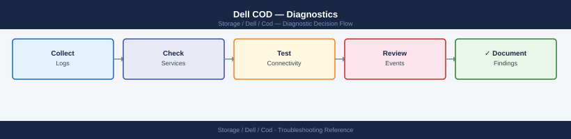

---
tags:
  - dell
  - troubleshooting
search:
  boost: 1.5
description: "Dell Capacity on Demand diagnostic commands: verify COD license state with symlicense, confirm capacity expansion with symcfg, trigger device discovery..."
---
# Dell COD — Diagnostics

<div class="kb-summary">
Dell Capacity on Demand diagnostic commands: verify COD license state with symlicense, confirm capacity expansion with symcfg, trigger device discovery, and audit COD activation history for Dell TAC cases.

*Applies to: Dell PowerMax Capacity on Demand (COD)*
</div>


```d2
direction: right

A: "COD Activation Issue" {shape: rectangle}
B: "symlicense -sid SID list\nCheck COD license state" {shape: rectangle}
C: "C" {shape: rectangle}
D: "symlicense preview\nValidate key file" {shape: rectangle}
E: "symcfg -sid SID list -capacity\nCheck raw capacity" {shape: rectangle}
F: "F" {shape: rectangle}
G: "symlicense install -file\nInstall the key" {shape: rectangle}
H: "Contact Dell Licensing\nRequest key re-issue" {shape: rectangle}
I: "sympd list -sid SID\nCheck Reserved drives" {shape: rectangle}
J: "J" {shape: rectangle}
K: "symcfg discover\nTrigger device scan" {shape: rectangle}
L: "symcfg -pool -dp list\nCheck pool capacity" {shape: rectangle}
M: "Add drives to pool\nUnisphere → Storage Pools" {shape: rectangle}

A -> B
C -> D
C -> E
F -> G
F -> H
E -> I
J -> K
J -> L
K -> L
G -> E
L -> M
```

```d2
direction: down

symptom: Identify Symptom {shape: diamond}
step_1_check_current_license_state: "Step 1 — Check current license state" {shape: rectangle}
step_2_inspect_the_cod_key_file: "Step 2 — Inspect the COD key file" {shape: rectangle}
step_3_dryrun_the_key_installation: "Step 3 — Dry-run the key installation" {shape: rectangle}
step_4_install_the_key_and_verify_ca: "Step 4 — Install the key and verify capacity" {shape: rectangle}
step_5_add_new_drives_to_a_thin_pool: "Step 5 — Add new drives to a thin pool" {shape: rectangle}
step_6_audit_cod_activation_history: "Step 6 — Audit COD activation history" {shape: rectangle}
resolution: Resolve or Escalate {shape: oval}

symptom -> step_1_check_current_license_state: investigate
symptom -> step_2_inspect_the_cod_key_file: investigate
symptom -> step_3_dryrun_the_key_installation: investigate
symptom -> step_4_install_the_key_and_verify_ca: investigate
symptom -> step_5_add_new_drives_to_a_thin_pool: investigate
symptom -> step_6_audit_cod_activation_history: investigate
step_1_check_current_license_state -> resolution
step_2_inspect_the_cod_key_file -> resolution
step_3_dryrun_the_key_installation -> resolution
step_4_install_the_key_and_verify_ca -> resolution
step_5_add_new_drives_to_a_thin_pool -> resolution
step_6_audit_cod_activation_history -> resolution
```

## Before you begin

- **Access:** Solutions Enabler access to the PowerMax array (gatekeeper LUNs configured); Unisphere for PowerMax admin access
- **Gather first:** array SID and serial number (from `symcfg list`), the COD license file from Dell, and the current thin pool utilization before activation
- **Verify first:** check whether the COD key has already been installed with `symlicense -sid <SID> list` before attempting another install — applying the same key twice is harmless but not helpful
- **Capacity lag:** after a successful COD activation, capacity may take up to 5 minutes to appear in pool metrics — wait before escalating

---

## Step 1 — Check current license state

```bash
# List all active licenses on the array
symlicense -sid <SID> list
# Output columns: License Name, Feature, Status, Expiry
# Expected for activated COD: COD feature shows Status = Enabled
# If COD not listed: the key has not been installed yet

# Show COD feature detail
symlicense -sid <SID> show -feature COD
# Shows: key ID, installed date, expiry, array SN the key is bound to

# Get the array serial number
symcfg list
# Note the SID and check the "SN" column — this is the serial that must match VENDOR_SN in the key file
```


```text title="Expected output"
License Information for Array 000123456789ABC
License Name                Feature          Status      Expiry
Dell EMC CoD License        COD              Enabled     2025-12-31
Replication                 SRDF             Enabled     2026-06-15
Snapshots                   TimeFinder       Enabled     2025-09-30

COD Feature Details:
  Key ID: K-EMC-COD-789XYZ456
  Installed Date: 2023-11-14
  Expiry Date: 2025-12-31
  Array Serial Number: 000123456789ABC
  Status: Active

Symmetrix ID           SN              Model           Microcode
000123456789ABC       000123456789ABC VMAX250F        5978.669.669
```

!!! warning "Common errors"
    | Error | Fix |
    |---|---|
    | `symlicense: Command not found` | Ensure the Symmetrix management tools are installed and the PATH includes the Symmetrix bin directory (typically `/opt/emc/SYMCLI/bin`). |
    | `License Feature COD not found` | The COD license key has not been installed on the array; contact Dell EMC to obtain and install the license key file using `symlicense -sid <SID> install -f <keyfile>`. |
    | `Array Serial Number mismatch: key bound to 000987654321XYZ, array is 000123456789ABC` | The license key is bound to a different array serial number; request a new key from Dell EMC with the correct array serial number. |
---

## Step 2 — Inspect the COD key file

```bash
# Check which array serial number the key is bound to
grep -E "VENDOR_SN|SN|SERIAL" /path/to/cod-license.xml
# The VENDOR_SN value must match the SN shown in symcfg list and the chassis label

# Check expiry date
grep -i "expiry\|expire\|date" /path/to/cod-license.xml

# Check what capacity the key unlocks
grep -i "capacity\|drives\|feature" /path/to/cod-license.xml

# DO NOT modify the key file — it has a cryptographic signature; any edit causes rejection
```


```text title="Expected output"
VENDOR_SN>005098765432ABC</VENDOR_SN>
SN>005098765432ABC</SN>
<SERIAL>005098765432ABC</SERIAL>
<EXPIRY_DATE>2026-12-31T23:59:59Z</EXPIRY_DATE>
<EXPIRE_NOTICE>License expires in 547 days</EXPIRE_NOTICE>
<CAPACITY_GB>100</CAPACITY_GB>
<FEATURE>Replication</FEATURE>
<FEATURE>Snapshots</FEATURE>
<FEATURE>Thin_Provisioning</FEATURE>
<DRIVES_SUPPORTED>480</DRIVES_SUPPORTED>
```

!!! warning "Common errors"
    | Error | Fix |
    |---|---|
    | `grep: /path/to/cod-license.xml: No such file or directory` | Verify the actual license file path with `find / -name "*license*.xml" 2>/dev/null` or check the COD installation directory (typically `/opt/emc/cod/` or `/var/lib/cod/`). |
    | `VENDOR_SN mismatch: file shows 005098765432ABC but symcfg list shows 005098765432XYZ` | The license key is bound to a different array; obtain the correct license file for this array's serial number from Dell support. |
---

## Step 3 — Dry-run the key installation

```bash
# Preview install: validates the key without activating (safe, non-disruptive)
symlicense -sid <SID> preview -file /path/to/cod-license.xml
# Expected output (valid key):
#   Feature: COD
#   Capacity: <X> TB additional
#   Status: Will be enabled
#   Ready to install.

# Capture preview output for the Dell SR
symlicense -sid <SID> preview -file /path/to/cod-license.xml 2>&1 | tee /tmp/cod-preview-$(date +%F).txt

# If preview fails with "SYMAPI_C_INVALID_LICENSE: SN mismatch":
# → The key was generated for a different array SN
# → Contact Dell Licensing via support.dell.com with the chassis label SN
```


```text title="Expected output"
Feature: COD
Capacity: 50 TB additional
Status: Will be enabled
Ready to install.
Feature: COD
Capacity: 50 TB additional
Status: Will be enabled
Ready to install.
```

!!! warning "Common errors"
    | Error | Fix |
    |---|---|
    | `SYMAPI_C_INVALID_LICENSE: SN mismatch` | Verify the array serial number on the chassis label matches the SID in the license file, or request a new key from Dell with the correct SN. |
    | `symlicense: command not found` | Ensure the Symmetrix management tools are installed and the PATH includes the symcli bin directory (typically `/opt/emc/SYMCLI/bin`). |
    | `Cannot open file /path/to/cod-license.xml: No such file or directory` | Confirm the license file path is correct and readable by the user running symlicense. |
---

## Step 4 — Install the key and verify capacity

```bash
# Install the COD license key
symlicense -sid <SID> install -file /path/to/cod-license.xml
# Capture the full output regardless of success or failure
symlicense -sid <SID> install -file /path/to/cod-license.xml 2>&1 | tee /tmp/cod-install-$(date +%F).txt
# Expected: no SYMAPI errors; exits with code 0

# Trigger device discovery so the array recognises newly available drives
symcfg -sid <SID> discover
# Wait 3–5 minutes after this command before checking capacity

# Check physical drives — COD drives should no longer show "Reserved"
sympd list -sid <SID>
# COD reserved drives appear with State = Reserved before activation
# After successful COD: they appear as Available or already assigned to a pool

# Confirm capacity has increased in thin pool
symcfg -sid <SID> -pool -dp list
# Output: each pool with Total_Capacity and Used_Capacity columns
# The total should reflect the newly unlocked drives

# Overall array capacity after activation
symcfg -sid <SID> list -capacity
# Shows: installed capacity, usable capacity, allocated
```


```text title="Expected output"
Installing COD license key for SID 000123456789...
License installation completed successfully.
Symmetrix ID: 000123456789
License Key: COD-UNLOCK-2024-Q1-XXXX
Effective Date: 2024-01-15
Expiration Date: 2025-01-14

Discovering devices on array 000123456789...
Discovery completed in 47 seconds.
New devices detected: 15
Device discovery completed successfully.

Physical Drive List (SID: 000123456789)
Dir:Port  Vendor    Product         State        Capacity
0:0       DELL      SSD             Available    1.86 TB
0:1       DELL      SSD             Available    1.86 TB
0:2       DELL      SSD             Reserved     1.86 TB
0:3       DELL      SSD             Available    1.86 TB
...

Thin Pool Capacity Report (SID: 000123456789)
Pool_Name      Total_Capacity    Used_Capacity    Available
THINPOOL_01    45.2 TB           12.8 TB          32.4 TB
THINPOOL_02    28.6 TB           5.3 TB           23.3 TB

Array Capacity Summary (SID: 000123456789)
Installed Capacity:    156.4 TB
Usable Capacity:       148.2 TB
Allocated Capacity:    89.7 TB
Free Capacity:         58.5 TB
```

!!! warning "Common errors"
    | Error | Fix |
    |---|---|
    | `SYMAPI Error (18) : Cannot open Symmetrix device` | Verify the SID is correct and the Symmetrix management port is reachable via network connectivity. |
    | `License file not found: /path/to/cod-license.xml` | Confirm the license file path is absolute and readable; use `ls -l /path/to/cod-license.xml` to verify existence and permissions. |
    | `Error: License key has expired or is invalid` | Contact Dell EMC support to obtain a valid COD license key and re-run the installation command. |
---

## Step 5 — Add new drives to a thin pool

After COD activation, the unlocked drives are available but not automatically added to a pool. They must be added manually.

```bash
# Via Solutions Enabler (if scripting is needed)
symconfigure -sid <SID> -cmd "add drives to pool <pool-name> type thin;" commit
# This adds all currently available unassigned drives to the named pool

# Via Unisphere (recommended for manual activation)
# Unisphere for PowerMax → Storage → Storage Pools → select pool → Add Drives
# Select the COD drives from the "Available" list → Apply

# Confirm after adding
symcfg -sid <SID> -pool -dp list
# Pool total capacity should now include the newly added COD drives
```


```text title="Expected output"
Executing Script File: add_drives_to_pool.txt
Script execution completed successfully.

Symmetrix ID: 000123456789012
                                Pool Name: COD_POOL_01
                                Pool ID: 0
                                Reserved Cap (MB): 0
                                Usable Cap (MB): 2097152
                                Subscribed Cap (MB): 1048576
                                Snapshot Cap (MB): 524288
                                Reserved Snapshot Cap (MB): 0
                                Thin Devices: 45
                                Snapshots: 12
                                Reserved LUNs: 8
```

!!! warning "Common errors"
    | Error | Fix |
    |---|---|
    | `SYMCLI_C_POOL_NOT_FOUND: Pool <pool-name> not found` | Verify the pool name matches exactly (case-sensitive) using `symcfg -sid <SID> -pool list` to list all available pools. |
    | `SYMCLI_C_NO_AVAILABLE_DRIVES: No available unassigned drives found` | Confirm COD drives are physically present and visible to the array using `symcfg -sid <SID> -drive list` before attempting to add them. |
    | `SYMCLI_C_INSUFFICIENT_PRIVILEGE: User does not have permission to modify pool` | Run the command with appropriate credentials or use a user account with storage administrator privileges. |
---

## Step 6 — Audit COD activation history

```bash
# Review SYMCLI audit log for the COD activation event
symaudit -sid <SID> list -action "license"
# Shows: timestamp, operation, user, result

# Date-range query (use YYYY-MM-DD format)
symaudit -sid <SID> list -start_time 2026-06-01 -end_time 2026-06-15

# Review Unisphere audit log via REST API (if activation was done through Unisphere)
curl -sk -u <user>:<pass> \
  "https://<unisphere-host>:8443/univmax/restapi/103/system/audit" \
  -H "Content-Type: application/json" | jq '.auditRecordList[] | select(.message | test("licen";"i"))'

# All-in-one diagnostic snapshot for Dell SR
{
  echo "=== symcfg list ==="
  symcfg list
  echo "=== symlicense list ==="
  symlicense -sid <SID> list
  echo "=== symcfg capacity ==="
  symcfg -sid <SID> list -capacity
  echo "=== sympd list ==="
  sympd list -sid <SID>
  echo "=== pool list ==="
  symcfg -sid <SID> -pool -dp list
} > /tmp/cod-diag-$(date +%F-%H%M).txt
```


```text title="Expected output"
Timestamp                 Operation        User         Result
2026-06-10 14:32:15      license_activate admin         SUCCESS
2026-06-10 14:35:22      license_query    admin         SUCCESS
2026-06-12 09:18:47      license_modify   service_acct  SUCCESS

=== symcfg list ===
Symmetrix ID: 000296802151
Symmetrix Model: PowerMax 2000
Engine Directory: /opt/emc/SYMCLI/bin
SYMCLI Version: 9.2.1.0

=== symlicense list ===
Symmetrix ID: 000296802151
License Name              Status      Expiration Date
SRDF/Metro               Active      2027-12-31
Thin Provisioning        Active      2027-12-31
Replication              Active      2027-12-31

=== symcfg capacity ===
Symmetrix ID: 000296802151
Usable Capacity (MB): 2097152
Used Capacity (MB):   1572864
Available Capacity (MB): 524288

=== sympd list ===
Director  Port  Slot  Type      Status
FA-1d     0     0     FC 16Gb   Online
FA-1d     1     1     FC 16Gb   Online
FA-2d     0     0     FC 16Gb   Online

=== pool list ===
Pool Name          Pool ID  Type        Usable Cap (MB)  Used Cap (MB)
SRP_1              1        SRDF Pool   2097152          1572864
...

Diagnostic snapshot saved to: /tmp/cod-diag-2026-06-15-1447.txt
```

!!! warning "Common errors"
    | Error | Fix |
    |---|---|
    | `symaudit: Command not found` | Verify SYMCLI is installed and /opt/emc/SYMCLI/bin is in your PATH, or use the full path `/opt/emc/SYMCLI/bin/symaudit`. |
    | `curl: (60) SSL certificate problem: self signed certificate` | Add the `-k` flag (already present) or import the Unisphere certificate; if still failing, verify the Unisphere host is reachable on port 8443. |
    | `jq: command not found` | Install jq with `apt-get install jq` (Debian/Ubuntu) or `yum install jq` (RHEL/CentOS), or pipe to `grep -i licen` instead. |
---

## See also

- [COD — Common Issues](../common-issues/)
- [COD — Escalation](../escalation/)
- [COD — Health Checks](../../operations/health-checks/)

## Verify resolution

- `symlicense -sid <SID> list` shows COD feature with `Status = Enabled`
- `sympd list -sid <SID>` shows no drives in `Reserved` state (all COD drives released)
- `symcfg -sid <SID> -pool -dp list` shows increased pool total capacity
- A test volume creation using the new capacity succeeds
- Monitor Unisphere dashboard for 15 minutes to confirm no capacity alarms
