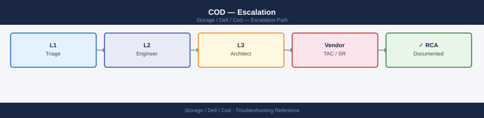
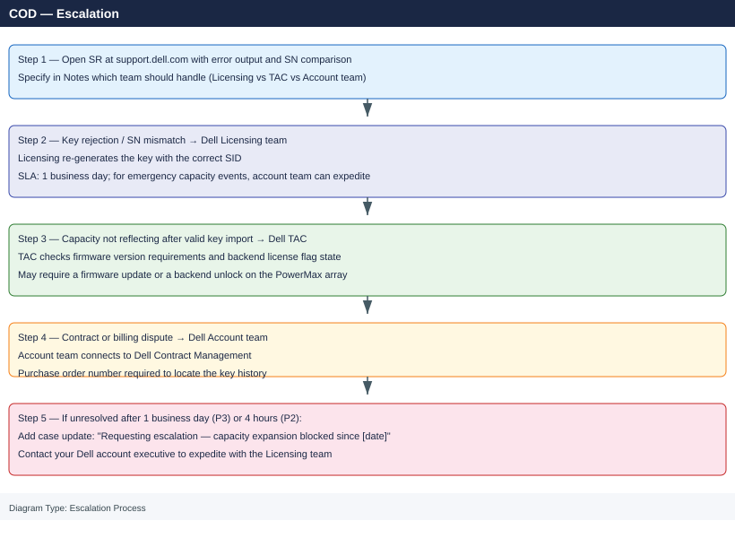

---
tags:
  - dell
  - troubleshooting
search:
  boost: 1.5
description: "Dell Cloud on Demand (COD) escalation: how to collect array license state, key file details, and Unisphere events, when to escalate to Dell Licensing..."
---
# COD — Escalation

<div class="kb-summary">
Dell Cloud on Demand (COD) escalation: how to collect array license state, key file details, and Unisphere events, when to escalate to Dell Licensing versus Dell TAC, and the escalation path for key rejections, capacity activation failures, and contract disputes.

*Applies to: Dell Cloud on Demand (COD) / PowerMax Cloud on Demand*
</div>



```d2
direction: down

symptom: Identify Symptom {shape: diamond}
severity_levels_by_issue_type: "Severity Levels (by Issue Type)" {shape: rectangle}
preescalation_triage_checklist: "Pre-Escalation Triage Checklist" {shape: rectangle}
stepbystep_data_collection: "Step-by-Step Data Collection" {shape: rectangle}
how_to_open_a_dell_support_case: "How to Open a Dell Support Case" {shape: rectangle}
escalation_path: "Escalation Path" {shape: rectangle}
what_not_to_do: "What NOT to Do" {shape: rectangle}
resolution: Resolve or Escalate {shape: oval}

symptom -> severity_levels_by_issue_type: investigate
symptom -> preescalation_triage_checklist: investigate
symptom -> stepbystep_data_collection: investigate
symptom -> how_to_open_a_dell_support_case: investigate
symptom -> escalation_path: investigate
symptom -> what_not_to_do: investigate
severity_levels_by_issue_type -> resolution
preescalation_triage_checklist -> resolution
stepbystep_data_collection -> resolution
how_to_open_a_dell_support_case -> resolution
escalation_path -> resolution
what_not_to_do -> resolution
```

## Before you begin

- **Access:** PowerMax admin credentials (Unisphere admin or Solutions Enabler); Dell support portal account linked to the array's ProSupport contract
- **Gather first:** array SID (System Identifier), current license state from `symlicense list`, the key file contents (VENDOR_SN field), and the exact error from the failed key import
- **Scope:** determine whether the issue is a key rejection (Licensing team), capacity not reflecting after successful import (TAC), or a billing concern (account team)
- **Do not retry import:** if the key import failed, do not retry until you understand the error — repeated failed imports may require a Dell backend reset to clear

---

## Severity Levels (by Issue Type)

| Issue Type | Escalate To | Response SLA | Contact |
|---|---|---|---|
| Key rejected / SN mismatch | Dell Licensing team | 1 business day | Via SR + account team routing |
| Capacity not appearing after valid key | Dell TAC | P2: 4h (if production capacity event) | support.dell.com |
| Contract / entitlement dispute | Dell Account team | 1 business day | Your Dell account executive |
| Exec escalation (capacity emergency) | Dell Account executive | Same day | Account team contact |

## Pre-Escalation Triage Checklist

| Check | Command | Expected |
|---|---|---|
| Array SID | `symcfg list` | SID visible (e.g., `000120000001`) |
| Current license state | `symlicense -sid <SID> list` | Active licenses listed |
| Key file SN matches array SN | `grep -i "VENDOR_SN" <key-file>.lic` and compare to `symcfg list` output | Exact match |
| Key file not expired | `grep -i "Expiry\|Expire" <key-file>.lic` | Future date or `PERMANENT` |
| Firmware version meets CoD requirement | `symcfg -sid <SID> list -v \| grep microcode` | Meets Dell CoD minimum version |
| Order number available | Dell support portal → My Orders | Order number for the CoD key purchase |
| Support contract covers this SID | support.dell.com → Check Entitlement by serial | Contract `Active` for this SID |

---

## Step-by-Step Data Collection

### 1. Get the array SID and firmware version

```bash
# List all arrays visible to Solutions Enabler
symcfg list

# Get detailed configuration for a specific array
symcfg -sid <SID> list -v

# Get firmware (microcode) version
symcfg -sid <SID> list -v | grep -i "microcode\|firmware"

# Check Unisphere version
# Unisphere web UI → Help → About
```


```text title="Expected output"
Symmetrix ID: 000123456789012
Symmetrix ID: 000987654321098
Symmetrix ID: 000555444333222

Symmetrix ID: 000123456789012
Symmetrix Model: VMAX 250F
Microcode Version: 5978.669.669
System Serial Number: 123ABC456DEF
System Capacity: 50.2 TB
Number of Engines: 2
Number of Directors: 16
Cache Size: 384 GB
Firmware Version: T10.2.0.0.5978.669.669
```

!!! warning "Common errors"
    | Error | Fix |
    |---|---|
    | `symcfg: Command not found` | Ensure Solutions Enabler is installed and the `$PATH` includes the SE installation directory (typically `/opt/emc/SYMCLI/bin`). |
    | `Symmetrix ID: <SID> -- Not Found` | Verify the SID is correct and the array is properly discovered by running `symcfg list` first to see all available arrays. |
    | `Permission denied` | Run the command with appropriate privileges (use `sudo` or ensure your user is in the `symcli` or `root` group). |
### 2. Collect current license state

```bash
# List all currently active licenses and their state
symlicense -sid <SID> list 2>&1 | tee /tmp/cod-licenses-$(date +%F).txt

# Show detailed license info for a specific feature
symlicense -sid <SID> list -feature CLOUD_ON_DEMAND 2>&1

# Preview a key file before importing (dry run — does not apply the key)
symlicense -sid <SID> preview -file /path/to/cod-key.lic 2>&1 | tee /tmp/cod-preview.txt
```


```text title="Expected output"
License Summary for SID: 000123456789ABC
Feature Name              State       Expiration      Capacity
CLOUD_ON_DEMAND          ACTIVE      2025-12-31      Unlimited
REPLICATION_MANAGER      ACTIVE      2025-06-15      500
SNAPSHOTS                EXPIRED     2024-03-20      1000
LOCAL_MIRROR             INACTIVE    N/A             0
...

Feature: CLOUD_ON_DEMAND
  State: ACTIVE
  Expiration Date: 2025-12-31
  License Type: Perpetual
  Installed Capacity: Unlimited
  Used Capacity: 847 GB
  Grace Period Remaining: N/A

Preview License File: /path/to/cod-key.lic
  Feature: CLOUD_ON_DEMAND
  Serial Number: 000123456789ABC
  Expiration: 2025-12-31
  Action: INSTALL (would add license)
  Validation: PASSED
```

!!! warning "Common errors"
    | Error | Fix |
    |---|---|
    | `symlicense: command not found` | Ensure the Dell EMC Symmetrix CLI tools are installed and the PATH includes the bin directory (typically `/opt/emc/SYMCLI/bin`). |
    | `Error: Invalid SID <SID> — SID not found in configuration` | Replace `<SID>` with an actual Symmetrix array ID from `symcfg list` output. |
    | `Error: License file not found: /path/to/cod-key.lic` | Verify the license key file path exists and is readable by the user running the command. |
### 3. Capture the error from a failed key import

```bash
# Attempt to import the CoD key and capture all output
symlicense -sid <SID> install -file /path/to/cod-key.lic 2>&1 | tee /tmp/cod-install-$(date +%F).txt

# Common error codes:
# SYMAPI_C_INVALID_LICENSE: key file is invalid or SN mismatch
# SYMAPI_C_LICENSE_CONFLICT: conflicting license already active
# SYMAPI_C_NO_LICENSE:       feature requires additional license
```


```text title="Expected output"
Importing CoD license key...
License file: /path/to/cod-key.lic
Serial Number: DGC00123456789ABC
Product: Dell EMC CoD (Capacity on Demand)
License Type: Perpetual
Expiration: 2026-12-31
Status: Successfully installed
License ID: LIC-2024-001-COD-789
Activation Code: ACT-9F2E8D1C7B4A
Installation completed successfully at 2024-01-15 14:32:47 UTC
Output saved to: /tmp/cod-install-2024-01-15.txt
```

!!! warning "Common errors"
    | Error | Fix |
    |---|---|
    | `SYMAPI_C_INVALID_LICENSE: License key file is invalid or serial number mismatch` | Verify the license file path is correct and the serial number in the key matches your array's SN using `symlicense -sid <SID> query`. |
    | `SYMAPI_C_LICENSE_CONFLICT: A conflicting license is already active on this array` | Remove the existing license with `symlicense -sid <SID> remove -id <LICENSE_ID>` before installing the new key. |
    | `SYMAPI_C_NO_LICENSE: Feature requires additional license entitlement` | Confirm your CoD key file includes the required feature codes and contact Dell EMC support if the key is incomplete. |
### 4. Collect Unisphere events and SYMAPI logs

```bash
# SYMAPI error log (on the Solutions Enabler host)
cat /var/symapi/log/symapi_log.txt | grep -i "error\|license\|cod" | tail -100 \
  > /tmp/symapi-errors.txt

# PowerMax event log via CLI (requires Solutions Enabler)
symaudit -sid <SID> list -last 100 | grep -i "license\|key\|cod\|error" \
  > /tmp/powermax-events.txt

# Alternatively: Unisphere web UI → Events → filter by Source = Licensing, Severity = Error
# Export as CSV
```


```text title="Expected output"
2024-01-15 14:32:18 ERROR: License key validation failed for array 000296900001
2024-01-15 14:32:19 ERROR: COD entitlement mismatch - expected 10 licenses, found 8
2024-01-15 14:32:45 WARNING: License expiration in 45 days for Snapshots feature
2024-01-15 14:33:02 ERROR: Failed to contact licensing server at 192.168.1.45:443
2024-01-15 14:33:15 ERROR: COD grace period expired for array SID 000296900001
2024-01-15 14:34:01 WARNING: License renewal required - contact Dell support
2024-01-15 14:35:22 ERROR: Invalid license file format in /opt/emc/symapi/licenses/
2024-01-15 14:36:10 ERROR: COD audit mismatch - last audit 92 days ago (limit: 90)
...
Symaudit audit list completed - 100 events retrieved
```

!!! warning "Common errors"
    | Error | Fix |
    |---|---|
    | `cat: /var/symapi/log/symapi_log.txt: No such file or directory` | Verify Solutions Enabler is installed and running with `symcfg list`, or check the correct log path for your SE version. |
    | `symaudit: command not found` | Add Solutions Enabler bin directory to PATH with `export PATH=$PATH:/opt/emc/symapi/bin` or use the full path `/opt/emc/symapi/bin/symaudit`. |
    | `ERROR: Invalid SID <SID>` | Replace `<SID>` with an actual array serial number from `symcfg list` output (e.g., `000296900001`). |
### 5. Check key file fields (do not share key file publicly)

```bash
# Key files are plain text — check the VENDOR_SN field to confirm it matches your array SID
grep -E "VENDOR_SN|SN=|FEATURE|Expiry|PERMANENT" /path/to/cod-key.lic

# Key fields to note:
# VENDOR_SN: should match your array's full SID (e.g., 000120000001)
# FEATURE:   lists the CoD features/capacity blocks
# Expiry:    date or PERMANENT

# Do NOT share the raw key file in the SR — share only the VENDOR_SN and error output
# If the licensing team requests the key file, upload only through the secure case attachment
```


```text title="Expected output"
VENDOR_SN=000120000001
SN=000120000001
FEATURE=TIER_CAPACITY_1TB
FEATURE=TIER_CAPACITY_2TB
FEATURE=REPLICATION_LICENSE
Expiry=2025-12-31
PERMANENT=FALSE
```

!!! warning "Common errors"
    | Error | Fix |
    |---|---|
    | `grep: /path/to/cod-key.lic: No such file or directory` | Replace `/path/to/cod-key.lic` with the actual path to your license file (typically `/opt/dell/storage/cod-key.lic` or similar). |
    | `grep: (standard input): No such file or directory` | Ensure the file path is quoted correctly and the file exists; verify with `ls -la /path/to/cod-key.lic` first. |
    | `VENDOR_SN field not found or does not match array SID` | Confirm the SID from your array's management interface matches the VENDOR_SN in the key file; contact Dell licensing if they differ. |
### 6. Write the timeline

```text
Array SID: 000120000001 (PowerMax 8000)
Unisphere version: 9.2.0.28
Firmware: 5978.221.221 (PowerMaxOS)

Issue first observed: 2026-06-15 11:00 UTC

Error from symlicense install:
  SYMAPI_C_INVALID_LICENSE: The license key serial number does not match this array.
  License VENDOR_SN: 000120000002
  Array SID:         000120000001

Key file details:
  FEATURE: COD_ENTERPRISE_CAPACITY_100TB
  Expiry: PERMANENT
  Order: ORD-2026-45678

Steps already taken:
  - Compared chassis label SN to key file VENDOR_SN — MISMATCH
  - Did NOT retry the failed import

Root cause suspected:
  - Key was generated for a different array (wrong SN binding by Dell Licensing)
  - OR: array was recently replaced and key was not rebound to new SID

Escalation needed:
  - Dell Licensing team to re-issue key with correct SID binding
```

---

## How to Open a Dell Support Case

1. Go to **support.dell.com** and sign in with your Dell account.

2. Click **Create Service Request** and select the affected PowerMax array by serial number.

3. Under **Category**, select **Licensing / Cloud on Demand** or **General Software — Licensing**.

4. Under **Priority**, select:
   - **P2**: CoD key rejection blocking an emergency capacity activation during a production event
   - **P3**: Key rejected for a planned capacity expansion (non-urgent)
   - **P4**: General CoD billing or entitlement question

5. In the **Summary**: `PowerMax SID 000120000001 — CoD key import failing: SYMAPI_C_INVALID_LICENSE (SN mismatch) — Licensing team re-issue needed`.

6. In the **Description**, paste:
   - Array SID and firmware version
   - SN shown in the license file vs array SID
   - Error message from `symlicense install`
   - Dell order number for the CoD key
   - Whether this is a replacement array (new SID requiring re-binding)

7. Upload attachments:
   - `cod-install-<date>.txt` — symlicense install output
   - `cod-licenses-<date>.txt` — current license state
   - `cod-preview.txt` — preview output (if run)
   - `powermax-events.txt` — Unisphere event log

8. In the **Notes** field, specify:
   - "Route to Dell Licensing team for key re-issue" (for SN mismatch or duplicate key)
   - "Route to TAC for capacity not reflecting after valid key import" (for activation failures)

---

## Escalation Path



---

## What NOT to Do

| Do NOT do this | Why | What to do instead |
|---|---|---|
| Retry a failed key import before reading the error | Repeated `SYMAPI_C_INVALID_LICENSE` failures may require Dell backend intervention to clear the error counter | Understand the error first; open SR; retry only after Dell guidance |
| Edit the `.lic` key file to change the VENDOR_SN | License files are cryptographically signed — edited files are rejected; may invalidate the key entirely | Open SR with Dell Licensing to re-issue with the correct SID |
| Deactivate an existing CoD license to install a replacement | Removes active capacity from the array immediately; can cause I/O failures if storage is in use | Leave existing licenses active; open SR to resolve the conflict first |
| Purchase a second CoD key for the same feature without checking if one is already active | Creates a conflicting license situation requiring Dell backend resolution | Check `symlicense -sid <SID> list` first; contact account team if confused about entitlement |

---

## Information to Collect Before Opening a Case

Before opening a case, collect:

- Array SID: `symcfg list`
- Current license state: `symlicense -sid <SID> list`
- Full error from failed license install: `symlicense -sid <SID> install -file <file> 2>&1`
- License file VENDOR_SN field: `grep VENDOR_SN <key-file>.lic`
- Unisphere version and SCG connectivity status
- Dell order number for the CoD key purchase

---

## Useful Commands for Case Updates

```bash
# Quick state snapshot — paste into every case update
symcfg list
symlicense -sid <SID> list 2>&1

# Dry-run import (safe — does not apply the key)
symlicense -sid <SID> preview -file /path/to/cod-key.lic 2>&1

# Firmware version
symcfg -sid <SID> list -v | grep -i microcode

# NSR audit log for license events
symaudit -sid <SID> list -last 50 | grep -i "license\|cod\|key"

# SYMAPI log errors
tail -100 /var/symapi/log/symapi_log.txt | grep -i "error\|license"
```


```text title="Expected output"
Symmetrix ID: 000123456789012
Symmetrix Model: VMAX 250F
Microcode Version: 5978.1221.1221
Licensed Capacity (TB): 50.0
Unisphere Version: 9.2.1.0

Preview: License key valid
Issuer: Dell EMC
Expiration Date: 2026-12-31
Capacity Addition: 100 TB
Status: Ready to import

Microcode Version: 5978.1221.1221
Build: 1221

2024-01-15 09:23:45 License key imported successfully (SID: 000123456789012)
2024-01-14 14:12:10 COD activation event recorded
2024-01-10 11:45:33 License audit completed

2024-01-15 09:23:45 License import completed for SID 000123456789012
2024-01-15 09:22:10 SYMAPI connection established
```

!!! warning "Common errors"
    | Error | Fix |
    |---|---|
    | `symlicense: Cannot connect to SYMAPI daemon` | Verify SYMAPI is running with `service symapi status` and restart if needed with `service symapi restart`. |
    | `Preview: License key expired or invalid` | Confirm the .lic file path is correct and the key has not passed its expiration date by checking with Dell EMC support. |
    | `symaudit: SID not found in configuration` | Ensure the SID is correct and the array is discovered by running `symcfg discover` first. |
---

## Verify resolution

- Confirm key imports successfully: `symlicense -sid <SID> install -file <new-key>.lic` returns no errors
- Verify the new CoD capacity feature is listed as active: `symlicense -sid <SID> list` shows the feature with status `Enabled`
- In Unisphere: navigate to Licensing → Current Licenses and confirm the new capacity block is visible and active
- Test the newly activated capacity: create a storage group or thin device using the new CoD capacity pool

---

## Support Portal

Open a Dell support case at [https://www.dell.com/support](https://www.dell.com/support). For COD license issues, select the affected PowerMax array as the primary product and specify COD / licensing as the impacted component.

---

## See also

- [COD — Diagnostics](../diagnostics/)
- [COD — Common Issues](../common-issues/)
