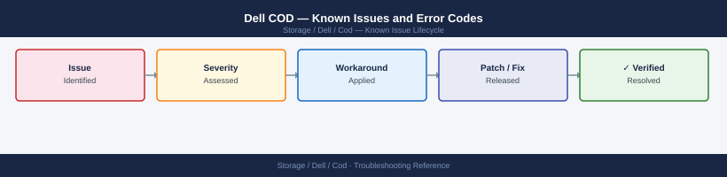

---
tags:
  - troubleshooting
  - cod
  - dell
  - known-issues
description: "Dell COD (Capacity on Demand) is a PowerMax capacity licensing model, not a separate software product. Known issues relate to license activation via ESRS..."
---
# Dell COD — Known Issues and Error Codes

<div class="kb-summary">
Dell COD (Capacity on Demand) is a PowerMax capacity licensing model, not a separate software product. Known issues relate to license activation via ESRS and capacity validation.

*Applies to: Dell PowerMax COD licensing*
</div>



```d2
direction: down

symptom: Identify Symptom {shape: diamond}
license_activation: "License Activation" {shape: rectangle}
resolution: Resolve or Escalate {shape: oval}

symptom -> license_activation: investigate
license_activation -> resolution
```

## Before you begin

- COD issues are almost always ESRS connectivity (TCP 443 to esrs.dell.com) or license entitlement mismatch.
- View COD status in Unisphere for PowerMax → System → Capacity On Demand.

## License Activation

| Error / Symptom | Affected Versions | Cause | Workaround / Fix | Fixed In |
|---|---|---|---|---|
| COD capacity not activating: `ESRS unreachable` | PowerMax | TCP 443 blocked from PowerMax to esrs.dell.com | Open firewall; verify: `curl -sk https://esrs.dell.com` from management network | N/A |
| `COD license limit exceeded` alert | PowerMax | Provisioned capacity exceeds purchased COD tier | Contact Dell to expand COD entitlement; or decommission storage | N/A |
| COD validation fails after ESRS gateway replacement | PowerMax | ESRS gateway not re-registered with PowerMax | Re-register new ESRS gateway in Unisphere → System → ConnectEMC | N/A |

## See also

- [Dell COD — Common Issues](../common-issues/)
- [Dell PowerMax — Known Issues](../../powermax/troubleshooting/known-issues.md)
- [Dell FOD — Known Issues](../../fod/troubleshooting/known-issues.md)
