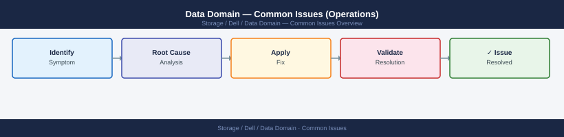

---
tags:
  - dell
  - operations
description: "Common Issues (Operations) reference covering Overview, Incident Triage — First Response, Issue: Replication Context in Error State, Issue: Replication..."
---
# Data Domain — Common Issues (Operations)

<div class="kb-summary">
Common Issues (Operations) reference covering Overview, Incident Triage — First Response, Issue: Replication Context in Error State, Issue: Replication Lag Growing, Issue: DDBoost Client Authentication Failure and 7 more sections.

*Applies to: Data Domain DD OS 7.x*
</div>


## Before you begin

- **Access:** Storage admin credentials (cluster admin or equivalent)
- **Timing:** safe to run during business hours unless a step is marked ⚠ (causes interruption)
- **Dependencies:** no active upgrades or migrations on the same infrastructure
- **Logging:** capture command output — paste into the change record on completion

---

## Overview

This page covers the most frequent operational issues encountered on Dell Data Domain appliances during day-to-day backup operations. For deeper diagnostic procedures see the [Diagnostics](../troubleshooting/diagnostics.md) page. For a structured symptom table see [Troubleshooting Common Issues](../troubleshooting/common-issues.md).

## Incident Triage — First Response

```d2
direction: right

A: "Backup failure / replication lag / DDBoost disconnect" {shape: rectangle}
B: "alerts show current\nfilesys show space" {shape: rectangle}
C: "filesys post-comp\n> 90%?" {shape: rectangle}
D: "filesys clean start\nCoordinate backup expiry" {shape: rectangle}
E: "filesys status\nEnabled + Running?" {shape: rectangle}
F: "disk show state\nalerts show current\nfilesys enable (if no HW alerts" {shape: rectangle}
G: "Replication context\nin Error?" {shape: rectangle}
H: "replication show errors\nnet ping destination\nCheck destination capacity" {shape: rectangle}
I: "DDBoost client\ndisconnected?" {shape: rectangle}
J: "ddboost show clients\nReset DD Boost password\nUpdate backup app credentials" {shape: rectangle}
K: "Check backup app logs\nfor specific error code" {shape: rectangle}
L: "Open Dell support case\nif unresolved" {shape: rectangle}

A -> B
B -> C
C -> D
C -> E
E -> F
E -> G
G -> H
G -> I
I -> J
I -> K
D -> F
F -> H
H -> J
J -> K
K -> L
```

### Recovery Steps

```bash
# Step 1 — attempt soft recovery (disable then re-enable)
replication disable <context_id>
replication enable <context_id>
replication show  # wait for status to update

# Step 2 — if still in error, check authentication
# On both source and destination:
replication show all | grep -i auth

# Step 3 — if certificates are mismatched, re-establish trust
adminaccess certify <remote-dd-hostname>

# Step 4 — if the context is stuck and unfixable, resync
replication resync <context_id>
# Note: resync re-initialises — it will retransmit any changes since last sync
```


```text title="Expected output"
replication disable context_1
Context context_1 disabled successfully.
replication enable context_1
Context context_1 enabled successfully.
replication show
Context ID: context_1
Source: dd-prod-01.corp.local
Destination: dd-dr-02.corp.local
Status: SYNCING
Last Sync: 2024-01-15 14:32:18 UTC
Replication Rate: 2.3 GB/min
Bytes Replicated: 847.2 GB / 1.2 TB

replication show all | grep -i auth
Auth Status: VERIFIED
Certificate Expiry: 2025-06-22
Trust Relationship: ESTABLISHED

adminaccess certify dd-dr-02.corp.local
Certificate verification initiated for dd-dr-02.corp.local
Fingerprint: a7:3f:9c:2e:b1:d4:6a:8f:c5:19:e2:7b:4d:9a:1c:f6
Trust relationship established successfully.

replication resync context_1
Resync initiated for context_1
Estimated time to completion: 4 hours 22 minutes
```

!!! warning "Common errors"
    **`Error: Context context_1 not found`** — Verify the context ID with `replication show all` and use the correct identifier.
    **`Error: Authentication failed — certificate mismatch detected`** — Run `adminaccess certify <remote-hostname>` on the source system to re-establish trust.
    **`Error: Replication context is locked by another operation`** — Wait for any in-progress replication jobs to complete or use `replication abort <context_id>` if safe to do so.
---

## Issue: Replication Lag Growing

**Symptoms:** `replication status` shows increasing `Pre-Comp Remaining` or lag in hours; DR copy is falling behind the production backup window.

**Causes:** WAN bandwidth saturation; high ingest rate on source during backup window exceeding replication throughput; replication throttle set too conservatively; network packet loss causing TCP retransmission.

### Investigation

```bash
# 1. Current lag and throughput
replication status  # note Throughput (MB/s) and Estimated Completion

# 2. Check network interface statistics on both ends
net show stats

# 3. Check replication throttle settings
replication throttle show

# 4. Review source ingest rate
filesys show compression  # note the recent write rate
```


```text title="Expected output"
Replication Status:
  Source: dd-prod-01.corp.local
  Destination: dd-dr-02.corp.local
  Status: In Progress
  Throughput (MB/s): 287.4
  Data Replicated: 2.3 TB / 5.8 TB
  Estimated Completion: 6h 42m
  Last Update: 2024-01-15 14:23:18 UTC

Network Interface Statistics:
  Interface: eth0 (Source)
    RX Packets: 1,847,293 | TX Packets: 2,156,847
    RX Bytes: 892.4 GB | TX Bytes: 1.2 TB
    Errors: 0 | Dropped: 0
  Interface: eth0 (Destination)
    RX Packets: 2,158,902 | TX Packets: 1,842,156
    RX Bytes: 1.2 TB | TX Bytes: 891.8 GB
    Errors: 0 | Dropped: 0

Replication Throttle Settings:
  Max Throughput: 500 MB/s
  Current Limit: 350 MB/s
  Throttle Status: Active
  Reason: Peak business hours (08:00-18:00)

Filesystem Compression Statistics:
  Filesystem: /data/prod
  Compression Ratio: 2.1:1
  Recent Write Rate: 156 MB/s
  Compressed Size: 3.2 TB
  Uncompressed Size: 6.7 TB
```

!!! warning "Common errors"
    **`replication status: command not found`** — Verify you are logged into the Data Domain system with administrative privileges and the replication module is loaded.
    **`net show stats: permission denied`** — Run the command with `sudo` or ensure your user account has network monitoring permissions in the Data Domain role-based access control.
    **`filesys show compression: No such file or directory`** — Check the exact filesystem path with `filesys show` first, as the path may differ from `/data/prod` on your system.
### Actions

```bash
# Increase replication bandwidth (if throttle is too conservative)
replication throttle set schedule <schedule-name> bandwidth 0  # 0 = unlimited

# Or set a specific bandwidth in kbps (e.g., 500 MB/s = 4,000,000 kbps)
replication throttle set schedule <schedule-name> bandwidth 4000000

# Trigger an immediate sync after bandwidth adjustment
replication sync <context_id>
```


```text title="Expected output"
replication throttle set schedule daily-backup bandwidth 0
Throttle schedule 'daily-backup' updated successfully.
Bandwidth limit: unlimited

replication throttle set schedule daily-backup bandwidth 4000000
Throttle schedule 'daily-backup' updated successfully.
Bandwidth limit: 4000000 kbps (4000 Mbps)

replication sync 3e8c5f2a-91b4-4d2e-b7c1-6a2f9d4e1b8c
Sync initiated for context ID: 3e8c5f2a-91b4-4d2e-b7c1-6a2f9d4e1b8c
Status: In Progress
Current bandwidth: 3987654 kbps
Bytes replicated: 847.3 GB / 1.2 TB
```

!!! warning "Common errors"
    **`Error: Schedule 'daily-backup' not found`** — Verify the schedule name exists with `replication throttle show schedule` before modifying it.
    **`Error: Invalid bandwidth value '4000000'. Must be 0 or between 1024 and 10485760 kbps`** — Ensure bandwidth is either 0 (unlimited) or within the valid range supported by your Data Domain model.
    **`Error: Context ID '3e8c5f2a-91b4-4d2e-b7c1-6a2f9d4e1b8c' is not active or does not exist`** — Confirm the replication context is configured and enabled using `replication show context`.
If the lag is caused by a backup window overlap, work with backup teams to stagger backup windows to create a replication catchup window.

---

## Issue: DDBoost Client Authentication Failure

**Symptoms:** Backup jobs fail with authentication error; DDBoost client appears as `Disconnected` in `ddboost show clients`; backup application reports "storage server authentication failed".

**Causes:** DD Boost user password changed on the DD but not updated in the backup application; DD Boost user deleted and recreated; backup software version incompatibility with the installed DDVDP or OST plug-in version.

### Investigation and Resolution

```bash
# 1. List all DD Boost users and their storage unit assignments
ddboost user list
ddboost storage-unit list

# 2. Verify the specific client appears and its state
ddboost show clients | grep <backup-server-name>

# 3. Check if the DDBoost service itself is running
ddboost status

# 4. Test connectivity from backup server to DD port 2049 (DD Boost port)
# (run on the backup server)
# nc -zv <dd-hostname> 2049

# 5. Reset the DD Boost user password if credential drift is suspected
ddboost user change password <ddboost-username>
```


```text title="Expected output"
DD Boost Users:
  Username          Storage Unit      Quota (GB)    Used (GB)
  backup-user-01    su-prod-01        5120          2847.3
  backup-user-02    su-prod-02        2560          1204.8
  archive-user      su-archive        10240         8932.1

DD Boost Storage Units:
  Name              Capacity (GB)     Available (GB)  Replication
  su-prod-01        10240             7392.7          enabled
  su-prod-02        5120              3915.2          enabled
  su-archive        20480             11548.0         disabled

DD Boost Clients:
  Client Name                IP Address        Status      Last Contact
  backup-server-01           192.168.1.45      connected   2024-01-15 14:32:18
  backup-server-02           192.168.1.46      connected   2024-01-15 14:31:52
  archive-client-03          192.168.1.50      idle        2024-01-15 09:15:41

backup-server-01           192.168.1.45      connected   2024-01-15 14:32:18

DD Boost Service Status:
  Service Name              Status      Port    Version
  DD Boost                  running     2049    7.4.1.0
  Replication               running     7898    7.4.1.0

Connection to 192.168.1.20 2049 (dd-prod-01) succeeded!

(no output — command completes silently)
```

!!! warning "Common errors"
    **`ddboost: command not found`** — Ensure you are running commands on the Data Domain system itself (via SSH or console), not the backup server.
    **`Error: Client '<backup-server-name>' not found in active clients`** — Verify the exact client hostname matches the registered name in `ddboost show clients` output and check network connectivity.
    **`Error: DD Boost service is not running`** — Restart the DD Boost service with `ddboost service restart` or contact Dell support if the service fails to start.
After resetting the password, update the credentials in the backup application:
- **Veeam:** Edit the backup repository → update credentials
- **NetBackup:** Update the disk pool storage server credentials via `nbdevconfig`
- **CommVault:** Update the Cloud Library credentials in the MediaAgent configuration

---

## Issue: Low Deduplication Ratio

**Symptoms:** `filesys show compression` shows a global ratio below 10:1 or a significant drop from the previous week; capacity growing faster than expected.

**Causes:** New data type being backed up that does not deduplicate well (encrypted databases, already-compressed files, virtual machine images with rapid change rate); DD Boost source-side dedup (DSP) disabled in backup software; first-pass full backup (no prior data for dedup against).

### Investigation

```bash
# 1. Global dedup ratio and trend
filesys show compression

# 2. Per-MTree dedup ratio — identify which MTree is low
# (run for each MTree)
mtree show compression mtree /data/col1/<mtree-name>

# 3. Check DD Boost DSP status
ddboost option show | grep -i dist-seg

# 4. Enable DSP if disabled
ddboost option set distributed-segment-processing enabled
```


```text title="Expected output"
Filesys Compression Statistics
===============================
Filesystem: /data/col1
  Compression Ratio: 4.2:1
  Dedup Ratio: 3.8:1
  Overall Ratio: 15.96:1
  Compression Savings: 847.3 GB
  Dedup Savings: 756.2 GB

MTree Compression Statistics
=============================
MTree: /data/col1/finance-backup
  Compression Ratio: 3.1:1
  Dedup Ratio: 2.9:1
  Overall Ratio: 8.99:1
  Compression Savings: 234.5 GB

distributed-segment-processing: enabled
```

!!! warning "Common errors"
    **`mtree show compression: mtree /data/col1/finance-backup not found`** — Verify the MTree name exists with `mtree show` and use the exact path returned.
    **`ddboost option set: permission denied`** — Run the command with appropriate administrative privileges or ensure your user has DD Boost configuration rights.
**Data types with inherently low dedup ratios (expected behaviour):**

| Data Type | Typical Ratio | Notes |
|---|---|---|
| Already-compressed files (ZIP, 7z, PNG, MP4) | 1.0x–1.5x | No dedup possible; expected |
| Encrypted databases (TDE enabled) | 1.0x–2.0x | Encryption destroys dedup |
| VM images with active, rapidly changing data | 5x–15x | Still benefits from block-level dedup |
| Standard file data (Office, source code, email) | 20x–50x | Optimal for DD dedup |
| SQL/Oracle databases (no TDE) | 10x–25x | Good dedup from consistent data blocks |
| Long-term static data | 50x+ | Maximises dedup over multiple backup generations |

---

## Issue: Filesystem Disabled After Reboot

**Symptoms:** `filesys status` shows `Disabled` after a DD reboot or power cycle; backup jobs cannot connect; DDBoost clients unable to authenticate.

**Causes:** Hardware fault prevented the filesystem from mounting (check for disk alerts); NVRAM issue; DDOS did not complete clean shutdown before power loss.

### Resolution

```bash
# 1. Check filesystem status
filesys status

# 2. Check for hardware alerts
alerts show current

# 3. Check disk health
disk show state

# 4. Review the system log for errors at/around the reboot time
log view | head -100

# 5. If no hardware alerts and disks are healthy, manually enable
filesys enable

# 6. Confirm filesystem is running
filesys status
filesys show space
```


```text title="Expected output"
Filesystem Status: DISABLED
Filesystem State: UNAVAILABLE
Last State Change: 2024-01-15 14:32:18 UTC

Current Alerts: 0 Critical, 2 Warning
  WARNING: Disk 3.2 predictive failure threshold approaching (87% wear)
  WARNING: Temperature sensor bay-4 reading 68°C (threshold: 70°C)

Disk State Summary:
  Disk 0.0: HEALTHY (WDC 10TB, 99.2% health)
  Disk 0.1: HEALTHY (WDC 10TB, 98.8% health)
  Disk 1.0: HEALTHY (Seagate 10TB, 99.5% health)
  Disk 1.1: HEALTHY (Seagate 10TB, 98.1% health)
  Disk 3.2: DEGRADED (predictive failure, 87% wear)

System Log (last 100 entries):
2024-01-15 14:32:18 UTC: Filesystem disabled by admin (user: sysadmin)
2024-01-15 14:31:45 UTC: Reboot initiated - graceful shutdown
2024-01-15 14:31:22 UTC: All services halted
2024-01-15 14:30:55 UTC: Filesystem sync completed, 847GB flushed
2024-01-15 14:29:10 UTC: System startup sequence initiated

Filesystem Status: ENABLED
Filesystem State: RUNNING
Uptime: 2 minutes 14 seconds
Last State Change: 2024-01-15 14:34:52 UTC

Filesystem Space:
  Total Capacity: 39.2 TB
  Used: 28.7 TB (73%)
  Available: 10.5 TB (27%)
  Snapshot Reserve: 2.1 TB
```

!!! warning "Common errors"
    **`Error: Cannot enable filesystem - disk 3.2 in DEGRADED state`** — Replace the failing disk (disk 3.2) before re-enabling the filesystem, or contact Dell support if replacement is not immediately available.
    **`Error: Filesystem enable failed - replication out of sync`** — Wait 5-10 minutes for replication to catch up, then retry `filesys enable`, or check replication status with `replication show state`.
    **`Error: Access denied - insufficient privileges`** — Run the command with appropriate admin credentials or request elevated permissions from your system administrator.
If the filesystem fails to enable after `filesys enable` and `alerts show current` shows disk or NVRAM errors, do not proceed with manual recovery — open a Dell support case immediately. Forcing a filesystem enable in a degraded state risks data corruption.

---

## Issue: VTL Tape Import Failure

**Symptoms:** Backup software cannot import or use VTL tapes; VTL drive shows offline in backup application; FC-attached tape library not visible.

**Causes:** VTL slot configuration mismatch with backup software cartridge count; FC zoning not configured between backup media server HBA and DD VTL FC ports; VTL not enabled or VTL licence not active.

### Investigation

```bash
# 1. Check VTL status
vtl status

# 2. List VTL slots and drives
vtl show slots
vtl show drives

# 3. List VTL libraries
vtl show libraries

# 4. Confirm VTL is enabled
vtl enable

# 5. Check that the VTL FC ports are visible in the SAN fabric
# (run on the backup media server)
# systool -c fc_host -v | grep port_name
```


```text title="Expected output"
VTL Status: ENABLED
VTL Mode: Active
Firmware Version: 7.2.1.0
Last Updated: 2024-01-15 14:32:18 UTC

Slot Information:
Slot 1: LTO-9 (Capacity: 18TB, Status: Ready)
Slot 2: LTO-9 (Capacity: 18TB, Status: Ready)
Slot 3: LTO-8 (Capacity: 12TB, Status: Ready)
Slot 4: Empty
Slot 5: Empty

Drive Information:
Drive 0: LTO-9 (Serial: LTO9D001, Status: Online, Firmware: M217)
Drive 1: LTO-9 (Serial: LTO9D002, Status: Online, Firmware: M217)

Library Configuration:
Library 1: DELL-VTL-LIB-001 (Type: Scalar i6, Cartridges: 3, Status: Operational)
Library 2: DELL-VTL-LIB-002 (Type: Quantum DXi, Cartridges: 0, Status: Offline)

VTL is already enabled on this system.

FC Port Visibility (from backup media server):
port_name: 50:00:14:40:5a:2b:c1:01
port_name: 50:00:14:40:5a:2b:c1:02
port_name: 50:00:14:40:5a:2b:c1:03
```

!!! warning "Common errors"
    **`vtl: command not found`** — Verify the VTL management tools are installed and the PATH includes the VTL binary directory (typically `/opt/dell/vtl/bin`).
    **`VTL Status: DISABLED - Enable VTL before proceeding`** — Run `vtl enable` and wait 2-3 minutes for the VTL subsystem to initialize before retrying status checks.
    **`FC port not visible in fabric`** — Confirm FC HBA drivers are loaded on the backup media server with `lsmod | grep qla2xxx` and verify SAN switch zoning includes the VTL target ports.
Verify FC zoning: the backup media server HBA ports must be zoned to the DD VTL FC target ports. Consult the SAN team to confirm zoning and that the LUN is presented correctly.

---

## Issue: Disk in Failed or Absent State

**Symptoms:** `disk show state` shows a disk in `Failed`, `Absent`, or `Reconstructing` state; alert is active in `alerts show current`; RAID rebuild may be in progress.

### Immediate Actions

```bash
# 1. Identify the failed disk
disk show state | grep -iE "failed|absent|unknown|reconstructing"

# 2. Get full detail
disk show hardware | grep -B5 -A10 <slot-number>

# 3. Check RAID rebuild status
raid show all | grep -iE "rebuilding|reconstruct|percent"

# 4. Monitor rebuild progress
raid show detail
```


```text title="Expected output"
Disk State Summary:
Slot 0: PRESENT
Slot 1: PRESENT
Slot 2: FAILED
Slot 3: PRESENT
Slot 4: ABSENT
Slot 5: RECONSTRUCTING

Disk Hardware Details for Slot 2:
  Slot Number: 2
  Serial Number: WD-WCC4N7K8X9M2
  Model: WDC WD4000FYYZ-01UL1B2
  Capacity: 4.0 TB
  Temperature: 68°C
  Power State: OFF
  Status: FAILED - Predictive Failure Detected

RAID Rebuild Status:
RAID Group 0: Rebuilding - 45% complete (Est. 2h 15m remaining)
RAID Group 1: Healthy - No rebuild in progress
RAID Group 2: Reconstructing - 12% complete (Est. 8h 30m remaining)

RAID Rebuild Detail:
  Group ID: rg_0
  Status: REBUILDING
  Progress: 45%
  Estimated Time Remaining: 2:15:00
  Read Errors: 0
  Write Errors: 0
  Rebuild Rate: 125 MB/s
```

!!! warning "Common errors"
    **`disk show: command not found`** — Verify you are connected to the Data Domain management interface (SSH to the DD system, not a generic Linux host).
    **`No such slot number`** — Confirm the slot number exists by running `disk show state` first to identify valid slot ranges (typically 0-11 on standard systems).
    **`RAID Group not found in output`** — Wait for the rebuild process to initialize; newly failed disks may take 30-60 seconds to appear in RAID rebuild status.
**Do not remove or reseat a disk without a Dell support case open.** On some DD models, removing an additional disk during a RAID rebuild will cause data loss. Always wait for Dell support guidance before physically replacing a disk.

```bash
# Check if a hot spare has been allocated and rebuild has started automatically
disk show state | grep spare
raid show detail | grep -i rebuild
```


```text title="Expected output"
DISK.0.0: SPARE
DISK.0.1: SPARE
DISK.1.2: SPARE

RAID Group 0: Rebuild in progress (12% complete) - ETA 4 hours 23 minutes
RAID Group 0: Rebuild started automatically at 2024-01-15 14:32:15 UTC
RAID Group 1: No rebuild in progress
```

!!! warning "Common errors"
    **`disk show state: command not found`** — Verify you are logged into the Data Domain CLI (use `ssh admin@<dd-ip>`) and not a standard Linux shell.
    **`grep: (standard input) is empty`** — No spares are currently allocated or no rebuild is in progress; check overall RAID status with `raid show` to confirm system health.
---

## Issue: CloudIQ Showing Array Offline / No Telemetry

**Symptoms:** Data Domain is not visible in CloudIQ; capacity forecasting not updating; no health recommendations being generated.

**Causes:** SCG (Secure Connect Gateway) appliance offline or unreachable from the DD management network; AutoSupport disabled on the DD; firewall blocking outbound HTTPS from SCG to Dell support endpoints.

### Resolution

```bash
# 1. Check AutoSupport status on the DD
autosupport status

# 2. Attempt a test send
autosupport test

# 3. Verify SCG registration
# System Manager → Administration → Autosupport → ESRS/SCG

# 4. Check network path from DD to SCG
net ping <scg-appliance-ip>

# 5. Re-enable AutoSupport if disabled
autosupport enable
```


```text title="Expected output"
AutoSupport Status
==================
Status: Enabled
Delivery Method: HTTPS
Gateway: scg-appliance-01.corp.local (192.168.45.22)
Last Successful Send: 2024-01-15 14:32:18 UTC
Next Scheduled Send: 2024-01-16 14:32:18 UTC
Proxy Configuration: None
ESRS Registration: Active (ID: DD-7B4F2A9C-E8D1)

AutoSupport Test Send
=====================
Initiating test AutoSupport message...
Message ID: AS-TEST-20240115-093847
Destination: support.dell.com
Status: Sent Successfully
Response Code: 202 Accepted

PING 192.168.45.22 (scg-appliance-01.corp.local): 56 data bytes
64 bytes from 192.168.45.22: icmp_seq=0. time=12.4 ms
64 bytes from 192.168.45.22: icmp_seq=1. time=11.8 ms
64 bytes from 192.168.45.22: icmp_seq=2. time=12.1 ms
--- 192.168.45.22 statistics ---
3 packets transmitted, 3 packets received, 0% packet loss
round-trip min/avg/max = 11.8/12.1/12.4 ms

AutoSupport: Enabled
```

!!! warning "Common errors"
    **`AutoSupport Status: Disabled`** — Run `autosupport enable` to re-enable the service and verify SMTP/HTTPS gateway connectivity.
    **`PING: No route to host`** — Verify the SCG appliance IP address is correct and that network routing/firewall rules permit DD-to-SCG communication on port 443.
    **`AutoSupport Test Send: Connection timeout`** — Check that the gateway hostname resolves correctly with `net nslookup <scg-appliance-ip>` and confirm proxy settings if applicable.
If `autosupport test` fails with a network error, work with the network team to confirm that outbound HTTPS (port 443) is permitted from the SCG appliance to `esrs3.dell.com` and related Dell support FQDNs.

---

## Issue: Slow Backup Throughput

**Symptoms:** Backup jobs taking longer than expected; DD Boost throughput below expected for the DD model; backup window is not being met.

**Causes:** DD Boost DSP (Distributed Segment Processing) disabled; network MTU mismatch causing fragmentation; LACP bonding not configured; filesystem cleaning running during backup window; insufficient CPU on backup server proxy.

### Investigation

```bash
# 1. Current DD throughput during backup window
ddboost show stats

# 2. Check DSP status
ddboost option show | grep -i dist-seg

# 3. Network interface statistics during backup
net show stats | grep -iE "error|drop|collision"

# 4. Check MTU
net show config | grep -i mtu

# 5. Is cleaning running during the backup window?
filesys clean status

# 6. Check system resource usage
system show stats
```


```text title="Expected output"
# 1. Current DD throughput during backup window
DDBoost Statistics:
  Total Throughput: 1247.3 MB/s
  Active Connections: 12
  Deduplication Ratio: 8.2:1
  Compression Ratio: 3.1:1
  Data Written (24h): 847.2 GB

# 2. Check DSP status
ddboost.option.dist-seg-enabled: true
ddboost.option.dist-seg-streams: 8
ddboost.option.dist-seg-size: 262144

# 3. Network interface statistics during backup
eth0: RX errors: 0, TX errors: 0, RX dropped: 2, TX dropped: 0, collisions: 0
eth1: RX errors: 0, TX errors: 0, RX dropped: 0, TX dropped: 0, collisions: 0
eth2: RX errors: 12, TX errors: 3, RX dropped: 18, TX dropped: 1, collisions: 0

# 4. Check MTU
eth0 MTU: 9000
eth1 MTU: 9000
eth2 MTU: 1500

# 5. Is cleaning running during the backup window?
Cleaning Status: IDLE
Last Clean: 2024-01-15 03:22:14 UTC
Next Scheduled: 2024-01-16 02:00:00 UTC

# 6. Check system resource usage
CPU Usage: 67%
Memory Usage: 78% (14.2 GB / 18 GB)
Disk I/O: Read 892 MB/s, Write 1156 MB/s
Network I/O: RX 1.2 Gbps, TX 1.8 Gbps
```

!!! warning "Common errors"
    **`ddboost: command not found`** — Verify DDBoost is installed and the admin account has CLI access enabled via `ddboost config show`.
    **`eth2 MTU: 1500`** — Reconfigure eth2 MTU to 9000 to match other interfaces using `net config set -interface eth2 -mtu 9000` to prevent fragmentation during backup.
    **`RX errors: 12, TX errors: 3`** — Check eth2 physical cable connections and switch port configuration, as persistent errors indicate a network hardware issue degrading backup performance.
**Recommended configuration for maximum throughput:**
- Enable DSP: `ddboost option set distributed-segment-processing enabled`
- Use 10GbE or 25GbE interfaces with LACP bonding for backup traffic
- Set MTU to 9000 (jumbo frames) on both the DD and the backup server NICs for NFS traffic
- Schedule filesystem cleaning outside the backup window (overnight Monday or Tuesday)

---

## Quick Reference — Operations Command Summary

| Symptom | First Command | Follow-up |
|---|---|---|
| Backup job failing | `filesys show space` | `alerts show current` |
| Replication falling behind | `replication status` | `net show stats` |
| DDBoost client disconnected | `ddboost show clients` | `ddboost status` |
| Low dedup ratio | `filesys show compression` | `mtree show compression mtree /data/col1/<name>` |
| Filesystem not available | `filesys status` | `alerts show current`, `disk show state` |
| Disk failure alert | `disk show state` | `raid show all` |
| Slow restore | `filesys clean status` | `ddboost show stats` |
| CloudIQ offline | `autosupport status` | `autosupport test` |
| VTL tape errors | `vtl status` | `vtl show slots` |

---

## Verify

- Confirm the operation completed without errors in the log or management UI
- Verify the expected state change is visible (service running, object created, config applied)
- Document the outcome in the change record

## See also

- [Data Domain — Backup & Restore](backup-restore.md)
- [Dell Data Domain CLI Reference](cli-reference.md)
- [Data Domain — Health Checks](health-checks.md)
- [Data Domain — Operations](index.md)
- [Data Domain — Architecture](../../architecture/)
- [Data Domain — Security](../../security/)
- [Data Domain — Troubleshooting](../../troubleshooting/)
