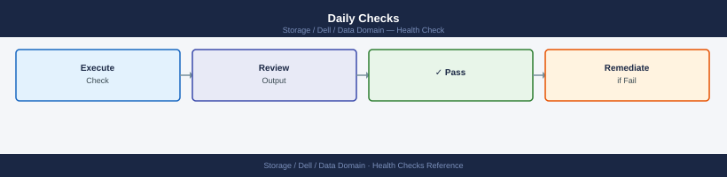

---
tags:
  - dell
  - operations
description: "Health Checks reference covering Daily Checks, Weekly Health Check, Health Check — Pre-Change, Capacity Monitoring, Replication Health and 3 more sections."
---
# Data Domain — Health Checks

<div class="kb-summary">
Health Checks reference covering Daily Checks, Weekly Health Check, Health Check — Pre-Change, Capacity Monitoring, Replication Health and 3 more sections.

*Applies to: Data Domain DD OS 7.x*
</div>

```vegalite
{
  "$schema": "https://vega.github.io/schema/vega-lite/v5.json",
  "title": {
    "text": "Health Checks \u2014 Thresholds",
    "fontSize": 13,
    "fontWeight": "normal"
  },
  "width": 480,
  "height": {
    "step": 26
  },
  "data": {
    "values": [
      {
        "metric": "Post-comp used",
        "zone": "Safe",
        "val": 80
      },
      {
        "metric": "Post-comp used",
        "zone": "Alert",
        "val": 20
      },
      {
        "metric": "MTree quota used",
        "zone": "Safe",
        "val": 85
      },
      {
        "metric": "MTree quota used",
        "zone": "Alert",
        "val": 15
      }
    ]
  },
  "mark": {
    "type": "bar",
    "cornerRadiusEnd": 3
  },
  "encoding": {
    "y": {
      "field": "metric",
      "type": "nominal",
      "axis": {
        "title": null,
        "labelLimit": 200
      },
      "sort": null
    },
    "x": {
      "field": "val",
      "type": "quantitative",
      "stack": "normalize",
      "axis": {
        "title": "Threshold boundary",
        "format": ".0%"
      }
    },
    "color": {
      "field": "zone",
      "type": "nominal",
      "scale": {
        "domain": [
          "Safe",
          "Alert"
        ],
        "range": [
          "#15803d",
          "#dc2626"
        ]
      },
      "legend": {
        "title": "Zone"
      }
    },
    "order": {
      "field": "zone",
      "sort": [
        "Safe",
        "Alert"
      ]
    },
    "tooltip": [
      {
        "field": "metric",
        "type": "nominal",
        "title": "Metric"
      },
      {
        "field": "zone",
        "type": "nominal",
        "title": "Zone"
      },
      {
        "field": "val",
        "type": "quantitative",
        "title": "Segment %",
        "format": ".0f"
      }
    ]
  }
}
```

## Before you begin

- **Access:** Storage admin credentials (cluster admin or equivalent)
- **Timing:** safe to run during business hours unless a step is marked ⚠ (causes interruption)
- **Dependencies:** no active upgrades or migrations on the same infrastructure
- **Logging:** capture command output — paste into the change record on completion

---

## Daily Checks



```d2
direction: right

A: "Daily Health Check" {shape: rectangle}
B: "alerts show current\nAny active alerts?" {shape: rectangle}
C: "Critical or\nhardware alert?" {shape: rectangle}
D: "disk show state\nenclosure show hardware\nOpen Dell support case" {shape: rectangle}
E: "filesys show space\nPost-comp < 80%?" {shape: rectangle}
F: "Capacity\n> 80%?" {shape: rectangle}
G: "filesys clean start\nPlan capacity expansion" {shape: rectangle}
H: "replication show\nAll contexts Normal?" {shape: rectangle}
I: "Context in Error\nor high lag?" {shape: rectangle}
J: "replication show errors\nCheck network\nreplication disable + enable" {shape: rectangle}
K: "ddboost show clients\nAll backup servers connected?" {shape: rectangle}
L: "Client\ndisconnected?" {shape: rectangle}
M: "ddboost status\nReset credentials if needed" {shape: rectangle}
N: "All checks passed" {shape: rectangle}

A -> B
B -> C
C -> D
C -> E
E -> F
F -> G
F -> H
H -> I
I -> J
I -> K
K -> L
L -> M
L -> N
D -> G
G -> J
J -> M
M -> N
```

## Run This Routine

1. **System status:** `sysstat` — overall health and uptime
2. **Filesystem status:** `filesys status` — check "File system is enabled and running"
3. **Dedup ratio:** `filesys show compression` — verify compression ratio in expected range
4. **Disk health:** `disk show state` — all disks in Normal state
5. **Replication status (if configured):** `replication status` — check all contexts Replicating or Idle
6. **Cleaner status:** `filesys clean show` — check last clean timestamp
7. **Space usage:** `filesys show space` — flag if >80% used

## Health Check — Pre-Change


Run these checks before any planned change or as first-response steps when investigating backup failures or capacity alerts.

- [ ] `filesys status` — filesystem is `Enabled` and `Running`
- [ ] `filesys show space` — post-compression usage below 80%; at least 10–15% raw capacity free for cleaner operation
- [ ] `filesys show compression` — global dedup ratio above 10:1; note if it has dropped since the last check
- [ ] `alerts show current` — no active hardware alerts (disk, fan, PSU, NIC)
- [ ] `replication show` — all contexts in `Normal` or `Replicating` with no lag growing unboundedly
- [ ] `ddboost status` — DDBoost service is active and all storage units are accessible
- [ ] `system show` — system hardware health is clean; note firmware version
- [ ] `mtree list` — all MTrees are accessible; per-MTree quotas are not exhausted

```bash
# Check filesystem operational status
filesys status

# Show pre- and post-compression space usage
filesys show space

# Show global deduplication and compression ratio
filesys show compression

# Show all replication contexts, their state, and lag
replication show

# Show per-context replication throughput and detailed status
replication status

# List all MTrees and their individual space usage
mtree list

# Show per-MTree dedup ratio for a specific MTree
mtree show compression mtree /data/col1/<mtree-name>

# List DDBoost-connected clients and storage unit status
ddboost show clients

# Show DDBoost service status
ddboost status

# Show all currently active system alerts
alerts show current

# Show system hardware health and DDOS version
system show
```


```text title="Expected output"
Filesystem Status: HEALTHY
  Filesystems: 1
  Total Capacity: 100.0 TB
  Used Capacity: 67.3 TB
  Available Capacity: 32.7 TB

Pre-compression Used: 287.4 TB
Post-compression Used: 67.3 TB
Compression Ratio: 4.27:1

Global Deduplication Ratio: 2.89:1
Global Compression Ratio: 1.48:1
Combined Ratio: 4.27:1

Replication Context: prod-backup
  State: ACTIVE
  Lag: 0 seconds
  Last Sync: 2024-01-15 14:32:18 UTC

Replication Context: dr-site
  State: ACTIVE
  Lag: 127 seconds
  Last Sync: 2024-01-15 14:30:11 UTC

Context: prod-backup
  Throughput: 487.2 MB/s
  Total Replicated: 12.4 TB
  Status: In Sync

MTree: /data/col1/finance-backup
  Used Space: 18.7 TB
  Dedup Ratio: 3.12:1

MTree: /data/col1/hr-archive
  Used Space: 9.2 TB
  Dedup Ratio: 2.45:1

MTree Compression Ratio (/data/col1/finance-backup): 1.56:1

DDBoost Client: backup-server-01 (192.168.1.45)
  Status: CONNECTED
  Storage Unit: /data/col1/finance-backup
  Connected Since: 2024-01-10 08:15:33 UTC

DDBoost Client: backup-server-02 (192.168.1.46)
  Status: CONNECTED
  Storage Unit: /data/col1/hr-archive
  Connected Since: 2024-01-12 11:22:09 UTC

DDBoost Service Status: RUNNING
  Port: 3009
  Connections: 2
  Active Sessions: 2

Current Alerts: None

System Information:
  Model: Data Domain DD9900
  DDOS Version: 7.15.1.0
  Hardware Health: OPTIMAL
  CPU Usage: 34%
  Memory Usage: 62%
```

!!! warning "Common errors"
    **`Error: Replication context 'dr-site' not found`** — Verify the replication context name with `replication show` and ensure it is configured on the system.
    **`Error: MTree '/data/col1/<mtree-name>' does not exist`** — Run `mtree list` to confirm the exact MTree path and replace `<mtree-name>` with the actual MTree identifier.
    **`Error: DDBoost service is not running`** — Start the DDBoost service with `ddboost start` and verify connectivity with `ddboost status`.
## Capacity Monitoring


| Metric | Threshold | Action |
|---|---|---|
| Post-comp used | > 80% | Plan expansion or cleaning cycle |
| MTree quota used | > 85% | Increase quota or expire old data |
| Cleaning last run | > 7 days | Trigger `filesys clean start` |
| Replication lag | > 4 hours | Investigate network or source load |

## Replication Health


```bash
# All replication contexts
replication show all

# Contexts not in replicating or idle state
replication status | grep -v "replicating\|idle"

# Lag detail per context
replication show stats
```


```text title="Expected output"
Replication Contexts:
  Context Name          Source              Destination        State
  prod-backup-01        192.168.1.50        192.168.2.100       replicating
  dr-sync-02            192.168.1.51        192.168.2.101       idle
  archive-weekly-03     192.168.1.52        192.168.2.102       replicating
  hotspot-04            192.168.1.53        192.168.2.103       idle

Replication Status (non-idle/non-replicating):
  Context Name          State               Last Error
  hotspot-04            error               Connection timeout at 14:32:15
  archive-weekly-03     paused              Manual pause by admin@ddmd1

Replication Statistics:
  Context               Sent (GB)    Lag (hours)    Last Update
  prod-backup-01        2847.3       0.25           2024-01-15 09:42:31
  dr-sync-02            5124.8       1.12           2024-01-15 09:41:15
  archive-weekly-03     891.2        18.45          2024-01-14 15:30:22
  hotspot-04            156.4        72.33          2024-01-13 09:15:08
```

!!! warning "Common errors"
    **`error: replication context 'hotspot-04' not responding`** — Verify network connectivity to the destination system and check firewall rules between source and destination Data Domain appliances.
    **`error: insufficient bandwidth for replication context 'archive-weekly-03'`** — Increase the bandwidth throttle limit or reduce concurrent replication contexts using `replication modify <context> -bandwidth <Mbps>`.
## Hardware Health


```bash
# Disk states (no failed or reconstructing disks)
disk show state | grep -v normal

# Enclosure health (power, fans, temperature)
enclosure show hardware | grep -iE "fault|failed|warning"

# RAID group status
raid show all | grep -v "normal\|OK"
```


```text title="Expected output"
(no output — command completes silently)
(no output — command completes silently)
(no output — command completes silently)
```

!!! warning "Common errors"
    **`disk show state: command not found`** — Verify you are logged into the Data Domain CLI (SSH to the management IP) and not a standard Linux shell.
    **`enclosure show hardware: No such file or directory`** — Confirm the Data Domain system is online and responding; try `system show` first to verify connectivity.
    **`raid show all: Invalid command`** — Check your Data Domain firmware version supports this syntax; use `raid show` without the `all` parameter on older versions.
## Pre-Change Checklist

- [ ] No critical or error alerts active
- [ ] Filesystem enabled and healthy
- [ ] All disks in normal state
- [ ] No RAID rebuild in progress
- [ ] Replication lag within acceptable range
- [ ] Cleaning not in progress (or aware it may run)
- [ ] Support bundle taken for baseline

## Health Summary Table

| Check | Expected | Command |
|---|---|---|
| Active alerts | None critical | `alert show current` |
| Filesystem state | Enabled | `filesys status` |
| Disk state | All normal | `disk show state` |
| RAID state | Normal | `raid show all` |
| Replication lag | < 4 hours | `replication show stats` |
| Capacity used | < 80% | `filesys show space` |
| Last cleaning | < 7 days | `filesys clean status` |

---

## Verify

- Confirm the operation completed without errors in the log or management UI
- Verify the expected state change is visible (service running, object created, config applied)
- Document the outcome in the change record

---

## See also

- [Data Domain — Procedures](../procedures/)
- [Data Domain — CLI Reference](../cli-reference/)
- [Data Domain — Common Issues](../../troubleshooting/common-issues/)
