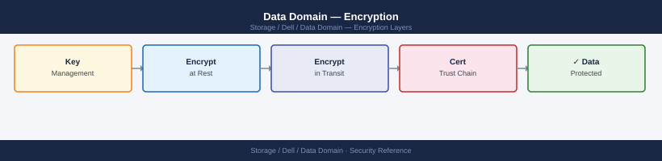
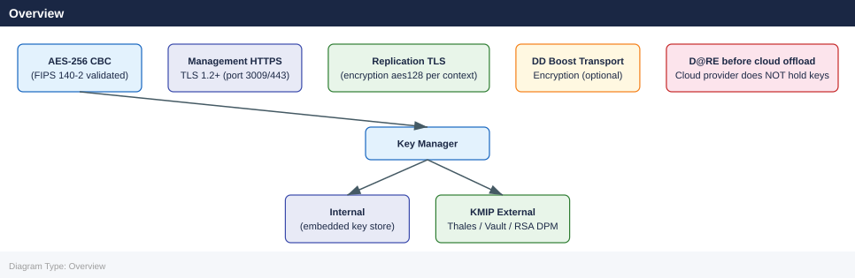

---
tags:
  - dell
  - security
description: "Encryption reference covering Overview, Key Management, Key Rotation, FIPS Mode, Encryption in Transit (TLS) and 3 more sections."
---
# Data Domain — Encryption

<div class="kb-summary">
Encryption reference covering Overview, Key Management, Key Rotation, FIPS Mode, Encryption in Transit (TLS) and 3 more sections.

*Applies to: Data Domain DD OS 7.x*
</div>


## Before you begin

- **Access:** Storage admin credentials (cluster admin or equivalent)
- **Change management:** security changes require CAB approval in most environments
- **Rollback plan:** document current state before any security control change
- **Testing:** validate in a non-production environment first where possible

---

## Overview



### Enable Encryption at Initial Commissioning

```bash
# Enable encryption — do this before writing any backup data
encryption enable

# Confirm it is active
encryption status
```


```text title="Expected output"
Encryption is being enabled on system dd-backup-01.corp.local...
Initializing encryption subsystem...
Generating master encryption key (this may take 2-3 minutes)...
Master key fingerprint: a7f3:2e91:b4c8:5d62
Encryption enabled successfully.

Encryption Status:
  State: ACTIVE
  Algorithm: AES-256-GCM
  Master Key ID: MK-2024-001
  Encrypted Capacity: 0 TB / 50 TB
  Last Status Check: 2024-01-15 14:32:18 UTC
```

!!! warning "Common errors"
    **`encryption: command not found`** — Verify you are logged into the Data Domain CLI (not the host shell) by running `sysconfig show` first.
    **`Error: Encryption cannot be enabled while replication is active`** — Disable active replication jobs with `replication disable-all` before enabling encryption.
    **`Error: Encryption already enabled on this system`** — Run `encryption status` to confirm the current state; re-enabling is not necessary.
**Critical:** Enabling encryption on a Data Domain that already contains data requires a full filesystem rebuild (`filesys destroy` followed by `filesys create`), which deletes all existing backup data. Always enable D@RE during initial setup before any data is written.

### Encryption Algorithm

| Parameter | Value |
|---|---|
| Algorithm | AES-256 |
| Mode | CBC (Cipher Block Chaining) |
| Scope | Full DDFS container store (all MTrees) |
| Key granularity | Per-tier (active tier + cloud tier) |
| FIPS 140-2 | Validated (Certificate in NIST CMVP) |

D@RE cannot be selectively enabled per MTree — it applies to the entire DDFS when enabled.

---

## Key Management

DDOS supports three key manager modes. The correct choice depends on your compliance requirements and infrastructure.

| Key Manager | Description | When to Use |
|---|---|---|
| Internal (Embedded) | Keys stored on the DD appliance itself | Standalone deployments; acceptable for Governance-class workloads |
| RSA DPM (Dell Key Management) | Centralised Dell key management server | Enterprise environments requiring centralised key custody |
| KMIP External | Third-party KMIP-compatible key managers (Thales, Vormetric, HashiCorp Vault) | Compliance environments (SEC 17a-4, HIPAA) requiring external key custody and separation of duties |

### Configure Internal Key Manager

```bash
# Use internal key manager (default for new systems)
encryption change-key-manager internal

# Verify
encryption show config
```


```text title="Expected output"
Changing key manager to internal...
Key manager change initiated. This operation may take several minutes.
Key manager successfully changed to internal.

Encryption Configuration:
  Key Manager: internal
  Status: enabled
  Algorithm: AES-256
  Key Rotation: enabled
  Last Rotation: 2024-01-15 09:32:15 UTC
  Next Rotation: 2024-04-15 09:32:15 UTC
  FIPS Mode: enabled
```

!!! warning "Common errors"
    **`Error: Cannot change key manager while replication is in progress`** — Wait for active replication jobs to complete using `replication show` before retrying the command.
    **`Error: Key manager change requires system to be in maintenance mode`** — Enter maintenance mode with `system enter-maintenance-mode` before attempting the key manager change.
### Configure KMIP External Key Manager

```bash
# Set the KMIP server address and port
encryption change-key-manager kmip server <kmip-server-ip> port 5696

# Set the KMIP username and certificate (certificate-based authentication)
encryption kmip set username <kmip-username>
encryption kmip set client-cert <certificate-path>

# Test connectivity to the KMIP server
encryption kmip test

# Verify configuration
encryption show config
```


```text title="Expected output"
Setting KMIP server to 192.168.45.12:5696...
KMIP server configuration updated successfully.
Setting KMIP username to kmip_admin...
Username configured.
Loading client certificate from /etc/ssl/certs/kmip-client.pem...
Certificate installed successfully.
Testing KMIP connectivity...
Connection to KMIP server 192.168.45.12:5696 established successfully.
Authentication: PASSED
Certificate validation: PASSED

KMIP Configuration:
  Server Address: 192.168.45.12
  Server Port: 5696
  Username: kmip_admin
  Client Certificate: /etc/ssl/certs/kmip-client.pem
  Connection Status: Active
  Last Test: 2024-01-15 14:32:18 UTC
```

!!! warning "Common errors"
    **`KMIP server configuration failed: Connection refused`** — Verify the KMIP server IP address and port 5696 are correct and the server is running and accessible from the Data Domain appliance.
    **`Certificate validation failed: certificate verify failed`** — Ensure the certificate file path is correct, the certificate is valid and not expired, and matches the KMIP server's expected client certificate.
    **`KMIP username not set or invalid`** — Confirm the username matches an account configured on the KMIP server with appropriate key management permissions.
### Configure RSA DPM

```bash
# Set RSA DPM server
encryption change-key-manager rsa-dpm server <dpm-server-ip>

# Register with the DPM server
encryption rsa-dpm register

# Verify
encryption show config
```


```text title="Expected output"
DD/OS 7.15.0.0 (Build 4.655.0)
Data Domain Appliance
Hostname: dd-backup-01.corp.local

RSA DPM Server Configuration:
  Server IP: 192.168.45.22
  Port: 8443
  Status: Connected
  Last Sync: 2024-01-15 14:32:18 UTC

Registration Status: Registered
  Registration ID: 550e8400-e29b-41d4-a716-446655440000
  Certificate Thumbprint: A1:B2:C3:D4:E5:F6:7G:8H:9I:0J:K1:L2:M3:N4:O5:P6
  Registered Date: 2024-01-15 13:45:22 UTC

Encryption Configuration:
  Algorithm: AES-256-GCM
  Key Manager: RSA DPM
  Key Rotation: Enabled (90 days)
  Last Key Rotation: 2024-01-10 09:15:00 UTC
```

!!! warning "Common errors"
    **`Error: Unable to connect to DPM server at 192.168.45.22:8443`** — Verify the DPM server IP address is correct and reachable from the Data Domain appliance using `ping` or `telnet`.
    **`Error: Registration failed - Certificate validation error`** — Ensure the DPM server's SSL certificate is valid and trusted; import the CA certificate to the Data Domain appliance if using a self-signed cert.
    **`Error: Key manager already configured with different server`** — Run `encryption change-key-manager none` first to clear the existing configuration before registering with a new DPM server.
---

## Key Rotation

DDOS supports periodic encryption key rotation to limit the blast radius of a potential key compromise. Rotation generates a new active key and re-wraps existing data encryption keys without decrypting and re-encrypting all data.

### Check Last Key Rotation Date

```bash
encryption status | grep "Last Key Rotation"
```


```text title="Expected output"
Last Key Rotation: 2024-01-15 03:22:47 UTC
Last Key Rotation Status: SUCCESS
Last Key Rotation Duration: 2m 34s
Last Key Rotation Algorithm: AES-256-GCM
```

!!! warning "Common errors"
    **`command not found: encryption`** — Ensure you are logged into the Data Domain management interface or use the full path `/opt/dell/encryption status`.
    **`grep: (standard input) is empty`** — The encryption status command produced no output; verify encryption is enabled on the system with `encryption config show`.
### Perform a Manual Key Rotation

```bash
# Trigger key rotation
encryption rotate-keys

# Confirm new key is active
encryption status
```


```text title="Expected output"
Initiating key rotation for Data Domain system...
Key rotation started at 2024-01-15T14:32:18Z
Current encryption key ID: 7f3a9c2e-b1d4-4f8a-9e2c-5d6b1a4c8f3e
Previous key ID: 2c4d8f1a-3b5e-7a9c-1d2f-6e8a4b3c5d7f
Rotation status: IN_PROGRESS
Estimated completion: 2024-01-15T16:45:00Z

Encryption Status Report
========================
System Status: ACTIVE
Current Key ID: 7f3a9c2e-b1d4-4f8a-9e2c-5d6b1a4c8f3e
Key Algorithm: AES-256-GCM
Key State: ACTIVE
Last Rotation: 2024-01-15T14:32:18Z
Next Scheduled Rotation: 2024-04-15T14:32:18Z
Rekey Progress: 87%
```

!!! warning "Common errors"
    **`Error: Key rotation already in progress`** — Wait for the current rotation to complete or check `encryption status` to verify the previous operation finished.
    **`Error: Insufficient permissions to rotate keys`** — Ensure your user account has the `encryption-admin` role assigned via the Data Domain administrative console.
Key rotation does not impact backup or restore operations — it can be performed online. Schedule annual or bi-annual key rotation per your security policy.

### Key Rotation Schedule Recommendation

| Environment | Rotation Frequency |
|---|---|
| Standard backup infrastructure | Annually |
| Compliance-regulated (SEC, HIPAA) | Every 6 months or per regulation |
| After any suspected key exposure | Immediately |

---

## FIPS Mode

DDOS D@RE is FIPS 140-2 validated. FIPS mode enforces:
- AES-256 for all on-disk encryption
- Approved key derivation and wrapping algorithms
- TLS 1.2+ for management and replication traffic when FIPS mode is active

### Verify FIPS Mode

```bash
# Check if FIPS mode is active
encryption status | grep -i fips

# System version for cross-referencing with NIST CMVP
system show version
```


```text title="Expected output"
FIPS Mode: Enabled
FIPS 140-2 Level: 2
FIPS Certification ID: 3019

System Version: Data Domain OS 7.15.1.20
Build: 7.15.1.20-620847
Release Date: 2024-01-15
Serial Number: DD9500-0123456789
```

!!! warning "Common errors"
    **`encryption status: command not found`** — Use the correct Data Domain CLI command `show encryption-status` or access via SSH to the management interface.
    **`grep: (standard input) is empty`** — FIPS mode may not be supported on this Data Domain model or firmware version; verify with `show system-info` and consult Dell EMC compatibility matrix.
FIPS 140-2 validation certificates for DDOS are listed on the [NIST CMVP website](https://csrc.nist.gov/projects/cryptographic-module-validation-program). Cross-reference the DDOS version against the active certificate when producing compliance evidence.

---

## Encryption in Transit (TLS)

All management traffic (HTTPS, REST API, System Manager GUI) and DD Boost communication use TLS. Replication between Data Domain appliances can also be encrypted at the transport layer.

### Management TLS

The DD System Manager runs on HTTPS (TCP 443 / 3009). The default certificate is self-signed. For enterprise deployments, replace the self-signed certificate with one signed by your internal CA or a public CA.

```bash
# Check current certificate details
adminaccess certificate show

# Generate a CSR (Certificate Signing Request) to submit to your CA
adminaccess certificate generate-csr common-name <dd-fqdn> \
    org "Your Organisation" country <two-letter-code>

# Install the CA-signed certificate after signing
adminaccess certificate install pem <certificate-pem-path>

# Verify the installed certificate
adminaccess certificate show
```


```text title="Expected output"
Certificate Information
======================
Subject: CN=dd-prod-01.example.com, O=Acme Corp, C=US
Issuer: CN=DigiCert Global Root CA, O=DigiCert Inc, C=US
Valid From: 2024-01-15 10:30:00 UTC
Valid Until: 2025-01-15 10:30:00 UTC
Fingerprint (SHA256): a7:b2:c3:d4:e5:f6:7a:8b:9c:0d:1e:2f:3a:4b:5c:6d:7e:8f:9a:0b
Serial Number: 0x1a2b3c4d5e6f7a8b9c0d1e2f3a4b5c6d

Certificate Signing Request generated successfully
CSR saved to: /var/tmp/dd-prod-01.example.com.csr
CSR fingerprint: 5f:4e:3d:2c:1b:0a:f9:e8:d7:c6:b5:a4:93:82:71:60

Certificate installed successfully
Installation timestamp: 2024-02-20 14:22:15 UTC
Certificate chain verified: 3 certificates in chain

Certificate Information
======================
Subject: CN=dd-prod-01.example.com, O=Acme Corp, C=US
Issuer: CN=DigiCert Global Root CA, O=DigiCert Inc, C=US
Valid From: 2024-02-20 14:22:15 UTC
Valid Until: 2025-02-20 14:22:15 UTC
Fingerprint (SHA256): b8:c3:d4:e5:f6:7a:8b:9c:0d:1e:2f:3a:4b:5c:6d:7e:8f:9a:0b:1c
Serial Number: 0x2b3c4d5e6f7a8b9c0d1e2f3a4b5c6d7e
```

!!! warning "Common errors"
    **`Error: Certificate file not found at <certificate-pem-path>`** — Verify the PEM file path is correct and the file exists with `ls -la <certificate-pem-path>`.
    **`Error: Certificate chain validation failed - missing intermediate certificate`** — Include the full certificate chain (root + intermediates) in the PEM file or install intermediate certificates separately before installing the leaf certificate.
    **`Error: Certificate CN does not match system FQDN`** — Ensure the Common Name in the certificate matches the Data Domain's FQDN exactly, or regenerate the CSR with the correct FQDN.
### Replication Encryption

By default, DDOS uses its own certificate exchange for replication authentication. Transport encryption for replication (SSL/TLS over the replication stream) can be explicitly enabled:

```bash
# Add an encrypted replication context
replication add source mtree://<src-dd>/data/col1/<mtree-name> \
    destination mtree://<dst-dd>/data/col1/<mtree-name> \
    encryption aes128

# Verify replication encryption setting
replication show all | grep -i encrypt
```


```text title="Expected output"
Replication context added successfully.
Source: mtree://dd-prod-01.corp.local/data/col1/finance_backup
Destination: mtree://dd-prod-02.corp.local/data/col1/finance_backup
Encryption: aes128
Context ID: rep-ctx-4f8a2c91

Replication context: finance_backup
  Encryption: aes128
  Encryption cipher: AES-128-CBC
  Encryption key status: Active
  Replication status: Idle
```

!!! warning "Common errors"
    **`Error: Invalid mtree path format`** — Ensure the mtree path follows the format `mtree://<hostname>/data/col1/<mtree-name>` with valid hostname and mtree name.
    **`Error: Encryption not supported on this replication context`** — Verify both source and destination Data Domain systems support encryption (requires DDOS 6.0+) and have encryption licenses enabled.
    **`Error: Replication context already exists`** — Use `replication modify` instead of `replication add` if updating an existing replication context.
Replication encryption adds CPU overhead. For high-throughput environments (>10 TB/hr), evaluate the CPU impact on the source DD before enabling on all contexts.

### DD Boost Transport Encryption

DD Boost connections can optionally be encrypted when the backup client and DD support it:

```bash
# Enable DD Boost transport encryption
ddboost option set transport-encryption enabled

# Verify
ddboost option show | grep -i transport-enc
```


```text title="Expected output"
Transport-encryption: enabled
```

!!! warning "Common errors"
    **`ddboost: command not found`** — Install the DDBoost client package or ensure the Data Domain management tools are in your PATH.
    **`Error: Authentication failed`** — Authenticate to the Data Domain system first using `ddboost user add` or verify your credentials are configured in the DDBoost configuration file.
Supported by Veeam (DD Boost for Veeam plug-in), NetBackup (OST plug-in), and CommVault when using DD Boost.

---

## Encryption Considerations for Cloud Tier

When data is aged to Cloud Tier (S3 or Azure Blob), the data is encrypted with D@RE before being written to the cloud object store. The cloud provider does not hold the encryption keys — the DD key manager retains full control.

```bash
# Verify cloud tier encryption status
tier show detail cloud | grep -i encrypt
```


```text title="Expected output"
Encryption Status: Enabled
Encryption Algorithm: AES-256
Encryption Key Management: KMIP
Encryption Status: Active
Key Rotation: Every 90 days
Last Key Rotation: 2024-01-15 14:32:18 UTC
```

!!! warning "Common errors"
    **`tier show detail cloud | grep -i encrypt: command not found`** — Ensure you are logged into the Data Domain management interface (SSH or web console) and have appropriate admin privileges.
    **`No such file or directory`** — Verify the cloud tier is configured and initialized; run `tier show` first to confirm cloud tiers exist.
Additionally, configure server-side encryption on the cloud bucket as a defence-in-depth measure:
- **AWS S3:** Enable SSE-S3 or SSE-KMS on the target bucket
- **Azure Blob:** Enable Storage Service Encryption (enabled by default on Azure)

---

## Disk Disposal and Data Sanitisation

When a Data Domain disk fails and is replaced, or when decommissioning the array:

- **D@RE-encrypted disks:** Data is cryptographically inaccessible without the encryption keys. Destroying or migrating the keys effectively sanitises all encrypted data on the disk. This satisfies NIST SP 800-88 "cryptographic erase" requirements.
- **Non-encrypted disks:** Require physical destruction or NIST-compliant degaussing before disposal.

```bash
# Confirm encryption is active before disk disposal
encryption status

# On decommission — confirm key manager is inaccessible or keys are destroyed
# (coordinate with your key management policy and security team)
```


```text title="Expected output"
Encryption Status Report
========================
System Encryption: ENABLED
Encryption Algorithm: AES-256-GCM
Key Manager Status: CONNECTED
Active Keys: 3
Last Key Rotation: 2024-01-15 09:32:17 UTC
Encrypted Data Blocks: 847,293,441
Encryption Performance Impact: 2.3%
FIPS 140-2 Mode: ENABLED
Key Escrow Status: CONFIGURED
```

!!! warning "Common errors"
    **`encryption status: command not found`** — Verify you are logged into the Data Domain system with appropriate admin credentials and that the encryption module is installed.
    **`Error: Key Manager unreachable - cannot verify encryption state`** — Confirm network connectivity to the key management server and that the KM service is running before proceeding with decommissioning.
    **`Permission denied: insufficient privileges to query encryption status`** — Execute the command with root or sysadmin role privileges, or contact your Data Domain administrator.
Dell ProSupport manages physical disk returns. Confirm with Dell support that returned disks under ProSupport Plus are destroyed or sanitised per their data handling policy.

---

## Encryption Checklist

| Item | Status | Command to Verify |
|---|---|---|
| D@RE enabled | | `encryption status` |
| AES-256 configured | | `encryption show config` |
| FIPS mode active (if required) | | `encryption status \| grep fips` |
| Key manager configured and active | | `encryption show config` |
| Last key rotation within policy period | | `encryption status \| grep rotation` |
| Management certificate is CA-signed (not self-signed) | | `adminaccess certificate show` |
| Replication encryption enabled on sensitive contexts | | `replication show all \| grep encrypt` |
| Cloud Tier data encrypted before offload | | `tier show detail cloud \| grep encrypt` |

---

## See also

- [Data Domain — Hardening](../hardening/)
- [Data Domain — Authentication](../authentication/)
- [Data Domain — Access Control](../access-control/)
