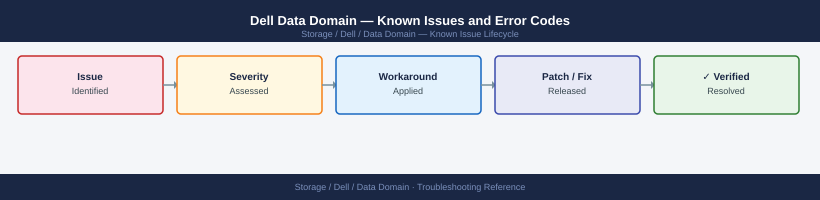

---
tags:
  - troubleshooting
  - data-domain
  - dell
  - known-issues
description: "Catalog of known Data Domain bugs, error codes, and workarounds covering DD Boost, replication, NFS/CIFS, and filesystem health."
---
# Dell Data Domain — Known Issues and Error Codes

<div class="kb-summary">
Catalog of known Data Domain bugs, error codes, and workarounds covering DD Boost, replication, NFS/CIFS, and filesystem health.

*Applies to: Data Domain OS 7.x*
</div>



```d2
direction: down

symptom: Identify Symptom {shape: diamond}
dd_boost_backup_integration: "DD Boost (Backup Integration)" {shape: rectangle}
replication: "Replication" {shape: rectangle}
filesystem: "Filesystem" {shape: rectangle}
resolution: Resolve or Escalate {shape: oval}

symptom -> dd_boost_backup_integration: investigate
symptom -> replication: investigate
symptom -> filesystem: investigate
dd_boost_backup_integration -> resolution
replication -> resolution
filesystem -> resolution
```

## Before you begin

- Data Domain alerts appear in DD System Manager → Health → Alerts.
- Logs: `log view` in the DDOS CLI; key log is `debug.log` for backup integration errors.
- Run `filesys status` and `filesys show compression` for filesystem health.

## DD Boost (Backup Integration)

| Error / Symptom | Affected Versions | Cause | Workaround / Fix | Fixed In |
|---|---|---|---|---|
| Veeam/Commvault backup fails: `DD Boost connection refused` | DDOS 7.x | DD Boost user not enabled or TCP 2052 blocked | Enable DD Boost user: `ddboost user assign <user>`; verify TCP 2052 from backup server | N/A |
| DD Boost throughput lower than expected | DDOS 7.x | Distributed segment processing (DSP) disabled | Enable DSP on backup server — improves dedup efficiency and throughput | N/A |

## Replication

| Error / Symptom | Affected Versions | Cause | Workaround / Fix | Fixed In |
|---|---|---|---|---|
| DD Replicator pair showing `Error` state | DDOS 7.x | Network interruption; port 2051 blocked | Verify TCP 2051 between source and destination Data Domain; replication will resume automatically when connectivity restored | N/A |
| Replication lag growing | DDOS 7.x | WAN bandwidth insufficient for backup change rate | Throttle replication schedule; or increase WAN bandwidth | N/A |

## Filesystem

| Error / Symptom | Affected Versions | Cause | Workaround / Fix | Fixed In |
|---|---|---|---|---|
| `filesys status: needs cleaning` | DDOS 7.x | Filesystem cleaning has not run for >7 days | Run: `filesys clean start` | N/A |
| Capacity alarm despite recent expired-file cleanup | DDOS 7.x | Expired files not yet cleaned from filesystem | Filesystem cleaning must run to reclaim space; schedule or run manually | N/A |
| `ALERT: data collection suspended — filesystem full` | DDOS 7.x | Filesystem at 100% — writes suspended | Expire old backups; run cleaning; or expand filesystem capacity | N/A |

## See also

- [Dell Data Domain — Common Issues](../common-issues/)
