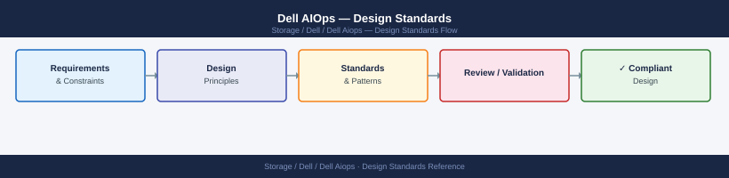

---
tags:
  - architecture
  - dell
---
# Dell AIOps — Design Standards

SCG prerequisites, configuration baselines, alert acknowledgement workflow, and operational standards for Dell AIOps.

*Applies to: Dell AIOps*

## Prerequisites

Dell AIOps capability is delivered through the CloudIQ platform — no separate AIOps appliance is deployed. The prerequisites mirror the CloudIQ SCG deployment:

| Requirement | Standard |
|---|---|
| SCG deployed | One SCG per site (see CloudIQ design standards) |
| Arrays connected | All managed arrays registered and collection green in CloudIQ |
| Portal access | CloudIQ portal account with admin or operator role |
| Licensing | AIOps features included in CloudIQ subscription (no extra licence) |

## Recommendation Acknowledgement Workflow

AIOps surfaces prioritised recommendations. Follow this workflow to close the loop:

1. **Review** recommendations weekly in the CloudIQ APEX Console
2. **Assign** each active recommendation to the responsible team member
3. **Act** — apply the recommendation within the SLA below, or document a deferral reason
4. **Dismiss** recommendations that are accepted risks (with a comment)

| Recommendation Severity | Action SLA |
|---|---|
| Critical (capacity or health risk) | 5 business days |
| High | 15 business days |
| Medium | 30 days or next change window |
| Low | Review quarterly |

## Alert Threshold Baselines

Thresholds are configured in CloudIQ and feed into the AIOps anomaly engine:

| Metric | Warning | Critical |
|---|---|---|
| Capacity utilisation | 75% | 85% |
| IOPS anomaly (% above baseline) | 50% | 100% |
| Latency anomaly (% above baseline) | 50% | 100% |
| Component health fault | Any component fault | Multiple component faults |

## Configuration Checklist

- [ ] SCG deployed and all arrays reporting collection-healthy
- [ ] AIOps / CloudIQ portal login verified for storage team accounts
- [ ] Notification rules set (email + ServiceNow for Critical)
- [ ] Weekly recommendation review scheduled as recurring calendar event
- [ ] APEX Console bookmarked and access verified for on-call engineer

---

## See also

- [Dell Aiops — How It Works](../how-it-works/)
- [Dell Aiops — Integrations](../integrations/)
- [Dell Aiops — Deploy](../../deploy/)
