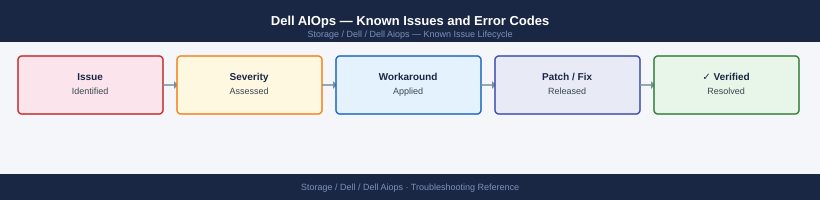

---
tags:
  - troubleshooting
  - dell-aiops
  - dell
  - known-issues
---
# Dell AIOps — Known Issues and Error Codes

<div class="kb-summary">
Dell AIOps is a SaaS analytics layer on CloudIQ. All operational issues relate to CloudIQ connectivity or portal access — see Dell CloudIQ known issues for full coverage.

*Applies to: Dell AIOps / CloudIQ AIOps*
</div>



```d2
direction: down

symptom: Identify Symptom {shape: diamond}
connectivity_and_data: "Connectivity and Data" {shape: rectangle}
resolution: Resolve or Escalate {shape: oval}

symptom -> connectivity_and_data: investigate
connectivity_and_data -> resolution
```

## Before you begin

- Dell AIOps is fully SaaS-based; no on-premises AIOps software exists.
- All AIOps data flows through CloudIQ; connectivity and data issues are CloudIQ issues.

## Connectivity and Data

| Error / Symptom | Affected Versions | Cause | Workaround / Fix | Fixed In |
|---|---|---|---|---|
| AIOps recommendations not appearing | AIOps | Array not sending telemetry to CloudIQ | Verify array phone-home (TCP 443 to cloudiq.dell.com); see [CloudIQ Known Issues](../../../cloudiq/troubleshooting/known-issues/) | N/A |
| AIOps portal shows stale predictions | AIOps | CloudIQ data lag (up to 24h for analytics engine refresh) | Wait 24 hours; if persistent, contact Dell support | N/A |

## See also

- [Dell CloudIQ — Known Issues](../../cloudiq/troubleshooting/known-issues.md)
