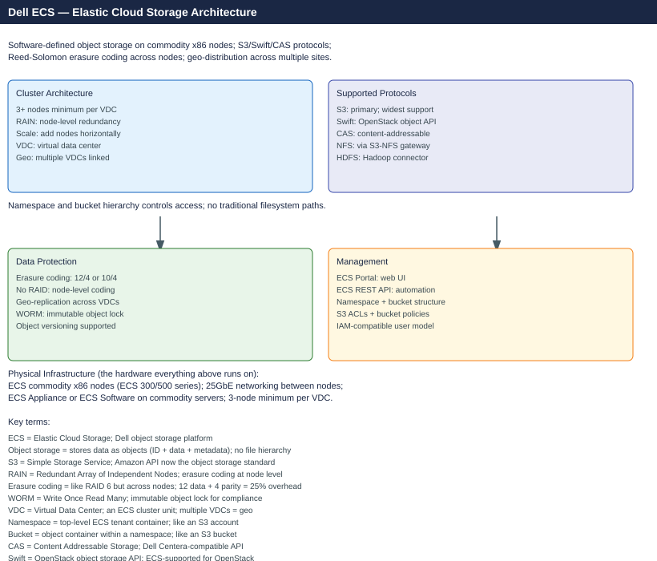

---
tags:
  - architecture
  - dell
---
# Dell ECS — Architecture

<div class="kb-summary">
Scale-out software-defined object storage on commodity x86 nodes. Exposes S3, Swift, Atmos, and CAS APIs; protects data within a site using erasure coding; replicates geo-distributed across Virtual Data Centers linked in replication groups.

*Applies to: ECS 3.x*
</div>



```d2
direction: right

CLT: "S3 / Swift / Atmos Clients" {shape: rectangle}
GW: "Load Balancer\n(optional" {shape: rectangle}
N1: "ECS Node 1" {shape: rectangle}
N2: "ECS Node 2" {shape: rectangle}
N3: "ECS Node 3" {shape: rectangle}
NN: "Node N…" {shape: rectangle}
RING: "Object Ring\ndistributed erasure coding" {shape: rectangle}

CLT -> GW
GW -> N1
N1 -> N2
N2 -> N3
N3 -> NN
NN -> RING
```


<div class="kb-grid kb-grid-3">
<a class="kb-card" href="how-it-works/"><strong>How It Works</strong><span>How it works, integrations, and design standards.</span></a>
<a class="kb-card" href="integrations/"><strong>Integrations</strong><span>Integration with S3 clients, Hadoop, LDAP/AD, KMS, and backup tools.</span></a>
<a class="kb-card" href="design-standards/"><strong>Design Standards</strong><span>VDC sizing, replication group design, namespace and bucket configuration standards.</span></a>
</div>

## Erasure Coding Schemes

| EC Scheme | Data + Parity | Min Nodes | Tolerated Failures |
|---|---|---|---|
| 12+4 (default) | 12 + 4 | 16 | Up to 4 simultaneous node/disk failures |
| 10+2 | 10 + 2 | 12 | Up to 2 simultaneous failures |
| 4+2 (small cluster) | 4 + 2 | 6 | Up to 2 simultaneous failures |

## Scale-Out Object Storage Topology

