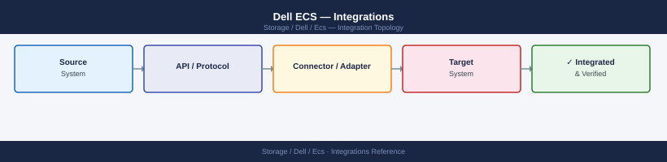
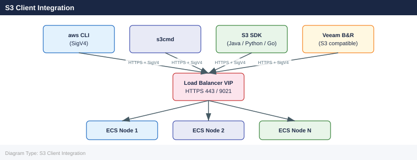
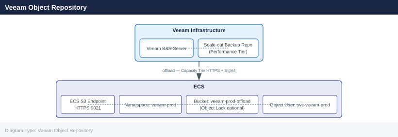

---
tags:
  - architecture
  - dell
description: "Integrations reference covering S3 Client Integration, Veeam Object Repository, Commvault Integration, NetBackup Integration, HDFS Integration and 4 more..."
---
# Dell ECS — Integrations

<div class="kb-summary">
Integrations reference covering S3 Client Integration, Veeam Object Repository, Commvault Integration, NetBackup Integration, HDFS Integration and 4 more sections.

*Applies to: ECS 3.x*
</div>


## S3 Client Integration

ECS exposes a native S3-compatible API on HTTPS port 443 (or 9021 for the non-standard S3 port; 9020 for plain HTTP in lab environments). Any S3-compatible client can connect using path-style or virtual-hosted-style addressing.



**Connection parameters:**

| Parameter | Value |
|---|---|
| Endpoint | `https://<ecs-load-balancer-or-node>` (port 443 or 9021) |
| Access key | Object user access key from ECS Portal → Namespace → IAM Users |
| Secret key | Associated secret from key creation (shown once at creation only) |
| Region | ECS does not enforce AWS regions; set to any value (e.g., `us-east-1`) in client config |
| Signature version | AWS Signature Version 4 (SigV4) — required; SigV2 is not supported in ECS 3.8+ |
| Addressing style | Path-style (`<endpoint>/<bucket>`) or virtual-hosted (`<bucket>.<endpoint>`) |

**AWS CLI configuration:**

```bash
# Configure a named profile for ECS
aws configure --profile ecs
# AWS Access Key ID:     <object_user_access_key>
# AWS Secret Access Key: <object_user_secret_key>
# Default region:        us-east-1
# Default output format: json

ECS_EP="https://<ecs-node-or-lb>:9021"
PROFILE="--profile ecs --endpoint-url $ECS_EP --no-verify-ssl"

# List all buckets accessible to this user
aws s3api list-buckets $PROFILE

# Upload a file
aws s3 cp localfile.tar.gz s3://<bucket>/path/ $PROFILE

# Sync a directory recursively
aws s3 sync /local/backup/ s3://<bucket>/backups/ $PROFILE
```


```text title="Expected output"
{
    "Buckets": [
        {
            "Name": "backup-prod-001",
            "CreationDate": "2024-01-15T08:32:14.000Z"
        },
        {
            "Name": "archive-data",
            "CreationDate": "2024-02-03T14:22:47.000Z"
        },
        {
            "Name": "logs-retention",
            "CreationDate": "2024-01-28T11:05:22.000Z"
        }
    ],
    "Owner": {
        "DisplayName": "object_user",
        "ID": "a1b2c3d4e5f6g7h8i9j0k1l2m3n4o5p6"
    }
}
upload: ./localfile.tar.gz to s3://backup-prod-001/path/localfile.tar.gz
Completed 1.2 GiB/1.2 GiB (45.3 MiB/s) with 1 file(s) remaining
upload: ./localfile.tar.gz to s3://backup-prod-001/path/localfile.tar.gz

Completed 1.2 GiB/1.2 GiB (45.3 MiB/s) with 1 file(s) remaining
Completed 1.2 GiB/1.2 GiB (45.3 MiB/s) with 1 file(s) remaining
upload: /local/backup/db_backup_20240315.sql to s3://backup-prod-001/backups/db_backup_20240315.sql
upload: /local/backup/config.tar to s3://backup-prod-001/backups/config.tar
upload: /local/backup/logs/ to s3://backup-prod-001/backups/logs/
Completed 3 files, 2.8 GiB total
```

!!! warning "Common errors"
    | Error | Fix |
    |---|---|
    | `Unable to locate credentials` | Run `aws configure --profile ecs` first and ensure AWS_ACCESS_KEY_ID and AWS_SECRET_ACCESS_KEY environment variables are set or credentials file exists at ~/.aws/credentials. |
    | `SSL: CERTIFICATE_VERIFY_FAILED` | The `--no-verify-ssl` flag is already included in the PROFILE variable; if still failing, verify the ECS endpoint certificate is valid or use `export AWS_CA_BUNDLE=/path/to/ca-cert.pem` before running commands. |
    | `NoSuchBucket` | Verify the bucket name in the s3:// path matches exactly (case-sensitive) and that the configured user has s3:GetObject and s3:PutObject permissions on that bucket. |
ECS supports S3 multipart upload, S3 Object Lock (WORM), presigned URLs, bucket versioning, and lifecycle policies. Virtual-hosted-style (`<bucket>.<ecs-endpoint>`) requires DNS configuration pointing `*.ecs.example.com` to the ECS load balancer VIP; path-style (`<ecs-endpoint>/<bucket>`) works without DNS changes and is easier to configure in most clients.

**s3cmd configuration:**

```ini
# ~/.s3cfg for Dell ECS
[default]
access_key = <ecs_access_key>
secret_key = <ecs_secret_key>
host_base = <ecs-endpoint>:9021
host_bucket = <ecs-endpoint>:9021/%(bucket)s
use_https = True
check_ssl_certificate = False
signature_v2 = False
```

```bash
# Test s3cmd connectivity
s3cmd ls

# Upload a file
s3cmd put localfile.tar.gz s3://<bucket>/path/

# Sync a directory
s3cmd sync /local/path/ s3://<bucket>/
```


```text title="Expected output"
2024-01-15 09:23:14        0   s3://backup-prod
2024-01-15 09:18:47        0   s3://archive-2024
2024-01-15 08:45:22        0   s3://logs-retention
2024-01-15 07:12:33        0   s3://dr-replica

upload: 'localfile.tar.gz' -> 's3://backup-prod/path/localfile.tar.gz'  [1 of 1]
 1234567890 of 1234567890   100% in 45s    27.43 MB/s  done

sync: '/local/path/app.conf' -> 's3://backup-prod/app.conf'
sync: '/local/path/data.json' -> 's3://backup-prod/data.json'
sync: '/local/path/logs/' -> 's3://backup-prod/logs/'
Done. Synced 3 files.
```

!!! warning "Common errors"
    | Error | Fix |
    |---|---|
    | `ERROR: S3 error: 403 Forbidden` | Verify AWS credentials are configured correctly in `~/.s3cfg` and the IAM user has s3:GetObject and s3:ListBucket permissions. |
    | `ERROR: Unable to open file 'localfile.tar.gz'` | Confirm the file exists and the current user has read permissions with `ls -l localfile.tar.gz`. |
    | `ERROR: S3 error: 404 Not Found` | Verify the bucket name is correct and exists in the ECS cluster with `s3cmd ls`. |
## Veeam Object Repository

ECS is a certified S3-compatible target for Veeam Backup & Replication object repositories (Scale-out Backup Repository offload and Capacity Tier).



**Integration steps:**

1. Create a dedicated ECS namespace for Veeam: `veeam-prod`
2. Create a dedicated bucket: `veeam-prod-offload`
   - Enable Object Lock at bucket creation if Veeam Immutability is required
   - Set a hard quota matching the planned Veeam storage allocation + 20% buffer
3. Create a dedicated object user: `svc-veeam-prod`
   - Generate access key and secret key; store in Veeam credential store
4. In Veeam VBR: **Backup Infrastructure** → **Add Backup Repository** → **Object Storage** → **S3 Compatible**
   - Service point: `https://<ecs-load-balancer>:9021`
   - Region: any value (e.g., `us-east-1`)
   - Credentials: `svc-veeam-prod` access key and secret key
   - Bucket: `veeam-prod-offload`
   - Enable Immutability (if Object Lock enabled on bucket): set retention period matching backup policy RPO
5. Add the ECS object repository as a Capacity Tier or Performance Tier extent in the Scale-out Backup Repository

**Key ECS settings for Veeam:**

| Setting | Recommendation |
|---|---|
| Bucket versioning | Not required for Veeam; Veeam manages its own metadata structures |
| Object Lock | Enable only if Veeam Immutability is required; must be enabled at bucket creation |
| Object Lock mode | Compliance mode for air-gap immutability against ransomware; Governance mode for operational flexibility |
| Namespace quota | Set hard quota; Veeam can consume all available cluster capacity without a quota |
| Bucket quota | Set per-bucket quota in addition to namespace quota for finer-grained control |
| S3 endpoint | Use the load balancer VIP or a DNS round-robin for resilience; do not point Veeam at a single node |

**Validating Veeam backup data on ECS:**

```bash
# Confirm Veeam backup data is present
aws s3 ls s3://veeam-prod-offload/ \
  --recursive --human-readable \
  --endpoint-url https://<ecs-endpoint>:9021 \
  --no-verify-ssl \
  --profile ecs
```


```text title="Expected output"
2024-01-15 09:47:32    1.2 GiB veeam-prod-offload/vm-backups/prod-vm-001/full-backup-20240115.vbk
2024-01-15 10:22:18  856.4 MiB veeam-prod-offload/vm-backups/prod-vm-002/incremental-20240115.vbk
2024-01-15 11:05:44    2.1 GiB veeam-prod-offload/vm-backups/prod-vm-003/full-backup-20240115.vbk
2024-01-15 11:33:09  512.3 MiB veeam-prod-offload/vm-backups/prod-vm-004/incremental-20240115.vbk
2024-01-15 12:15:22    3.4 GiB veeam-prod-offload/vm-backups/prod-db-cluster/full-backup-20240115.vbk
...

Total Objects: 47
Total Size: 18.9 GiB
```

!!! warning "Common errors"
    | Error | Fix |
    |---|---|
    | `Unable to locate credentials` | Ensure the `ecs` profile exists in `~/.aws/credentials` with valid access key and secret key for the ECS S3 endpoint. |
    | `SSL: CERTIFICATE_VERIFY_FAILED` | The `--no-verify-ssl` flag is already present; if the error persists, verify the ECS endpoint hostname matches the certificate or update the CA bundle with `export AWS_CA_BUNDLE=/path/to/ca-cert.pem`. |
    | `NoSuchBucket` | Confirm the bucket name `veeam-prod-offload` exists on the ECS cluster by running `aws s3 ls --endpoint-url https://<ecs-endpoint>:9021 --profile ecs` without the bucket path. |
## Commvault Integration

Commvault supports ECS as an S3-compatible cloud library target for secondary copy and archival. Configuration is performed in the Commvault Command Center.

**Integration steps:**

1. Create a dedicated ECS namespace and bucket for Commvault: `commvault-prod` / `commvault-prod-archive`
2. Create a dedicated object user: `svc-commvault-prod`
3. In Commvault Command Center: **Storage** → **Cloud** → **Add Cloud Storage** → **S3 Compatible**
   - Service host: `<ecs-endpoint>` (without `https://` prefix in some Commvault versions)
   - Port: `9021`
   - Access key and secret key: `svc-commvault-prod` credentials
   - Bucket: `commvault-prod-archive`
4. Configure the cloud library as a storage pool target for secondary or archive copies
5. Test a synthetic full backup to confirm end-to-end connectivity and write throughput

## NetBackup Integration

Veritas NetBackup can use ECS as an object storage target via the NetBackup CloudCatalyst or as a direct S3-compatible storage unit.

**CloudCatalyst (deduplication target):**
- Deploy NetBackup CloudCatalyst on a dedicated server with network access to ECS
- Configure the CloudCatalyst to use ECS as its backing S3 store with the ECS endpoint and object user credentials
- CloudCatalyst deduplicates backup streams before writing to ECS, reducing ECS capacity consumption

**Direct S3 storage unit:**
- NetBackup 8.3+: create a Cloud Storage Server with `S3` type and ECS endpoint
- Configure the storage unit to use the ECS bucket and object user credentials
- Enable CloudCatalyst on the media server for deduplication (recommended for large environments)

## HDFS Integration

ECS supports HDFS-compatible access through the ECS HDFS connector, enabling Hadoop ecosystem tools (Spark, Hive, MapReduce) to read and write directly to ECS buckets.

**Integration steps:**

1. Download the ECS HDFS connector JAR from the Dell Support portal
2. Install the JAR on all Hadoop cluster nodes (place in the Hadoop classpath)
3. Configure `core-site.xml` to point to the `ecshdfs://` scheme:
   ```xml
   <property>
     <name>fs.ecshdfs.impl</name>
     <value>com.emc.hadoop.fs.vipr.ViPRFileSystem</value>
   </property>
   <property>
     <name>fs.AbstractFileSystem.ecshdfs.impl</name>
     <value>com.emc.hadoop.fs.vipr.ViPRAbstractFilesystem</value>
   </property>
   <property>
     <name>viprfs.client.access_key</name>
     <value><ecs_object_user_access_key></value>
   </property>
   <property>
     <name>viprfs.client.secret_key</name>
     <value><ecs_object_user_secret_key></value>
   </property>
   <property>
     <name>viprfs.client.vipr.hostname</name>
     <value><ecs-endpoint></value>
   </property>
   <property>
     <name>viprfs.client.vipr.port</name>
     <value>9021</value>
   </property>
   ```
4. Authentication uses ECS object user access keys (simple auth); Kerberos integration is possible for secured Hadoop clusters — configure via ECS namespace HDFS auth settings
5. ECS presents HDFS namespace paths mapped to buckets; directory emulation is handled by the connector
6. Test: `hadoop fs -ls ecshdfs://<namespace>@<ecs-endpoint>/<bucket>/`

**HDFS considerations:**

| Consideration | Detail |
|---|---|
| Performance | ECS HDFS is not optimised for small random I/O; best suited for large sequential reads/writes (Spark workloads) |
| Authentication | S3 access keys are embedded in `core-site.xml` — store the file with restricted permissions; use secrets management integration if available |
| Namespace mapping | Each ECS namespace appears as a separate HDFS cluster identifier; paths are `ecshdfs://<namespace>@<ecs-endpoint>/<bucket>/` |
| Metadata search | HDFS access does not use ECS metadata search; queries must go through the ECS Query API |

## Metadata Search Integration

ECS supports custom object metadata tagging and a Metadata Search API (based on Elasticsearch) that allows querying objects by custom key-value tags across a namespace.

**Enable metadata search per namespace:**
1. Navigate to ECS Portal → Manage → Namespaces → select namespace → Edit
2. Enable **Metadata Search** — this provisions an Elasticsearch indexer for the namespace
3. Note: metadata search adds indexer capacity overhead; plan ECS node sizing with this enabled

**Tag objects with custom metadata on upload:**

```bash
# Upload an object with custom metadata tags
aws s3api put-object \
  --bucket analytics-prod-raw \
  --key data/2024/report.parquet \
  --body report.parquet \
  --metadata '{"project":"alpha","env":"prod","owner":"analytics-team"}' \
  --endpoint-url https://<ecs-endpoint>:9021 \
  --no-verify-ssl \
  --profile ecs
```


```text title="Expected output"
(no output — command completes silently)
```

!!! warning "Common errors"
    | Error | Fix |
    |---|---|
    | `An error occurred (InvalidAccessKeyId) when calling the PutObject operation: The Access Key Id you provided does not exist in our records.` | Verify the AWS credentials in your `ecs` profile match the ECS S3 user account with `aws configure --profile ecs`. |
    | `An error occurred (NoSuchBucket) when calling the PutObject operation: The specified bucket does not exist.` | Confirm the bucket `analytics-prod-raw` exists on the ECS endpoint with `aws s3 ls --endpoint-url https://<ecs-endpoint>:9021 --profile ecs`. |
    | `SSL: CERTIFICATE_VERIFY_FAILED` | The `--no-verify-ssl` flag is present but still failing; verify the ECS endpoint URL is correct and reachable with `curl -k https://<ecs-endpoint>:9021`. |
**Query objects by metadata tag (ECS Query API):**

```bash
# Search for objects with a custom metadata tag (requires metadata search enabled on namespace)
curl -s -k -H "X-SDS-AUTH-TOKEN: $TOKEN" \
  "https://<ecs-node>:4443/object/namespaces/analytics-prod/buckets/analytics-prod-raw/query?query=project%3Dalpha" \
  | python3 -m json.tool

# URL-encoded query format: key=value -> key%3Dvalue
# Multiple conditions: key1=value1 AND key2=value2 -> key1%3Dvalue1%20AND%20key2%3Dvalue2
```


```text title="Expected output"
{
  "objects": [
    {
      "name": "dataset-alpha-2024-01-15.parquet",
      "size": 2147483648,
      "mtime": 1705276800000,
      "metadata": {
        "project": "alpha",
        "owner": "data-eng",
        "version": "1.2.3"
      }
    },
    {
      "name": "alpha-metrics-hourly.csv",
      "size": 536870912,
      "mtime": 1705363200000,
      "metadata": {
        "project": "alpha",
        "owner": "analytics"
      }
    },
    {
      "name": "alpha-config-prod.json",
      "size": 8192,
      "mtime": 1705449600000,
      "metadata": {
        "project": "alpha"
      }
    }
  ],
  "query_time_ms": 342,
  "total_objects": 3
}
```

!!! warning "Common errors"
    | Error | Fix |
    |---|---|
    | `curl: (60) SSL certificate problem: self signed certificate` | Add `-k` flag to curl command to skip SSL verification (already present in example; if error persists, verify ECS node certificate or use `--cacert` with proper CA bundle). |
    | `{"error":"Invalid query syntax","code":400}` | Ensure metadata search is enabled on the namespace with `ecs object namespace metadata-search enable` and verify query parameters are properly URL-encoded (spaces as `%20`, equals as `%3D`). |
    | `{"error":"Unauthorized","code":401}` | Verify `$TOKEN` variable is set with a valid authentication token from `curl -k -u <user>:<pass> https://<ecs-node>:4443/login` and has not expired. |
## External Authentication (LDAP/AD)

ECS can delegate IAM user authentication to an external LDAP or Active Directory service for namespace-level management access. Configure under ECS Portal → Namespace → Edit → Authentication Domain.

- Object users with S3 access keys always authenticate locally — LDAP integration applies to management console users only
- LDAP is configured per namespace; multiple namespaces can reference different LDAP domains
- Supported protocols: LDAP (TCP 389) and LDAPS (TCP 636)
- Map AD groups to ECS namespace roles in the Authentication Domain configuration

## CloudIQ Integration (ECS 3.9+)

ECS 3.9 introduced integration with Dell CloudIQ for cloud-based capacity analytics, proactive health alerts, and hardware lifecycle management.

- Configure CloudIQ connectivity in ECS Portal → Settings → CloudIQ
- CloudIQ provides multi-cluster capacity trending and forecasting alongside other Dell storage systems
- Proactive recommendations for capacity expansion are surfaced in the CloudIQ portal before utilisation thresholds are reached
- Hardware component health and end-of-service-life alerts are raised in CloudIQ automatically

## SNMP and Syslog Integration

ECS generates SNMP traps and syslog messages for hardware and service health events. Integrate with your monitoring platform for 24/7 alerting.

**Syslog configuration:**
```yaml
ECS Portal → Settings → Syslog
  - Syslog server: <SIEM-or-syslog-aggregator-IP>
  - Port: 514 (UDP or TCP)
  - Protocol: RFC 5424 or RFC 3164
```

**SNMP configuration:**
```yaml
ECS Portal → Settings → SNMP
  - SNMP version: v3 (recommended); v2c for legacy monitoring systems
  - Community string (v2c): <monitoring-community>
  - Trap destination: <monitoring-server-IP>:162
  - Trap types: node status, disk status, capacity threshold, replication status
```

**Key SNMP MIBs:** Download the ECS MIB file from ECS Portal → Settings → SNMP → Download MIB to import into your monitoring platform (Nagios, Zabbix, SolarWinds, etc.).

---

## See also

- [Ecs — How It Works](../how-it-works/)
- [Ecs — Design Standards](../design-standards/)
