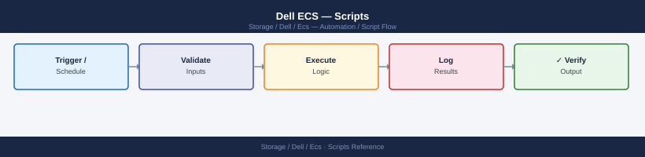

---
tags:
  - dell
  - operations
description: "Dell ECS automation scripts: curl REST API examples for bucket management, namespace health polling, replication status checks, and alert-to-ticket..."
---
# Dell ECS — Scripts

<div class="kb-summary">
Dell ECS automation scripts: `curl` REST API examples for bucket management, namespace health polling, replication status checks, and alert-to-ticket scripts.

*Applies to: ECS 3.x*
</div>


---

## Before you begin

- **Access:** Storage admin credentials (cluster admin or equivalent)
- **Timing:** safe to run during business hours unless a step is marked ⚠ (causes interruption)
- **Dependencies:** no active upgrades or migrations on the same infrastructure
- **Logging:** capture command output — paste into the change record on completion

---

## Node & Capacity Health Check

Queries the ECS Management REST API to check node status, cluster capacity utilisation, and active alerts. Warns if capacity exceeds 80% and goes critical above 90%.

```python
#!/usr/bin/env python3
# ecs_health_check.py — Node and capacity health check via ECS Management REST API
# Requirements: requests
# Usage: ECS_HOST=ecs01.example.com ECS_USER=sysadmin ECS_PASS=secret ./ecs_health_check.py

import os
import sys
import json
import requests
import urllib3

urllib3.disable_warnings(urllib3.exceptions.InsecureRequestWarning)

ECS_HOST = os.environ.get("ECS_HOST", "")
ECS_USER = os.environ.get("ECS_USER", "sysadmin")
ECS_PASS = os.environ.get("ECS_PASS", "")

WARN_PCT  = 80
CRIT_PCT  = 90
BASE_URL  = f"https://{ECS_HOST}:4443"

if not ECS_HOST or not ECS_PASS:
    print("ERROR: ECS_HOST and ECS_PASS must be set.", file=sys.stderr)
    sys.exit(1)

def authenticate(session):
    """Authenticate and return the auth token."""
    resp = session.get(f"{BASE_URL}/login", auth=(ECS_USER, ECS_PASS), verify=False)
    resp.raise_for_status()
    token = resp.headers.get("X-SDS-AUTH-TOKEN")
    if not token:
        raise RuntimeError("Authentication failed: no token in response headers.")
    return token

def api_get(session, token, path):
    """GET a JSON endpoint from the ECS Management API."""
    resp = session.get(
        f"{BASE_URL}{path}",
        headers={"X-SDS-AUTH-TOKEN": token, "Accept": "application/json"},
        verify=False,
    )
    resp.raise_for_status()
    return resp.json()

def main():
    exit_code = 0
    session = requests.Session()

    print("=" * 50)
    print("  ECS Health Check")
    print(f"  Host : {ECS_HOST}")
    print("=" * 50)

    # Authenticate
    try:
        token = authenticate(session)
        print("\n[AUTH] Login successful.\n")
    except Exception as e:
        print(f"[AUTH] FAILED: {e}")
        sys.exit(2)

    # --- Node health ---
    print("--- Node Status ---")
    try:
        nodes_data = api_get(session, token, "/vdc/nodes")
        nodes = nodes_data.get("node", [])
        for node in nodes:
            name  = node.get("nodename", node.get("ip", "unknown"))
            state = node.get("nodestatus", "UNKNOWN")
            marker = "" if state == "GOOD" else "  <<< DEGRADED"
            print(f"  {name:<30} {state}{marker}")
            if state != "GOOD":
                exit_code = max(exit_code, 2)
    except Exception as e:
        print(f"  ERROR fetching nodes: {e}")
        exit_code = max(exit_code, 2)

    # --- Capacity ---
    print("\n--- Capacity ---")
    try:
        cap = api_get(session, token, "/vdc/capacity")
        total_gb = int(cap.get("totalProvisioned_gb", 0))
        used_gb  = int(cap.get("usedCapacity_gb", 0))
        pct_used = (used_gb / total_gb * 100) if total_gb > 0 else 0
        print(f"  Total  : {total_gb:>8} GB")
        print(f"  Used   : {used_gb:>8} GB  ({pct_used:.1f}%)")
        if pct_used >= CRIT_PCT:
            print(f"  STATUS : CRITICAL — capacity at {pct_used:.1f}% (threshold {CRIT_PCT}%)")
            exit_code = max(exit_code, 2)
        elif pct_used >= WARN_PCT:
            print(f"  STATUS : WARNING  — capacity at {pct_used:.1f}% (threshold {WARN_PCT}%)")
            exit_code = max(exit_code, 1)
        else:
            print(f"  STATUS : OK")
    except Exception as e:
        print(f"  ERROR fetching capacity: {e}")
        exit_code = max(exit_code, 2)

    # --- Alerts ---
    print("\n--- Active Alerts ---")
    try:
        alerts_data = api_get(session, token, "/vdc/alerts")
        alerts = alerts_data.get("alert", [])
        if not alerts:
            print("  No active alerts.")
        for alert in alerts:
            severity = alert.get("severity", "UNKNOWN")
            desc     = alert.get("description", "no description")
            print(f"  [{severity}] {desc}")
            if severity in ("CRITICAL", "ERROR"):
                exit_code = max(exit_code, 2)
            elif severity in ("WARNING",):
                exit_code = max(exit_code, 1)
    except Exception as e:
        print(f"  ERROR fetching alerts: {e}")
        exit_code = max(exit_code, 2)

    # Logout
    try:
        session.get(
            f"{BASE_URL}/logout",
            headers={"X-SDS-AUTH-TOKEN": token},
            verify=False,
        )
    except Exception:
        pass

    print("\n" + "=" * 50)
    labels = {0: "OK", 1: "WARNING", 2: "CRITICAL"}
    print(f"  OVERALL STATUS: {labels.get(exit_code, 'UNKNOWN')}")
    print("=" * 50)
    sys.exit(exit_code)

if __name__ == "__main__":
    main()
```

**Requirements:** Python 3.7+, `pip install requests`, network access to ECS management on port 4443.

**Usage:**
```text
ECS_HOST=ecs01.example.com ECS_USER=sysadmin ECS_PASS=yourpassword python ecs_health_check.py
```

---

## Bucket Audit

Authenticates to the ECS REST API, iterates all namespaces and their buckets, and prints a report of bucket name, owner, total size, and object count. Flags any bucket whose size exceeds a configurable threshold.

```python
#!/usr/bin/env python3
# ecs_bucket_audit.py — Audit all ECS namespaces and buckets via REST API
# Requirements: requests
# Usage: ECS_HOST=ecs01.example.com ECS_USER=sysadmin ECS_PASS=secret \
#        WARN_SIZE_GB=500 ./ecs_bucket_audit.py

import os
import sys
import requests
import urllib3

urllib3.disable_warnings(urllib3.exceptions.InsecureRequestWarning)

ECS_HOST    = os.environ.get("ECS_HOST", "")
ECS_USER    = os.environ.get("ECS_USER", "sysadmin")
ECS_PASS    = os.environ.get("ECS_PASS", "")
WARN_SIZE_GB = int(os.environ.get("WARN_SIZE_GB", "500"))
BASE_URL    = f"https://{ECS_HOST}:4443"

if not ECS_HOST or not ECS_PASS:
    print("ERROR: ECS_HOST and ECS_PASS must be set.", file=sys.stderr)
    sys.exit(1)

def authenticate(session):
    resp = session.get(f"{BASE_URL}/login", auth=(ECS_USER, ECS_PASS), verify=False)
    resp.raise_for_status()
    token = resp.headers.get("X-SDS-AUTH-TOKEN")
    if not token:
        raise RuntimeError("No auth token received.")
    return token

def api_get(session, token, path):
    resp = session.get(
        f"{BASE_URL}{path}",
        headers={"X-SDS-AUTH-TOKEN": token, "Accept": "application/json"},
        verify=False,
    )
    resp.raise_for_status()
    return resp.json()

def bytes_to_gb(b):
    try:
        return float(b) / (1024 ** 3)
    except (TypeError, ValueError):
        return 0.0

def main():
    session = requests.Session()

    print(f"{'NAMESPACE':<25}  {'BUCKET':<30}  {'OWNER':<20}  {'SIZE (GB)':>10}  {'OBJECTS':>10}  FLAG")
    print("-" * 110)

    token = authenticate(session)

    ns_data = api_get(session, token, "/object/namespaces")
    namespaces = ns_data.get("namespace", [])

    flagged = 0
    for ns in namespaces:
        ns_name = ns.get("name", "unknown")

        try:
            bucket_data = api_get(session, token, f"/object/bucket?namespace={ns_name}")
            buckets = bucket_data.get("object_bucket", [])
        except Exception as e:
            print(f"  ERROR listing buckets for namespace {ns_name}: {e}")
            continue

        for bucket in buckets:
            bname   = bucket.get("name", "unknown")
            owner   = bucket.get("owner", "unknown")
            size_b  = bucket.get("total_size", 0)
            obj_cnt = bucket.get("total_objects", 0)
            size_gb = bytes_to_gb(size_b)
            flag    = ""
            if size_gb >= WARN_SIZE_GB:
                flag = f"  <<< OVER {WARN_SIZE_GB} GB"
                flagged += 1
            print(f"{ns_name:<25}  {bname:<30}  {owner:<20}  {size_gb:>10.2f}  {obj_cnt:>10}  {flag}")

    try:
        session.get(f"{BASE_URL}/logout",
                    headers={"X-SDS-AUTH-TOKEN": token}, verify=False)
    except Exception:
        pass

    print("-" * 110)
    print(f"\nTotal buckets flagged over {WARN_SIZE_GB} GB threshold: {flagged}")
    sys.exit(0 if flagged == 0 else 1)

if __name__ == "__main__":
    main()
```

**Usage:**
```text
ECS_HOST=ecs01.example.com ECS_USER=sysadmin ECS_PASS=secret WARN_SIZE_GB=500 python ecs_bucket_audit.py
```

---

## S3 Connectivity Check

Uses the AWS CLI with a custom `--endpoint-url` to test S3 connectivity to an ECS cluster. Performs list, put, get, and delete operations against a test bucket and prints PASS/FAIL for each step.

```bash
#!/bin/bash
# ecs_s3_check.sh — S3 connectivity check against Dell ECS using the AWS CLI
# Requirements: aws CLI installed and on PATH
# Usage:
#   ECS_S3_ENDPOINT=https://ecs01.example.com:9021
#   AWS_ACCESS_KEY_ID=mykey
#   AWS_SECRET_ACCESS_KEY=mysecret
#   TEST_BUCKET=s3-check-bucket
#   ./ecs_s3_check.sh

set -uo pipefail

ECS_S3_ENDPOINT="${ECS_S3_ENDPOINT:-}"
AWS_ACCESS_KEY_ID="${AWS_ACCESS_KEY_ID:-}"
AWS_SECRET_ACCESS_KEY="${AWS_SECRET_ACCESS_KEY:-}"
TEST_BUCKET="${TEST_BUCKET:-ecs-connectivity-test}"
TEST_KEY="ecs-check-$(date +%s).txt"
TEST_CONTENT="ECS S3 connectivity check object"
TMP_FILE=$(mktemp)
PASS=0
FAIL=0

export AWS_ACCESS_KEY_ID AWS_SECRET_ACCESS_KEY
export AWS_DEFAULT_REGION="us-east-1"

if [[ -z "$ECS_S3_ENDPOINT" || -z "$AWS_ACCESS_KEY_ID" || -z "$AWS_SECRET_ACCESS_KEY" ]]; then
  echo "ERROR: ECS_S3_ENDPOINT, AWS_ACCESS_KEY_ID, and AWS_SECRET_ACCESS_KEY must be set."
  exit 1
fi

S3_OPTS="--endpoint-url ${ECS_S3_ENDPOINT} --no-verify-ssl"

check() {
  local step="$1"
  local result="$2"
  if [[ "$result" -eq 0 ]]; then
    printf "  %-30s  PASS\n" "$step"
    PASS=$((PASS + 1))
  else
    printf "  %-30s  FAIL\n" "$step"
    FAIL=$((FAIL + 1))
  fi
}

echo "========================================"
echo "  ECS S3 Connectivity Check"
echo "  Endpoint : $ECS_S3_ENDPOINT"
echo "  Bucket   : $TEST_BUCKET"
echo "  $(date '+%Y-%m-%d %H:%M:%S')"
echo "========================================"

aws s3 ls "s3://${TEST_BUCKET}" $S3_OPTS > /dev/null 2>&1
check "List bucket" $?

echo "$TEST_CONTENT" > "$TMP_FILE"
aws s3 cp "$TMP_FILE" "s3://${TEST_BUCKET}/${TEST_KEY}" $S3_OPTS > /dev/null 2>&1
check "Put test object" $?

GET_TMP=$(mktemp)
aws s3 cp "s3://${TEST_BUCKET}/${TEST_KEY}" "$GET_TMP" $S3_OPTS > /dev/null 2>&1
GET_RESULT=$?
if [[ $GET_RESULT -eq 0 ]]; then
  CONTENT=$(cat "$GET_TMP")
  if [[ "$CONTENT" == "$TEST_CONTENT" ]]; then
    check "Get test object (content match)" 0
  else
    check "Get test object (content match)" 1
  fi
else
  check "Get test object" $GET_RESULT
fi
rm -f "$GET_TMP"

aws s3 rm "s3://${TEST_BUCKET}/${TEST_KEY}" $S3_OPTS > /dev/null 2>&1
check "Delete test object" $?

rm -f "$TMP_FILE"

echo ""
echo "========================================"
echo "  Results: $PASS passed, $FAIL failed"
echo "========================================"

[[ "$FAIL" -eq 0 ]] && exit 0 || exit 1
```


```text title="Expected output"
========================================
  ECS S3 Connectivity Check
  Endpoint : https://ecs01.example.com:9021
  Bucket   : s3-check-bucket
  2024-01-15 14:32:47
========================================
  List bucket                    PASS
  Put test object                PASS
  Get test object (content match) PASS
  Delete test object             PASS

========================================
  Results: 4 passed, 0 failed
========================================
```

!!! warning "Common errors"
    | Error | Fix |
    |---|---|
    | `Unable to locate credentials` | Ensure AWS_ACCESS_KEY_ID and AWS_SECRET_ACCESS_KEY environment variables are exported before running the script. |
    | `SSL: CERTIFICATE_VERIFY_FAILED` | The --no-verify-ssl flag is already set; if the error persists, verify the ECS endpoint URL is correct and the certificate chain is valid on the ECS appliance. |
    | `NoSuchBucket` | Create the test bucket on the ECS system using `aws s3 mb s3://s3-check-bucket --endpoint-url https://ecs01.example.com:9021 --no-verify-ssl` or set TEST_BUCKET to an existing bucket name. |
---

## Daily Check Script

Queries the ECS management API for zone health, counts buckets, checks data disk usage via SSH, and flags any node in an error state.

```bash
#!/bin/bash
# ecs_daily_check.sh — Daily operations check for Dell ECS
# Usage: ECS_HOST=ecs01.example.com SSH_USER=root \
#        ECS_MGMT_USER=sysadmin ECS_MGMT_PASS=secret ./ecs_daily_check.sh

set -uo pipefail

ECS_HOST="${ECS_HOST:-}"
SSH_USER="${SSH_USER:-root}"
ECS_MGMT_USER="${ECS_MGMT_USER:-sysadmin}"
ECS_MGMT_PASS="${ECS_MGMT_PASS:-}"

if [[ -z "$ECS_HOST" || -z "$ECS_MGMT_PASS" ]]; then
  echo "ERROR: ECS_HOST and ECS_MGMT_PASS must be set." >&2
  exit 1
fi

PASS=0
FAIL=0
MGMT_BASE="https://$ECS_HOST:4443"

check() {
  local label="$1"
  local rc="$2"
  if [[ "$rc" -eq 0 ]]; then
    printf "  %-50s  PASS\n" "$label"
    PASS=$((PASS + 1))
  else
    printf "  %-50s  FAIL\n" "$label"
    FAIL=$((FAIL + 1))
  fi
}

TOKEN=$(curl -sk -u "$ECS_MGMT_USER:$ECS_MGMT_PASS" \
  -D - "$MGMT_BASE/login" | grep -i "X-SDS-AUTH-TOKEN" | awk '{print $2}' | tr -d '\r')

if [[ -z "$TOKEN" ]]; then
  echo "ERROR: Failed to authenticate to ECS management API." >&2
  exit 2
fi

echo "========================================"
echo "  ECS Daily Check — $ECS_HOST"
echo "  $(date '+%Y-%m-%d %H:%M:%S')"
echo "========================================"

ZONE=$(curl -sk -H "X-SDS-AUTH-TOKEN: $TOKEN" -H "Accept: application/json" \
  "$MGMT_BASE/dashboard/zones/localzone")
echo "$ZONE" | grep -qi '"error"\|"FAILED"\|"unreachable"' \
  && check "zone health" 1 || check "zone health" 0

NODES=$(curl -sk -H "X-SDS-AUTH-TOKEN: $TOKEN" -H "Accept: application/json" \
  "$MGMT_BASE/vdc/nodes")
ERROR_NODES=$(echo "$NODES" | grep -c '"nodestatus":"[^G]' || true)
[[ "$ERROR_NODES" -gt 0 ]] && check "nodes (no errors)" 1 || check "nodes (all GOOD)" 0

DISK=$(ssh -o BatchMode=yes -o ConnectTimeout=10 "$SSH_USER@$ECS_HOST" "df -h /data/" 2>&1)
echo "$DISK"
HIGH=$(echo "$DISK" | awk 'NR>1 {gsub(/%/,"",$5); if($5+0 > 80) print $5}' | wc -l | tr -d ' ')
[[ "$HIGH" -gt 0 ]] && check "data disk usage (<80%)" 1 || check "data disk usage (<80%)" 0

curl -sk -H "X-SDS-AUTH-TOKEN: $TOKEN" "$MGMT_BASE/logout" > /dev/null

echo "========================================"
echo "  PASS: $PASS   FAIL: $FAIL"
[[ "$FAIL" -eq 0 ]] && echo "  STATUS: OK" && exit 0 || echo "  STATUS: DEGRADED" && exit 1
```


```text title="Expected output"
========================================
  ECS Daily Check — ecs01.example.com
  2024-01-15 09:47:23
========================================
Filesystem      Size  Used Avail Use% Mounted on
/dev/sda1       500G  387G  113G  77% /data/
  zone health                                        PASS
  nodes (all GOOD)                                   PASS
  data disk usage (<80%)                             PASS
========================================
  PASS: 3   FAIL: 0
  STATUS: OK
```

!!! warning "Common errors"
    | Error | Fix |
    |---|---|
    | `ERROR: Failed to authenticate to ECS management API.` | Verify ECS_MGMT_USER and ECS_MGMT_PASS are correct, and that the management API is responding on port 4443. |
    | `ssh: connect to host ecs01.example.com port 22: Connection timed out` | Confirm SSH_USER and ECS_HOST are correct, SSH is enabled on the target node, and network connectivity exists. |
    | `curl: (60) SSL certificate problem: self signed certificate` | The `-k` flag in the curl commands already ignores SSL verification; if this error persists, check that the management API is accessible and not behind a firewall. |
---

## Pre-Change Validation Script

Confirms ECS zone is healthy, all nodes are up, data disk usage is below 80%, and no active alerts exist before a maintenance window — exits 2 on any failure.

```bash
#!/bin/bash
# ecs_precheck.sh — Pre-change validation for Dell ECS
# Usage: ECS_HOST=ecs01.example.com SSH_USER=root \
#        ECS_MGMT_USER=sysadmin ECS_MGMT_PASS=secret ./ecs_precheck.sh

set -uo pipefail

ECS_HOST="${ECS_HOST:-}"
SSH_USER="${SSH_USER:-root}"
ECS_MGMT_USER="${ECS_MGMT_USER:-sysadmin}"
ECS_MGMT_PASS="${ECS_MGMT_PASS:-}"

if [[ -z "$ECS_HOST" || -z "$ECS_MGMT_PASS" ]]; then
  echo "ERROR: ECS_HOST and ECS_MGMT_PASS must be set." >&2
  exit 1
fi

ISSUES=0
MGMT_BASE="https://$ECS_HOST:4443"

TOKEN=$(curl -sk -u "$ECS_MGMT_USER:$ECS_MGMT_PASS" \
  -D - "$MGMT_BASE/login" | grep -i "X-SDS-AUTH-TOKEN" | awk '{print $2}' | tr -d '\r')

[[ -z "$TOKEN" ]] && echo "ERROR: Authentication failed." >&2 && exit 2

apicall() {
  curl -sk -H "X-SDS-AUTH-TOKEN: $TOKEN" -H "Accept: application/json" "$MGMT_BASE$1"
}

fail() { echo "  FAIL: $1"; ISSUES=$((ISSUES + 1)); }
pass() { echo "  PASS: $1"; }

echo "========================================"
echo "  ECS Pre-Change Check — $ECS_HOST"
echo "  $(date '+%Y-%m-%d %H:%M:%S')"
echo "========================================"

ZONE=$(apicall "/dashboard/zones/localzone")
echo "$ZONE" | grep -qi '"error"\|"FAILED"\|"unreachable"' \
  && fail "zone reports errors" || pass "zone healthy"

NODES=$(apicall "/vdc/nodes")
ERROR_NODES=$(echo "$NODES" | grep -c '"nodestatus":"[^G]' || true)
[[ "$ERROR_NODES" -gt 0 ]] && fail "$ERROR_NODES node(s) not GOOD" || pass "all nodes up"

ALERTS=$(apicall "/vdc/alerts")
ALERT_COUNT=$(echo "$ALERTS" | grep -c '"severity"' || true)
[[ "$ALERT_COUNT" -gt 0 ]] && fail "$ALERT_COUNT active alert(s)" || pass "no active alerts"

DISK=$(ssh -o BatchMode=yes -o ConnectTimeout=10 "$SSH_USER@$ECS_HOST" "df -h /data/" 2>&1)
HIGH=$(echo "$DISK" | awk 'NR>1 {gsub(/%/,"",$5); if($5+0 >= 80) print $5}' | wc -l | tr -d ' ')
[[ "$HIGH" -gt 0 ]] && fail "data disk usage >= 80%" || pass "data disk usage < 80%"

curl -sk -H "X-SDS-AUTH-TOKEN: $TOKEN" "$MGMT_BASE/logout" > /dev/null

echo "========================================"
if [[ "$ISSUES" -gt 0 ]]; then
  echo "  PRE-CHECK FAILED — $ISSUES issue(s). Do not proceed."
  exit 2
fi
echo "  PRE-CHECK PASSED — Safe to proceed."
exit 0
```


```text title="Expected output"
========================================
  ECS Pre-Change Check — ecs01.example.com
  2024-01-15 14:32:47
========================================
  PASS: zone healthy
  PASS: all nodes up
  PASS: no active alerts
  PASS: data disk usage < 80%
========================================
  PRE-CHECK PASSED — Safe to proceed.
```

!!! warning "Common errors"
    | Error | Fix |
    |---|---|
    | `ERROR: Authentication failed.` | Verify ECS_MGMT_USER and ECS_MGMT_PASS are correct and the management API is accessible on port 4443. |
    | `ssh: connect to host ecs01.example.com port 22: Connection timed out` | Ensure SSH_USER has key-based authentication configured or add password auth; verify network connectivity and firewall rules allow port 22 to the ECS host. |
    | `curl: (60) SSL certificate problem: self signed certificate` | The `-k` flag in the curl commands already ignores SSL verification, but if curl is not found, install it via your package manager. |
---

## Verify

- Confirm the operation completed without errors in the log or management UI
- Verify the expected state change is visible (service running, object created, config applied)
- Document the outcome in the change record

---

## See also

- [Ecs — Procedures](../procedures/)
- [Ecs — CLI Reference](../cli-reference/)
- [Ecs — Health Checks](../health-checks/)
