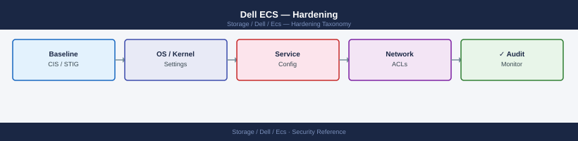
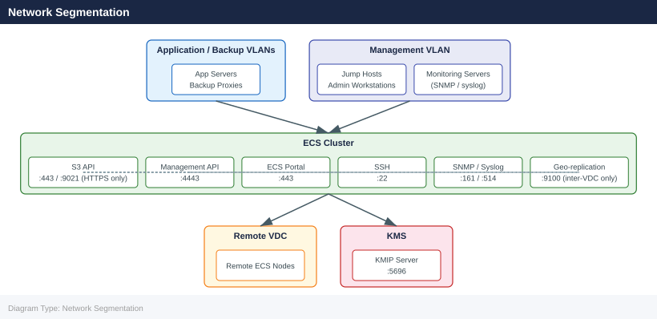

---
tags:
  - dell
  - security
---
# Dell ECS — Hardening

<div class="kb-summary">
Hardening reference covering Hardening Checklist, Network Segmentation, Operating System Hardening (Node-Level), Object Lock (WORM) Hardening, Secrets Management Integration and 1 more sections.

*Applies to: ECS 3.x*
</div>


## Before you begin

- **Access:** Storage admin credentials (cluster admin or equivalent)
- **Change management:** security changes require CAB approval in most environments
- **Rollback plan:** document current state before any security control change
- **Testing:** validate in a non-production environment first where possible

---

## Hardening Checklist

Apply these controls at initial deployment and validate at each quarterly security review.

- [ ] Change the default `sysadmin` password immediately after initial deployment; use a strong password (24+ characters, stored in a vault)
- [ ] Replace self-signed TLS certificates on the Management API (4443) and S3 endpoint (443/9021) with certificates signed by the corporate CA
- [ ] Disable HTTP (port 9021 plain HTTP) in production; require HTTPS for all S3 access
- [ ] Enable TLS 1.2 minimum on all endpoints; disable TLS 1.0 and 1.1
- [ ] Remove weak cipher suites (RC4, DES, 3DES, NULL) from the TLS configuration
- [ ] Create named management service accounts for all automation and API access; do not use `sysadmin` in scripts or CI/CD pipelines
- [ ] Restrict `sysadmin` to break-glass access only; log and alert on each `sysadmin` login via syslog/SIEM
- [ ] Apply namespace quotas to all production namespaces; do not allow unconstrained namespaces
- [ ] Set hard quotas on high-growth buckets (Veeam offload, analytics ingest) to prevent runaway capacity consumption
- [ ] Enable bucket-level access logging for all namespaces with compliance or audit requirements
- [ ] Configure syslog forwarding to the SIEM for all ECS management and access events
- [ ] Enable Object Lock (WORM) on buckets designated for compliance or immutable backup data — use Compliance mode, not Governance mode
- [ ] Restrict ECS Portal (port 443) and Management API (port 4443) access to management network VLANs via firewall ACLs; block access from data network VLANs
- [ ] Restrict S3 API access (port 443/9021) to authorised application and backup network VLANs only
- [ ] Disable unused API protocols (Swift, Atmos, CAS) on namespaces that only require S3
- [ ] Rotate object user secret keys every 12 months; update consuming applications and secrets manager entries
- [ ] Enable encryption at rest on namespaces holding regulated data (PCI, HIPAA, GDPR)
- [ ] For encryption at rest: use an external KMIP KMS for regulated compliance environments; do not rely on the internal ECS KMS for PCI or HIPAA data
- [ ] Configure NTP on all nodes to a consistent authoritative time source; clock drift > 5 minutes can cause geo-replication and S3 signature validation failures
- [ ] Disable password-based SSH login to ECS nodes; use SSH key authentication only
- [ ] Apply the principle of least privilege to all IAM bucket policies; never assign `Action: "*"` to application object users
- [ ] Perform a quarterly access review: remove object users for decommissioned applications; rotate keys older than 12 months

## Network Segmentation



| Traffic Type | Source Networks | Destination Port | Action |
|---|---|---|---|
| S3 API | Application VLANs, Backup VLANs | 443 or 9021 (HTTPS) | Allow |
| Swift API | OpenStack compute VLANs | 9024 | Allow (only if Swift is in use) |
| Management API | Management VLAN, jump hosts only | 4443 | Allow |
| ECS Portal | Management VLAN, jump hosts only | 443 | Allow |
| SSH | Jump hosts, management VLAN only | 22 | Allow |
| SNMP | Monitoring VLANs only | 161 (UDP) | Allow |
| Syslog | ECS nodes to SIEM | 514 (UDP/TCP) | Allow |
| Geo-replication | ECS data VLANs, remote site | 9100 | Allow between VDC sites only |
| KMIP | ECS nodes to KMS server | 5696 | Allow |
| All other | Any | Any | Deny |

Configure inter-VLAN firewall rules to enforce this segmentation. ECS does not enforce network-level source IP restrictions natively (except via bucket policies with `aws:SourceIp` conditions).

## Operating System Hardening (Node-Level)

ECS nodes run a hardened Linux OS managed by Dell. Avoid making manual OS-level changes outside of the ECS-supported procedures, as unsupported changes may break the ECS software stack.

- Do not install third-party software or agents on ECS nodes unless explicitly validated by Dell Support
- Do not modify kernel parameters, network settings, or disk mounts manually — use ECS Portal procedures
- SSH access to nodes should be restricted to jump hosts and management workstations
- Disable direct `root` SSH login where possible; use `admin` and escalate with `sudo`
- Review `/etc/sudoers` and SSH `authorized_keys` periodically; remove stale entries

```bash
# Check who has SSH access on an ECS node
ssh admin@<ecs-node> "cat /home/admin/.ssh/authorized_keys"

# Verify root direct login is disabled in sshd_config
ssh admin@<ecs-node> "grep PermitRootLogin /etc/ssh/sshd_config"
# Expected: PermitRootLogin no
```


```text title="Expected output"
ssh_rsa AAAAB3NzaC1yc2EAAAADAQABAAABgQDk7vJ9mK2xL4pQ8nR5tZ1wX3yH6jK9lM0oP2qS3uV4wX5yZ6aB7cD8eF9gH0iJ1kL2mN3oP4qR5sT6uV7wX8yZ9aB0cD1eF2gH3iJ4kL5mN6oP7qR8sT9uV0wX1yZ2aB3cD4eF5gH6iJ7kL8mN9oP8qR9sU0vW1xY2yZ3aB4cD5eF6gH7iJ8kL9mN0oP9qR0sU1vW2xY3yZ4aB5cD6eF7gH8iJ9kL0mO1pQ0rV2wX3yZ5aB6cD7eF8gH9iJ0kL1mO2pQ1rV3wX4yZ6aB7cD8eF9gH0iJ1kL2mO3pQ2rV4wX5yZ7aB8cD9eF0gH1iJ2kL3mO4pQ3rV5wX6yZ8aB9cD0eF1gH2iJ3kL4mO5pQ4rV6wX7yZ9aB0cD1eF2gH3iJ4kL5mO6pQ5rV7wX8yZ0aB1cD2eF3gH4iJ5kL6mO7pQ6rV8wX9yZ1aB2cD3eF4gH5iJ6kL7mO8pQ7rV9wX0yZ2aB3cD4eF5gH6iJ7kL8mO9pQ8rV0wX1yZ3aB4cD5eF6gH7iJ8kL9mO0pQ9rV1wX2yZ4aB5cD6eF7gH8iJ9kL0mP1pQ0rV2wX3yZ5aB6cD7eF8gH9iJ0kL1mP2pQ1rV3wX4yZ6aB7cD8eF9gH0iJ1kL2mP3pQ2rV4wX5yZ7aB8cD9eF0gH1iJ2kL3mP4pQ3rV5wX6yZ8aB9cD0eF1gH2iJ3kL4mP5pQ4rV6wX7yZ9aB0cD1eF2gH3iJ4kL5mP6pQ5rV7wX8yZ0aB1cD2eF3gH4iJ5kL6mP7pQ6rV8wX9yZ1aB2c
```
## Object Lock (WORM) Hardening

| Control | Compliance Mode | Governance Mode |
|---|---|---|
| Can the retention period be shortened? | No — not by any user, including sysadmin | Yes — by a user with `s3:BypassGovernanceRetention` |
| Can the object be deleted before expiry? | No | Yes — by a user with `s3:BypassGovernanceRetention` |
| Suitable for SEC 17a-4, FINRA compliance? | Yes | No |
| Suitable for backup immutability (anti-ransomware)? | Yes | Conditionally — protect the bypass permission carefully |

For regulated compliance workloads, always use Compliance mode. For backup immutability against ransomware, Compliance mode is preferred; Governance mode is acceptable only if `s3:BypassGovernanceRetention` is restricted to a privileged break-glass account and not granted to backup service accounts.

```bash
# Set Object Lock retention in Compliance mode on an existing bucket
# (Note: the bucket must have been created with Object Lock enabled)
aws s3api put-object-lock-configuration \
  --bucket compliance-immutable \
  --object-lock-configuration '{
    "ObjectLockEnabled": "Enabled",
    "Rule": {
      "DefaultRetention": {
        "Mode": "COMPLIANCE",
        "Days": 2557
      }
    }
  }' \
  --endpoint-url https://<ecs-endpoint>:9021 \
  --no-verify-ssl \
  --profile ecs

# Verify the Object Lock configuration
aws s3api get-object-lock-configuration \
  --bucket compliance-immutable \
  --endpoint-url https://<ecs-endpoint>:9021 \
  --no-verify-ssl \
  --profile ecs
```


```text title="Expected output"
(no output — command completes silently)

{
    "ObjectLockConfiguration": {
        "ObjectLockEnabled": "Enabled",
        "Rule": {
            "DefaultRetention": {
                "Mode": "COMPLIANCE",
                "Days": 2557
            }
        }
    }
}
```

!!! warning "Common errors"
    **`An error occurred (ObjectLockConfigurationNotFoundError) when calling the PutObjectLockConfiguration operation: Object Lock configuration does not exist`** — Ensure the bucket was created with Object Lock enabled using the `--object-lock-enabled-for-bucket` flag during bucket creation.
    **`An error occurred (InvalidArgument) when calling the PutObjectLockConfiguration operation: Invalid retention period`** — Set `Days` to a positive integer between 1 and 36500 (100 years); 2557 days is valid, but verify the value matches your compliance requirements.
    **`Unable to locate credentials for profile 'ecs'`** — Verify the `ecs` profile exists in `~/.aws/credentials` or `~/.aws/config` with valid access key and secret key configured.
## Secrets Management Integration

Do not embed ECS credentials (management passwords, S3 access keys/secret keys, KMIP certificates) in configuration files, scripts, or source code.

**Recommended secrets management approaches:**

| Secret Type | Recommended Storage | Retrieval Method |
|---|---|---|
| `sysadmin` password | Physical vault or PAM (CyberArk, BeyondTrust) | Manual break-glass checkout |
| Management service account password | HashiCorp Vault or PAM | API retrieval at runtime in automation scripts |
| S3 access key / secret key | HashiCorp Vault (KV secrets engine) or secrets manager | Application retrieves at startup; never embedded in code |
| TLS certificate private key | HashiCorp Vault (PKI secrets engine) | Vault-managed PKI rotation |
| KMIP client certificate | HashiCorp Vault (PKI secrets engine) | Vault-managed; auto-rotated before expiry |

```bash
# Example: retrieve ECS S3 credentials from HashiCorp Vault at runtime
export AWS_ACCESS_KEY_ID=$(vault kv get -field=access_key secret/ecs/svc-spark-prod)
export AWS_SECRET_ACCESS_KEY=$(vault kv get -field=secret_key secret/ecs/svc-spark-prod)

# Use immediately; do not persist to disk or shell history
aws s3 ls s3://analytics-prod-raw \
  --endpoint-url https://<ecs-endpoint>:9021 \
  --no-verify-ssl
```


```text title="Expected output"
2024-01-15T09:47:23Z [INFO] Vault client initialized
2024-01-15T09:47:24Z [INFO] Auth method token has 720h remaining
                           PRE analytics-prod-raw-2024/
                           PRE analytics-prod-raw-2023/
                           PRE analytics-prod-raw-archive/
2024-01-15 09:47:25        0 .keep
2024-01-15 09:47:25   4521984 manifest.json
2024-01-15 09:47:25  15728640 data-partition-001.parquet
...
```

!!! warning "Common errors"
    **`Error reading secret/ecs/svc-spark-prod: permission denied`** — Verify your Vault token has read permissions on the secret path using `vault policy read` and ensure the token hasn't expired.
    **`SSL: CERTIFICATE_VERIFY_FAILED`** — The `--no-verify-ssl` flag is present but the endpoint certificate may still be invalid; confirm the ECS endpoint hostname matches the certificate CN or use a valid CA bundle instead of disabling verification.
    **`InvalidAccessKeyId`** — The credentials retrieved from Vault are stale or the service account was rotated; rotate the secret in Vault using `vault kv put secret/ecs/svc-spark-prod access_key=<new_key> secret_key=<new_secret>`.
## Security Validation

Run these checks at each quarterly security review and after any security-relevant configuration change:

```bash
# Confirm TLS version on S3 endpoint (should reject TLS 1.0 and 1.1)
openssl s_client -connect <ecs-node>:9021 -tls1 </dev/null 2>&1 \
  | grep -E "handshake failure|alert"  # Should show failure

openssl s_client -connect <ecs-node>:9021 -tls1_2 </dev/null 2>&1 \
  | grep "Protocol"  # Should show TLSv1.2 or TLSv1.3

# Confirm self-signed certs have been replaced (issuer should be the corporate CA)
openssl s_client -connect <ecs-node>:4443 </dev/null 2>/dev/null \
  | openssl x509 -noout -issuer

openssl s_client -connect <ecs-node>:9021 </dev/null 2>/dev/null \
  | openssl x509 -noout -issuer

# Confirm certificate is not expiring within 30 days
openssl s_client -connect <ecs-node>:9021 </dev/null 2>/dev/null \
  | openssl x509 -noout -enddate

# Confirm management API is not accessible from outside the management network
# (Run this from an application VLAN host — should time out or be refused)
curl --max-time 5 https://<ecs-node>:4443/login && echo "ACCESSIBLE — REMEDIATE" || echo "Blocked — OK"

# List all namespaces and verify quotas are set
ecscli namespace list
# Review each namespace output for quota values — alert on any with no quota

# Review active management users
curl -s -k -H "X-SDS-AUTH-TOKEN: $TOKEN" \
  "https://<ecs-node>:4443/user/users.json" | python3 -m json.tool
```


```text title="Expected output"
connect:errno=104
140735289937728:error:14094410:SSL routines:ssl3_read_bytes:sslv3 alert handshake failure:../ssl/record/rec_read_c.c:205:SSL alert number 40
Protocol  : TLSv1.2
issuer=CN=InternalCA-01,O=Acme Corp,C=US
issuer=CN=InternalCA-01,O=Acme Corp,C=US
notAfter=Mar 15 09:42:17 2025 GMT
Blocked — OK
Namespace: ns-prod-01
  Quota: 10737418240
Namespace: ns-dev-02
  Quota: 5368709120
Namespace: ns-archive
  Quota: (unlimited)
[
  {
    "uid": "admin@internal.local",
    "name": "Administrator",
    "created": "2024-01-10T14:22:33Z"
  },
  {
    "uid": "svc-backup@internal.local",
    "name": "Backup Service",
    "created": "2024-02-05T08:15:12Z"
  }
]
```

!!! warning "Common errors"
    **`curl: (7) Failed to connect to <ecs-node>:4443: Connection refused`** — Verify the management API port is open and the ECS node is reachable; check firewall rules and node status with `ecscli node list`.
    **`error:14090086:SSL routines:SSL3_GET_SERVER_CERTIFICATE:certificate verify failed`** — Add the corporate CA certificate to your system trust store with `sudo cp ca-cert.pem /etc/pki/ca-trust/source/anchors/ && sudo update-ca-trust`.
    **`error: invalid token`** — Regenerate the authentication token by running `curl -k -u admin:password https://<ecs-node>:4443/login` and export the returned token to `$TOKEN`.
---

## See also

- [Ecs — Authentication](../authentication/)
- [Ecs — Access Control](../access-control/)
- [Ecs — Encryption](../encryption/)
