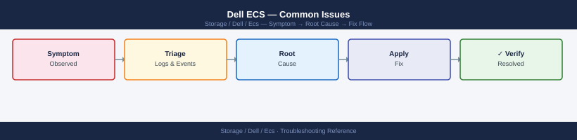

---
tags:
  - dell
  - troubleshooting
search:
  boost: 1.5
---
# Dell ECS — Common Issues

<div class="kb-summary">
Common Issues reference covering Incident Triage, Common Symptoms and Resolutions.

*Applies to: ECS 3.x*
</div>


```d2
direction: down

symptom: Identify Symptom {shape: diamond}
diagnostic_flow: "Diagnostic Flow" {shape: rectangle}
incident_triage: "Incident Triage" {shape: rectangle}
common_symptoms_and_resolutions: "Common Symptoms and Resolutions" {shape: rectangle}
verify_resolution: "Verify resolution" {shape: rectangle}
resolution: Resolve or Escalate {shape: oval}

symptom -> diagnostic_flow: investigate
symptom -> incident_triage: investigate
symptom -> common_symptoms_and_resolutions: investigate
symptom -> verify_resolution: investigate
diagnostic_flow -> resolution
incident_triage -> resolution
common_symptoms_and_resolutions -> resolution
verify_resolution -> resolution
```

## Diagnostic Flow

```d2
direction: right

D1: "D1" {shape: rectangle}
R1: "See Incident Triage —\nCheck portal for FAILED or SUSPECT disks" {shape: rectangle}
R2: "See Symptoms and Resolutions —\nSSH to node: check storageos service" {shape: rectangle}
D2: "D2" {shape: rectangle}
R3: "See Incident Triage —\nCheck IAM user namespace and bucket policy" {shape: rectangle}
R4: "See Symptoms and Resolutions —\n503: data service process down on nodes" {shape: rectangle}
D3: "D3" {shape: rectangle}
R5: "See Symptoms and Resolutions —\nS3 AccessDenied: fix IAM or bucket policy" {shape: rectangle}
R6: "See Symptoms and Resolutions —\nWORM object deletion blocked by retention" {shape: rectangle}
D4: "D4" {shape: rectangle}
R7: "See Incident Triage —\nCheck WAN port 9100 and replication throttle" {shape: rectangle}
R8: "See Symptoms and Resolutions —\nObject 404: wait for geo-replication" {shape: rectangle}
D5: "D5" {shape: rectangle}
R9: "See Symptoms and Resolutions —\nECS Portal login fails: renew certificate" {shape: rectangle}
R10: "See Symptoms and Resolutions —\nBucket quota exceeded: increase or expire objects" {shape: rectangle}
S: "What is the symptom?" {shape: rectangle}
B1: "B1" {shape: rectangle}
B2: "B2" {shape: rectangle}
B3: "B3" {shape: rectangle}
B4: "B4" {shape: rectangle}
B5: "B5" {shape: rectangle}

D1 -> R1
D1 -> R2
D2 -> R3
D2 -> R4
D3 -> R5
D3 -> R6
D4 -> R7
D4 -> R8
D5 -> R9
D5 -> R10
```

---

## Before you begin

- **Access:** Storage admin credentials (cluster admin or equivalent)
- **Gather first:** recent error message text, event timestamps, and affected object names
- **Scope:** confirm whether the issue affects a single object, host, cluster, or site
- **Escalation:** open a vendor support ticket before running any destructive step
- **Logging:** document each command and output — required if escalation is needed

---

## Incident Triage

When S3 writes fail, geo-replication falls behind, or a node goes offline, work through this sequence first.

```d2
direction: right

NODE: "NODE" {shape: rectangle}
DISK_CHK: "Check Portal → Hardware → Disks\nFAILED or SUSPECT disks?" {shape: rectangle}
DISK_REPL: "Initiate disk replacement\nMonitor rebuild" {shape: rectangle}
S3TEST: "S3 API\nresponding?" {shape: rectangle}
SVC: "SSH to node\nsystemctl status storageos\nReview /var/log/ecs/" {shape: rectangle}
AUTH_ERR: "AUTH_ERR" {shape: rectangle}
IAM: "Check: IAM user namespace\nBucket policy · addressing style\necscli bucket get --namespace ..." {shape: rectangle}
GEOREP: "GEOREP" {shape: rectangle}
WAN: "Check WAN link :9100\nRemote VDC health\nReplication throttle" {shape: rectangle}
CAP: "CAP" {shape: rectangle}
QUOTA: "Increase quota in portal\nor expire old objects" {shape: rectangle}
BUNDLE: "Collect support bundle\nOpen Dell case" {shape: rectangle}
REPORT: "Incident reported" {shape: rectangle}

NODE -> DISK_CHK
DISK_CHK -> DISK_REPL
NODE -> S3TEST
S3TEST -> SVC
AUTH_ERR -> IAM
GEOREP -> WAN
CAP -> QUOTA
CAP -> BUNDLE
```

- [ ] Check ECS Portal → Hardware → Nodes immediately — identify any node that has moved to `DEGRADED` or offline state; note when the state change occurred
- [ ] Query `GET /vdc/alerts` — retrieve the active alert list and identify alerts timestamped near the start of the incident
- [ ] Check geo-replication lag: ECS Portal → Geo Monitoring — growing lag between VDCs can indicate a WAN link issue or a remote VDC node problem
- [ ] Test S3 API availability: send a `HeadBucket` request to the S3 endpoint — a non-200 response or timeout confirms S3 API impact
- [ ] Check ECS Portal → Hardware → Disks for `FAILED` or `SUSPECT` disks on the affected node — disk failures trigger node rebalancing that can cause temporary capacity or performance impact
- [ ] If geo-replication lag is growing: check WAN bandwidth utilisation between sites and confirm the remote VDC is healthy; review replication group configuration with `ecscli bucket get`
- [ ] For S3 authentication failures: confirm the IAM user and access key are correct; check bucket policies with `ecscli bucket get --namespace <ns> --name <bucket>`
- [ ] If the node is unresponsive to the REST API: SSH to the node and check the ECS service status; open a Dell support case for hardware faults

| Question | Answer |
|---|---|
| Which nodes are DEGRADED or offline? | |
| What active alerts does GET /vdc/alerts return? | |
| Is geo-replication lag growing between VDCs? | |
| Is the S3 API endpoint responding? | |
| Are there FAILED or SUSPECT disks on the affected node? | |

## Common Symptoms and Resolutions

| Symptom | Cause | Action |
|---|---|---|
| Node shows `DEGRADED` or offline in ECS Portal | Disk failure, NIC fault, or node OS crash | Check ECS Portal → Hardware for disk state; SSH to the node and check OS logs; replace failed disk via the guided procedure in the portal |
| Geo-replication lag growing between VDCs | WAN link saturation, remote VDC node issue, or replication group misconfiguration | Check ECS Portal → Geo Monitoring; review inter-site bandwidth utilisation; verify the remote VDC has healthy nodes |
| S3 `AccessDenied` despite correct credentials | IAM policy misconfiguration, wrong namespace, or bucket policy conflict | Confirm IAM user is assigned to the correct namespace; check bucket policy with `ecscli bucket get`; verify path-style vs virtual-hosted-style addressing |
| Capacity growing unexpectedly | Bucket versioning accumulating old versions, incomplete multipart uploads, or no lifecycle policy | Check versioning on buckets; list and abort incomplete MPUs via S3 API; add lifecycle policies to expire non-current versions |
| ECS Portal login fails (HTTP 503 or timeout) | Portal service down or certificate expired | SSH to node and restart ECS portal service; check TLS certificate expiry via ECS Portal → Settings → Certificates |
| Bucket quota exceeded — writes failing with `QuotaExceeded` | Bucket or namespace hard quota reached | Increase quota via ECS Portal → Buckets → Edit or expire old objects; review lifecycle rules |
| Object read returns `404` for a recently written object | Replication lag: object written to one VDC not yet visible on the reading VDC | Wait for replication to complete; check replication lag in Geo Monitoring; verify replication group consistency setting |
| `503 Service Unavailable` on S3 endpoint during steady state | Data service process down on some nodes, or cluster is in degraded mode | Check node health in portal; review ECS data service logs on affected nodes |
| WORM/CAS object deletion blocked | Object is within its retention period | This is expected behaviour; confirm retention period setting on the bucket; escalate to data owner to confirm |

---

## Verify resolution

- Confirm the original symptom no longer occurs
- Check logs for any residual errors related to the issue
- Monitor for 10–15 minutes to confirm the fix is stable

---

## See also

- [Ecs — Diagnostics](../diagnostics/)
- [Ecs — Escalation](../escalation/)
- [Ecs — Health Checks](../../operations/health-checks/)
