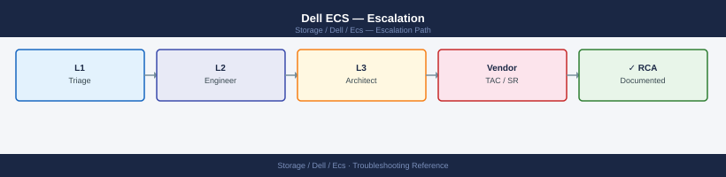

---
tags:
  - dell
  - troubleshooting
search:
  boost: 1.5
---
# Dell ECS — Escalation


<div class="kb-summary">
Escalation reference covering Support Portal, Opening a Case, Information to Collect, SLA Tiers, Escalation Path.

*Applies to: ECS 3.x*
</div>



```d2
direction: down

symptom: Identify Symptom {shape: diamond}
support_portal: "Support Portal" {shape: rectangle}
opening_a_case: "Opening a Case" {shape: rectangle}
information_to_collect: "Information to Collect" {shape: rectangle}
sla_tiers: "SLA Tiers" {shape: rectangle}
escalation_path: "Escalation Path" {shape: rectangle}
verify_resolution: "Verify resolution" {shape: rectangle}
resolution: Resolve or Escalate {shape: oval}

symptom -> support_portal: investigate
symptom -> opening_a_case: investigate
symptom -> information_to_collect: investigate
symptom -> sla_tiers: investigate
symptom -> escalation_path: investigate
symptom -> verify_resolution: investigate
support_portal -> resolution
opening_a_case -> resolution
information_to_collect -> resolution
sla_tiers -> resolution
escalation_path -> resolution
verify_resolution -> resolution
```

## Before you begin

- **Access:** Storage admin credentials (cluster admin or equivalent)
- **Gather first:** recent error message text, event timestamps, and affected object names
- **Scope:** confirm whether the issue affects a single object, host, cluster, or site
- **Escalation:** open a vendor support ticket before running any destructive step
- **Logging:** document each command and output — required if escalation is needed

---

## Support Portal

Dell EMC Support: [https://www.dell.com/support](https://www.dell.com/support)

- Log in with your MyDell account linked to your support contract
- Navigate to **Cases** to open a new case or view existing cases
- Navigate to **Contracts & Warranties** to verify ECS support entitlement

## Opening a Case

1. Confirm the ECS system is registered under your support contract in the Dell Support portal
2. Collect the information listed below before opening the case
3. Go to [https://www.dell.com/support](https://www.dell.com/support) → **Contact Support** → **Create Service Request**
4. Select product: **Dell EMC ECS** (Enterprise Content Storage)
5. Set severity:
   - **Severity 1** — production cluster down or data inaccessible
   - **Severity 2** — degraded cluster (nodes down, replication stopped) but data accessible
   - **Severity 3** — non-critical functional issue or question
   - **Severity 4** — general enquiry or low-impact issue
6. Attach the support bundle (ECS Portal → Support → Collect Logs) to the case immediately
7. Note the case number and communicate it to the on-call team

## Information to Collect

```bash
# ECS software version
curl -s -k -H "X-SDS-AUTH-TOKEN: $TOKEN" \
  "https://<ecs-node>:4443/vdc/version" | python3 -m json.tool

# Node list and health status
curl -s -k -H "X-SDS-AUTH-TOKEN: $TOKEN" \
  "https://<ecs-node>:4443/vdc/nodes" | python3 -m json.tool

# Active alerts
curl -s -k -H "X-SDS-AUTH-TOKEN: $TOKEN" \
  "https://<ecs-node>:4443/vdc/alerts" | python3 -m json.tool

# VDC capacity
curl -s -k -H "X-SDS-AUTH-TOKEN: $TOKEN" \
  "https://<ecs-node>:4443/vdc/capacity" | python3 -m json.tool

# Replication group status (geo deployments)
curl -s -k -H "X-SDS-AUTH-TOKEN: $TOKEN" \
  "https://<ecs-node>:4443/vdc/data-service/vpools" | python3 -m json.tool

# Namespace and bucket affected by the issue
ecscli namespace list
ecscli bucket get --namespace <namespace> --name <bucket>
```


```text title="Expected output"
{
  "version": "3.6.1.0.20240115",
  "build_number": "r20240115-001",
  "release_date": "2024-01-15"
}
{
  "nodes": [
    {
      "id": "ecs-node-01.lab.local",
      "ip": "192.168.1.101",
      "status": "UP",
      "version": "3.6.1.0.20240115",
      "disk_usage_percent": 67.3
    },
    {
      "id": "ecs-node-02.lab.local",
      "ip": "192.168.1.102",
      "status": "UP",
      "version": "3.6.1.0.20240115",
      "disk_usage_percent": 71.8
    },
    {
      "id": "ecs-node-03.lab.local",
      "ip": "192.168.1.103",
      "status": "UP",
      "version": "3.6.1.0.20240115",
      "disk_usage_percent": 65.2
    }
  ]
}
{
  "alerts": [
    {
      "id": "alert-8472",
      "severity": "WARNING",
      "message": "Disk usage on ecs-node-02 exceeds 70%",
      "timestamp": "2024-01-20T14:32:15Z"
    },
    {
      "id": "alert-8471",
      "severity": "INFO",
      "message": "Replication lag detected on vpool-prod: 2.3 seconds",
      "timestamp": "2024-01-20T13:45:22Z"
    }
  ]
}
{
  "total_capacity_gb": 102400,
  "used_capacity_gb": 68971,
  "available_capacity_gb": 33429,
  "usage_percent": 67.3
}
{
  "vpools": [
    {
      "id": "vpool-prod",
      "name": "Production",
      "replication_group": "us-east-1",
      "status": "HEALTHY",
      "replicas": 3
    },
    {
      "id": "vpool-dr",
      "name": "Disaster Recovery",
      "replication_group": "us-west-2",
      "status": "HEALTHY",
      "replicas": 2
    }
  ]
}
Namespace: ns-prod (active)
Namespace: ns-archive (active)
Namespace: ns-test (active)

Bucket: prod-data
  Namespace: ns-prod
  Versioning: enabled
  Size: 2.4 TB
  Object Count: 1847293
```

!!! warning "Common errors"
    **`curl: (60) SSL certificate problem: self signed certificate`** — Add `-k` flag to curl command to skip SSL verification, or import the ECS node's certificate into your CA bundle.
    **`error: invalid_token or X-SDS-AUTH-TOKEN: Unauthorized`** — Regenerate the authentication token using `ecscli authentication login` and ensure the token has not expired.
    **`command not
Also provide:
- ECS Portal → Support → Collect Logs (per-node support bundle — mandatory for Severity 1/2 cases)
- VDC topology diagram (number of sites, nodes per VDC, replication group configuration)
- Approximate time the issue started
- Description of any recent changes (upgrades, replication group changes, network/firewall changes, new bucket or namespace creation)
- Error messages from the ECS Portal and from the S3/API client side

## SLA Tiers

| Severity | Description | Initial Response Target | Update Frequency |
|---|---|---|---|
| Severity 1 | Production cluster down / data inaccessible | 30 minutes | Every 2 hours until resolved |
| Severity 2 | Degraded cluster / significant impact | 2 hours | Every 4 hours |
| Severity 3 | Non-critical issue / minor impact | Next business day | As updated |
| Severity 4 | General question / low impact | 2 business days | As updated |

Response times are governed by your specific Dell support contract tier (Basic, ProSupport, ProSupport Plus, or Mission Critical). Verify your entitlement in the Support portal before assuming the above defaults.

## Escalation Path

1. **Case update**: Add a comment to the open case requesting escalation if progress is insufficient
2. **Account Team**: Contact your Dell account manager or technical account manager (TAM) to escalate a Sev1/Sev2 case that is not progressing
3. **Mission Critical escalation**: If you have a ProSupport Mission Critical contract, call the dedicated Mission Critical support line for immediate engineer engagement
4. **Executive escalation**: If the account team is unresponsive, request escalation through your Dell sales representative to Dell EMC Services management

---

## Verify resolution

- Confirm the original symptom no longer occurs
- Check logs for any residual errors related to the issue
- Monitor for 10–15 minutes to confirm the fix is stable

---

## See also

- [Ecs — Diagnostics](../diagnostics/)
- [Ecs — Common Issues](../common-issues/)
