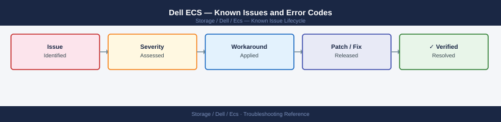

---
tags:
  - troubleshooting
  - ecs
  - dell
  - known-issues
description: "Catalog of known ECS (Elastic Cloud Storage) bugs, error codes, and workarounds covering S3 API, geo-replication, and cluster health."
---
# Dell ECS — Known Issues and Error Codes

<div class="kb-summary">
Catalog of known ECS (Elastic Cloud Storage) bugs, error codes, and workarounds covering S3 API, geo-replication, and cluster health.

*Applies to: ECS 3.x*
</div>



```d2
direction: down

symptom: Identify Symptom {shape: diamond}
s3_api: "S3 API" {shape: rectangle}
georeplication: "Geo-Replication" {shape: rectangle}
cluster_health: "Cluster Health" {shape: rectangle}
resolution: Resolve or Escalate {shape: oval}

symptom -> s3_api: investigate
symptom -> georeplication: investigate
symptom -> cluster_health: investigate
s3_api -> resolution
georeplication -> resolution
cluster_health -> resolution
```

## Before you begin

- ECS alerts appear in ECS Portal → Dashboard → Alerts.
- `ecscli` for cluster management; `managementAPI` on port 9101 for REST API.
- Geo-replication issues always involve port 9011 between sites.

## S3 API

| Error / Symptom | Affected Versions | Cause | Workaround / Fix | Fixed In |
|---|---|---|---|---|
| S3 `403 Forbidden` for valid credentials | ECS 3.x | User not in correct S3 object user group or namespace | Verify user namespace mapping in ECS Portal → Manage → Users | N/A |
| S3 multipart upload returning `400 Bad Request` | ECS 3.x | Part size below ECS minimum (5 MB for all except last part) | Ensure all parts except last are ≥5 MB | N/A |
| `404 NoSuchBucket` immediately after bucket create | ECS 3.x | Consistency delay on new bucket; client retried too fast | Retry S3 operation after 1–2 seconds; ECS has eventual consistency for metadata | N/A |

## Geo-Replication

| Error / Symptom | Affected Versions | Cause | Workaround / Fix | Fixed In |
|---|---|---|---|---|
| Geo-replication `Link Down` | ECS 3.x | TCP 9011 blocked between ECS sites | Verify TCP 9011 open between all ECS nodes across sites | N/A |
| Replication lag growing after network event | ECS 3.x | Backlog built up during outage | Lag clears automatically after connectivity restored; no manual action required | N/A |

## Cluster Health

| Error / Symptom | Affected Versions | Cause | Workaround / Fix | Fixed In |
|---|---|---|---|---|
| `Disk failed` alert — cluster healthy | ECS 3.x | Single disk failure; ECS re-protecting data | Replace disk; no data loss as long as cluster has sufficient nodes online | N/A |
| ZooKeeper quorum lost: `Cassandra not available` | ECS 3.x | Multiple nodes offline simultaneously | Restore node count to ≥3 in ZooKeeper quorum; check Cassandra ring | N/A |

## See also

- [Dell ECS — Common Issues](../common-issues/)
- [Dell CloudIQ — Known Issues](../../cloudiq/troubleshooting/known-issues.md)
