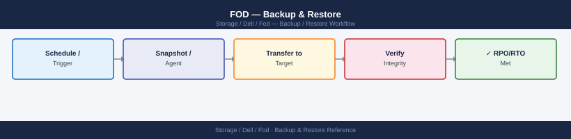

---
tags:
  - dell
  - operations
---
# FOD — Backup & Restore

Dell FoD (Flex on Demand) backup and restore: entitlement file backup, SCG configuration export, and procedure to restore capacity licences after replacement.

*Applies to: Dell FOD*

> Part of the [Flex on Demand](../index.md) reference.

---

FOD does not manage data backup directly. Key items to protect:

- **FOD license files**: store downloaded license key files in a secure, backed-up location.
- **Monthly usage reports**: export and retain monthly consumption reports from the APEX Console for billing reconciliation and dispute resolution.
- **Contracted baseline documentation**: retain records of the contracted base and burst ceiling values, contract dates, and any baseline adjustment requests.

## Before you begin

- **Access:** Storage admin credentials (cluster admin or equivalent)
- **Timing:** safe to run during business hours unless a step is marked ⚠ (causes interruption)
- **Dependencies:** no active upgrades or migrations on the same infrastructure
- **Logging:** capture command output — paste into the change record on completion

---

---

## Verify

- Confirm the operation completed without errors in the log or management UI
- Verify the expected state change is visible (service running, object created, config applied)
- Document the outcome in the change record

---

## See also

- [Fod — Procedures](../procedures/)
- [Fod — Health Checks](../health-checks/)
- [Fod — Common Issues](../../troubleshooting/common-issues/)
