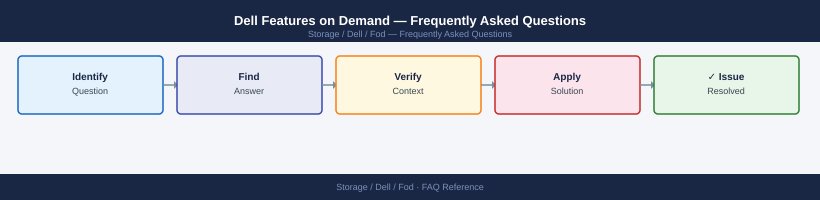

---
tags:
  - dell-fod
  - faq
  - operations
---
# Dell Features on Demand — Frequently Asked Questions

*Applies to: Dell EMC Storage*

Common questions about Dell Features on Demand operations, configuration, and troubleshooting. For step-by-step procedures, see the <a href="index.md">Operations</a> section.

## General

**Q: How do I check which FoD licences are active on a Dell array?**
A: For PowerStore: PowerStore Manager → Settings → Licences. For Unity: Unisphere for Unity → System → Licences. For PowerMax: Unisphere → System → Licences. Active FoD features are listed with their entitlement status.

**Q: How do I check the current Dell Features on Demand version?**
A: `Unisphere → System → Licences → Features on Demand`

## Configuration

**Q: What features are included in the base array licence vs FoD?**
A: Base licences include core block/file functionality. FoD unlocks advanced features: synchronous replication, data reduction, cloud tiering, and analytics. Review the Dell FoD catalogue for your specific array model.

**Q: How do I activate a new FoD feature licence?**
A: Obtain the licence key from Dell (via Support portal or account team). Apply in the array management UI: System → Licences → Apply Key. Most features activate immediately without downtime.

## Operations

**Q: How do I plan a FoD feature rollout across multiple arrays?**
A: Activate on a test array first. Validate the feature works as expected. Roll out to production arrays one at a time. For replication features, activate on both source and target arrays before configuring replication.

**Q: What is the correct procedure to request a new FoD trial licence?**
A: Contact Dell Support or your account team. Specify the array serial number and the feature to trial. Dell provides a 90-day trial key. Permanent licensing requires a purchase order.

## Troubleshooting

**Q: Array shows 'FoD Licence Expiring in 30 Days'. What does it mean?**
A: A trial or term licence for a feature is expiring. If you are using the feature in production, contact Dell immediately to purchase a permanent licence. The feature will be disabled when the licence expires.

**Q: Activating a FoD feature caused unexpected performance impact — where do I start?**
A: Some FoD features (deduplication, compression, encryption) have CPU overhead. Review CloudIQ performance metrics. Contact Dell Support if the impact exceeds expected levels for your configuration.

## Backup and Recovery

**Q: Should I back up FoD licence keys?**
A: Yes — store all FoD licence keys in a secure credential store. Dell can reissue keys but this takes 1-2 business days. Document the array serial number and associated FoD features in your CMDB.

**Q: If I rebuild an array, are FoD licences automatically re-applied?**
A: No — you must re-apply FoD licence keys after a factory reset or rebuild. Ensure keys are stored securely and retrievable before initiating any destructive operation on the array.

## See Also

- [Dell Features on Demand Operations](index.md)
- [Dell Features on Demand Troubleshooting](../../../../troubleshooting/index.md)
