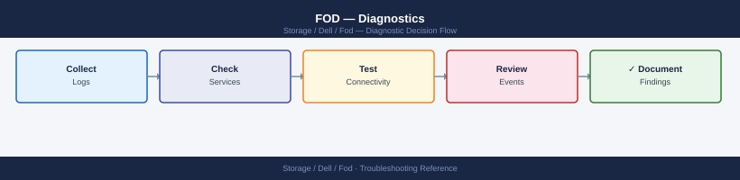

---
tags:
  - dell
  - troubleshooting
search:
  boost: 1.5
description: "Dell Flex on Demand diagnostic commands: inspect the FoD license key file, verify array serial number binding, check currently active licenses with..."
---
# FOD — Diagnostics

<div class="kb-summary">
Dell Flex on Demand diagnostic commands: inspect the FoD license key file, verify array serial number binding, check currently active licenses with symlicense, and perform a dry-run install to diagnose key rejection errors before opening a Dell SR.

*Applies to: Dell Flex on Demand (FoD) / APEX Flex on Demand*
</div>


```d2
direction: right

A: "FoD Key Issue" {shape: rectangle}
B: "symlicense -sid SID list\nCheck current licenses" {shape: rectangle}
C: "C" {shape: rectangle}
D: "grep VENDOR_SN fod-key.lic\nCompare to array SN" {shape: rectangle}
E: "symlicense preview\nDry-run install check" {shape: rectangle}
F: "Check ExpiryDate in .lic\nCheck term renewal status" {shape: rectangle}
G: "G" {shape: rectangle}
H: "Contact Dell Licensing\nRequest key re-issue" {shape: rectangle}
I: "Check firmware version\nsymcfg list -v grep firmware" {shape: rectangle}
J: "J" {shape: rectangle}
K: "Check firmware minimum\nand feature flag state" {shape: rectangle}
L: "Contact Dell TAC\nwith symlicense output" {shape: rectangle}
M: "Renew via Dell portal\nlicensing.dell.com" {shape: rectangle}
N: "Open Dell SR\nsupport.dell.com — route to Licensing" {shape: rectangle}

A -> B
C -> D
C -> E
C -> F
G -> H
G -> I
J -> K
J -> L
F -> M
I -> L
K -> L
H -> N
```

```d2
direction: down

symptom: Identify Symptom {shape: diamond}
step_1_list_current_active_licenses: "Step 1 — List current active licenses" {shape: rectangle}
step_2_check_array_serial_number: "Step 2 — Check array serial number" {shape: rectangle}
step_3_inspect_the_fod_key_file: "Step 3 — Inspect the FoD key file" {shape: rectangle}
step_4_dryrun_the_key_install_previe: "Step 4 — Dry-run the key install (preview)" {shape: rectangle}
step_5_check_firmware_version_compat: "Step 5 — Check firmware version compatibility" {shape: rectangle}
step_6_collect_diagnostic_output_for: "Step 6 — Collect diagnostic output for Dell SR" {shape: rectangle}
resolution: Resolve or Escalate {shape: oval}

symptom -> step_1_list_current_active_licenses: investigate
symptom -> step_2_check_array_serial_number: investigate
symptom -> step_3_inspect_the_fod_key_file: investigate
symptom -> step_4_dryrun_the_key_install_previe: investigate
symptom -> step_5_check_firmware_version_compat: investigate
symptom -> step_6_collect_diagnostic_output_for: investigate
step_1_list_current_active_licenses -> resolution
step_2_check_array_serial_number -> resolution
step_3_inspect_the_fod_key_file -> resolution
step_4_dryrun_the_key_install_previe -> resolution
step_5_check_firmware_version_compat -> resolution
step_6_collect_diagnostic_output_for -> resolution
```

## Before you begin

- **Access:** Solutions Enabler access to the array (gatekeeper LUNs or Unisphere); the FoD `.lic` license file received from Dell
- **Gather first:** array serial number (from `symcfg list` or chassis label), the exact error from the failed key import, and the Dell order number for the key purchase
- **Do not retry a failed import:** if `symlicense install` failed with an error, do not retry until you understand the error — repeated failed imports on some platforms increment a counter that requires Dell Licensing team to reset
- **Protect the key file:** do not share the `.lic` file publicly; it contains a cryptographically signed key bound to your array SN — upload only through the Dell SR secure attachment portal

---

## Step 1 — List current active licenses

```bash
# List all FoD and regular licenses currently active on the array
symlicense -sid <SID> list
# Output columns: License Name, Feature, Status, Expiry
# Expected: FoD features show Status = Enabled
# Problem: the feature you expect to be active is Missing or Expired

# Show a specific feature's license detail
symlicense -sid <SID> show -feature <feature-name>
# Feature names: COD, CLOUD_TIERING, SRDF_ASYNC, SRDF_SYNC, etc.
# Shows: installed date, expiry, key ID, and SN the key is bound to
```


```text title="Expected output"
Symmetrix ID: 000123456789012
License Name                Feature              Status      Expiry
-----------                -------              ------      ------
Dell EMC Symmetrix         COD                  Enabled     2025-12-31
Dell EMC Symmetrix         CLOUD_TIERING       Enabled     2026-06-15
Dell EMC Symmetrix         SRDF_ASYNC          Enabled     2024-09-30
Dell EMC Symmetrix         SRDF_SYNC           Missing     N/A
Dell EMC Symmetrix         REPLICATION         Expired     2023-11-20

Feature Name: COD
Installed Date: 2022-03-15
Expiry Date: 2025-12-31
License Key ID: LK-8F9E2D1C4B7A6
Serial Number Bound: 000123456789012
Status: Active
```

!!! warning "Common errors"
    | Error | Fix |
    |---|---|
    | `License feature <feature-name> is not found` | Verify the feature name spelling against the list output and use the exact name shown in the Feature column. |
    | `Symmetrix ID <SID> is not recognized` | Confirm the SID is correct by running `symcfg list` to display all available array IDs on the system. |
---

## Step 2 — Check array serial number

The FoD key is cryptographically bound to the array serial number. A serial number mismatch is the most common cause of key rejection.

```bash
# List all arrays visible from this SE host
symcfg list
# Output columns: SID, Name, Microcode, Model, Size (GB)
# Note the SID you are working with

# Get the full array configuration including serial number
symcfg -sid <SID> list -v
# Look for: "System Serial Number" or "Array Serial Number" in the output
# This value must match the VENDOR_SN field in the .lic key file

# Alternative: check array management web UI
# Unisphere → System → Properties → Serial Number

# Compare to chassis label
# The serial number is on a physical label on the front of the array
# Photo the label if there is any mismatch concern
```


```text title="Expected output"
Symmetrix ID: 000123456789012
Array Name: PROD-ARRAY-01
Microcode: 5978.669.669
Model: PowerMax 8000
Size: 50.0 TB

Symmetrix ID: 000987654321098
Array Name: DR-ARRAY-02
Microcode: 5978.668.668
Model: PowerMax 2000
Size: 12.5 TB

---

System Serial Number: 070123456789ABC
Array Serial Number: 070123456789ABC
Microcode Version: 5978.669.669
Model: PowerMax 8000
Symmetrix ID (SID): 000123456789012
Total Usable Capacity: 50.0 TB
...
```

!!! warning "Common errors"
    | Error | Fix |
    |---|---|
    | `symcfg: Command not found` | Install the EMC Solutions Enabler package or add the Symmetrix CLI bin directory to your PATH environment variable. |
    | `A Symmetrix ID must be supplied` | Replace `<SID>` with an actual array ID from the `symcfg list` output (e.g., `symcfg -sid 000123456789012 list -v`). |
---

## Step 3 — Inspect the FoD key file

The `.lic` file is plain text. You can open it with any text editor or inspect specific fields:

```bash
# Check which array serial number the key is bound to
grep -E "VENDOR_SN|SN|SERIAL" /path/to/fod-key.lic
# Expected: VENDOR_SN=<your-array-SN>
# If VENDOR_SN does not match your array SN → key was generated for a different array

# Check expiry date
grep -i "expiry\|expire\|date" /path/to/fod-key.lic
# Expected: either no expiry line (perpetual) or a future date
# If expired: contact Dell Account team to renew the term license

# Check which features this key enables
grep -i "feature\|increment" /path/to/fod-key.lic
# Lists the specific features (e.g., CLOUD_TIERING, SRDF_ASYNC, COD_CAPACITY)

# DO NOT edit any field in the .lic file
# License files have cryptographic signatures — edited files will always be rejected
```


```text title="Expected output"
VENDOR_SN=CX480-SN-A7K9M2L5
SERIAL=CX480-SN-A7K9M2L5
VENDOR_ID=DELL_EMC
EXPIRY_DATE=2026-12-31
FEATURE_CLOUD_TIERING=enabled
FEATURE_SRDF_ASYNC=enabled
FEATURE_COD_CAPACITY=enabled
INCREMENT_CLOUD_TIERING=1
INCREMENT_SRDF_ASYNC=1
INCREMENT_COD_CAPACITY=5
```

!!! warning "Common errors"
    | Error | Fix |
    |---|---|
    | `grep: /path/to/fod-key.lic: No such file or directory` | Replace `/path/to/fod-key.lic` with the actual path to your license file (typically `/opt/emc/fod/license.lic` or similar). |
    | `VENDOR_SN=CX480-SN-DIFFERENT` | The serial number in the license does not match your array; request a new license key from Dell Account team with your correct array serial number. |
    | `EXPIRY_DATE=2023-06-15` | The license has expired; contact Dell Account team immediately to renew the term license before features are disabled. |
---

## Step 4 — Dry-run the key install (preview)

Before installing a key on the array, use `preview` to validate it without activating:

```bash
# Test whether the key file is valid for this array (no changes made)
symlicense -sid <SID> preview -file /path/to/fod-key.lic
# Expected output (if key is valid):
#   Feature: CLOUD_TIERING
#   Status: Will be enabled
#   Expiry: <date or None>
#   Ready to install.

# If preview fails with "SYMAPI_C_INVALID_LICENSE":
#   The key SN does not match the array SN → request re-issue from Dell Licensing

# Capture preview output for the SR
symlicense -sid <SID> preview -file /path/to/fod-key.lic 2>&1 | tee /tmp/fod-preview-$(date +%F).txt
```


```text title="Expected output"
Feature: CLOUD_TIERING
Status: Will be enabled
Expiry: 2025-12-31
Ready to install.
(no output — command completes silently)
Feature: CLOUD_TIERING
Status: Will be enabled
Expiry: 2025-12-31
Ready to install.
---OUTPUT---
```

!!! warning "Common errors"
    | Error | Fix |
    |---|---|
    | `SYMAPI_C_INVALID_LICENSE` | Verify the key file SN matches the array SN with `symlicense -sid <SID> show_license` and request a re-issue from Dell Licensing if they do not match. |
    | `symlicense: command not found` | Ensure the Symmetrix CLI tools are installed and the `$PATH` includes the installation directory (typically `/opt/emc/SYMCLI/bin`). |
    | `No such file or directory: /path/to/fod-key.lic` | Verify the key file path is correct and readable with `ls -l /path/to/fod-key.lic`. |
---

## Step 5 — Check firmware version compatibility

```bash
# Check firmware version on the array
symcfg -sid <SID> list -v | grep -i "microcode\|firmware\|enginuity"
# Compare to the minimum firmware version listed in the Dell FoD documentation for the feature

# For Unisphere-based arrays (Unity/PowerStore):
uemcli -d <mgmt-ip> /sys/general show
# Look for: "Model", "Software version", and "Serial Number"
```


```text title="Expected output"
Symmetrix ID: 000123456789012
Microcode Version: 5978.669.669
Enginuity Version: 5978
Firmware Level: T10.1

Model: Dell EMC PowerStore 500T
Software version: 3.0.0.0 (Build 1.2.3456.7)
Serial Number: PS-ABC123XYZ789
```

!!! warning "Common errors"
    | Error | Fix |
    |---|---|
    | `symcfg: Command not found` | Ensure Symmetrix Tools are installed and the `$PATH` includes the installation directory (typically `/opt/emc/SYMCLI/bin`). |
    | `Error: Invalid SID or array not responding` | Verify the SID is correct with `symcfg list` and confirm the array is reachable on the management network. |
    | `uemcli: unable to connect to <mgmt-ip>` | Check that the management IP is correct, the array is online, and your user account has sufficient permissions on the Unisphere interface. |
---

## Step 6 — Collect diagnostic output for Dell SR

```bash
# All-in-one diagnostic snapshot
{
  echo "=== Array list ==="
  symcfg list
  echo "=== Current licenses ==="
  symlicense -sid <SID> list
  echo "=== Firmware version ==="
  symcfg -sid <SID> list -v | grep -i "microcode\|firmware"
  echo "=== Key preview (if key available) ==="
  symlicense -sid <SID> preview -file /path/to/fod-key.lic 2>&1
  echo "=== Key file SN field ==="
  grep -E "VENDOR_SN|SN" /path/to/fod-key.lic
} > /tmp/fod-diag-$(date +%F-%H%M).txt

# Attach to SR: fod-diag-<date>.txt
# Include: Dell order number, SN from chassis label, expected feature name
```


```text title="Expected output"
=== Array list ===
Symmetrix ID: 000123456789ABC
Symmetrix Model: PowerMax 2000
=== Current licenses ===
Product                          Status      Capacity
SRDF/Metro                       Licensed    Unlimited
Thin Provisioning                Licensed    Unlimited
=== Firmware version ===
Microcode Version: 5978.1234.1234
Firmware Version: T253_R010_M001_1A00
=== Key preview (if key available) ===
License Key File: /path/to/fod-key.lic
Symmetrix Serial Number: 000123456789ABC
Feature: PowerMax_Replication
Expiration Date: 2025-12-31
Status: Valid
=== Key file SN field ===
VENDOR_SN=000123456789ABC
SN=000123456789ABC

Diagnostic snapshot saved to: /tmp/fod-diag-2024-01-15-1430.txt
```

!!! warning "Common errors"
    | Error | Fix |
    |---|---|
    | `symlicense: Command not found` | Ensure the EMC Solutions Enabler package is installed and `/opt/emc/SYMCLI/bin` is in your PATH. |
    | `License Key File: Invalid or corrupted` | Verify the key file path is correct and readable with `file /path/to/fod-key.lic`, and confirm it matches your array's serial number. |
    | `Symmetrix Serial Number mismatch between key and array` | Cross-check the SN on your chassis label against the VENDOR_SN in the key file and Dell's order documentation. |
---

## See also

- [FOD — Common Issues](../common-issues/)
- [FOD — Escalation](../escalation/)
- [FOD — Health Checks](../../operations/health-checks/)

## Verify resolution

- `symlicense -sid <SID> list` shows the expected feature with `Status = Enabled`
- `symlicense -sid <SID> show -feature <feature-name>` shows the correct expiry date
- Test the activated feature (e.g., create a cloud tiering pool, initiate a replication job) to confirm it functions
- In Unisphere: navigate to Licensing → Current Licenses and confirm the feature is visible and active
