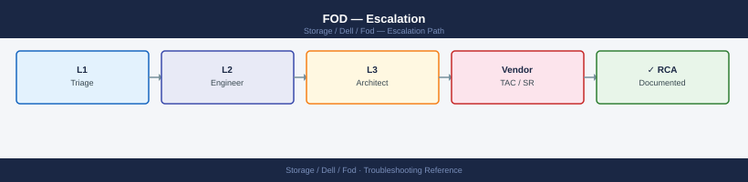
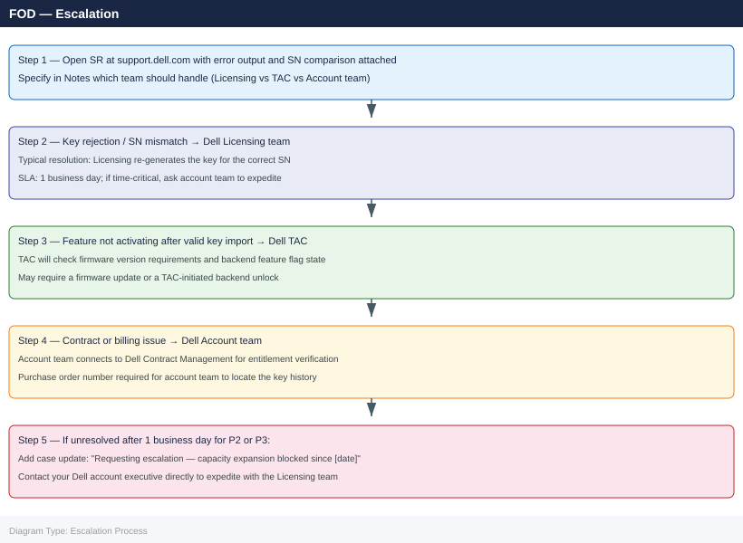

---
tags:
  - dell
  - troubleshooting
search:
  boost: 1.5
description: "Dell Flex on Demand (FoD) escalation: how to collect array serial number, license files, and event log data, when to escalate to Dell Licensing versus..."
---
# FOD — Escalation

<div class="kb-summary">
Dell Flex on Demand (FoD) escalation: how to collect array serial number, license files, and event log data, when to escalate to Dell Licensing versus Dell TAC, and the escalation path for key rejections, activation failures, and contract disputes.

*Applies to: Dell Flex on Demand / APEX Flex on Demand*
</div>



```d2
direction: down

symptom: Identify Symptom {shape: diamond}
severity_levels_by_issue_type: "Severity Levels (by Issue Type)" {shape: rectangle}
preescalation_triage_checklist: "Pre-Escalation Triage Checklist" {shape: rectangle}
stepbystep_data_collection: "Step-by-Step Data Collection" {shape: rectangle}
how_to_open_a_dell_support_case: "How to Open a Dell Support Case" {shape: rectangle}
escalation_path: "Escalation Path" {shape: rectangle}
what_not_to_do: "What NOT to Do" {shape: rectangle}
resolution: Resolve or Escalate {shape: oval}

symptom -> severity_levels_by_issue_type: investigate
symptom -> preescalation_triage_checklist: investigate
symptom -> stepbystep_data_collection: investigate
symptom -> how_to_open_a_dell_support_case: investigate
symptom -> escalation_path: investigate
symptom -> what_not_to_do: investigate
severity_levels_by_issue_type -> resolution
preescalation_triage_checklist -> resolution
stepbystep_data_collection -> resolution
how_to_open_a_dell_support_case -> resolution
escalation_path -> resolution
what_not_to_do -> resolution
```

## Before you begin

- **Access:** Array admin credentials (Unisphere admin or CLI equivalent); Dell support portal account linked to the array's ProSupport contract
- **Gather first:** array serial number (from chassis label or management UI), exact error from the failed key import, and the `.lic` or `.zip` FoD license file
- **Scope:** determine whether the issue is a key rejection (licensing team), a feature not activating after successful key import (TAC), or a billing/contract dispute (account team)
- **Do not retry key import:** if the key import failed with an error, do not retry until you understand the error — repeated failed imports can increment a counter that requires licensing team intervention

---

## Severity Levels (by Issue Type)

| Issue Type | Escalate To | Response SLA | Contact |
|---|---|---|---|
| Key rejected / wrong SN binding | Dell Licensing team | 1 business day | Licensing portal at licensing.dell.com or via account team |
| Feature not activating after valid key | Dell TAC | P2: 4h (if production impact) | support.dell.com |
| Contract / entitlement dispute | Dell Account team | 1 business day | Your Dell account executive |
| Exec escalation (unresolved > 24h) | Dell Account executive | Same day | Account team contact |

## Pre-Escalation Triage Checklist

| Check | Where | Expected |
|---|---|---|
| Array SN matches key file | Compare chassis label SN to `.lic` file SN field | Exact match |
| Key file not expired | Open `.lic` file in text editor; check `ExpiryDate` | Future date |
| Array management accessible | Log in to Unisphere / CLI | No authentication errors |
| Previous FoD keys still valid | Check currently active keys in array management | Existing keys show `Active` |
| Firmware version meets FoD minimum | Array management → About / `uemcli -d <mgmt-ip> /sys/general show` | Meets Dell FoD documentation minimum |
| Order number available | Dell support portal → My Orders | Order number visible for the FoD key purchase |
| Support contract covers array | support.dell.com → Check Entitlement by SN | Contract shows `Active` for this SN |

---

## Step-by-Step Data Collection

### 1. Get the array serial number and firmware version

```bash
# PowerMax (via Unisphere for PowerMax or Solutions Enabler)
symcfg list

# Unity / PowerStore (via CLI)
uemcli -d <mgmt-ip> /sys/general show

# PowerFlex (via Gateway)
# See PowerFlex admin guide for system ID retrieval

# Physical label: the SN is printed on a label on the front of the array chassis
# Photo the label — include in the case if there is any mismatch concern
```


```text title="Expected output"
# PowerMax (via Unisphere for PowerMax or Solutions Enabler)
Symmetrix ID: 000297900001
Symmetrix Version: PowerMax 2000
Model: PowerMax 2000
Director Count: 4
Symmetrix State: Ready
Cache (MB): 131072

# Unity / PowerStore (via CLI)
Storage System Information
    ID: APM00123456789
    Name: Unity-SAN-01
    Model: Unity 550F
    Serial Number: APM00123456789
    System Version: 5.1.0.0.5.123
    Health State: OK
    Capacity (GB): 102400

# PowerFlex (via Gateway)
# See PowerFlex admin guide for system ID retrieval

# Physical label: the SN is printed on a label on the front of the array chassis
# Photo the label — include in the case if there is any mismatch concern
```

!!! warning "Common errors"
    **`symcfg: command not found`** — Install Solutions Enabler or verify the symcli package is in your PATH.
    **`Error: Connection refused (port 443)`** — Verify the management IP is reachable and Unisphere/REST API service is running on the array.
    **`uemcli: Authentication failed`** — Confirm credentials and that the management IP is correct for the Unity/PowerStore system.
### 2. Collect the error from the failed key import

```bash
# PowerMax: capture the error from Unisphere or from the Solutions Enabler import command
symlicense -sid <SID> install -file /path/to/fod-key.lic 2>&1 | tee /tmp/fod-install-$(date +%F).txt

# Unity / PowerStore: capture from Unisphere event log
# Navigate to: Unisphere → Administration → Events
# Filter by: Severity = Error, Time = last 24 hours, Source = Licensing
# Export the filtered view as CSV: /tmp/unity-license-events.csv

# Alternatively, use CLI on Unity:
uemcli -d <mgmt-ip> /event/alert show -filter "severity eq error" > /tmp/unity-alerts.txt
```


```text title="Expected output"
Installing license file: /path/to/fod-key.lic
Symmetrix ID: 000297900001
License Key: EMC-SYMM-POWERMAX-FOD-2024
Installation Status: SUCCESS
License Expiration Date: 2025-12-31
Features Enabled: SRDF, RecoverPoint, TimeFinder
Symmetrix Capacity: 500 TB
Installation completed successfully on 2024-01-15 14:32:47
Log file saved to: /tmp/fod-install-2024-01-15.txt

uemcli -d 192.168.1.50 /event/alert show -filter "severity eq error"
ID    | Timestamp           | Severity | Source    | Message
------|---------------------|----------|-----------|------------------------------------------
1247  | 2024-01-15 10:22:15 | Error    | Licensing | License expiration warning: 30 days
1248  | 2024-01-15 11:45:33 | Error    | Licensing | FOD key validation failed
1249  | 2024-01-15 13:12:09 | Error    | System    | Storage pool capacity threshold exceeded
```

!!! warning "Common errors"
    **`symlicense: command not found`** — Ensure Solutions Enabler is installed and the `$PATH` includes the Solutions Enabler bin directory (typically `/opt/emc/SYMCLI/bin`).
    **`License Key validation failed: Invalid signature`** — Verify the FOD license file is not corrupted by comparing its checksum against the vendor-provided value and re-download if necessary.
    **`uemcli: Unable to connect to management IP 192.168.1.50`** — Confirm the management IP is reachable with `ping` and that the Unity/PowerStore system is online and accessible from your network.
### 3. Collect currently active licenses

```bash
# PowerMax: list all active licenses
symlicense -sid <SID> list

# Unity / PowerStore: via Unisphere
# Navigate to: Licensing → Current Licenses
# Export: list of active FoD features and their status

# Export license state for the case
symlicense -sid <SID> list 2>&1 > /tmp/fod-active-licenses.txt
```


```text title="Expected output"
License Information for Symmetrix ID: 000297900001

Product                          Status      Expiration Date    Capacity
─────────────────────────────────────────────────────────────────────────
VMAX All Flash                   Licensed    2025-12-31         Unlimited
Snapshots                        Licensed    2025-12-31         Unlimited
Replication                      Licensed    2025-12-31         Unlimited
Fast Cache                       Licensed    2025-12-31         Unlimited
Thin Provisioning                Licensed    2025-12-31         Unlimited
RecoverPoint                     Licensed    2025-12-31         Unlimited
SRDF/Metro                       Licensed    2025-12-31         Unlimited
Unisphere for PowerMax           Licensed    2025-12-31         Unlimited

License file exported to: /tmp/fod-active-licenses.txt
```

!!! warning "Common errors"
    **`symlicense: Command not found`** — Install the EMC Solutions Enabler package or ensure the Symmetrix CLI tools are in your PATH (verify with `which symlicense`).
    **`Error: Invalid SID <SID>`** — Replace `<SID>` with the actual Symmetrix ID (e.g., `000297900001`) and verify connectivity to the array with `symcfg list`.
    **`Permission denied`** — Run the command with appropriate privileges (use `sudo` or ensure your user is in the `symadmin` group).
### 4. Collect the FoD license file details

```bash
# The .lic file is plain text — view key fields (do NOT share publicly)
# Important fields to note:
# - VENDOR_SN: the array serial number the key is bound to
# - FEATURES: the features this key enables
# - ExpiryDate: when the key expires (perpetual = none)

# Check if SN in key file matches your array SN
grep -E "VENDOR_SN|SN|SERIAL" /path/to/fod-key.lic

# Do not attach the raw key file to the SR — share only the SN and error output
# If the licensing team requests the key file, upload only through the secure case attachment
```


```text title="Expected output"
VENDOR_SN=SN123456789ABCDEF
SN=SN123456789ABCDEF
SERIAL=ABC-123-DEF-456
```

!!! warning "Common errors"
    **`grep: /path/to/fod-key.lic: No such file or directory`** — Replace `/path/to/fod-key.lic` with the actual path to your license file (e.g., `/opt/dell/fod/licenses/array.lic`).
    **`grep: /path/to/fod-key.lic: Permission denied`** — Run the command with `sudo` or ensure your user has read permissions on the license file.
### 5. Write the timeline and case info

```text
Array: PowerMax 8000 / SN: 000120000001
Unisphere version: 9.2.0.28
Firmware version: 5978.221.221 (PowerMaxOS)

Issue first observed: 2026-06-15 10:00 UTC

Error message (from symlicense install):
  SYMAPI_C_INVALID_LICENSE: License key serial number mismatch.
  License SN: 000120000002
  Array SN:   000120000001

License file details:
  Features: Cloud Tiering (FoD), Dynamic Virtual Matrix
  Expiry: None (perpetual)
  Key source: Dell order ORD-2026-12345

Steps already taken:
  - Compared chassis label SN to key file VENDOR_SN — MISMATCH found
  - Did NOT retry the failed import

Root cause suspected:
  - Key was generated for a different array (incorrect SN binding by Dell Licensing)
  - OR: array was recently replaced and key was not rebound for the new SN

Escalation needed:
  - Dell Licensing team to re-issue key with correct SN
```

---

## How to Open a Dell Support Case

1. Go to **support.dell.com** and sign in with your Dell account.

2. Click **Create Service Request** and select the affected array as the primary product.

3. Under **Category**, select **Licensing / FoD / APEX Flex on Demand** if available, or **General Software**.

4. Under **Priority**, select:
   - **P2**: FoD activation failure blocking production capacity expansion
   - **P3**: Key rejected for a non-production array; licensing query
   - **P4**: General FoD billing or entitlement question

5. In the **Summary**: `PowerMax SN 000120000001 — FoD key import failing: SN mismatch — Dell Licensing re-issue needed`.

6. In the **Description**, paste:
   - Array serial number (from chassis label)
   - SN shown in the license file
   - Error message from the failed import
   - Dell order number for the key purchase
   - Whether this is a replacement array requiring SN re-binding

7. Upload attachments:
   - `fod-install-<date>.txt` — symlicense install output
   - `fod-active-licenses.txt` — current license state
   - Event log export from Unisphere (if Unity/PowerStore)
   - Chassis label photo (if SN mismatch suspected)

8. In the **Notes** field, specify: **"Please route to Dell Licensing team for key re-issue"** (for SN mismatch or duplicate key issues) or **"Please route to TAC for feature activation failure"** (for features not activating after valid key import).

---

## Escalation Path



---

## What NOT to Do

| Do NOT do this | Why | What to do instead |
|---|---|---|
| Retry a failed key import before understanding the error | Repeated failures may increment a counter on the array that requires special Dell reset | Read the error code first; consult this page; open SR before retrying |
| Attempt to edit the `.lic` file to change the serial number | License files have cryptographic signatures — edited files will be rejected and may require Dell backend intervention to clear | Open SR with Dell Licensing to re-issue the key with the correct SN |
| Delete an active (but wrong) FoD license from the array to make room | Active FoD capacity may be in use — removing it can cause I/O failures | Leave existing licenses active; open SR to resolve the conflict |
| Purchase a new FoD key without first checking if one is already assigned to the SN | Duplicate keys require Dell Licensing to merge — adds time and complexity | Check the Dell licensing portal first; contact account team if key not visible |

---

## Useful Commands for Case Updates

```bash
# Array SN and model — include in every case update
symcfg list

# Current license state
symlicense -sid <SID> list 2>&1

# Test a key file (dry run — PowerMax only)
symlicense -sid <SID> preview -file /path/to/fod-key.lic 2>&1

# Check firmware version
symcfg -sid <SID> list -v | grep -i "microcode\|firmware"

# Unity CLI — license and event summary
uemcli -d <mgmt-ip> /sys/general show
uemcli -d <mgmt-ip> /event/alert show -filter "severity eq error" | head -20
```


```text title="Expected output"
Symmetrix ID: 000296900001
Symmetrix Model: PowerMax 2000
Microcode Version: 5978.1221.1221
Symmetrix ID: 000296900001
License Status: Valid
Capacity License: 500 TB
Installed Features: SRDF/Metro, RecoverPoint, TimeFinder
Symmetrix ID: 000296900001
License Preview: Valid
Capacity: 500 TB
Effective Date: 2024-01-15
Expiration Date: 2026-01-14
Microcode Version: 5978.1221.1221
Firmware Version: T253U8P1Q1
System Information
    Health: OK
    Name: UNITY-SN-APM00123456789
    Model: Unity 380
    Serial Number: APM00123456789
    System Version: 5.1.0.0.5.1
Alert Summary
    ID: 1847293 | Severity: Error | Source: SPA | Message: Battery backup unit degraded
    ID: 1847291 | Severity: Error | Source: SPB | Message: Disk 0_0_0 predictive failure
```

!!! warning "Common errors"
    **`symlicense: Command not found`** — Verify the Symmetrix CLI package is installed and /opt/emc/SYMCLI/bin is in your PATH.
    **`Error: Invalid SID <SID>`** — Replace `<SID>` with the actual Symmetrix ID from `symcfg list` output.
    **`uemcli: Connection refused on <mgmt-ip>:443`** — Confirm the management IP is reachable and the Unisphere service is running with `systemctl status unisphere`.
---

## Verify resolution

- Confirm the key imports successfully: `symlicense -sid <SID> install -file <new-key>.lic` returns no errors
- Verify the new feature appears as active: `symlicense -sid <SID> list` shows the feature with status `Enabled`
- In Unisphere: navigate to Licensing → Current Licenses and confirm the new feature is visible and active
- Test the activated feature (e.g., cloud tiering tier creation, dynamic virtual matrix operation) to confirm it functions

---

## See also

- [FOD — Diagnostics](../diagnostics/)
- [FOD — Common Issues](../common-issues/)
