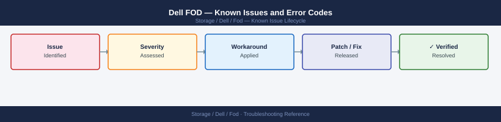

---
tags:
  - troubleshooting
  - fod
  - dell
  - known-issues
---
# Dell FOD — Known Issues and Error Codes

<div class="kb-summary">
Dell FOD (Feature on Demand) is a software feature licensing mechanism for Dell arrays. Known issues relate to license key download, ESRS activation, and feature enablement on array.

*Applies to: Dell FOD for PowerStore, PowerMax, Unity*
</div>



```d2
direction: down

symptom: Identify Symptom {shape: diamond}
license_activation: "License Activation" {shape: rectangle}
resolution: Resolve or Escalate {shape: oval}

symptom -> license_activation: investigate
license_activation -> resolution
```

## Before you begin

- FOD license keys are downloaded from `my.dell.com` or via ESRS.
- Features are enabled in the array management UI (Unisphere / PowerStore Manager) after applying the license key.
- If online activation fails, offline activation is always available via `my.dell.com` → Licensing portal.

## License Activation

| Error / Symptom | Affected Versions | Cause | Workaround / Fix | Fixed In |
|---|---|---|---|---|
| `Invalid license key` when applying FOD | Any | License key for wrong array serial number | Verify license serial number matches array; regenerate key at `my.dell.com` | N/A |
| ESRS activation fails: `Cannot contact licensing server` | Any | TCP 443 blocked from array to licensing.dell.com | Open firewall; use offline activation from `my.dell.com` as alternative | N/A |
| Feature enabled in UI but not activating | Any | Array requires reboot or service restart after FOD | Follow array-specific FOD activation steps (some features require service restart) | N/A |

## See also

- [Dell FOD — Common Issues](../common-issues/)
- [Dell COD — Known Issues](../../cod/troubleshooting/known-issues.md)
- [Dell PowerStore — Known Issues](../../powerstore/troubleshooting/known-issues.md)
