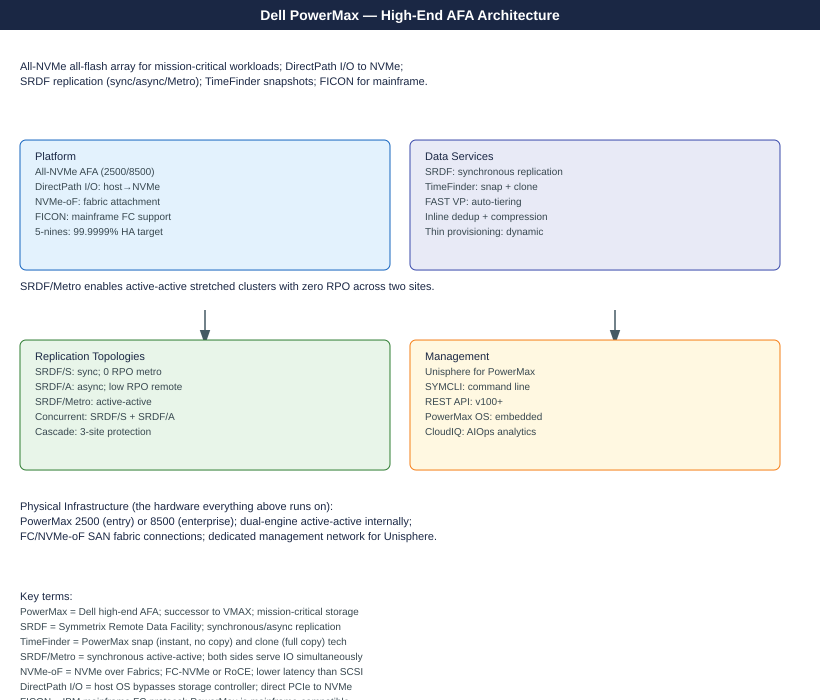

---
tags:
  - architecture
  - dell
description: "Dell PowerMax is an enterprise all-flash NVMe-oF array with an active-active director-pair architecture and global memory mirroring. It supports SRDF..."
---
# PowerMax — Architecture

<div class="kb-summary">
Dell PowerMax is an enterprise all-flash NVMe-oF array with an active-active director-pair architecture and global memory mirroring. It supports SRDF synchronous (zero RPO) and asynchronous replication for metro and long-distance DR.

*Applies to: PowerMax 2500 / 8500*
</div>



```d2
direction: right

san: FC / NVMe-oF Hosts {shape: rectangle}

engine: PowerMax Engine {
  da: Director A\n(FE + BE + RDF) {shape: rectangle}
  db: Director B\n(FE + BE + RDF) {shape: rectangle}
  gc: Global Memory\n(DRAM · RAID-1 mirrored) {shape: rectangle}
  da -> gc: shared cache
  db -> gc: shared cache
}

nvme: NVMe SSDs\nRAID-5 / RAID-6 {shape: cylinder}
srdf: Remote PowerMax\n(SRDF partner) {shape: rectangle}

san -> engine.da: FC / NVMe-oF
san -> engine.db: FC / NVMe-oF
engine.da -> nvme
engine.db -> nvme
engine.da -> srdf: SRDF/S or SRDF/A\nFC / GigE
engine.db -> srdf: SRDF/S or SRDF/A
```


<div class="kb-grid kb-grid-3">
  <a class="kb-card" href="how-it-works/">
    <div class="kb-card-icon">⚙️</div>
    <div class="kb-card-title">How It Works</div>
    <div class="kb-card-desc">Director-pair HA, SRDF replication modes, NVMe-oF fabric, SnapVX snapshots, and SYMCLI reference.</div>
  </a>
  <a class="kb-card" href="integrations/">
    <div class="kb-card-icon">🔗</div>
    <div class="kb-card-title">Integrations</div>
    <div class="kb-card-desc">VMware VASA/vVols, Oracle RMAN, SQL Server, VPLEX back-end, and Solutions Enabler scripting.</div>
  </a>
  <a class="kb-card" href="design-standards/">
    <div class="kb-card-icon">📐</div>
    <div class="kb-card-title">Design Standards</div>
    <div class="kb-card-desc">SRDF topology decisions, director layout, zoning standards, and host connectivity design rules.</div>
  </a>
</div>

## Models

| Model | Engines | Max Raw Capacity | Primary Use Case |
|---|---|---|---|
| PowerMax 2500 | 1–2 | ~4 PB | Mid-enterprise; tier-1 databases |
| PowerMax 8500 | 1–8 | ~9 PB | Large enterprise; SRDF/S metro clusters |

Both models share the same Hypermax OS, SRDF feature set, and NVMe-oF architecture. The 8500 supports more engines and higher drive counts.

## Topology

PowerMax uses a director-pair architecture where every engine contains at least two director boards (Director A and Director B). Both directors share a crossbar interconnect to the same Global Cache DRAM pool — this is the key to its active-active HA model. A director failure does not take the array offline because the surviving director retains full access to the shared cache and drives.

```d2
direction: right

h: Hosts {shape: rectangle}

engine: Engine (active-active pair) {
  da: Director A\nFE · BE · RDF roles {shape: rectangle}
  db: Director B\nFE · BE · RDF roles {shape: rectangle}
  xbar: Crossbar Interconnect {shape: rectangle}
  gc: Global Cache (DRAM)\nRAID-1 across DA–DB pair {shape: rectangle}
  da -> xbar
  db -> xbar
  xbar -> gc
}

flash: NVMe Flash Bays\n(RAID-5 / RAID-6) {shape: cylinder}
remote: Remote PowerMax\n(SRDF partner) {shape: rectangle}

h -> engine.da: host I/O
h -> engine.db: host I/O (multipath)
engine.gc -> flash: destage
engine.da -> remote: SRDF replication
```
