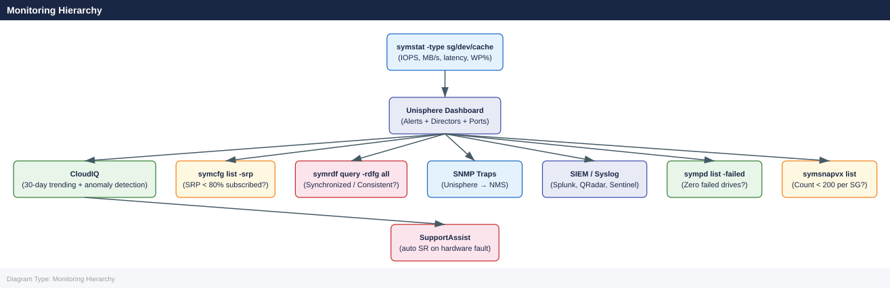

---
tags:
  - dell
  - operations
---
# PowerMax — Health Checks

<div class="kb-summary">
Health Checks reference covering Monitoring Hierarchy, Daily Checks, Health Check, Array Connectivity and Status, Director and Port Status and 7 more sections.

*Applies to: PowerMax 2500 / 8500*
</div>

## Before you begin

- **Access:** Storage admin credentials (cluster admin or equivalent)
- **Timing:** safe to run during business hours unless a step is marked ⚠ (causes interruption)
- **Dependencies:** no active upgrades or migrations on the same infrastructure
- **Logging:** capture command output — paste into the change record on completion

---

## Run This Routine

1. **System health:** `symcli -sid <sid> list -v | grep -i health`
2. **Disk group status:** `symdisk -sid <sid> list -failed` — should return empty
3. **Array performance:** `symstat -sid <sid> -type array` — check utilisation %
4. **SRDF group health:** `symrdf -sid <sid> list -v | grep -i state`
5. **Port health:** `symcfg -sid <sid> list -dir -v | grep -i status`
6. **Snapshot and clone status:** `symsnapvx -sid <sid> list -expired` — review expired snaps
7. **License status:** `symcfg -sid <sid> list -licenses`
8. **Open alerts:** Unisphere for PowerMax → Alerts → open/unacknowledged count

## Monitoring Hierarchy




## Daily Checks


| Check | Command | Notes |
|---|---|---|
| [ ] Open Unisphere for PowerMax → Dashboard and review the Alerts pane | | |
| [ ] Run `symcfg list` to confirm all registered arrays are online | `symcfg list` | |
| [ ] Check SRDF pair states | `symrdf list -sid XXXX` | All R1/R2 pairs should show `Synchronized` (SRDF/S) or `Consistent` (SRDF/A); investigate any pair showing `Transmit Idle`, `R1 Updated`, or `Suspended` |
| [ ] Check failed or degraded physical drives | `sympd list -sid XXXX -failed` | Output should be empty |
| [ ] Review active SnapVX sessions | `symsnap list -sid XXXX` | Confirm no device is approaching the 256-snapshot limit; expire stale snaps |
| [ ] Check thin device pool utilisation in Unisphere → Storage → Thin Pools | | Alert if any pool exceeds 80% consumed |
| [ ] Review Unisphere → Performance → Array for I/O response time and throughput | | |
| [ ] Confirm CloudIQ shows no critical findings for the array | | |

## Health Check


Run these commands from a host with Solutions Enabler installed to get a complete picture of array health before any change or incident response.

- [ ] `symcfg list` returns the expected array SIDs with status `Online`
- [ ] `symcfg -sid XXXX show` shows all directors and ports in a healthy state with no fault indicators
- [ ] `sympd list -sid XXXX -failed` returns no output (no failed drives)
- [ ] `symrdf list -sid XXXX` shows all SRDF groups and pair states — note any that are not `Synchronized` or `Consistent`
- [ ] `symdg list -sid XXXX` lists all device groups without errors
- [ ] `symsg list -sid XXXX` lists all storage groups and confirms no group is reporting capacity issues
- [ ] `symsnap list -sid XXXX` shows all active SnapVX sessions with no expired or stuck sessions
- [ ] Unisphere → System → Hardware confirms no director, drive, or port faults
- [ ] CloudIQ risk score is green or within accepted threshold

```bash
# List all Symmetrix arrays and confirm they are Online
symcfg list

# Full array health and director/port status for a specific SID
symcfg -sid XXXX show

# List all physical drives — check for Failed or Degraded state
sympd list -sid XXXX

# Filter for failed drives only (should return empty on a healthy array)
sympd list -sid XXXX -failed

# List SRDF groups and pair states
symrdf list -sid XXXX

# Show detailed SRDF pair state for a specific RDF group
symrdf -sid XXXX -rdfg <group> query

# List all device groups
symdg list -sid XXXX

# List all storage groups
symsg list -sid XXXX

# List all SnapVX snapshots across the array
symsnap list -sid XXXX

# Show replication sessions (SRDF and SnapVX combined view)
symreplicate list -sid XXXX
```


```text title="Expected output"
Symmetrix ID: 000123456789012
Symmetrix ID: 000123456789013
Symmetrix ID: 000123456789014

Symmetrix ID: 000123456789012
Director: FA-1e (Online)
Director: FA-2e (Online)
Director: SE-1 (Online)
Port: FA-1e:0 (Online, 16 Gb Fibre)
Port: FA-1e:1 (Online, 16 Gb Fibre)
Port: FA-2e:0 (Online, 16 Gb Fibre)

Physical Disk: 0.0.0 (Online, 1.2TB SSD)
Physical Disk: 0.0.1 (Online, 1.2TB SSD)
Physical Disk: 0.0.2 (Online, 1.2TB SSD)
Physical Disk: 0.0.3 (Online, 1.2TB SSD)
Physical Disk: 0.0.4 (Online, 1.2TB SSD)
...

(no output — command completes silently)

RDF Group: 001 (Synchronized)
RDF Group: 002 (Synchronized)
RDF Group: 003 (Synchronized)

Pair State: Synchronized
RDF Mode: Synchronous
Link State: Online
Pair Count: 24

Device Group: dg_prod_ora
Device Group: dg_prod_sql
Device Group: dg_backup

Storage Group: sg_prod_ora_01
Storage Group: sg_prod_sql_02
Storage Group: sg_backup_daily

Snapshot ID: 0x0a1b2c3d (Created: 2024-01-15 14:32:15, 256GB)
Snapshot ID: 0x0f4e5d6c (Created: 2024-01-14 09:18:42, 512GB)
Snapshot ID: 0x1a2b3c4d (Created: 2024-01-13 22:05:33, 1.2TB)

Replication Session: SRDF_001 (Synchronized, 24 devices)
Replication Session: SNAP_002 (Active, 8 snapshots)
Replication Session: SRDF_003 (Synchronized, 12 devices)
```

!!! warning "Common errors"
    **`SYMCLI Error: The specified Symmetrix ID is not available`** — Verify the SID is correct and the array is reachable via `symcfg discover`.
    **`SYMCLI Error: You do not have the required privileges to execute this command`** — Ensure your user account is in the `symuser` group or has appropriate SYMCLI permissions configured.
    **`SYMCLI Error: Cannot connect to the Symmetrix`** — Check that the Symmetrix Management Console (SMC) daemon is running with `service symcli status` and restart if necessary.
## Array Connectivity and Status


```bash
# Verify Solutions Enabler can reach the array
symcfg list
symcfg -sid <sid> show | grep -E "Product|Microcode|Online"

# Check array health via Unisphere REST (requires curl + valid token)
curl -sk -X GET "https://<unisphere-ip>:8443/univmax/restapi/system/symmetrix/<sid>" \
    -H "Authorization: Bearer <token>" | python3 -m json.tool | grep -E "model|health|microcode"
```


```text title="Expected output"
Symmetrix ID: 000123456789
Product: VMAX 250F
Microcode: 5978.1221.1221
Online: Yes

model: VMAX250F
health: Healthy
microcode: 5978.1221.1221
```

!!! warning "Common errors"
    **`symcfg: Command not found`** — Install EMC Solutions Enabler package or add its bin directory to your PATH environment variable.
    **`curl: (60) SSL certificate problem: self signed certificate`** — Use the `-k` flag (already present) or import the Unisphere certificate into your system's CA bundle if SSL verification is required.
    **`401 Unauthorized`** — Verify the bearer token is valid and not expired; regenerate it from Unisphere's REST API authentication endpoint.
## Director and Port Status


```bash
# Check all directors — flag any offline
symcfg -sid <sid> list -dir all | grep -v Online

# Check all ports — flag any not RDY
symcfg -sid <sid> list -port all | grep -v RDY

# FA port login count (host connectivity)
symcfg -sid <sid> list -fa -online | grep -E "Port|Logins"
```


```text title="Expected output"
# Check all directors — flag any offline
Director 0 (SE)        Offline
Director 1 (SE)        Online
Director 2 (IM)        Online
Director 3 (IM)        Online

# Check all ports — flag any not RDY
Port 0a                NotRdy
Port 1b                RDY
Port 2a                RDY
Port 3d                RDY

# FA port login count (host connectivity
Port 0a                Logins: 12
Port 1b                Logins: 28
Port 2a                Logins: 0
Port 3d                Logins: 15
```

!!! warning "Common errors"
    **`symcfg: Cannot open array <sid>`** — Verify the SID is correct and the Symmetrix is online by running `symcfg -sid <sid> list -v`.
    **`grep: (standard input) is empty`** — Confirm the array has FA ports configured and the symcfg command executed successfully without permission errors.
## Events and Alerts


```bash
# Active/uncleared events
symevent list -sid <sid> -v | grep -i "uncleared\|Warning\|Error\|Fatal" | head -20

# Events in last 24 hours
symevent list -sid <sid> -start_time "$(date -d 'yesterday' '+%m/%d/%Y') 00:00:00" -v | head -30
```


```text title="Expected output"
Event ID: 12847392 | Timestamp: 2024-01-15 14:32:18 | Severity: Warning | Message: Drive predictive failure threshold exceeded on disk 0_0_A4
Event ID: 12847391 | Timestamp: 2024-01-15 13:18:45 | Severity: Error | Message: Cache battery backup unit degraded on SP A
Event ID: 12847389 | Timestamp: 2024-01-15 11:05:22 | Severity: Warning | Message: Temperature sensor reading above normal on director 4
Event ID: 12847385 | Timestamp: 2024-01-15 09:47:33 | Severity: Uncleared | Message: Fibre channel link flapping detected on port 2_0
Event ID: 12847380 | Timestamp: 2024-01-15 07:21:11 | Severity: Fatal | Message: Storage processor failover initiated on SP B
Event ID: 12847376 | Timestamp: 2024-01-15 05:14:09 | Severity: Warning | Message: Vault drive wear level at 87%
...

Event ID: 12847392 | Timestamp: 2024-01-15 14:32:18 | Severity: Warning | Message: Drive predictive failure threshold exceeded on disk 0_0_A4
Event ID: 12847388 | Timestamp: 2024-01-14 22:15:44 | Severity: Error | Message: Snapshot consistency group sync delayed
Event ID: 12847384 | Timestamp: 2024-01-14 19:43:27 | Severity: Warning | Message: Replication link latency spike detected
Event ID: 12847379 | Timestamp: 2024-01-14 16:29:55 | Severity: Warning | Message: Thin pool utilization at 92%
Event ID: 12847375 | Timestamp: 2024-01-14 13:08:12 | Severity: Error | Message: SRDF mirror out of sync on RDF group 3
```

!!! warning "Common errors"
    **`symevent: command not found`** — Ensure the Unisphere CLI tools are installed and the `$PATH` includes the Unisphere bin directory (typically `/opt/emc/unisphere/bin`).
    **`Invalid SID: <sid>`** — Replace `<sid>` with a valid array serial number (e.g., `000297900000`) and verify connectivity to that array with `symcfg list -sid <sid>`.
    **`date: invalid date 'yesterday'`** — Use `date -d '1 day ago'` or `date -v-1d` (macOS) instead of the GNU-specific `yesterday` keyword.
## Storage Pool (SRP) Capacity


```bash
# SRP subscription and free capacity
symcfg -sid <sid> list -srp

# Thin pool usage detail
symcfg -sid <sid> show -pool -thin -demand

# Flag SRP above 80% subscribed
symcfg -sid <sid> list -srp | awk '$5+0 > 80 {print "WARNING:", $0}'
```


```text title="Expected output"
Symmetrix ID: 000123456789012

                                    Subscribed Percent
SRP       Usable Capacity  Free Cap  Capacity   Used
--------  ---------------  --------  ---------  -----
SRP_1     45.6 TB          8.2 TB    38.4 TB    84.1%
SRP_2     45.6 TB          12.1 TB   33.5 TB    73.5%
SRP_3     45.6 TB          6.9 TB    38.7 TB    88.3%

Thin Pool Name          Allocated Cap  Consumed Cap  Percent Consumed
--------------------    ---------------  -----------  ----------------
THINPOOL_PROD_01        12.5 TB          9.8 TB       78.4%
THINPOOL_PROD_02        8.3 TB           6.1 TB       73.5%
THINPOOL_DEV_01         5.2 TB           2.1 TB       40.4%

WARNING: SRP_1     45.6 TB          8.2 TB    38.4 TB    84.1%
WARNING: SRP_3     45.6 TB          6.9 TB    38.7 TB    88.3%
```

!!! warning "Common errors"
    **`symcfg: Command not found`** — Verify the Symmetrix CLI tools are installed and the PATH includes the installation directory (typically `/opt/emc/SYMCLI/bin`).
    **`Symmetrix ID: <sid> — Could not be resolved`** — Replace `<sid>` with the actual 12-digit Symmetrix ID (e.g., `000123456789012`) or verify the array is reachable via `symcfg discover`.
    **`awk: syntax error at source line 1`** — Ensure the awk command is on a single line without line breaks; the pipe may have been corrupted during copy-paste.
## SRDF Replication State


```bash
# Check all SRDF groups
symrdf -sid <sid> list -rdfg all

# Check for any pairs not in Synchronized state
symrdf -sid <sid> query -rdfg all | grep -v "Synchronized\|InSync" | grep -v "^$\|Group\|Pair\|---"
```


```text title="Expected output"
Group Pair  Local Dev  Remote Dev  State           RDF Mode  Link State
--------- ---- ---------- ---------- --------------- --------- ----------
0         0    000123     000124     Synchronized    Sync      OK
0         1    000125     000126     Synchronized    Sync      OK
1         0    000127     000128     Synchronized    Async     OK
1         1    000129     000130     InSync          Async     OK
2         0    000131     000132     Suspended       Sync      LINK_DOWN
2         1    000133     000134     Failed Over     Sync      OK

000131     000132     Suspended       Sync      LINK_DOWN
000133     000134     Failed Over     Sync      OK
```

!!! warning "Common errors"
    **`symrdf: Command not found`** — Ensure the PowerMax/VMAX CLI tools are installed and the PATH includes the Symmetrix tools directory (typically `/opt/emc/SYMCLI/bin`).
    **`Error: Invalid SID <sid>`** — Replace `<sid>` with the actual array serial number (e.g., `000123456789`) or verify connectivity to the array with `symcfg list`.
    **`Error: Insufficient privileges to query RDF groups`** — Run the command with appropriate user permissions or use `sudo` if your account lacks SYMCLI access rights.
## Device Status


```bash
# Failed or degraded devices
symdev list -sid <sid> -failed

# Devices not ready
symdev list -sid <sid> -NR

# Spare devices available
symdev list -sid <sid> -spare
```


```text title="Expected output"
Symmetrix ID: 000297900001

                                    Device
Device        Sym       Cap    Status  Allo Stat
Number        ID        (MB)   (Type)  (%)  
-------       -----     -----  ------  ---  ----
000           0001      2048   (RDF)   100  Failed
001           0002      2048   (RDF)   100  Degraded
015           000F      4096   (TDEV)  95   Degraded

Symmetrix ID: 000297900001

Device        Sym       Cap    Status  Allo Stat
Number        ID        (MB)   (Type)  (%)  
-------       -----     -----  ------  ---  ----
042           002A      1024   (TDEV)  50   Not Ready
089           0059      2048   (RDF)   100  Not Ready

Symmetrix ID: 000297900001

Device        Sym       Cap    Status  Allo Stat
Number        ID        (MB)   (Type)  (%)  
-------       -----     -----  ------  ---  ----
256           0100      2048   (TDEV)  0    Spare
257           0101      2048   (TDEV)  0    Spare
```

!!! warning "Common errors"
    **`SYMCLI_ERROR: The Symmetrix ID <sid> is not valid or not available`** — Verify the Symmetrix ID with `symcfg list` and ensure the array is reachable via the management network.
    **`SYMCLI_ERROR: User does not have the required privileges to execute the command`** — Run the command with appropriate SYMCLI credentials or as a user with storage administrator role.
    **`SYMCLI_ERROR: Cannot connect to the Symmetrix`** — Confirm the Solutions Enabler daemon is running with `sudo /opt/emc/SYMCLI/bin/stordaemon start` and the array gateway is accessible.
## Cache Health


```bash
# Cache write pending percentage — alert if > 50%
symstat -sid <sid> list -type cache | grep -E "WP\|Write Pending"
```


```text title="Expected output"
Cache Write Pending Percentage:
Director  Enclosure  Port  WP%
FA-1D     1          0     34
FA-1D     1          1     28
FA-2D     2          0     47
FA-2D     2          1     52
Symmetrix ID: 000123456789012
```

!!! warning "Common errors"
    **`symstat: command not found`** — Ensure the EMC Solutions Enabler package is installed and the `symcli` binaries are in your PATH, or run the command with the full path `/opt/emc/SYMCLI_7.6.0.0/bin/symstat`.
    **`Symmetrix ID <sid> not found or not responding`** — Verify the SID is correct, the Symmetrix array is online and reachable, and your user has proper credentials configured in `/var/symapi/config/netcnf.txt`.
    **`grep: (standard input) is empty`** — The cache statistics output format may differ in your array's firmware version; try `symstat -sid <sid> list -type cache` without grep to see the actual column headers.
## Health Check Decision Flow


```d2
direction: right

START: "Begin Health Check" {shape: rectangle}
A: "symcfg list\nArray Online?" {shape: rectangle}
A1: "Check SE connectivity\nCheck array power\nCheck netcnfg" {shape: rectangle}
B: "symcfg show\nAll directors Online?" {shape: rectangle}
B1: "Raise P2 case with Dell\nCheck director LEDs\nCapture symcfg show output" {shape: rectangle}
C: "sympd list -failed\nFailed drives?" {shape: rectangle}
C1: "Check RAID protection\nMark spare drive\nRaise Dell hardware case" {shape: rectangle}
D: "symrdf query -rdfg all\nAll pairs Synchronized?" {shape: rectangle}
D1: "Check WAN link\nCheck R2 array\nReview SRDF state table" {shape: rectangle}
E: "symcfg list -srp\nSRP < 80% subscribed?" {shape: rectangle}
E1: "Expire stale SnapVX snaps\nReview thin provisioning\nPlan capacity expansion" {shape: rectangle}
F: "symstat list -type cache\nCache WP% < 31%?" {shape: rectangle}
F1: "Check for I/O spike\nIdentify hot SGs\nReview FAST VP placement" {shape: rectangle}
G: "symevent list\nUncleared critical events?" {shape: rectangle}
G1: "Triage events by severity\nCorrelate with Unisphere alerts\nEscalate if hardware-related" {shape: rectangle}
PASS: "All checks PASSED\nArray healthy" {shape: rectangle}

START -> A
A -> A1
A -> B
B -> B1
B -> C
C -> C1
C -> D
D -> D1
D -> E
E -> E1
E -> F
F -> F1
F -> G
G -> G1
G -> PASS
```

## Health Check Summary


| Check | Command | Healthy |
|---|---|---|
| Array reachable | `symcfg list` | Array listed, Online |
| All directors online | `symcfg list -dir all` | All = Online |
| All ports ready | `symcfg list -port all` | All = RDY |
| No active events | `symevent list -v` | 0 uncleared |
| SRP < 80% subscribed | `symcfg list -srp` | < 80% used |
| SRDF synchronized | `symrdf query -rdfg all` | All = Synchronized |
| No failed devices | `symdev list -failed` | 0 failed |
| Cache WP < 31% | `symstat list -type cache` | WP% < 31% |

---

## Verify

- Confirm the operation completed without errors in the log or management UI
- Verify the expected state change is visible (service running, object created, config applied)
- Document the outcome in the change record

---

## See also

- [Powermax — Procedures](../procedures/)
- [Powermax — CLI Reference](../cli-reference/)
- [Powermax — Common Issues](../../troubleshooting/common-issues/)
