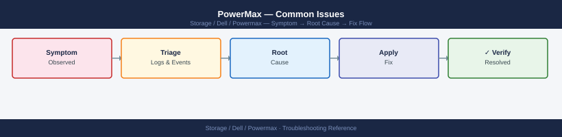

---
tags:
  - dell
  - troubleshooting
search:
  boost: 2
description: "Common Issues reference covering Common Issues, Incident Triage."
---
# PowerMax — Common Issues

<div class="kb-summary">
Common Issues reference covering Common Issues, Incident Triage.

*Applies to: PowerMax 2500 / 8500*
</div>


```d2
direction: down

symptom: Identify Symptom {shape: diamond}
diagnostic_flow: "Diagnostic Flow" {shape: rectangle}
common_issues: "Common Issues" {shape: rectangle}
incident_triage: "Incident Triage" {shape: rectangle}
verify_resolution: "Verify resolution" {shape: rectangle}
resolution: Resolve or Escalate {shape: oval}

symptom -> diagnostic_flow: investigate
symptom -> common_issues: investigate
symptom -> incident_triage: investigate
symptom -> verify_resolution: investigate
diagnostic_flow -> resolution
common_issues -> resolution
incident_triage -> resolution
verify_resolution -> resolution
```

## Diagnostic Flow

```d2
direction: right

D1: "D1" {shape: rectangle}
R1: "See Common Issues —\nDirector port I/O errors" {shape: rectangle}
R2: "See Common Issues —\nHost cannot see LUN" {shape: rectangle}
D2: "D2" {shape: rectangle}
R3: "See Common Issues —\nSRDF pair in Suspended state" {shape: rectangle}
R4: "See Incident Triage —\nSRDF link check" {shape: rectangle}
D3: "D3" {shape: rectangle}
R5: "See Common Issues —\nSnapVX session count at 256" {shape: rectangle}
R6: "See Incident Triage —\nEscalate to Dell TAC" {shape: rectangle}
D4: "D4" {shape: rectangle}
R7: "See Common Issues —\nPerformance SLO violations" {shape: rectangle}
R8: "See Incident Triage —\nPerformance path" {shape: rectangle}
D5: "D5" {shape: rectangle}
R9: "See Common Issues —\nHost cannot see LUN after MV creation" {shape: rectangle}
R10: "See Incident Triage —\nFabric zone check" {shape: rectangle}
S: "What is the symptom?" {shape: rectangle}
B1: "B1" {shape: rectangle}
B2: "B2" {shape: rectangle}
B3: "B3" {shape: rectangle}
B4: "B4" {shape: rectangle}
B5: "B5" {shape: rectangle}

D1 -> R1
D1 -> R2
D2 -> R3
D2 -> R4
D3 -> R5
D3 -> R6
D4 -> R7
D4 -> R8
D5 -> R9
D5 -> R10
```

---

## Before you begin

- **Access:** Storage admin credentials (cluster admin or equivalent)
- **Gather first:** recent error message text, event timestamps, and affected object names
- **Scope:** confirm whether the issue affects a single object, host, cluster, or site
- **Escalation:** open a vendor support ticket before running any destructive step
- **Logging:** document each command and output — required if escalation is needed

---

## Common Issues

| Symptom | Likely Cause | Action |
|---|---|---|
| SRDF pair in `R1 Updated` or `Transmit Idle` | WAN link failure, R2 array unreachable, or RDF director port error | `symrdf -sid <SID> -rdfg <group> query`; check RDF port state with `symcfg -sid <SID> show`; inspect WAN link and switch port between arrays |
| SRDF pair in `Suspended` state | Manual suspend or automatic suspend triggered by I/O error on R2 | Confirm cause in Unisphere alerts; verify R2 is in a consistent state; resume with `symrdf -sid <SID> -rdfg <group> resume` |
| SnapVX session count at 256 per device | Accumulated snapshots not being expired; backup software snap retention too long | `symsnap list -sid <SID> -sg <sg>` to find stale sessions; `symsnap -sid <SID> -sg <sg> -snap <name> terminate` to remove; review backup software retention policy |
| Thin device subscription warning | Thin pool consumed capacity approaching 80–90%; thin devices over-allocated | `symcfg -sid <SID> -pool <pool> show`; expand pool with additional thin devices; identify over-consuming SGs with `symsg list -sid <SID>` |
| Director port I/O errors / link resets | SAN fabric event, failed SFP, cable issue, or host HBA problem | `symcfg -sid <SID> show` for port error counters; check switch interface statistics; inspect HBA and cable at host end |
| Host cannot see LUN after masking view creation | Incorrect port group, initiator WWN mismatch, or zone not active on fabric | Verify masking view with `symmask -sid <SID> list logins`; confirm host WWN is in initiator group; check fabric zone is active and port is online |
| Unisphere GUI inaccessible | Unisphere service stopped, vApp out of resources, or TLS certificate expired | Check Unisphere vApp VM health; restart Unisphere via `service dell-unisphere restart`; renew TLS cert if expired |
| Performance SLO violations (response time >2 ms) | Pool tier imbalance, FAST VP not migrating data, or I/O load spike | Review FAST VP tier placement in Unisphere → Performance; run `symstat -sid <SID>`; check for runaway workloads in storage groups |

## Incident Triage

When a host reports I/O errors, latency, or a LUN is inaccessible, work through this sequence before escalating.

```d2
direction: right

SYMPTOM: "Host reports I/O error\nor LUN inaccessible" {shape: rectangle}
UNI_ALERT: "Unisphere alerts\nin last 30 min?" {shape: rectangle}
TRIAGE_ALERT: "Note component and severity\nProceed to relevant check below" {shape: rectangle}
DIR_CHK: "symcfg show\nAll directors healthy?" {shape: rectangle}
RAISE_P1: "Raise P1 Dell case\nCapture symcfg show\nCheck hardware LEDs" {shape: rectangle}
SRDF_CHK: "symrdf list\nSRDF state normal?" {shape: rectangle}
SRDF_FIX: "Check WAN link\nResume SRDF if safe\nMonitor resync" {shape: rectangle}
DRIVE_CHK: "sympd list -failed\nFailed drive?" {shape: rectangle}
DRIVE_FIX: "Check RAID parity\nCapture drive state\nRaise Dell hardware case" {shape: rectangle}
PATH_CHK: "powermt display dev=all\nDead paths on host?" {shape: rectangle}
PATH_FIX: "Check SAN fabric port\nCheck HBA / cable\nCheck port group config" {shape: rectangle}
PERF_CHK: "symstat -type r2\nLatency spike?" {shape: rectangle}
PERF_FIX: "Check cache WP%\nIdentify hot SGs\nReview FAST VP tier" {shape: rectangle}
MASK_CHK: "symmask list logins\nHost sees LUN in MV?" {shape: rectangle}
MASK_FIX: "Verify masking view\nCheck initiator WWN\nCheck fabric zone active" {shape: rectangle}
ESCALATE: "Collect diagnostics bundle\nOpen Dell TAC case\nP1 if production impacted" {shape: rectangle}

SYMPTOM -> UNI_ALERT
UNI_ALERT -> TRIAGE_ALERT
UNI_ALERT -> DIR_CHK
TRIAGE_ALERT -> DIR_CHK
DIR_CHK -> RAISE_P1
DIR_CHK -> SRDF_CHK
SRDF_CHK -> SRDF_FIX
SRDF_CHK -> DRIVE_CHK
DRIVE_CHK -> DRIVE_FIX
DRIVE_CHK -> PATH_CHK
PATH_CHK -> PATH_FIX
PATH_CHK -> PERF_CHK
PERF_CHK -> PERF_FIX
PERF_CHK -> MASK_CHK
MASK_CHK -> MASK_FIX
MASK_CHK -> ESCALATE
```

- [ ] Check Unisphere Dashboard immediately for any active alerts flagged in the last 30 minutes — note alert severity and affected component
- [ ] Run `symcfg -sid XXXX show` to confirm array directors and ports are all healthy; look for any director in a degraded or faulted state
- [ ] Check SRDF state: `symrdf list -sid XXXX` — an unexpected `Suspended` or `R1 Updated` state may indicate the cause of host impact
- [ ] Check for failed drives: `sympd list -sid XXXX -failed` — a drive failure can cause I/O latency during rebuild
- [ ] Check host multipath status from the affected host: `powermt display dev=all` — look for dead paths or asymmetric path counts
- [ ] Check Fibre Channel port errors in Unisphere → Hardware → Directors → Ports for CRC errors or login/logout counts
- [ ] Run `symstat -sid XXXX -type r2` to check real-time array I/O statistics for throughput and latency anomalies
- [ ] Review the event log: Unisphere → System → Audit Log and filter by time of the incident

| Question | Answer |
|---|---|
| Which hosts are affected and what is the LUN device ID? | |
| What is the current SRDF state for relevant RDF groups? | |
| Are there active Unisphere alerts at the time of the incident? | |
| What is the host multipath path count and state? | |
| Are there director or port fault indicators in Unisphere? | |

---

## Verify resolution

- Confirm the original symptom no longer occurs
- Check logs for any residual errors related to the issue
- Monitor for 10–15 minutes to confirm the fix is stable

---

## See also

- [Powermax — Diagnostics](../diagnostics/)
- [Powermax — Escalation](../escalation/)
- [Powermax — Health Checks](../../operations/health-checks/)
