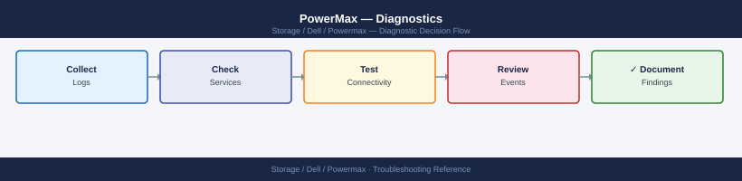
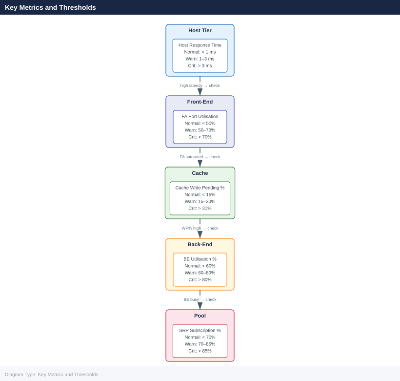

---
tags:
  - dell
  - troubleshooting
search:
  boost: 1.5
description: "Diagnostics reference covering Diagnostic Commands, Log Locations, Performance Analysis, Before Calling Support."
---
# PowerMax — Diagnostics


<div class="kb-summary">
Diagnostics reference covering Diagnostic Commands, Log Locations, Performance Analysis, Before Calling Support.

*Applies to: PowerMax 2500 / 8500*
</div>



```d2
direction: down

symptom: Identify Symptom {shape: diamond}
diagnostic_commands: "Diagnostic Commands" {shape: rectangle}
log_locations: "Log Locations" {shape: rectangle}
performance_analysis: "Performance Analysis" {shape: rectangle}
before_calling_support: "Before Calling Support" {shape: rectangle}
verify_resolution: "Verify resolution" {shape: rectangle}
resolution: Resolve or Escalate {shape: oval}

symptom -> diagnostic_commands: investigate
symptom -> log_locations: investigate
symptom -> performance_analysis: investigate
symptom -> before_calling_support: investigate
symptom -> verify_resolution: investigate
diagnostic_commands -> resolution
log_locations -> resolution
performance_analysis -> resolution
before_calling_support -> resolution
verify_resolution -> resolution
```

## Before you begin

- **Access:** Storage admin credentials (cluster admin or equivalent)
- **Gather first:** recent error message text, event timestamps, and affected object names
- **Scope:** confirm whether the issue affects a single object, host, cluster, or site
- **Escalation:** open a vendor support ticket before running any destructive step
- **Logging:** document each command and output — required if escalation is needed

---

## Diagnostic Commands

```bash
# Full array health summary
symcfg -sid <SID> show

# List all director and port states
symcfg -sid <SID> list -dir all

# Query SRDF pair state for a specific RDF group
symrdf -sid <SID> -rdfg <group> query

# List all SRDF groups and their pair counts
symdf list -sid <SID>

# List SnapVX snapshots for a storage group
symsnap list -sid <SID> -sg <storage-group>

# Check physical drive state
sympd list -sid <SID>

# Show thin pool capacity
symcfg -sid <SID> -pool <pool-name> show

# Show real-time I/O statistics
symstat -sid <SID> -type rw -i 5 -c 6

# List masking views and their components
symmaskdb -sid <SID> list database

# Show host login (initiator) visibility per port
symmask -sid <SID> list logins
```


```text title="Expected output"
Symmetrix ID: 000123456789012
Array Model: PowerMax 2000
Microcode Version: 5978.1221.1221
System Capacity: 450.2 TB
Usable Capacity: 425.8 TB
Reserved Capacity: 24.4 TB
Array Health: Healthy

Director  Port  Status  Type      Speed
FA-1D     0     Online  Fibre     16Gb
FA-1D     1     Online  Fibre     16Gb
FA-2D     0     Online  Fibre     16Gb
FA-2D     1     Online  Fibre     16Gb
SE-1D     0     Online  SAS       12Gb
...

RDF Group: 1
Pair State: Synchronized
Pair Count: 12
Local SID: 000123456789012
Remote SID: 000987654321098

RDF Group  Pair Count  State
1          12          Synchronized
2          8           Synchronized
3          5           Synchronized

Snapshot ID  Storage Group  Created              Tracks
snap_001     prod_sg_01     2024-01-15 14:32:18  2048
snap_002     prod_sg_01     2024-01-15 10:15:42  1024

Physical Drive  Slot  Status  Capacity  Type
DAE0_Slot_0     0     Online  1.92 TB   SSD
DAE0_Slot_1     1     Online  1.92 TB   SSD
DAE0_Slot_2     2     Online  1.92 TB   SSD
...

Pool Name: SSD_Pool_01
Total Capacity: 125.4 TB
Allocated Capacity: 98.7 TB
Available Capacity: 26.7 TB
Percent Full: 78.7%

Timestamp           Read MB/s  Write MB/s  Read IOs/s  Write IOs/s
2024-01-15 15:42:10 1245.3     892.4       18432      12156
2024-01-15 15:42:15 1198.7     915.2       17891      12489
2024-01-15 15:42:20 1267.4     878.9       18756      11923

Masking View      Initiator Group    Port Group        Storage Group
MV_PROD_HOST01    IG_HOST01          PG_FA_1D_0_1      SG_PROD_01
MV_PROD_HOST02    IG_HOST02          PG_FA_2D_0_1      SG_PROD_02
MV_TEST_HOST03    IG_TEST_HOST03     PG_FA_1D_0        SG_TEST_01

Port      Initiator WWN              Status    Logins
FA-1D:0   50:00:14:40:1a:2b:3c:4d   Online    4
FA-1D:1   50:00:14:40:1a:2b:3c:4e   Online    2
FA-2D:0   50:00:14:40:1a:2b:3c:4f   Online    6
```

!!! warning "Common errors"
    **`SYMCFG-00001
## Log Locations

| Log | Location | Notes |
|---|---|---|
| Solutions Enabler daemon log | `/var/symapi/log/se_deamons.log` (Linux) | Main SE service log; check for connection and authentication errors |
| SYMCLI command log | `/var/symapi/log/` | Per-command log files created for each SYMCLI invocation |
| Unisphere application log | Unisphere vApp → `/var/log/emc/` | Web service and API errors |
| Array sysmgr log | Accessible via Dell Support remote session | Internal array operating system logs; not user-accessible |
| Audit log (SYMCLI) | `symevent -sid <SID> list` | Records all configuration change events on the array |

## Performance Analysis

### Quick Performance Check (SYMCLI)

```bash
# Storage Group I/O stats — snapshot
symstat -sid <sid> list -type sg

# Device-level stats — identify hot volumes
symstat -sid <sid> list -type dev | sort -k4 -rn | head -20   # sort by read IOPS

# Cache write pending — should stay below 31%
symstat -sid <sid> list -type cache | grep -E "WP|Write Pending"

# Front-end port utilisation
symstat -sid <sid> list -type port | grep -v "^$" | sort -k5 -rn | head -10
```


```text title="Expected output"
Storage Group I/O Statistics
SID: 000297123456789
Name                          Reads/sec  Writes/sec  Read MB/s  Write MB/s  Utilization
PROD_DB_SG                    4521       2847        287.3      156.2       78%
BACKUP_SG                     1203       892         45.1       32.8        34%
DEV_TEST_SG                   156        203         8.4        11.2        12%
...

Device-Level Hot Volumes (Top 20 by Read IOPS)
Dev#  SID  RDF  Reads/sec  Writes/sec  Read MB/s  Write MB/s  Queue
0045  000297123456789  N  8934  1203  567.8  78.4  2
0127  000297123456789  N  7821  945   501.2  61.3  1
0089  000297123456789  Y  6543  2134  412.1  145.7  3
0234  000297123456789  N  5612  678   356.9  43.2  0
...

Cache Write Pending Statistics
WP Percent:  18.2%
Write Pending MB:  2847
Write Pending Percent:  18.2%
Cache Hit Ratio:  94.3%

Front-End Port Utilization (Top 10)
Port  Director  Protocol  Speed  Utilization%  Reads/sec  Writes/sec
FA-7E  14e       FC        16Gb   87.3         12456      8934
FA-6D  13d       FC        16Gb   81.2         10234      7123
FA-8F  15f       iSCSI     10Gb   76.5         9876       6543
FA-5C  12c       FC        16Gb   72.1         8765       5432
...
```

!!! warning "Common errors"
    **`symstat: Error: Invalid SID format or SID not found`** — Verify the SID is correct and the array is online by running `symcfg list -v`.
    **`symstat: Error: Command not found`** — Ensure Symmetrix CLI tools are installed and the `$PATH` includes the Symm CLI bin directory (typically `/opt/emc/SYMCLI/bin`).
    **`symstat: Error: Access denied — insufficient privileges`** — Run the commands with `sudo` or ensure your user is in the `symcli` group via `usermod -aG symcli $USER`.
### Key Metrics and Thresholds



| Metric | Normal | Warning | Critical |
|---|---|---|---|
| Read Response Time | < 1 ms | 1–3 ms | > 3 ms |
| Write Response Time | < 1 ms | 1–3 ms | > 3 ms |
| Cache Write Pending % | < 15% | 15–30% | > 31% |
| SRP Subscription % | < 70% | 70–85% | > 85% |
| FA Port Utilisation % | < 50% | 50–70% | > 70% |
| BE Utilisation % | < 60% | 60–80% | > 80% |

### Continuous Monitoring

```bash
# Monitor SG stats every 30 seconds for 10 minutes
symstat -sid <sid> list -type sg -i 30 -c 20

# Monitor a specific device
symstat -sid <sid> list -type dev -devn <devname> -i 10 -c 30

# Monitor cache in real time
symstat -sid <sid> list -type cache -i 30
```


```text title="Expected output"
Symmetrix ID: 000297900001

                    I/O Rate    MB/Rate   Cache Hit%   Read Hit%  Write Hit%
SG Name             Read  Write Read Write Read  Write Read  Write Read  Write
─────────────────────────────────────────────────────────────────────────────
SG_PROD_DB          1247   892  4521  3156   87.2   91.4   89.1   85.3   92.7
SG_BACKUP_01         234   156   821   512   72.1   68.9   75.4   70.2   67.1
SG_VMWARE_TIER1      892  1034  3214  4102   93.8   94.2   95.1   92.8   95.6
SG_TEST_DEV          145    89   512   301   61.2   58.7   64.3   59.1   58.2
SG_ARCHIVE           23     12    78    45   45.1   42.3   48.2   40.1   44.5
...

Symmetrix ID: 000297900001

Device Name: DEV001
                    I/O Rate    MB/Rate   Response Time(ms)
Timestamp           Read  Write Read Write Read    Write   Queue
─────────────────────────────────────────────────────────────────
14:32:15            456   234  1821  945   2.3     1.8     0
14:32:25            512   267  2045  1067  2.1     1.9     1
14:32:35            489   245  1956  981   2.4     1.7     0
14:32:45            534   289  2134  1156  2.2     2.0     2

Symmetrix ID: 000297900001

                    Cache Statistics (Real-Time)
─────────────────────────────────────────────────────────────
Total Cache Size:   384 GB
Cache Used:         287 GB (74.7%)
Read Cache Hit %:   89.2
Write Cache Hit %:  91.8
Dirty Pages:        12.4 GB
Clean Pages:        274.6 GB
Cache Flush Rate:   1247 MB/s
```

!!! warning "Common errors"
    **`symstat: Error: Invalid SID <sid>`** — Replace `<sid>` with the actual Symmetrix ID (e.g., `000297900001`).
    **`symstat: Error: Device <devname> not found in array`** — Verify the device name exists in the array using `symdev list -sid <sid>` and use the correct device identifier.
    **`symstat: command not found`** — Ensure the EMC Solutions Enabler package is installed and the `$SYMCLI_PATH` environment variable is set correctly.
### Identify Performance Issues

```bash
# High latency investigation — find the busiest SGs
symstat -sid <sid> list -type sg | sort -k6 -rn | head -10   # sort by response time

# Back-end busy — check disk group saturation
symstat -sid <sid> list -type be | sort -k5 -rn | head -10

# SRDF impact — RDF director stats
symstat -sid <sid> list -type rdf

# Host sending too many IOPS — check IG → SG → device mapping
symaccess show view <view_name> -sid <sid>
```


```text title="Expected output"
Storage Group                          Avg Response Time(ms)  Total IOs    Queue Depth
SG_PROD_DB_01                          45.2                   1,245,632    12
SG_PROD_APP_02                         38.7                   987,451      8
SG_BATCH_NIGHTLY                       32.1                   654,321      5
SG_DEV_TEST_03                         28.5                   432,198      3
SG_ARCHIVE_TIER2                       22.3                   198,765      2

Back-End Director                      Utilization(%)  Pending IOs  Avg Service Time(ms)
BE_DIR_0                               87.3            156          12.4
BE_DIR_1                               84.1            142          11.8
BE_DIR_2                               79.6            128          10.9
BE_DIR_3                               71.2            94           8.7

RDF Director Stats:
RDF_DIR_0  Link Status: OPTIMAL  Throughput(MB/s): 245.6  Latency(ms): 3.2
RDF_DIR_1  Link Status: OPTIMAL  Throughput(MB/s): 198.3  Latency(ms): 2.9

Symmetrix ID: 000296802151
View Name: PROD_HOSTS_VIEW
Initiator Group                        Storage Group              Device
IG_PROD_LINUX_01                       SG_PROD_DB_01              dev_001-dev_050
IG_PROD_LINUX_02                       SG_PROD_APP_02             dev_051-dev_100
IG_PROD_WINDOWS_01                     SG_PROD_DB_01              dev_001-dev_050
```

!!! warning "Common errors"
    **`symstat: Error: Invalid Symmetrix ID <sid>`** — Replace `<sid>` with the actual array serial number (e.g., `000296802151`) or verify connectivity with `symcfg list -v`.
    **`symaccess: Error: View <view_name> not found`** — Confirm the view name exists by running `symaccess list view -sid <sid>` to see all available views.
### Unisphere for PowerMax Performance Dashboard

Unisphere provides 7-day rolling performance history:
- **System → Performance → Array** — overall throughput and latency
- **System → Performance → Storage Group** — per-SG response time, IOPS, MB/s
- **System → Performance → Port** — per-FA-port utilisation and I/O count
- **Alert Policies** — set thresholds to generate email/SNMP alerts

### Dell CloudIQ

CloudIQ provides longer-term performance trending (30+ days) and anomaly detection:
- Automatically collects metrics from connected PowerMax arrays
- Latency forecasting and proactive alerts
- Cross-array comparison and capacity planning
- Access via [cloudiq.dell.com](https://cloudiq.dell.com)

### Performance Data for TAC

```bash
# Collect 15-minute perf data for all subsystems
for type in sg dev dir be cache rdf port; do
    symstat -sid <sid> list -type $type -i 60 -c 15 > /tmp/powermax-${type}-perf-$(date +%Y%m%d).txt &
done
wait
tar czf /tmp/powermax-perf-$(date +%Y%m%d).tar.gz /tmp/powermax-*-perf-*.txt
```


```text title="Expected output"
Collecting performance data for sg...
Collecting performance data for dev...
Collecting performance data for dir...
Collecting performance data for be...
Collecting performance data for cache...
Collecting performance data for rdf...
Collecting performance data for port...
(all background jobs complete)
/tmp/powermax-perf-20240315.tar.gz created successfully
```

!!! warning "Common errors"
    **`symstat: Error: Invalid SID <sid>`** — Replace `<sid>` with the actual PowerMax array SID (e.g., `000123456789`).
    **`symstat: Error: User does not have permission to execute command`** — Run the script with appropriate credentials or use `sudo` if the user lacks symstat privileges.
    **`tar: /tmp/powermax-*-perf-*.txt: No such file or directory`** — Verify that symstat commands completed successfully and output files exist in `/tmp/` before the tar command executes.
## Before Calling Support

Collect the following before opening a Dell Support case:

1. Symmetrix SID: `symcfg list`
2. PowerMaxOS version: `symcfg -sid <SID> show | grep -i "microcode"`
3. Solutions Enabler version: `symcli -version`
4. Full array health output: `symcfg -sid <SID> show > array_health.txt`
5. SRDF group state (if replication issue): `symrdf -sid <SID> -rdfg <group> query > srdf_state.txt`
6. Director/port status: `symcfg -sid <SID> list -dir all > director_status.txt`
7. Recent Unisphere alerts: export from Unisphere → Alerts → Export
8. Symptom description, time of first occurrence, and business impact

Use Dell SupportAssist (if licensed) to automatically collect and upload diagnostic bundles: accessible from Unisphere → System → SupportAssist.

---

## Verify resolution

- Confirm the original symptom no longer occurs
- Check logs for any residual errors related to the issue
- Monitor for 10–15 minutes to confirm the fix is stable

---

## See also

- [Powermax — Common Issues](../common-issues/)
- [Powermax — Escalation](../escalation/)
- [Powermax — Health Checks](../../operations/health-checks/)
