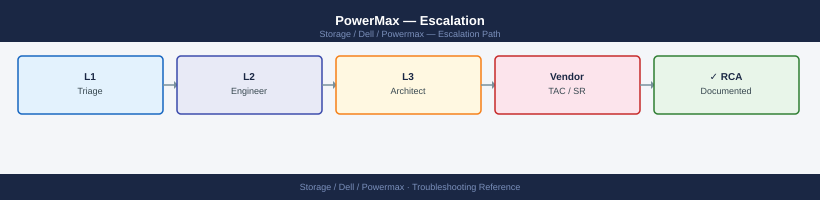
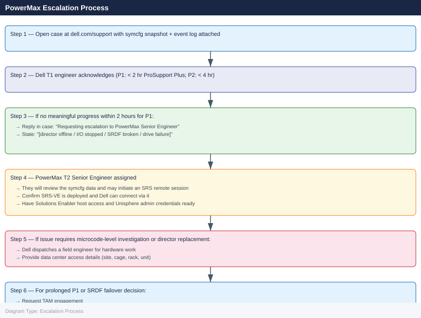

---
tags:
  - dell
  - troubleshooting
search:
  boost: 1.5
description: "How to escalate Dell PowerMax issues to Dell Technologies support: what data to collect, how to run symcfg diagnostics and collect the Solutions Enabler..."
---
# PowerMax — Escalation

<div class="kb-summary">
How to escalate Dell PowerMax issues to Dell Technologies support: what data to collect, how to run symcfg diagnostics and collect the Solutions Enabler bundle, step-by-step case creation on dell.com/support, and the escalation path when progress stalls.

*Applies to: PowerMax 2500 / 8500 running PowerMaxOS 10.x*
</div>



---

```d2
direction: down

symptom: Identify Symptom {shape: diamond}
preescalation_selfcheck: "Pre-Escalation Self-Check" {shape: rectangle}
stepbystep_data_collection: "Step-by-Step Data Collection" {shape: rectangle}
how_to_open_the_case_on_dellcomsuppo: "How to Open the Case on dell.com/support" {shape: rectangle}
escalation_path: "Escalation Path" {shape: rectangle}
what_not_to_do: "What NOT to Do" {shape: rectangle}
useful_commands_for_case_updates: "Useful Commands for Case Updates" {shape: rectangle}
resolution: Resolve or Escalate {shape: oval}

symptom -> preescalation_selfcheck: investigate
symptom -> stepbystep_data_collection: investigate
symptom -> how_to_open_the_case_on_dellcomsuppo: investigate
symptom -> escalation_path: investigate
symptom -> what_not_to_do: investigate
symptom -> useful_commands_for_case_updates: investigate
preescalation_selfcheck -> resolution
stepbystep_data_collection -> resolution
how_to_open_the_case_on_dellcomsuppo -> resolution
escalation_path -> resolution
what_not_to_do -> resolution
useful_commands_for_case_updates -> resolution
```

## Before you begin

- **Access required:** Solutions Enabler (symcli) on a host connected to the PowerMax; Unisphere access (admin credentials); Dell support account at dell.com/support linked to the array serial number; SRS-VE deployed and registered for remote Dell access
- **SupportAssist auto-cases:** PowerMax monitors itself via SupportAssist (Unisphere → Connectivity → SupportAssist) and can auto-open Dell cases for hardware faults. Check dell.com/support → My Cases before creating a duplicate
- **Do NOT failover SRDF** (symrdf failover or symrdf establish in the wrong direction) without Dell direction — an incorrect failover breaks the replication relationship and may require a full resync, causing extended RPO exposure
- **Do NOT use --force flags** on symcli commands without Dell direction — force flags on replication or storage group commands bypass safety checks and can cause data corruption

---

## Pre-Escalation Self-Check

Run these before opening the case.

| Check | Command | Expected result |
|---|---|---|
| Array serial (SID) | `symcfg list` | Note the 12-digit Symmetrix ID |
| Array health | `symcfg -sid <SID> show` | No directors in OFFLINE state |
| Director status | `symcfg -sid <SID> list -dir all` | All directors Online |
| Drive health | `sympd list -sid <SID>` | No drives in FAILED or DEAD state |
| SRDF state | `symdf list -sid <SID>` | All groups in SYNCHRONIZED or CONSISTENT state |
| Active alerts | Unisphere → Alerts | No critical (red) alerts |
| SupportAssist | Unisphere → Connectivity → SupportAssist | Enabled; last call-home successful |
| Unisphere accessibility | Browse to `https://<unisphere-ip>:8443/univmax` | Login page loads |

---

## Step-by-Step Data Collection

### 1. Get the array serial number and microcode version

```bash
# On a host with Solutions Enabler installed (symcli in PATH)

# List all registered arrays — note the 12-digit Symmetrix ID (SID)
symcfg list

# Full array health and microcode version
symcfg -sid <SID> show > /tmp/pmx-health-$(date +%Y%m%d%H%M).txt

# Solutions Enabler version
symcli -version >> /tmp/pmx-health-$(date +%Y%m%d%H%M).txt
```


```text title="Expected output"
Symmetrix ID: 000296900001
Symmetrix ID: 000296900002
Symmetrix ID: 000296900003

Solutions Enabler Version: V9.2.1.0
(no output — command completes silently)
Solutions Enabler Version: V9.2.1.0
Solutions Enabler Release: 9.2.1
Solutions Enabler Build: 123.456.789
```

!!! warning "Common errors"
    | Error | Fix |
    |---|---|
    | `symcfg: Command not found` | Verify Solutions Enabler is installed and /opt/emc/SYMCLI/bin is in your PATH, or source the installation profile. |
    | `SYMAPI_DB_CONNECT_ERROR: Cannot connect to the Symmetrix` | Ensure the Symmetrix daemon (symapi) is running on the host with `sudo /opt/emc/SYMAPI/bin/symapi_control start` and network connectivity to the array is available. |
    | `Permission denied` | Run the command with `sudo` or ensure your user is in the `symcli` or `root` group for Solutions Enabler access. |
### 2. Capture director and port status

```bash
# All directors with their health state
symcfg -sid <SID> list -dir all > /tmp/pmx-directors-$(date +%Y%m%d).txt

# Front-end director port status (host-facing)
symcfg -sid <SID> list -fa all >> /tmp/pmx-directors-$(date +%Y%m%d).txt

# Back-end director port status (drive-facing)
symcfg -sid <SID> list -da all >> /tmp/pmx-directors-$(date +%Y%m%d).txt
```


```text title="Expected output"
Director Information for Array 000123456789
================================================================================

                              Director Health Summary
Director ID    Type      Status      Cache    Temp    Power    Fan
----------- ----------- --------- ---------- ------- -------- --------
FA-1D        Front-End   Online      OK       OK      OK       OK
FA-2D        Front-End   Online      OK       OK      OK       OK
FA-3D        Front-End   Online      OK       OK      OK       OK
DA-1D        Back-End    Online      OK       OK      OK       OK
DA-2D        Back-End    Online      OK       OK      OK       OK
...

Front-End Director Port Status
================================================================================
Director    Port    Status    Link    Speed    Logins    MB/s
FA-1D       0       Online    Yes     16Gb     847       1245.3
FA-1D       1       Online    Yes     16Gb     892       1389.7
FA-2D       0       Online    Yes     16Gb     756       998.4
FA-2D       1       Online    Yes     16Gb     801       1156.2
...

Back-End Director Port Status
================================================================================
Director    Port    Status    Link    Speed    Logins    MB/s
DA-1D       0       Online    Yes     12Gb     1024      2847.5
DA-1D       1       Online    Yes     12Gb     1031      2923.1
DA-2D       0       Online    Yes     12Gb     998       2756.3
DA-2D       1       Online    Yes     12Gb     1009      2891.4
...
```

!!! warning "Common errors"
    | Error | Fix |
    |---|---|
    | `SYMAPI Error: Cannot connect to the Symmetrix array <SID>` | Verify the SID is correct and the Symmetrix Management Console (SMC) service is running on the management station. |
    | `Permission denied` | Run the command with appropriate privileges (use `sudo` or ensure your user is in the `symuser` group). |
    | `symcfg: command not found` | Install the EMC Solutions Enabler package or add its bin directory to your PATH environment variable. |
### 3. Capture drive health

```bash
# All physical drives and their state
sympd list -sid <SID> > /tmp/pmx-drives-$(date +%Y%m%d).txt

# Drives in FAILED or DEAD state only
sympd list -sid <SID> | grep -E "FAILED|DEAD|REPLACING" >> /tmp/pmx-drives-$(date +%Y%m%d).txt
```


```text title="Expected output"
Symmetrix ID: 000297900001

                                          Devic Port Slot Tray Dir Phys
                                          e ID  Num  Num  Num  Pos State
                                          --------- --- ---- --- --- ------
                                          0     0    0    0    0   Ready
                                          1     0    0    0    1   Ready
                                          2     0    0    0    2   Ready
                                          3     0    0    0    3   Ready
                                          4     0    0    0    4   Ready
                                          5     0    0    0    5   FAILED
                                          6     0    0    0    6   Ready
                                          7     0    0    0    7   DEAD
...

FAILED|DEAD|REPLACING state drives appended to /tmp/pmx-drives-20240115.txt
```

!!! warning "Common errors"
    | Error | Fix |
    |---|---|
    | `sympd: Command not found` | Ensure the Symmetrix CLI tools are installed and the PATH includes the bin directory (typically `/opt/emc/SYMCLI/bin`). |
    | `Permission denied: /tmp/pmx-drives-20240115.txt` | Check that the user running the command has write permissions to `/tmp` or redirect output to a directory with appropriate permissions. |
    | `Symmetrix ID: <SID> -- Could not be found` | Verify the SID value is correct and the array is reachable via the Symmetrix management network. |
### 4. Capture SRDF replication state (if SRDF is in use)

```bash
# All SRDF groups and their state
symdf list -sid <SID> > /tmp/pmx-srdf-$(date +%Y%m%d).txt

# Detailed state of a specific SRDF group
symrdf -sid <SID> -rdfg <rdfg-number> query >> /tmp/pmx-srdf-$(date +%Y%m%d).txt

# RDF director status
symcfg -sid <SID> list -ra all >> /tmp/pmx-srdf-$(date +%Y%m%d).txt
```


```text title="Expected output"
Symmetrix ID: 000123456789ABC
                                SRDF/Metro Groups
                                -----------------
Group #  Type  Local  Remote  State  Pair State  Link State
1        Metro R1     R2      Ready  Synchronized  OK
2        Metro R1     R2      Ready  Synchronized  OK
3        Metro R1     R2      Ready  Synchronized  OK

RDF Director Status Report
Director  Port  Status  Link State  Frames In  Frames Out
RF-1a     0     Online  OK          1245678    1245612
RF-1b     0     Online  OK          1245689    1245645
RF-2a     0     Online  OK          1245701    1245698
RF-2b     0     Online  OK          1245712    1245709
...
Report written to: /tmp/pmx-srdf-20240115.txt
```

!!! warning "Common errors"
    | Error | Fix |
    |---|---|
    | `symdf: Command not found` | Ensure Symmetrix CLI tools are installed and the `$PATH` includes the Symmetrix bin directory (typically `/opt/emc/SYMCLI/bin`). |
    | `Symmetrix ID <SID> does not exist in the configuration` | Verify the SID value matches an array in your Symmetrix configuration file (`/var/symapi/config/netcnx.cfg`). |
    | `Permission denied: /tmp/pmx-srdf-20240115.txt` | Run the commands with appropriate permissions or redirect output to a directory where the user has write access. |
### 5. Collect the event log

```bash
# Last 500 array events (faults, alerts, configuration changes)
symevent -sid <SID> list -last 500 > /tmp/pmx-events-$(date +%Y%m%d).txt

# Filter for alerts and faults
symevent -sid <SID> list -last 500 | grep -iE "FAULT|ALERT|FAILED|CRITICAL" >> /tmp/pmx-events-$(date +%Y%m%d).txt
```


```text title="Expected output"
Event ID,Timestamp,Severity,Message,Component
12847,2024-01-15 14:32:18,CRITICAL,Director 4a link down,FA-4a
12846,2024-01-15 14:31:52,ALERT,Cache hit ratio below threshold,Cache
12845,2024-01-15 14:15:03,FAULT,SSD 45 predictive failure,DAE-3
12844,2024-01-15 13:47:21,ALERT,Replication lag detected,SRDF
12843,2024-01-15 13:22:09,CRITICAL,Power supply 2 failed,PSU-2
12842,2024-01-15 12:58:44,ALERT,Temperature threshold exceeded,Cooling
12841,2024-01-15 11:19:37,FAULT,Port 3e offline,FA-3e
```

!!! warning "Common errors"
    | Error | Fix |
    |---|---|
    | `symevent: command not found` | Install Unisphere CLI tools or ensure the Symmetrix CLI package is in your PATH. |
    | `Error: Invalid SID <SID>` | Replace `<SID>` with the actual 6-digit array serial number (e.g., `000123456789`). |
    | `Permission denied` | Run the command with appropriate user privileges or use `sudo` if required by your environment. |
### 6. Write the timeline

```text
Array: PowerMax 8500 SID: 000XXXXXXXXXX
PowerMaxOS: 10.1.0.2
Solutions Enabler: 10.1.0.18
Unisphere: 10.1.0.2
Hosts connected: 24 (FC multipath via 4 FE directors)
SRDF: 3 RDF groups to DR site (async, RPO 30s)
Issue first observed: 2026-06-15 08:00 UTC
Last confirmed healthy: 2026-06-15 06:00 UTC
Changes in 24h before the issue:
  - 06:00: Planned drive capacity expansion: 4 x 7.68 TB NVMe drives added to DA-2C
  - 08:00: Unisphere alert: "Director FA-3D OFFLINE"
  - 08:05: 6 host paths to FA-3D ports went dead; multipath reduced from 4 to 2 paths per LUN
SupportAssist: Auto-case created (Dell case XXXXXXXX) at 08:01
Steps already taken:
  - Did NOT failover SRDF
  - Did NOT modify storage groups or masking views
  - symcfg -sid list -dir all: FA-3D shows OFFLINE; all other directors Online
Blast radius: 6 hosts have reduced path count; I/O is continuing via remaining paths; no outage yet
```

---

## How to Open the Case on dell.com/support

1. Go to **dell.com/support** and sign in with your Dell account.

2. Click **My Cases** → **Create New Case**.

3. Under **Product**, enter the array serial number. Dell identifies the PowerMax by the 12-digit Symmetrix ID.

4. Under **Severity**, select:
   - **Severity 1 — Production Down**: I/O has stopped to production hosts; a director is offline and no redundant path exists; SRDF has broken and DR site is out of sync with no valid recovery point; data loss is imminent; no workaround
   - **Severity 2 — Degraded**: A director is offline but multipath is maintaining I/O via remaining paths; SRDF is suspended but data is consistent; drive rebuild is in progress after a failure; workaround is partial
   - **Severity 3 — Non-Critical**: A drive is in a REPLACING state but RAID is protecting data; a specific Unisphere feature is broken; workaround exists
   - **Severity 4 — General**: How-to, capacity planning, upgrade planning, SRDF configuration review

5. In the **Summary** field: symptom + scope. Example: `PowerMax 8500 SID 000XXXXXXXXXX — FA-3D director offline since 08:00 UTC, 6 hosts reduced to 2 paths per LUN`.

6. In the **Description** field, paste:
   - Array SID and PowerMaxOS version from Step 1
   - Director status output from Step 2
   - SRDF state from Step 4 (if relevant)
   - The last 20 lines of the event log from Step 5
   - The timeline from Step 6
   - Any SupportAssist auto-case number if one was created

7. Under **Attachments**, upload:
   - The `pmx-health-*.txt` file from Step 1
   - The `pmx-directors-*.txt` file from Step 2
   - The `pmx-drives-*.txt` file from Step 3
   - The `pmx-events-*.txt` file from Step 5

8. Click **Submit**. You receive a case number immediately.

9. **Severity 1 only:** call Dell support after submission:
    - North America: +1 800 945 3355 (24×7 for production-down)
    - Reference the case number and state "Severity 1 — PowerMax director offline, host I/O at risk" at the start of the call.

---

## Escalation Path



---

## What NOT to Do

| Do NOT do this | Why | What to do instead |
|---|---|---|
| Failover SRDF without Dell approval | An incorrect failover breaks the replication relationship; resync from DR to primary can take hours and extends RPO exposure | Let Dell assess the SRDF state and confirm the failover direction before any symrdf failover command |
| Modify storage groups or masking views during the incident | Changes to host access during an I/O issue can cause hosts to lose access to their remaining paths | Freeze all storage group and masking view changes until Dell confirms it is safe to proceed |
| Use symcli --force flags without Dell direction | Force flags bypass safety checks and can cause data corruption or invalid SRDF state changes | Only use --force when Dell explicitly instructs and provides the exact command |
| Start a microcode upgrade during an active incident | Microcode upgrades on an array with a faulted director can make the array state unrecoverable | Wait until the director fault is resolved and the array is fully healthy before any upgrade |
| Disable SupportAssist during the case | SupportAssist provides Dell with real-time array telemetry that speeds diagnosis | Keep SupportAssist enabled; the auto-collected data is used by the T2 engineer |
| Remove or replace drives without Dell confirmation | Removing the wrong drive in a RAID-protected group can cause a second fault and potential data loss | Dell will identify the correct replacement drive and dispatch it; only replace after Dell confirms |

---

## Useful Commands for Case Updates

```bash
# Run on a host with Solutions Enabler (symcli) — paste into every case update

# Array health (quick summary)
symcfg -sid <SID> show | grep -E "Microcode|Status|Cache"

# Director states (look for OFFLINE)
symcfg -sid <SID> list -dir all | grep -E "ONLINE|OFFLINE"

# Drive states (look for FAILED/DEAD)
sympd list -sid <SID> | grep -v "Ready" | head -30

# SRDF state (look for Suspended or Invalid)
symdf list -sid <SID>

# Recent events (last 20)
symevent -sid <SID> list -last 20
```


```text title="Expected output"
Microcode Version: T10.1.0.0.4.030
Status: Normal
Cache: 4096 MB (Write-back enabled)

Director 0_0: ONLINE
Director 0_1: ONLINE
Director 1_0: ONLINE
Director 1_1: ONLINE
Director 2_0: ONLINE
Director 2_1: ONLINE

Disk 0_0_0: Failed
Disk 0_1_5: Dead
Disk 1_2_3: Rebuilding

R2 (Local): Synchronized
R1 (Remote): Synchronized

2024-01-15 14:32:18 Array 000123456789 Director 0_0 Link Down
2024-01-15 14:28:45 Array 000123456789 Disk 0_0_0 Predictive Failure
2024-01-15 14:15:22 Array 000123456789 Cache Battery Low
2024-01-15 13:52:10 Array 000123456789 Director 1_1 Recovered
2024-01-15 13:45:33 Array 000123456789 Disk 0_1_5 Failed
```

!!! warning "Common errors"
    | Error | Fix |
    |---|---|
    | `symcfg: Error: Invalid SID <SID>` | Replace `<SID>` with the actual array serial ID (e.g., `000123456789`). |
    | `symcfg: command not found` | Install or source Solutions Enabler (symcli) on the host, or verify the installation path is in $PATH. |
    | `symcfg: Error: Cannot connect to array` | Verify network connectivity to the array management interface and confirm the host has proper SNMP/management credentials configured. |
---

## Support SLA Reference

| Tier | Severity | Definition | Initial Response SLA |
|---|---|---|---|
| ProSupport Plus | P1 — Production Down | I/O stopped; director offline; SRDF broken; data at risk | < 2 hours (24×7) |
| ProSupport Plus | P2 — Degraded | Director offline with multipath protecting I/O; SRDF suspended; drive rebuilding | < 4 hours (24×7) |
| ProSupport Plus | P3 — Non-Critical | Drive in REPLACING (protected); specific feature broken; workaround exists | Next business day |
| ProSupport Plus | P4 — General | How-to, planning, SRDF configuration review | Next business day |
| ProSupport | P1 | As above | < 4 hours (24×7) |

---

## See also

- [PowerMax — Diagnostics](../diagnostics/)
- [PowerMax — Common Issues](../common-issues/)

---

## Verify resolution

- Run `symcfg -sid <SID> show` and confirm no directors are in OFFLINE state
- Run `symcfg -sid <SID> list -dir all` and confirm all FE, BE, and RDF directors are Online
- Run `sympd list -sid <SID>` and confirm no drives are in FAILED or DEAD state
- Run `symdf list -sid <SID>` and confirm all SRDF groups are in SYNCHRONIZED or CONSISTENT state
- Verify on affected hosts that all expected storage paths are active (multipath tool, `mpath`, or `esxcli storage nmp path list`)
- Confirm host I/O is healthy by checking application logs and storage performance metrics in Unisphere
- Monitor Unisphere Alerts for 15 minutes to confirm no new critical alerts appear
