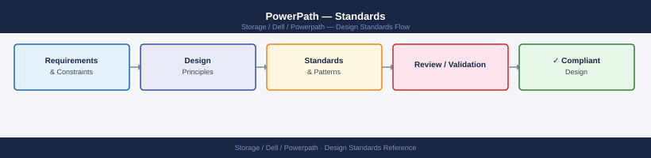

---
tags:
  - architecture
  - dell
description: "Standards reference covering Naming Conventions, Sizing and Path Count Model, Build and Deployment Baseline, Configuration Checklist."
---
# PowerPath — Standards

Standards reference covering Naming Conventions, Sizing and Path Count Model, Build and Deployment Baseline, Configuration Checklist.

*Applies to: PowerPath*

## Naming Conventions

| Object | Convention | Example |
|---|---|---|
| PowerPath pseudo device (Linux) | Auto-assigned by PowerPath: `/dev/emcpower<letter>` | `/dev/emcpowera`, `/dev/emcpowerb` |
| PowerPath pseudo device (Windows) | Appears as a standard disk in Disk Management; label by LUN purpose | `DATA01`, `LOG01` |
| Path policy alias | Reference policy by name in documentation: `CLAROpt`, `RoundRobin`, `BasicFailover` | `CLAROpt` |
| Baseline file | `<hostname>-powermt-baseline-<YYYY-MM-DD>.txt` | `lon01-db01-powermt-baseline-2025-01-15.txt` |
| License registration key file | `powerpath-<hostname>-<YYYY>.reg` | `powerpath-lon01-db01-2025.reg` |

## Sizing and Path Count Model

PowerPath does not consume significant CPU or memory — it is a kernel module. The key sizing consideration is path count per host:

| Parameter | Guideline |
|---|---|
| Minimum paths per LUN | 2 (one per fabric / HBA) for redundancy |
| Recommended paths per LUN | 4 (two fabrics × two HBA ports per fabric) |
| Maximum paths per LUN | 32 (PowerPath supports up to 32 paths per pseudo device) |
| Baseline documentation | Record expected path count per device per host; compare after every fabric change |

A host with 2 dual-port HBAs connected to 2 storage ports per fabric typically has 4 paths per LUN. Confirm the expected count matches the array LUN masking configuration.

## Build and Deployment Baseline

- Verify OS and kernel version against the Dell PowerPath support matrix before installation; do not install an unsupported combination
- Install PowerPath before connecting additional HBA paths — installing with all paths present avoids a `powermt config` re-run
- Use the CLAROpt policy for all Dell/EMC arrays; set and persist immediately after installation: `powermt set policy=CLAROpt class=all && powermt save`
- Disable DM-Multipath (Linux `multipathd`) for all devices that will be managed by PowerPath — running both on the same device causes I/O corruption
- On Linux, add a `blacklist` entry in `/etc/multipath.conf` for all Dell/EMC array WWIDs to prevent DM-Multipath from claiming those devices
- Run `powermt check_registration` immediately after installation to confirm the license is valid
- Capture and store the baseline path count: `powermt display dev=all > <hostname>-powermt-baseline-<date>.txt`
- Confirm `powermt save` is run after all initial configuration; verify the configuration persists after a test reboot

## Configuration Checklist

- [ ] Dell PowerPath support matrix confirmed for OS version and kernel version
- [ ] DM-Multipath blacklisted for all Dell/EMC array devices (Linux only)
- [ ] PowerPath installed and `powermt version` returns the expected version
- [ ] License applied and `powermt check_registration` shows valid registration
- [ ] `powermt config` run after installation; all expected pseudo devices visible
- [ ] Load balancing policy set to CLAROpt: `powermt display options` confirms `policy=co`
- [ ] `powermt save` run to persist configuration
- [ ] Baseline path count per device captured and stored in the runbook
- [ ] All paths show `alive` in `powermt display dev=all`
- [ ] `powermt display ports class=all` shows all HBA ports `alive`
- [ ] Post-reboot validation: reboot the host and confirm path count and policy are intact
- [ ] Monitoring configured: script or tool alerting on `dead` or `unlic` paths

---

## See also

- [Powerpath — How It Works](../how-it-works/)
- [Powerpath — Integrations](../integrations/)
