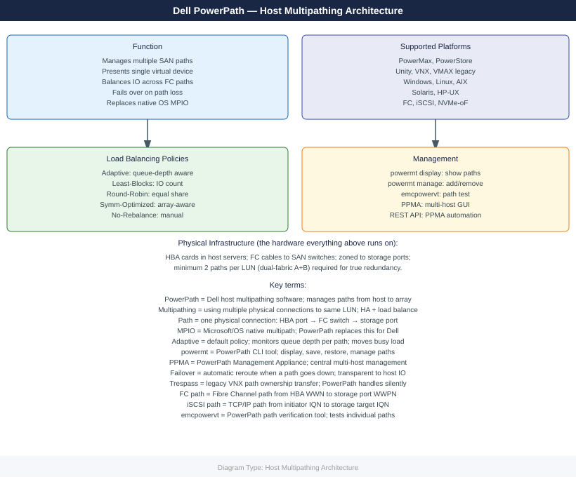
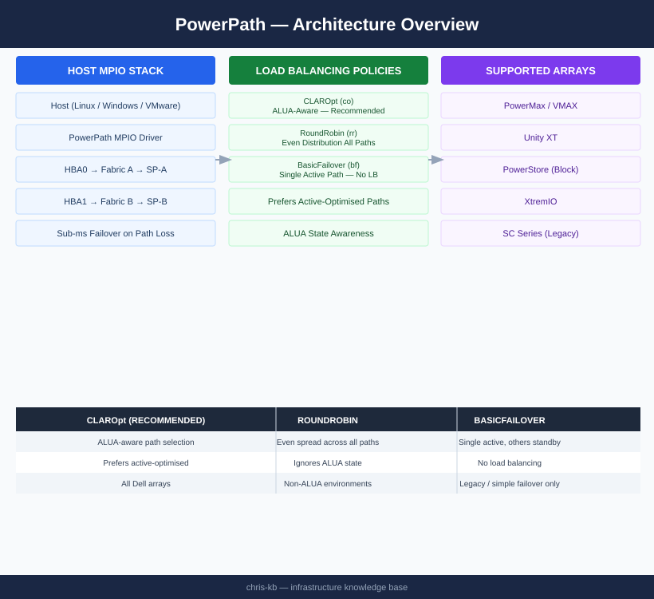

---
tags:
  - architecture
  - dell
description: "Host-side multipath I/O driver for Dell/EMC arrays. Intercepts block I/O and distributes it across all available HBA paths with ALUA-aware load balancing..."
---
# PowerPath — Architecture

<div class="kb-summary">
Host-side multipath I/O driver for Dell/EMC arrays. Intercepts block I/O and distributes it across all available HBA paths with ALUA-aware load balancing (CLAROpt policy) and automatic sub-millisecond failover on path loss.

*Applies to: PowerPath*
</div>



```d2
direction: right

HOST: "Host — Linux / Windows / VMware" {shape: rectangle}
PP: "PowerPath\n(MPIO driver" {shape: rectangle}
P1: "HBA0 → Fabric A → SP-A" {shape: rectangle}
P2: "HBA0 → Fabric A → SP-B" {shape: rectangle}
P3: "HBA1 → Fabric B → SP-A" {shape: rectangle}
P4: "HBA1 → Fabric B → SP-B" {shape: rectangle}
ARRAY: "Storage Array\nPowerMax / Unity" {shape: rectangle}

HOST -> PP
PP -> P1
PP -> P2
PP -> P3
PP -> P4
P1 -> P2
P2 -> P3
P3 -> P4
P4 -> ARRAY
```


<div class="kb-grid kb-grid-3">
<a class="kb-card" href="how-it-works/"><strong>How It Works</strong><span>How it works, integrations, and design standards.</span></a>
<a class="kb-card" href="integrations/"><strong>Integrations</strong><span>Integration with PowerMax, Unity, and host OS multipath frameworks.</span></a>
<a class="kb-card" href="design-standards/"><strong>Design Standards</strong><span>Path count requirements, CLAROpt policy standards, and installation best practices.</span></a>
</div>

## Load-Balancing Policies

| Policy | Code | Description |
|---|---|---|
| CLAROpt | `co` | ALUA-aware; prefers active-optimised paths — recommended for all Dell arrays |
| RoundRobin | `rr` | Even distribution across all paths regardless of ALUA state |
| BasicFailover | `bf` | Single active path; failover only — no load balancing |

## Host-Side MPIO Stack

