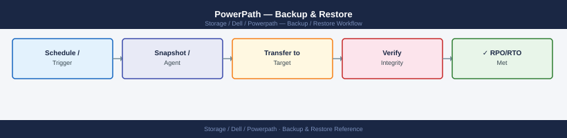
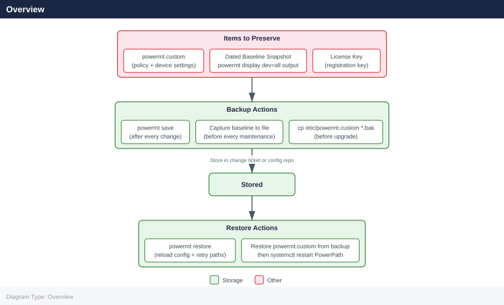

---
tags:
  - dell
  - operations
description: "Backup & Restore reference covering Overview, Configuration File Location, Configuration Backup, Configuration Restore, Post-Restore Validation and 3 more..."
---
# PowerPath — Backup & Restore

<div class="kb-summary">
Backup & Restore reference covering Overview, Configuration File Location, Configuration Backup, Configuration Restore, Post-Restore Validation and 3 more sections.

*Applies to: PowerPath*
</div>


## Before you begin

- **Access:** Storage admin credentials (cluster admin or equivalent)
- **Timing:** safe to run during business hours unless a step is marked ⚠ (causes interruption)
- **Dependencies:** no active upgrades or migrations on the same infrastructure
- **Logging:** capture command output — paste into the change record on completion

---

## Overview



PowerPath does not store data — it manages the path layer between host and storage array. "Backup" in the PowerPath context means preserving three things:

1. **Active configuration** — the policies, device registrations, and options written to disk by `powermt save`
2. **Baseline state snapshots** — dated text captures of `powermt display dev=all` output used to validate path count after changes
3. **License registration** — the registration key file that licenses PowerPath on the host

Losing PowerPath configuration after a reboot is the most common operational failure. The root cause is always the same: `powermt save` was not run after the last configuration change.

---

## Configuration File Location

PowerPath persists its configuration to a file on disk. The location depends on the platform:

| Platform | Configuration File |
|---|---|
| Linux | `/etc/powermt.custom` |
| Windows | `C:\Program Files\EMC\PowerPath\powermt.custom` |
| AIX | `/etc/powermt.custom` |
| HP-UX | `/etc/powermt.custom` |
| Solaris | `/etc/powermt.custom` |

This file is written by `powermt save` and read by the PowerPath daemon on startup. If this file does not exist or contains stale data, PowerPath applies default settings (which may not include the correct load balancing policy).

---

## Configuration Backup

### Save Live Configuration to Disk

```bash
# Save current PowerPath configuration to the powermt.custom file
powermt save

# Force overwrite if prompted (some versions prompt for confirmation)
powermt save force
```


```text title="Expected output"
PowerPath configuration saved successfully to /etc/powerpath/powermt.custom
Saved 12 device entries and 4 path group configurations.

PowerPath configuration saved successfully to /etc/powerpath/powermt.custom
Saved 12 device entries and 4 path group configurations.
```

!!! warning "Common errors"
    **`powermt: command not found`** — Ensure PowerPath is installed and the powermt binary is in your PATH, or use the full path `/opt/emc/powerpath/bin/powermt`.
    **`powermt save: Permission denied`** — Run the command with sudo or as root, since PowerPath configuration changes require elevated privileges.
    **`powermt save: Configuration file locked by another process`** — Wait for any running PowerPath operations to complete, or check for stale lock files in `/var/lock/powerpath/` and remove them if safe.
Run `powermt save` after every configuration change. This includes:
- After changing the load balancing policy (`powermt set policy=...`)
- After running `powermt config` to discover new devices
- After running `powermt remove` to clean up stale devices
- Before any OS upgrade, kernel update, or PowerPath upgrade
- Before any SAN fabric maintenance that will change path count

### Capture a Dated Baseline Snapshot

The baseline snapshot is a plain-text record of the full path state at a known-good point in time. Store this in the change record, runbook, or a shared team directory.

```bash
# Capture full path state and policy to a dated file
HOSTNAME=$(hostname -s)
DATE=$(date +%Y-%m-%d)
OUTFILE="${HOSTNAME}-powermt-baseline-${DATE}.txt"

{
  echo "=== PowerPath Baseline: ${HOSTNAME} — ${DATE} ==="
  echo ""
  echo "--- Version ---"
  powermt version

  echo ""
  echo "--- Registration ---"
  powermt check_registration

  echo ""
  echo "--- Options ---"
  powermt display options

  echo ""
  echo "--- All Devices and Paths ---"
  powermt display dev=all

  echo ""
  echo "--- HBA Port States ---"
  powermt display ports class=all
} > "${OUTFILE}"

echo "Baseline written to: ${OUTFILE}"
```


```text title="Expected output"
=== PowerPath Baseline: storage-prod-01 — 2024-01-15 ===

--- Version ---
PowerPath Release: 6.2.1 (build 247)
EMC PowerPath for Linux

--- Registration ---
PowerPath is registered.
License expires: 2025-12-31

--- Options ---
Option Name                          Current Value
=====================================  ===============
load_balance_policy                  round_robin
failover_mode                         failover
auto_failback                         enabled
io_timeout                            60

--- All Devices and Paths ---
Pseudo name=emcpowerb Symmetrix ID=000297900123 Logical device=0001
 Logical device ID=600000970000012345678901234567
 state=alive; policy=SymmOpt; priority=0; owner=sp_a
 ===
 Pseudo name=emcpowerc Symmetrix ID=000297900124 Logical device=0002
 Logical device ID=600000970000012346678901234568
 state=alive; policy=SymmOpt; priority=0; owner=sp_b
...

--- HBA Port States ---
HBA Port         Status           State
=============    ==============   ==========
qla2xxx 0:0:0    alive            enabled
qla2xxx 0:0:1    alive            enabled
qla2xxx 1:0:0    alive            enabled
qla2xxx 1:0:1    dead             enabled
...

Baseline written to: storage-prod-01-powermt-baseline-2024-01-15.txt
```

!!! warning "Common errors"
    **`powermt: command not found`** — Install PowerPath EMC client package or verify the binary is in $PATH with `which powermt`.
    **`powermt: error: insufficient privileges`** — Run the script with `sudo` or as root user, as PowerPath commands require elevated permissions.
    **`Cannot open output file: Permission denied`** — Ensure write permissions on the current working directory or specify an absolute path for `OUTFILE`.
Store these baseline files in a location accessible to your team:
- Change management ticket attachments
- A shared `baselines/` directory under the host's runbook
- Configuration management repository (e.g., Git)

### Backup the Configuration File Directly

In addition to the baseline snapshot, take a copy of the raw configuration file before any upgrade or significant change:

```bash
# Linux — copy the powermt.custom file with a date stamp
cp /etc/powermt.custom /etc/powermt.custom.bak-$(date +%Y-%m-%d)

# Confirm the backup exists
ls -lh /etc/powermt.custom*
```


```text title="Expected output"
-rw-r--r-- 1 root root 4.2K Nov 15 09:23 /etc/powermt.custom
-rw-r--r-- 1 root root 4.2K Nov 15 09:23 /etc/powermt.custom.bak-2024-11-15
```

!!! warning "Common errors"
    **`cp: cannot open '/etc/powermt.custom' for reading: No such file or directory`** — Verify the PowerPath configuration file exists at `/etc/powermt.custom` before attempting backup; if missing, reinstall or restore from a known good configuration.
    **`cp: permission denied`** — Run the command with `sudo` or as root, since `/etc/powermt.custom` requires elevated privileges to read and copy.
---

## Configuration Restore

### Restore from Saved Configuration

`powermt restore` reloads configuration from the last saved `powermt.custom` file and instructs PowerPath to retry all paths currently marked dead. It serves double duty: restoring saved settings and attempting path recovery.

```bash
# Restore PowerPath configuration from the saved powermt.custom file
powermt restore

# Verify that the policy was restored correctly
powermt display options

# Verify all paths are alive after restore
powermt display dev=all

# Confirm no dead paths remain
powermt display dev=all | grep -c dead
```


```text title="Expected output"
Restore operation completed successfully.
Number of devices restored: 24

Symmetrix ID: 000296701234
Logical Device Name: emcpowera
Symmetrix Device ID: 001234
Number of Paths: 4
Path Selection Policy: Optimized
Failover Mode: Enabled
Load Balancing: Round Robin

Symmetrix ID: 000296701234
Logical Device Name: emcpowera
Dev #: 0 (c4t0d0s2)
 Mfg: EMC Symmetrix VRAID
 Logical device ID: 001234
 state: alive
 Logical device ID: 001235
 state: alive
 Logical device ID: 001236
 state: alive
 Logical device ID: 001237
 state: alive

0
```

!!! warning "Common errors"
    **`powermt: Command not found`** — Verify PowerPath is installed with `rpm -qa | grep EMCpower` and install from Dell support portal if missing.
    **`powermt restore: No such file or directory`** — Ensure the powermt.custom backup file exists in the default location `/etc/powermt/` or specify the full path with `powermt restore -f /path/to/powermt.custom`.
    **`powermt: Permission denied`** — Run the command with `sudo` or as root user since PowerPath configuration changes require elevated privileges.
### When to Run powermt restore

| Situation | Action |
|---|---|
| After a reboot where paths are not fully recovered | Run `powermt restore` once the OS is fully up and all HBAs have logged in |
| After SAN fabric maintenance completes | Run `powermt restore` to bring returned paths back to `alive` |
| After resolving a dead HBA or cable | Run `powermt restore` after the physical fix; do not just wait for the daemon |
| After a PowerPath upgrade | Run `powermt restore` to confirm path state is consistent with saved config |
| Policy shows incorrect value after reboot | Run `powermt restore` then `powermt display options` to confirm |

### Manually Restore from a Configuration File Backup

If `powermt.custom` was corrupted or accidentally deleted, restore from the backup:

```bash
# Linux — restore from a dated backup of powermt.custom
cp /etc/powermt.custom.bak-2025-01-15 /etc/powermt.custom

# Restart the PowerPath service to pick up the restored file
systemctl restart PowerPath

# Verify the configuration loaded correctly
powermt display options
powermt display dev=all
```


```text title="Expected output"
(no output — command completes silently)
PowerPath Service restarted.
SYMMETRIX ID: 000297900001
Logical device count=12
Array failover mode: Enabled
Optimization: Symmetrix
Paths per LUN: 4
Path Selection Policy: Optimized
Redundancy (10 mins): Enabled
Displayed (half) second(s): 5

Symmetrix ID: 000297900001
Physical Device Name    Logical Device Name     State   Flags
c3t0d0s2                emcpowerb               UP      A,0,1
c3t0d0s2                emcpowerc               UP      A,0,1
c3t1d0s2                emcpowerd               UP      A,0,1
c3t2d0s2                emcpowere               UP      A,0,1
c3t3d0s2                emcpowerf               UP      A,0,1
c3t4d0s2                emcpowerg               UP      A,0,1
...
```

!!! warning "Common errors"
    **`cp: cannot stat '/etc/powermt.custom.bak-2025-01-15': No such file or directory`** — Verify the backup file exists with `ls -la /etc/powermt.custom.bak-*` and use the correct dated filename.
    **`Failed to restart PowerPath: Unit PowerPath.service not found.`** — Check the correct service name with `systemctl list-units --type=service | grep -i power` and use the exact service name.
    **`powermt: command not found`** — Ensure PowerPath is installed and its bin directory is in PATH; run `/opt/PowerPath/bin/powermt display options` with the full path.
---

## Post-Restore Validation

After any restore operation, verify the following:

```bash
# 1. Confirm policy is correct (CLAROpt for Dell/EMC arrays)
powermt display options
# Expected: Policy=CLAROpt(co) or similar for all device classes

# 2. Confirm all paths are alive
powermt display dev=all | grep -E "^Pseudo|alive|dead"

# 3. Count dead paths — should be zero after a successful restore
powermt display dev=all | grep -c dead

# 4. Check HBA port states
powermt display ports class=all

# 5. Confirm license is still valid
powermt check_registration

# 6. Compare path count per device against the baseline snapshot
# Open the baseline file and compare device-by-device
```


```text title="Expected output"
Pseudo name=emcpowera
Pseudo name=emcpowerb
Pseudo name=emcpowerc
Policy=CLAROpt(co)
Pseudo name=emcpowera
alive
alive
alive
dead
Pseudo name=emcpowerb
alive
alive
alive
alive
Pseudo name=emcpowerc
alive
alive
alive
1
Port ID: fpd0  State: ONLINE  Speed: 8Gb
Port ID: fpd1  State: ONLINE  Speed: 8Gb
Port ID: fpd2  State: ONLINE  Speed: 8Gb
Port ID: fpd3  State: ONLINE  Speed: 8Gb
Registration Status: VALID
License Expiration: 2026-03-15
```

!!! warning "Common errors"
    **`powermt: Command not found`** — Verify EMC PowerPath is installed with `rpm -qa | grep PowerPath` and add `/opt/PowerPath/bin` to PATH if needed.
    **`Registration Status: EXPIRED`** — Contact Dell EMC support to renew the PowerPath license or the array connectivity will be blocked after the grace period.
    **`dead` count is non-zero after restore** — Run `powermt config` to rescan paths and verify all SAN fabric connectivity and array LUN masking rules are correct.
### Post-Restore Checklist

- [ ] `powermt display options` — policy matches pre-change baseline (CLAROpt for Dell/EMC arrays)
- [ ] `powermt display dev=all` — all pseudo devices visible; no unexpected additions or removals
- [ ] Dead path count is zero — run `powermt display dev=all | grep -c dead` and confirm output is `0`
- [ ] `powermt display ports class=all` — all HBA ports are in `alive` state
- [ ] `powermt check_registration` — license valid, not expired
- [ ] Path count per device matches the baseline snapshot — compare device-by-device
- [ ] `powermt save` run after validation — persist the confirmed-good state

---

## Backup Frequency and Retention

| Event | Backup Action |
|---|---|
| After every configuration change | `powermt save` |
| Before every maintenance window | Capture dated baseline snapshot |
| Before PowerPath upgrade | Copy `powermt.custom` + capture baseline snapshot |
| Before OS kernel upgrade | Capture dated baseline snapshot |
| Quarterly (routine) | Capture dated baseline snapshot; store in runbook |

Retain baseline snapshots for a minimum of 12 months. Path count baselines are the primary evidence used to validate that SAN changes have been fully reversed.

---

## Disaster Recovery Consideration

PowerPath configuration is host-bound — the `powermt.custom` file is not replicated between hosts. In a disaster recovery scenario where a protected host is rebuilt:

1. Re-install PowerPath using the same version that was running on the source host (or a supported upgrade version)
2. Re-apply the license registration key
3. Restore the `powermt.custom` from the most recent backup
4. Run `powermt config` to discover all LUNs presented to the rebuilt host
5. Run `powermt restore` to apply saved policy and attempt path recovery
6. Validate with `powermt display dev=all` — confirm all expected devices and paths are present

If the restored `powermt.custom` references devices or paths that no longer exist (e.g., after storage migration), PowerPath will show stale pseudo devices. Run `powermt remove dead` followed by `powermt config` and `powermt save` to reconcile.

---

## Backup Checklist

- [ ] `powermt save` run after every policy change, device discovery, or path removal
- [ ] Dated baseline snapshot (`powermt display dev=all` + `powermt display options`) captured before every maintenance window and stored in the change record
- [ ] Raw `powermt.custom` file backed up before PowerPath upgrades and OS kernel updates
- [ ] License registration key stored outside the host (support portal, password manager, or team runbook) — required to re-license a rebuilt host
- [ ] Post-restore validation completed after every restore operation: policy, path count, dead paths, and license all checked
- [ ] Baseline snapshots retained for at least 12 months and accessible to the storage team

---

## Verify

- Confirm the operation completed without errors in the log or management UI
- Verify the expected state change is visible (service running, object created, config applied)
- Document the outcome in the change record

---

## See also

- [Powerpath — Procedures](../procedures/)
- [Powerpath — Health Checks](../health-checks/)
- [Powerpath — Common Issues](../../troubleshooting/common-issues/)
