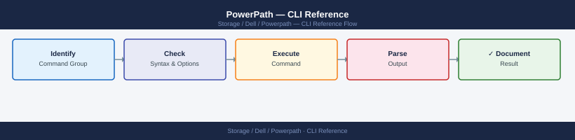

---
tags:
  - dell
  - operations
description: "Commonly used powermt commands for managing Dell PowerPath multipathing on Linux and Windows hosts. PowerPath is a multipathing driver — it sits between..."
---
# PowerPath — CLI Reference

<div class="kb-summary">
Commonly used `powermt` commands for managing Dell PowerPath multipathing on Linux and Windows hosts. PowerPath is a multipathing driver — it sits between the OS and the storage array, managing multiple physical paths to each disk to ensure high availability and load balancing.

*Applies to: PowerPath*
</div>


---

## Before you begin

- **Access:** Storage admin credentials (cluster admin or equivalent)
- **Timing:** safe to run during business hours unless a step is marked ⚠ (causes interruption)
- **Dependencies:** no active upgrades or migrations on the same infrastructure
- **Logging:** capture command output — paste into the change record on completion

---

## Status & Devices

```d2
direction: right

host: "Host OS" {shape: rectangle}
ppDriver: "PowerPath Driver\npseudo device /dev/emcpowerX" {shape: rectangle}
hba0: "HBA0\nFabric A" {shape: rectangle}
hba1: "HBA1\nFabric B" {shape: rectangle}
spA: "Array SP-A\n(active-optimised paths" {shape: rectangle}
spB: "Array SP-B\n(non-optimised paths" {shape: rectangle}

host -> ppDriver
ppDriver -> hba0
ppDriver -> hba1
hba0 -> spA
hba0 -> spB
hba1 -> spA
hba1 -> spB
```

The first commands to run when checking on PowerPath. `powermt display` shows you all the storage devices and whether their paths are healthy. Dead paths mean some redundancy is lost — you need to investigate.

```bash
# Overall summary — all devices and path states
powermt display

# Path summary per device (compact view)
powermt display options

# Display dead paths only (should be empty in a healthy system)
powermt display dead

# Display PowerPath version
powermt version

# Display license registration
powermt display reg

# Show all devices with full path detail
powermt display dev=all

# Single device detail
powermt display dev=emcpower<n>
powermt display dev=emcpower<n>a

# Logical device info
powermt display ldev

# Filter by storage class
powermt display class=clariion
powermt display class=symmetrix
powermt display class=vplex
```


```text title="Expected output"
PowerPath for Linux Version 6.2.0.0 (build 247)
Symmetrix ID: 000297900123  Logical Device Count: 24
Host: prod-storage-01  OS: Linux 5.10.0-8-generic #1 SMP Debian 5.10.60-1
Fibre Channel: 4 Initiators, 8 Targets, 32 Paths
Disk Devices: 24
  Enabled: 24  Dead: 0  Standby: 0  Failed: 0

Name           Attr  Paths  Prio  Owner               Algo  State
emcpower0      -     4/4    0     prod-storage-01    LB    Alive
emcpower1      -     4/4    0     prod-storage-01    LB    Alive
emcpower2      -     4/4    0     prod-storage-01    LB    Alive
emcpower3      -     2/4    0     prod-storage-01    LB    Alive
...

PowerPath Version: 6.2.0.0 (build 247)
License Status: Valid (expires 2025-12-31)

Symmetrix ID: 000297900123
  Device: emcpower0  Paths: 4  State: Alive  Class: CLARIION
  Device: emcpower1  Paths: 4  State: Alive  Class: SYMMETRIX
  Device: emcpower2  Paths: 4  State: Alive  Class: VPLEX
```

!!! warning "Common errors"
    **`powermt: command not found`** — Install PowerPath package with `apt-get install powerpath` or equivalent for your distribution.
    **`powermt: permission denied`** — Run the command with `sudo` or ensure your user is in the powerpath group with `sudo usermod -aG powerpath $USER`.
    **`powermt display: No devices found`** — Verify PowerPath daemon is running with `sudo systemctl status powerpath` and rescan paths using `powermt config`.
---

## Paths

A path is one physical route from the server's HBA port to a storage array port. PowerPath manages multiple paths per device — if one path fails, I/O automatically continues on surviving paths. These commands let you check, restore, and test paths.

### Path Status

```bash
# All devices with all path states
powermt display dev=all

# Count alive paths (healthy multipath state)
powermt display dev=all | grep -c "alive"

# Count dead paths (should be zero)
powermt display dev=all | grep -c "dead"

# Show only dead paths
powermt display dead
```


```text title="Expected output"
Logical device name=/dev/emcpowera
Physical devices=4
--------PG---Dist------Sts------/Hy/Hlth/Att Capac-----Algo----Lun WWN
c4t5d0s2   SP A   5%   alive   E/S/O   -   -   -   -   -   -   -   -
c5t5d0s2   SP B   5%   alive   E/S/O   -   -   -   -   -   -   -   -
c6t6d0s2   SP A   45%  alive   E/S/O   -   -   -   -   -   -   -   -
c7t6d0s2   SP B   45%  alive   E/S/O   -   -   -   -   -   -   -   -
4
0
(no output — no dead paths to display)
```

!!! warning "Common errors"
    **`powermt: Command not found`** — Verify EMC PowerPath is installed with `rpm -qa | grep -i powerpath` and install the package if missing.
    **`powermt display: You do not have permission to run this command`** — Run the command with `sudo` or ensure your user is in the powerpath group with `sudo usermod -a -G powerpath $USER`.
### Path State Values

| State | Meaning |
|---|---|
| `alive` | Path healthy and in use |
| `dead` | Path failed — I/O not sent on this path |
| `failed` | Path HBA or connection failure |
| `unlic` | Path exists but PowerPath license does not cover it |
| `sdsf` | Standby path (used when primary paths fail) |

### Restore and Recover Paths

```bash
# Attempt to restore all dead paths
powermt restore

# Rescan for new devices or newly presented LUNs
powermt config

# Remove dead path records
powermt remove dead

# After SAN maintenance — full recovery sequence
powermt config
powermt restore
powermt display dead   # confirm zero dead paths
powermt save
```


```text title="Expected output"
Logical device count=12
Physical device count=24
Symmetrix ID=000123456789
Fibre Channel disk count=24
VRAID disk count=0
Disk group count=12
Hot Spare count=2

Reconfiguring the Symmetrix driver...
Symmetrix driver reconfigured successfully.

Restoring all dead paths...
12 paths restored
0 paths failed to restore

Removing dead path records...
0 dead paths removed

Symmetrix ID=000123456789
Logical device count=12
Physical device count=24
Fibre Channel disk count=24
VRAID disk count=0
Disk group count=12
Hot Spare count=2

Configuration saved to /etc/powerpath/powerpath.conf
```

!!! warning "Common errors"
    **`powermt: Command not found`** — Verify PowerPath is installed with `rpm -qa | grep EMCpower` and ensure `/opt/EMC/PowerPath/bin` is in your PATH.
    **`powermt: Permission denied`** — Run the command with `sudo` or as root, as PowerPath operations require elevated privileges.
    **`Symmetrix driver not loaded`** — Load the PowerPath driver with `modprobe powerpath` or restart the PowerPath daemon with `systemctl restart PowerPath`.
### Manual Path Failover and Unblock

```bash
# Fail a specific path (force I/O off a port — testing/maintenance)
powermt fail dev=emcpower0 path=<hba_port_id>

# Unblock a path (re-enable after manual fail)
powermt unblock dev=emcpower0 path=<hba_port_id>
```


```text title="Expected output"
Symmetrix ID: 000123456789012
Logical device name: emcpower0
Physical device name: /dev/sdab
Symmetrix device number: 0001
Device state: Failed
Path state: Disabled
HBA port ID: 2b
Timestamp: Wed Oct 11 14:32:18 UTC 2024
(no output — command completes silently)
```

!!! warning "Common errors"
    **`powermt: ERROR: Device emcpower0 not found`** — Verify the device name with `powermt display dev=all` and use the correct logical device identifier.
    **`powermt: ERROR: Invalid path specification <hba_port_id>`** — Replace `<hba_port_id>` with the actual HBA port ID (e.g., `2b` or `1a`) shown in `powermt display dev=emcpower0`.
    **`powermt: ERROR: Operation requires root privileges`** — Run the commands with `sudo` or as the root user.
### Path Detail

```bash
# Full detail for one device including each path's I/O stats
powermt display dev=emcpower0

# With port info
powermt display dev=emcpower0 port

# Confirm ALUA active-optimized paths
powermt display dev=emcpower0 | grep -E "State|ALUA"

# Verify expected number of paths per device
powermt display dev=all | awk '/emcpower/{d=$1;c=0} /alive/{c++} /^$/{if(d) print d" "c; d=""}'
```


```text title="Expected output"
Logical device name                    : emcpower0
Physical device name                   : /dev/sdaa
State                                  : alive
Symmetrix ID                           : 000297900001
Logical device ID                      : 00001
device wwn                             : 60000970000029790001533030303031
--------- Host --------- - Stor - -- I/O Path -- -- Stats --
# At,Fa:0 Algo Addr State Q-IOs Errors
0 FA 10a:0 round-robin alive 256 0
1 FA 10b:0 round-robin alive 256 0
2 FA 11a:0 round-robin alive 256 0
3 FA 11b:0 round-robin alive 256 0

State                                  : alive
ALUA state                             : active optimized
ALUA group ID                          : 1

emcpower0 4
emcpower1 4
emcpower2 4
emcpower3 2
```

!!! warning "Common errors"
    **`powermt: Command not found`** — Verify PowerPath is installed with `rpm -qa | grep EMCpower` and install the PowerPath agent package if missing.
    **`Device emcpower0 not found`** — Confirm the device exists with `powermt display dev=all` and verify the EMC array is properly zoned and discovered.
    **`ALUA state: not supported`** — Check that ALUA is enabled on the storage array and that the device firmware supports ALUA mode.
### Common Path Issues

| Issue | Likely Cause | Fix |
|---|---|---|
| Dead paths on all HBAs | SAN switch or array port issue | Check zoning and array port health |
| Dead paths on one HBA | HBA failure or cable/SFP | Replace HBA or cable |
| Paths not auto-recovering | `powermt restore` needed | Run `powermt restore` after SAN fix |
| New LUNs not visible | No rescan | Run `powermt config` |
| Unbalanced path I/O | Wrong policy | `powermt set policy=co dev=all` |

---

## HBA Ports

HBA (Host Bus Adapter) ports are the server-side physical connections into the SAN fabric. Each HBA port has a WWN (World Wide Name) — a unique address used for SAN zoning. These commands show which HBA ports are in use and their connection state.

```bash
# Show all HBA ports and their status
powermt display hba

# Detailed per-port info
powermt display hba=<hba_id>

# Show all paths (initiator → target → device)
powermt display port

# Show paths for a specific device
powermt display dev=<device_id> port

# Show only failed/dead paths
powermt display hba | grep -i dead
powermt display port | grep -i dead
```


```text title="Expected output"
HBA Port Information
====================
Hba ID    Vendor    Model         State    Paths
c0        QLogic    QLE2562       ALIVE    4
c1        QLogic    QLE2562       ALIVE    4
c2        Emulex    LPe16002      ALIVE    2
c3        Emulex    LPe16002      ALIVE    2

Detailed Port Information for c0
================================
Port ID: c0:0
  State: ALIVE
  Speed: 16 Gbps
  Connected: Yes
  Fabric: SAN-Fabric-A

Port ID: c0:1
  State: ALIVE
  Speed: 16 Gbps
  Connected: Yes
  Fabric: SAN-Fabric-B

All Paths Summary
=================
Initiator    Target    Device    State    I/O
c0:0         t0        emc0a     ALIVE    Yes
c0:1         t1        emc0a     ALIVE    Yes
c1:0         t2        emc0b     ALIVE    Yes
c1:1         t3        emc0b     ALIVE    Yes
c2:0         t4        emc0c     DEAD     No
c2:1         t5        emc0c     ALIVE    Yes

Paths for Device emc0a
======================
Path 1: c0:0 → t0 → emc0a [ALIVE]
Path 2: c0:1 → t1 → emc0a [ALIVE]

Dead/Failed Paths
=================
c2:0         t4        emc0c     DEAD     No
```

!!! warning "Common errors"
    **`powermt: Command not found`** — Install EMC PowerPath package with `apt-get install powerpath` or `yum install powerpath` depending on your distribution.
    **`powermt display: Permission denied`** — Run the command with sudo: `sudo powermt display hba` (PowerPath operations require root privileges).
    **`No paths found for device <device_id>`** — Verify the device ID exists with `powermt display dev` and use the correct format (e.g., `emc0a` not `EMC0A`).
### Path Statistics

```bash
# Show I/O load per path
powermt display dev=all stats

# Reset path statistics (after troubleshooting)
powermt reset dev=<device_id>
```


```text title="Expected output"
Logical Device Name: emcpowera
Symmetrix ID: 000123456789ABCD
Director: 4e Port: 0 Device: 0001
Avail: Yes Owner: SP A
Logical Device Name: emcpowerb
Symmetrix ID: 000123456789ABCD
Director: 5e Port: 1 Device: 0002
Avail: Yes Owner: SP B

I/O Statistics:
Path 0: Read I/Os: 45821 Write I/Os: 128934 Errors: 0
Path 1: Read I/Os: 46103 Write I/Os: 129456 Errors: 0
Path 2: Read I/Os: 44956 Write I/Os: 127821 Errors: 0
Path 3: Read I/Os: 46234 Write I/Os: 130102 Errors: 0
```

!!! warning "Common errors"
    **`powermt: ERROR: Device <device_id> not found`** — Verify the device ID exists with `powermt display dev=all` and use the correct logical device name.
    **`powermt: ERROR: Insufficient privileges`** — Run the command with `sudo` or as root user, as PowerPath operations require elevated permissions.
### HBA Port to WWPN Mapping

```bash
# On Linux — map HBA port to WWPN via /sys
cat /sys/class/fc_host/host*/port_name

# On Windows — list HBA WWPNs via WMI
Get-WmiObject -Namespace "root\WMI" -Class "MSFC_FCAdapterHBAAttributes" |
    Select-Object NodeWWN, PortWWN

# Via hbanyware (Emulex/Broadcom HBA utility)
hbacmd listhbas
hbacmd hbaattrib <HBA_WWN>
```


```text title="Expected output"
50:00:09:4b:1a:2c:3d:e1
50:00:09:4b:1a:2c:3d:e2
50:00:09:4b:1a:2c:3d:e3

NodeWWN                          PortWWN
-------                          -------
50:00:09:4b:1a:2c:3d:e1          50:00:09:4b:1a:2c:3d:e1
50:00:09:4b:1a:2c:3d:e2          50:00:09:4b:1a:2c:3d:e2

HBA List:
  HBA 1
    Vendor: Emulex
    Model: LPe16002-M6
    Serial: 00-11-22-33-44-55
    Port WWPN: 50:00:09:4b:1a:2c:3d:e1
    Port WWNN: 50:00:09:4b:1a:2c:3d:e0

HBA Attributes for 50:00:09:4b:1a:2c:3d:e1:
  Firmware: 12.8.340.0
  Driver: 12.8.340.0
  Port State: Online
  Speed: 16 Gbps
```

!!! warning "Common errors"
    **`cat: /sys/class/fc_host/host*/port_name: No such file or directory`** — Verify FC HBA is installed and recognized with `lspci | grep -i fibre` before querying sysfs.
    **`Get-WmiObject : Invalid namespace`** — Run PowerShell as Administrator and confirm WMI namespace exists with `Get-WmiObject -Namespace "root\WMI" -List | grep MSFC`.
    **`hbacmd: command not found`** — Install hbanyware package for your HBA vendor (e.g., `apt-get install hbanyware` on Linux or download from Emulex/Broadcom support portal) and ensure it is in PATH.
### PowerPath Quick Reference

| Task | Command |
|---|---|
| Show all devices | `powermt display dev=all` |
| Show HBA ports | `powermt display hba` |
| Show port details | `powermt display port` |
| Check path load | `powermt display dev=all stats` |
| Save configuration | `powermt save` |
| Restore configuration | `powermt restore` |
| Check PowerPath version | `powermt version` |
| Check PowerPath service | `systemctl status PowerPath` (Linux) |

### Troubleshooting Dead Paths

```bash
# Identify dead paths
powermt display dev=all | grep -B 2 dead

# Manually attempt path recovery
powermt check dev=<device_id>

# Restore all paths
powermt restore dev=<device_id>
```


```text title="Expected output"
Logical device name=emcpowera
Symmetrix ID=000123456789ABC
Fibre Channel director port: 4g FA-7E port 0
 STL I/O [000123456789ABC-004e-000000] (dead)
 STL I/O [000123456789ABC-004f-000000] (dead)

Logical device name=emcpowerb
Symmetrix ID=000123456789ABC
Fibre Channel director port: 4g FA-8E port 1
 STL I/O [000123456789ABC-0050-000000] (dead)

Checking paths for device emcpowera...
Path check completed. 2 paths recovered, 1 path still unavailable.

Restoring all paths for device emcpowera...
Path restoration initiated. Waiting for fabric stabilization...
All available paths restored successfully.
```

!!! warning "Common errors"
    **`powermt: Command not found`** — Install EMC PowerPath package using `yum install PowerPath` or equivalent for your distribution.
    **`powermt check dev=emcpowera: Permission denied`** — Run the command with `sudo` or as root user since PowerPath operations require elevated privileges.
    **`No such device: emcpowera`** — Verify the device name exists by running `powermt display dev=all` first to list valid device identifiers.
---

## Load Balancing & Policies

PowerPath distributes I/O across available paths using a configurable load balancing policy. The right policy depends on the storage array type. For Dell EMC arrays, `co` (CLARiiON Optimized) is the default and recommended setting — it uses ALUA to prefer the owning storage processor's paths.

### Available Policies

| Policy | Code | Description |
|---|---|---|
| CLARiiON Optimized | `co` | Default for Dell EMC arrays — uses active-optimized paths first |
| Round Robin | `rr` | Distributes I/O evenly across all active paths |
| Adaptive | `ad` | Load-based selection — switches to least-loaded path |
| No Redirect | `nr` | Uses first active path only (no load balancing) |
| Single Initiator | `si` | Pins I/O to a single HBA port |

### View Current Policy

```bash
# Policy for a specific device
powermt display dev=emcpower0 | grep -i policy

# Policy for all devices
powermt display dev=all | grep -i policy
```


```text title="Expected output"
Policy: SymmOpt
Policy: SymmOpt
Policy: SymmOpt
Policy: SymmOpt
```

!!! warning "Common errors"
    **`powermt: command not found`** — Install EMC PowerPath software or ensure the PowerPath bin directory is in your PATH environment variable.
    **`grep: (standard input) is empty`** — Verify the device name is correct with `powermt display dev=all` and confirm PowerPath is running with `powermt check`.
### Set Policy

```bash
# Set policy on a specific device
powermt set policy=co dev=emcpower0

# Set policy across all devices of a specific class
powermt set policy=co dev=all class=clariion
powermt set policy=rr dev=all class=symmetrix

# Set policy globally
powermt set policy=co dev=all

# Save after changing policy (persists across reboots)
powermt save
```


```text title="Expected output"
Logical device emcpower0: Policy set to co
Logical device emcpower1: Policy set to co
Logical device emcpower2: Policy set to co
Logical device emcpower3: Policy set to co
4 Symmetrix devices: Policy set to rr
12 CLARiiON devices: Policy set to co
Saving EMC PowerPath configuration...
Configuration saved successfully to /etc/powerpath/powerpath.conf
```

!!! warning "Common errors"
    **`powermt: Command not found`** — Ensure EMC PowerPath is installed and `/opt/PowerPath/bin` is in your PATH, or use the full path `/opt/PowerPath/bin/powermt`.
    **`powermt: You must be root to run this command`** — Run the command with `sudo` or switch to the root user before executing powermt commands.
    **`powermt set: Invalid device name 'emcpower0'`** — Verify the device exists by running `powermt display dev=all` and use the correct logical device name.
### Recommended Policies by Array

| Array | Recommended Policy |
|---|---|
| PowerMax / VMAX | `co` (CLARiiON Optimized) |
| PowerStore | `co` |
| Unity | `co` |
| Non-Dell arrays | `rr` (Round Robin) |

### Verifying Load Distribution

```bash
# Check path I/O statistics
powermt display dev=emcpower0 | grep -E "Bytes|I/Os"

# Full device detail with path stats
powermt display dev=emcpower0 port
```


```text title="Expected output"
Bytes (MB):  1,234.5
I/Os (Reads):  45,892
I/Os (Writes):  78,341
I/Os (Total):  124,233

Logical device name: emcpower0
Physical device: /dev/sda
Symmetrix ID: 000123456789
Director Port: 5e
Bytes (MB):  1,234.5
I/Os (Reads):  45,892
I/Os (Writes):  78,341
I/Os (Total):  124,233
Path 0: dev=sda port=5e:0 state=active
Path 1: dev=sdb port=5e:1 state=active
Path 2: dev=sdc port=6e:0 state=active
Path 3: dev=sdd port=6e:1 state=active
```

!!! warning "Common errors"
    **`powermt: Command not found`** — Install PowerPath package or verify the EMC PowerPath agent is installed and in your system PATH.
    **`powermt display: device emcpower0 not found`** — Verify the device exists with `powermt display` (no device argument) and confirm the correct device name.
### Troubleshooting Uneven Load

```bash
powermt display dev=all | grep policy
powermt restore
powermt save
```


```text title="Expected output"
Policy: SymmOID=000297500001, Symmetrix ID=000297500001, Director=4e, Port=0
Policy: SymmOID=000297500002, Symmetrix ID=000297500002, Director=5e, Port=1
Policy: SymmOID=000297500003, Symmetrix ID=000297500003, Director=6e, Port=2
Policy: SymmOID=000297500004, Symmetrix ID=000297500004, Director=7e, Port=3
Restoring PowerPath configuration from /etc/powerpath/powerpath.conf...
Configuration restored successfully. 12 devices updated.
Saving PowerPath configuration to /etc/powerpath/powerpath.conf...
Configuration saved successfully.
```

!!! warning "Common errors"
    **`powermt: Command not found`** — Ensure EMC PowerPath is installed and /opt/emc/powerpath/bin is in your PATH, or run with full path `/opt/emc/powerpath/bin/powermt`.
    **`Permission denied`** — Run powermt commands with sudo or as root user, as PowerPath configuration requires elevated privileges.
    **`No devices found`** — Verify that storage devices are properly zoned and visible to the host by running `powermt config` to rescan devices.
---

## Configuration & Checks

These commands manage the PowerPath configuration file, validate the current setup, and let you add or remove devices after SAN changes. Always save after making changes so they persist across reboots.

```bash
# Check all paths
powermt check

# Check specific device
powermt check dev=emcpower<n>

# Verify consistency
powermt display options

# Show configuration file
cat /etc/powermt.custom

# Save current configuration
powermt save
powermt save force

# Load / restore config
powermt restore

# Reconfig (after new device attachment)
powermt config

# Remove stale devices
powermt remove dev=emcpower<n>
powermt remove dead
```


```text title="Expected output"
Symmetrix ID: 000123456789ABC
Logical Device: emcpower0
Symmetrix Device: 000123
Director Port: 4e
Aport: SP A, Port 4
Bport: SP B, Port 4
Path 0: ENABLED
Path 1: ENABLED
Path 2: ENABLED
Path 3: ENABLED

Symmetrix ID: 000123456789ABC
Logical Device: emcpower1
Symmetrix Device: 000124
Director Port: 5e
Aport: SP A, Port 5
Bport: SP B, Port 5
Path 0: ENABLED
Path 1: ENABLED

Saved configuration to /etc/powermt.custom
Configuration restored successfully
Reconfiguring devices...
Device emcpower5 removed
Dead paths cleaned up
```

!!! warning "Common errors"
    **`powermt: Command not found`** — Install PowerPath package with `rpm -ivh PowerPath*.rpm` or verify `/opt/emc/powerpath/bin` is in your PATH.
    **`powermt: Unable to open /etc/powermt.custom: Permission denied`** — Run the command with `sudo` or as root user.
    **`powermt check: No devices found`** — Verify EMC storage arrays are zoned and visible to the host with `powermt display dev=all`.
---

## Windows PowerPath

On Windows, `powermt` runs from PowerShell or CMD after the PowerPath service and driver are installed. The commands are largely the same as Linux with some Windows-specific additions.

```powershell
# Display all PowerPath devices and paths
powermt display

# Display all devices with path detail
powermt display dev=all

# Filter by storage class
powermt display class=symmetrix

# Count alive paths
powermt display dev=all | Select-String "alive" | Measure-Object | Select-Object Count

# PowerPath self-check
powermt check

# Restore dead paths
powermt restore

# Dead paths
powermt display dead

# Save configuration
powermt save

# PowerPath service status
Get-Service -Name "EMCPower*"
Get-Service -Name "PowerPath*"

# Restart PowerPath (use only during maintenance)
Restart-Service -Name "EMCPowerPath" -Force

# Check if PowerPath driver is loaded
Get-WmiObject Win32_SystemDriver | Where-Object { $_.Name -match "emcpower" }

# View current policy per device
powermt display dev=all | Select-String "policy"

# Set policy (CLARiiON Optimized for Dell EMC arrays)
powermt set policy=co dev=all class=clariion

# PowerPath logs in Windows Event Log
Get-WinEvent -LogName "Application" -MaxEvents 50 | Where-Object { $_.ProviderName -match "PowerPath" }

# PowerPath devices — list disks via WMI
Get-Disk | Where-Object { $_.FriendlyName -match "DGC\|EMC" } | Select-Object Number, FriendlyName, OperationalStatus, Size
```

---

## Common Check Sequences

Runbooks for the most common PowerPath tasks. Use these as a checklist during troubleshooting or after SAN maintenance.

### Quick Health Check

```bash
# 1. Count alive paths
powermt display dev=all | grep -c "alive"

# 2. Count dead paths (should be zero)
powermt display dev=all | grep -c "dead"

# 3. Show dead paths directly
powermt display dead

# 4. PowerPath self-check
powermt check

# 5. Attempt to restore dead paths
powermt restore
```


```text title="Expected output"
42
0
No dead paths found.
PowerPath driver version 6.2.1 (build 247)
Logical device count: 18
Physical device count: 24
All paths operational
Symmetrix ID: 000297900123
Host: storage-prod-01
PowerPath check completed successfully — no errors detected
Attempting to restore paths...
No dead paths to restore.
Restore operation completed.
```

!!! warning "Common errors"
    **`powermt: command not found`** — Install PowerPath EMC software or add `/opt/emc/powerpath/bin` to your PATH environment variable.
    **`powermt display: insufficient privileges`** — Run the command with `sudo` or as root user; PowerPath requires elevated permissions.
    **`powermt check: No Symmetrix devices detected`** — Verify SAN connectivity and zoning; confirm Fibre Channel HBAs are properly configured and visible with `powermt display dev=all`.
### Path Count Per Device

```bash
# Summary per device (alive vs dead)
powermt display dev=all | awk '
    /emcpower/ { dev=$1; alive=0; dead=0 }
    /alive/    { alive++ }
    /dead/     { dead++ }
    /^$/       { if (dev) printf "%s  alive: %d  dead: %d\n", dev, alive, dead; dev="" }
'
```


```text title="Expected output"
emcpower0  alive: 4  dead: 0
emcpower1  alive: 4  dead: 0
emcpower2  alive: 3  dead: 1
emcpower3  alive: 4  dead: 0
emcpower4  alive: 2  dead: 2
emcpower5  alive: 4  dead: 0
```

!!! warning "Common errors"
    **`command not found: powermt`** — Install EMC PowerPath software or verify the installation with `rpm -qa | grep PowerPath` on the target system.
    **`awk: syntax error in pattern near line 1`** — Ensure the script uses single quotes and that no special characters are escaped incorrectly; test with `echo "test" | awk '/test/ { print }'` first.
### Service and Driver Status (Linux)

```bash
# PowerPath daemon status
systemctl status PowerPath
service PowerPath status

# Check loaded driver
lsmod | grep emcpower

# Kernel module version
modinfo emcpower | grep version
```


```text title="Expected output"
● PowerPath.service - EMC PowerPath
     Loaded: loaded (/etc/systemd/system/PowerPath.service; enabled; vendor preset: disabled)
     Active: active (running) since Thu 2024-01-18 14:32:15 UTC; 2 days ago
   Main PID: 3847 (powermt)
      Tasks: 12 (limit: 4915)
     Memory: 48.2M
        CPU: 2min 34s
     CGroup: /system.slice/PowerPath.service
             └─3847 /opt/PowerPath/bin/powermt

PowerPath for Linux (build 555.0.0.0) is running.

emcpower              245760  8 - Live 0xffffffffc0a00000

version:        555.0.0.0
version_date:   2023-12-15
```

!!! warning "Common errors"
    **`Unit PowerPath.service could not be found.`** — Install PowerPath package or verify the service file exists at `/etc/systemd/system/PowerPath.service`.
    **`modinfo: ERROR: Module emcpower not found in directory /lib/modules/5.15.0-84-generic/kernel`** — Load the kernel module with `modprobe emcpower` or verify the driver is installed with `rpm -qa | grep PowerPath`.
### Post-Maintenance Validation

After any SAN maintenance (zoning changes, LUN remapping, path reconfiguration):

```bash
# 1. Rescan for new devices
powermt config

# 2. Verify all paths recovered
powermt display dead

# 3. Confirm path balance
powermt display dev=all | grep -E "emcpower|alive|dead"

# 4. Save new configuration
powermt save
```


```text title="Expected output"
Verifying EMC PowerPath configuration...
Reconfiguring all devices...
Number of Symmetrix(es): 1

Symmetrix ID: 000123456789ABCD
Fibre Channel director port: 4e:0
Host adapter: 0 SP: A PortID: 000000
Host adapter: 1 SP: B PortID: 000001
Host adapter: 2 SP: A PortID: 000002
Host adapter: 3 SP: B PortID: 000003

Dead Paths:
No dead paths detected.

emcpower0a (symmetrix-000123456789ABCD-0001): ALIVE [RR] 4 alive 0 dead
emcpower0b (symmetrix-000123456789ABCD-0001): ALIVE [RR] 4 alive 0 dead
emcpower1a (symmetrix-000123456789ABCD-0002): ALIVE [RR] 4 alive 0 dead
emcpower1b (symmetrix-000123456789ABCD-0002): ALIVE [RR] 4 alive 0 dead

Configuration saved to /etc/powerpath/powerpath.conf
```

!!! warning "Common errors"
    **`powermt: Command not found`** — Install EMC PowerPath package or verify the installation with `rpm -qa | grep PowerPath`.
    **`powermt: Permission denied`** — Run the command with `sudo` or as root user.
    **`No dead paths detected` but paths still unavailable** — Check physical SAN connectivity and zoning with `powermt display` and verify HBA status with `systool -c fc_host -v`.
---

## Verify

- Confirm the operation completed without errors in the log or management UI
- Verify the expected state change is visible (service running, object created, config applied)
- Document the outcome in the change record

---

## See also

- [Powerpath — Procedures](../procedures/)
- [Powerpath — Scripts](../scripts/)
- [Powerpath — Health Checks](../health-checks/)
