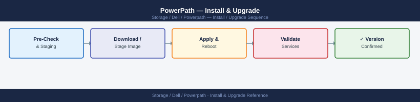

# PowerPath — Install & Upgrade

<div class="kb-summary">
Install & Upgrade reference covering Version and Release Matrix, Upgrade and Update Paths, EOL and Renewal Tracking, Replacement and Decommission Planning.

*Applies to: PowerPath*
</div>


## Before you begin

- **Access:** Storage admin credentials (cluster admin or equivalent)
- **Timing:** safe to run during business hours unless a step is marked ⚠ (causes interruption)
- **Dependencies:** no active upgrades or migrations on the same infrastructure
- **Logging:** capture command output — paste into the change record on completion

---

## Version and Release Matrix

| PowerPath Version | Supported Platforms | Key Changes | Support Status |
|---|---|---|---|
| PowerPath 6.2.x | RHEL 7/8, SLES 12/15, Windows Server 2016/2019, AIX 7.1/7.2 | Kernel 4.x support, RHEL 8 GA | End of Life |
| PowerPath 6.3.x | RHEL 7/8/9, SLES 12/15, Windows Server 2019/2022 | RHEL 9 support, NVMe/FC | Active |
| PowerPath 6.4.x | RHEL 8/9, SLES 15, Windows Server 2022, AIX 7.2/7.3 | RHEL 9.x kernels, extended NVMe-oF | Active (Current) |

Always verify the specific OS and kernel version against the Dell PowerPath E-Lab Interoperability Navigator before upgrading the host OS or PowerPath. Support matrix is at: [https://elabnavigator.dell.com](https://elabnavigator.dell.com)

## Upgrade and Update Paths

PowerPath upgrades on Linux require stopping applications or quiescing I/O if the kernel module must be reloaded (check the release notes for the target version).

**Pre-upgrade steps:**
1. Run `powermt display dev=all > pre-upgrade-baseline.txt` and save
2. Run `powermt display options > pre-upgrade-options.txt` and save
3. Run `powermt save` to persist current configuration
4. Verify the target PowerPath version supports the current OS and kernel: check E-Lab Navigator
5. Check array firmware is within the supported range for the target PowerPath version

**Upgrade procedure (Linux RPM):**
```bash
# Check current version
powermt version

# Install new package (non-disruptive if no kernel module reload required)
rpm -Uvh PowerPath-<version>-<platform>.rpm

# After installation, verify registration
powermt check_registration

# Verify path state
powermt display dev=all
```


```text title="Expected output"
EMC PowerPath Version 6.1.0.0 (build 247)
Copyright (c) 2023 Dell Inc. All rights reserved.

Preparing...                          ################################# [100%]
Updating / installing...
   1:PowerPath-6.1.0.0-247.x86_64     ################################# [100%]

Registration Status: VALID
License expires: 2025-12-31
Symmetrix ID: 000297900123

Pseudo name=emcpowerp, Symmetrix ID=000297900123, Server=symm-prod-01
    Logical device ID=0001234567890ABC
    state=alive; policy=SymmOpt; priority=0
    :
    Logical device ID=0001234567890ABD
    state=alive; policy=SymmOpt; priority=0

Pseudo name=emcpowerq, Symmetrix ID=000297900124, Server=symm-prod-02
    Logical device ID=0001234567890ABE
    state=alive; policy=SymmOpt; priority=0
```

!!! warning "Common errors"
    **`error: Failed dependencies: kernel-devel is needed by PowerPath-6.1.0.0-247.x86_64`** — Install the matching kernel-devel package with `yum install kernel-devel` before attempting the RPM upgrade.
    **`Registration Status: INVALID - License Expired`** — Contact Dell support to renew the PowerPath license or restore a valid license file to `/etc/powerpath/license.txt`.
    **`powermt: command not found`** — Verify PowerPath is installed with `rpm -qa | grep PowerPath` and ensure `/opt/emc/powerpath/bin` is in your PATH.
**Post-upgrade validation:** Compare path count and policy output against pre-upgrade baseline; run `powermt restore` if any paths show `dead`.

## EOL and Renewal Tracking

| Tracked Item | Where to Find | Action Trigger |
|---|---|---|
| PowerPath version EOS date | Dell Product Support Lifecycle page | Begin upgrade planning 6 months before EOS |
| OS kernel compatibility | E-Lab Interoperability Navigator | Check before any OS kernel update |
| PowerPath license expiry | `powermt check_registration` output | Renew with Dell account team before expiry |
| Support contract (covers PowerPath) | Dell Support portal → Contracts | Renew 90 days before expiry |

## Replacement and Decommission Planning

- PowerPath does not run on dedicated hardware; it is a host-side software component — "replacement" means version upgrades or platform migration
- When migrating a host from PowerPath to native DM-Multipath (Linux), the transition requires stopping I/O to all affected devices, removing PowerPath, configuring DM-Multipath, and validating device access — plan this as a maintenance window event
- When decommissioning a host, remove LUN masking at the array before removing PowerPath to avoid orphaned device entries
- When upgrading the underlying array (e.g., PowerMax to a new model), verify the new array model is in the PowerPath support matrix; some array firmware versions require a corresponding PowerPath update

---

## Verify

- Confirm the operation completed without errors in the log or management UI
- Verify the expected state change is visible (service running, object created, config applied)
- Document the outcome in the change record

---

## See also

- [Powerpath — Procedures](../procedures/)
- [Powerpath — Health Checks](../health-checks/)
