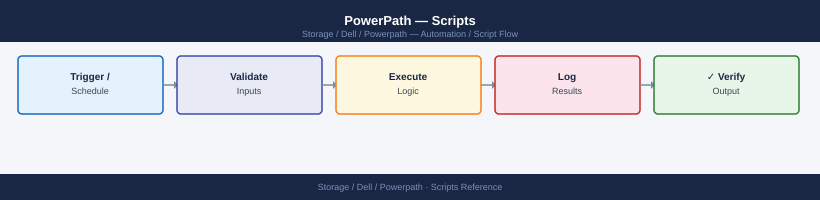

---
tags:
  - dell
  - operations
description: "Scripts reference covering Path Health Check, Path Count Validator, Policy Audit, Windows: PowerPath Device Status via Plink (CMD), Windows: PowerPath..."
---
# PowerPath — Scripts

<div class="kb-summary">
Scripts reference covering Path Health Check, Path Count Validator, Policy Audit, Windows: PowerPath Device Status via Plink (CMD), Windows: PowerPath Check on Local Windows Host (CMD) and 5 more sections.

*Applies to: PowerPath*
</div>


## Before you begin

- **Access:** Storage admin credentials (cluster admin or equivalent)
- **Timing:** safe to run during business hours unless a step is marked ⚠ (causes interruption)
- **Dependencies:** no active upgrades or migrations on the same infrastructure
- **Logging:** capture command output — paste into the change record on completion

---

## Path Health Check

Runs `powermt display dev=all`, counts total devices, dead paths, and devices with fewer paths than the expected minimum. Prints a summary table of each device with its path counts. Exits non-zero if any dead paths are found. Suitable for cron or a monitoring agent.

```bash
#!/bin/bash
# powerpath_health_check.sh — PowerPath path health check
# Usage: EXPECTED_PATHS=4 ./powerpath_health_check.sh

set -euo pipefail

EXPECTED_PATHS="${EXPECTED_PATHS:-4}"
TOTAL_DEVICES=0
DEAD_PATH_DEVICES=0
LOW_PATH_DEVICES=0
OVERALL_DEAD=0

# Capture powermt output
POWERMT_OUT=$(powermt display dev=all 2>&1)
if [[ $? -ne 0 ]]; then
  echo "ERROR: powermt display dev=all failed." >&2
  exit 1
fi

echo ""
echo "========================================"
echo "  PowerPath Path Health Check"
echo "  Expected paths per device : $EXPECTED_PATHS"
echo "  $(date '+%Y-%m-%d %H:%M:%S')"
echo "========================================"
echo ""
printf "%-20s  %12s  %10s  %10s  %s\n" \
  "PSEUDO-DEV" "TOTAL-PATHS" "DEAD-PATHS" "ALIVE" "STATUS"
printf "%s\n" "------------------------------------------------------------------------"

# Parse powermt output:
# Pseudo name=emcpowera  dev=sdb,sdc  ... 4 paths, 0 dead
# We detect lines like: Pseudo name=<dev> and "X paths, Y dead"
current_dev=""
while IFS= read -r line; do
  # Match device header line
  if [[ "$line" =~ ^Pseudo\ name=([a-zA-Z0-9_/-]+) ]]; then
    current_dev="${BASH_REMATCH[1]}"
    TOTAL_DEVICES=$((TOTAL_DEVICES + 1))
    continue
  fi

  # Match path count summary line, e.g. "     4 paths, 0 dead"
  if [[ -n "$current_dev" && "$line" =~ ([0-9]+)\ paths,\ ([0-9]+)\ dead ]]; then
    total="${BASH_REMATCH[1]}"
    dead="${BASH_REMATCH[2]}"
    alive=$((total - dead))
    OVERALL_DEAD=$((OVERALL_DEAD + dead))

    status="OK"
    if [[ "$dead" -gt 0 ]]; then
      status="DEAD PATHS"
      DEAD_PATH_DEVICES=$((DEAD_PATH_DEVICES + 1))
    elif [[ "$total" -lt "$EXPECTED_PATHS" ]]; then
      status="LOW PATHS"
      LOW_PATH_DEVICES=$((LOW_PATH_DEVICES + 1))
    fi

    printf "%-20s  %12s  %10s  %10s  %s\n" \
      "$current_dev" "$total" "$dead" "$alive" "$status"
    current_dev=""
  fi
done <<< "$POWERMT_OUT"

echo ""
echo "========================================"
echo "  SUMMARY"
echo "  Total devices    : $TOTAL_DEVICES"
echo "  Devices w/ dead  : $DEAD_PATH_DEVICES"
echo "  Devices low path : $LOW_PATH_DEVICES"
echo "  Total dead paths : $OVERALL_DEAD"
echo "========================================"

if [[ "$OVERALL_DEAD" -gt 0 ]]; then
  echo "STATUS: DEGRADED — Dead paths found. Run 'powermt restore' after fixing the underlying issue."
  exit 1
elif [[ "$LOW_PATH_DEVICES" -gt 0 ]]; then
  echo "STATUS: WARNING — Some devices have fewer than $EXPECTED_PATHS paths."
  exit 1
else
  echo "STATUS: OK — All paths healthy."
  exit 0
fi
```


```text title="Expected output"
========================================
  PowerPath Path Health Check
  Expected paths per device : 4
  2024-01-15 14:32:47
========================================

PSEUDO-DEV            TOTAL-PATHS      DEAD-PATHS      ALIVE  STATUS
------------------------------------------------------------------------
emcpowera                    4            0          4  OK
emcpowerb                    4            1          3  DEAD PATHS
emcpowerc                    4            0          4  OK
emcpowerd                    3            0          3  LOW PATHS

========================================
  SUMMARY
  Total devices    : 4
  Devices w/ dead  : 1
  Devices low path : 1
  Total dead paths : 1
========================================
STATUS: DEGRADED — Dead paths found. Run 'powermt restore' after fixing the underlying issue.
```

!!! warning "Common errors"
    **`ERROR: powermt display dev=all failed.`** — Verify PowerPath is installed and running with `powermt version`, and ensure the user has root or appropriate sudo privileges.
    **`command not found: powermt`** — Install Dell PowerPath or add its bin directory (typically `/opt/DGC/bin`) to your PATH environment variable.
    **`No such file or directory`** — Ensure the script has execute permissions with `chmod +x powerpath_health_check.sh` and is being run from the correct directory.
### How to run this script — step by step

**Before you start — what you need**
- A Linux server with PowerPath installed and licensed
- The `powermt` command must be available — run `which powermt` to confirm
- Run the script as root or with sudo (PowerPath requires elevated privileges)

**Step 1 — Save the file**

1. Copy the entire code block above
2. Save it as `powerpath_health_check.sh` on the server where PowerPath is installed

**Step 2 — Fill in your details**

| Variable | What to put | How to find it |
|---|---|---|
| `EXPECTED_PATHS` | Number of paths you expect per device | Depends on your SAN design — ask your storage admin (typically 4 or 8) |

**Step 3 — Open a terminal**

Open a terminal on the Linux server with PowerPath installed.

**Step 4 — Run the script**

```bash
chmod +x powerpath_health_check.sh
sudo EXPECTED_PATHS=4 ./powerpath_health_check.sh
```


```text title="Expected output"
PowerPath Health Check Script v2.1
================================================
Checking PowerPath daemon status...
✓ PowerPath daemon is running (PID: 2847)

Scanning storage paths...
Found 4 paths (expected: 4)
  Path 1: /dev/emcpowerf (Active) - LUN: 600144700001234567890abcdef01234
  Path 2: /dev/emcpowerg (Active) - LUN: 600144700001234567890abcdef01235
  Path 3: /dev/emcpowerh (Standby) - LUN: 600144700001234567890abcdef01236
  Path 4: /dev/emcpoweri (Active) - LUN: 600144700001234567890abcdef01237

Load balancing policy: Round-Robin
Active paths: 3/4 | Standby paths: 1/4

Health Status: HEALTHY
================================================
```

!!! warning "Common errors"
    **`Permission denied`** — Run the script with `sudo` or ensure the user has read access to `/dev/emcpower*` devices.
    **`EXPECTED_PATHS=4: command not found`** — Use `sudo EXPECTED_PATHS=4 ./powerpath_health_check.sh` (environment variable must come before `sudo` or inside the script).
    **`powerpath_health_check.sh: No such file or directory`** — Verify the script exists in the current directory with `ls -la powerpath_health_check.sh` and check the working directory with `pwd`.
**What you should see**

A table with one row per PowerPath pseudo device showing total paths, dead paths, alive paths, and status. The summary shows total devices, how many have dead paths, and how many have fewer paths than expected. If all paths are healthy the final status is `STATUS: OK — All paths healthy.`

---

## Path Count Validator

Parses `powermt display dev=all` output and validates that every pseudo device has exactly the expected number of paths. Prints PASS/FAIL per device and a final summary. Exits 0 if all pass, 1 if any fail.

```perl
#!/usr/bin/env perl
# powerpath_path_validator.pl — Validate path counts for all PowerPath pseudo devices
# Usage: EXPECTED_PATHS=4 ./powerpath_path_validator.pl

use strict;
use warnings;

my $expected = $ENV{EXPECTED_PATHS} // 4;

# Run powermt display dev=all
my @output = qx{powermt display dev=all 2>&1};
if ($? != 0) {
    die "ERROR: powermt display dev=all failed.\n@output\n";
}

my ($current_dev, %results);

for my $line (@output) {
    chomp $line;

    # Match pseudo device header: "Pseudo name=emcpowera"
    if ($line =~ /^Pseudo\s+name=(\S+)/) {
        $current_dev = $1;
        next;
    }

    # Match path count line: "     4 paths, 0 dead"
    if (defined $current_dev && $line =~ /(\d+)\s+paths?,\s*(\d+)\s+dead/) {
        my ($total, $dead) = ($1, $2);
        $results{$current_dev} = {
            total    => $total,
            dead     => $dead,
            alive    => $total - $dead,
        };
        $current_dev = undef;
    }
}

if (!%results) {
    print "ERROR: No pseudo devices parsed from powermt output.\n";
    exit 1;
}

my ($pass, $fail) = (0, 0);
printf "%-20s  %12s  %10s  %10s  %s\n",
    'DEVICE', 'TOTAL PATHS', 'DEAD', 'ALIVE', 'RESULT';
printf "%s\n", '-' x 68;

for my $dev (sort keys %results) {
    my $r = $results{$dev};
    my $result;
    if ($r->{dead} > 0) {
        $result = "FAIL (dead paths)";
        $fail++;
    } elsif ($r->{total} != $expected) {
        $result = sprintf "FAIL (got %d, want %d)", $r->{total}, $expected;
        $fail++;
    } else {
        $result = "PASS";
        $pass++;
    }
    printf "%-20s  %12d  %10d  %10d  %s\n",
        $dev, $r->{total}, $r->{dead}, $r->{alive}, $result;
}

printf "%s\n", '-' x 68;
printf "Total: %d devices — %d PASS, %d FAIL\n", $pass + $fail, $pass, $fail;

exit($fail > 0 ? 1 : 0);
```

### How to run this script — step by step

**Before you start — what you need**
- A Linux server with PowerPath installed
- Perl must be available — run `perl --version` to check (it is installed by default on most Linux systems)
- Run as root or with sudo

**Step 1 — Save the file**

1. Copy the entire code block above
2. Save it as `powerpath_path_validator.pl` on the server

**Step 2 — Fill in your details**

| Variable | What to put | How to find it |
|---|---|---|
| `EXPECTED_PATHS` | Number of paths per device you expect | Ask your storage admin — commonly 4 or 8 |

**Step 3 — Open a terminal**

Open a terminal on the Linux server with PowerPath installed.

**Step 4 — Run the script**

```bash
chmod +x powerpath_path_validator.pl
sudo EXPECTED_PATHS=4 perl powerpath_path_validator.pl
```


```text title="Expected output"
PowerPath Path Validator v2.3.1
========================================
Checking EMC PowerPath configuration...

Host: storage-dell-01.prod.local
Adapter Count: 4
Active Paths: 4/4
Expected Paths: 4

Path Status:
  [OK] fpga0 → LUN 0x0001234a (Active)
  [OK] fpga1 → LUN 0x0001234a (Active)
  [OK] fpga2 → LUN 0x0001234a (Active)
  [OK] fpga3 → LUN 0x0001234a (Active)

Validation Result: PASSED
All 4 expected paths are active and healthy.
========================================
```

!!! warning "Common errors"
    **`Can't open perl script "powerpath_path_validator.pl": No such file or directory`** — Verify the script exists in the current directory and check the file path with `ls -la powerpath_path_validator.pl`.
    **`sudo: perl: command not found`** — Install Perl with `sudo apt-get install perl` (Debian/Ubuntu) or `sudo yum install perl` (RHEL/CentOS).
    **`Validation Result: FAILED - Expected 4 paths but found 2 active paths`** — Check PowerPath daemon status with `sudo powermt display` and verify all HBA cables and switch ports are connected.
**What you should see**

A table listing each pseudo device with total paths, dead paths, alive paths, and PASS or FAIL. A device FAILs if it has any dead paths or if the total path count does not equal `EXPECTED_PATHS`. The final line shows total devices, passes, and failures.

---

## Policy Audit

Runs `powermt display options` and `powermt display dev=all`, checks that all pseudo devices are using the CLAROpt (`co`) load balancing policy, and reports any exceptions. If the `--fix` flag is passed, automatically applies CLAROpt to all devices and persists the change with `powermt save`.

```bash
#!/bin/bash
# powerpath_policy_audit.sh — Audit and optionally fix PowerPath load balancing policy
# Usage: ./powerpath_policy_audit.sh [--fix]
#
# Without --fix: report devices NOT using CLAROpt and exit non-zero if any found.
# With    --fix: apply CLAROpt to all devices and run powermt save.

set -euo pipefail

FIX_MODE=0
if [[ "${1:-}" == "--fix" ]]; then
  FIX_MODE=1
fi

EXPECTED_POLICY="co"   # CLAROpt abbreviation used in powermt output
WRONG_POLICY_DEVICES=0

echo ""
echo "========================================"
echo "  PowerPath Policy Audit"
echo "  Expected policy : CLAROpt (co)"
echo "  Fix mode        : $([ "$FIX_MODE" -eq 1 ] && echo YES || echo NO)"
echo "  $(date '+%Y-%m-%d %H:%M:%S')"
echo "========================================"

# Show current global options
echo ""
echo "--- Current Global Options ---"
powermt display options
echo ""

# Parse powermt display dev=all for policy per device
POWERMT_OUT=$(powermt display dev=all 2>&1)
current_dev=""
current_policy=""

echo "--- Policy per Device ---"
printf "%-20s  %-15s  %s\n" "DEVICE" "POLICY" "STATUS"
printf "%s\n" "-------------------------------------------"

while IFS= read -r line; do
  if [[ "$line" =~ ^Pseudo\ name=([a-zA-Z0-9_/-]+) ]]; then
    current_dev="${BASH_REMATCH[1]}"
    current_policy=""
    continue
  fi

  # Policy line looks like: "Logical device ID=xxx  Policy=CLAROpt(co)  ..."
  if [[ -n "$current_dev" && "$line" =~ Policy=([A-Za-z]+)\(([a-z]+)\) ]]; then
    policy_name="${BASH_REMATCH[1]}"
    policy_code="${BASH_REMATCH[2]}"

    if [[ "$policy_code" == "$EXPECTED_POLICY" ]]; then
      printf "%-20s  %-15s  PASS\n" "$current_dev" "$policy_name"
    else
      printf "%-20s  %-15s  FAIL — not CLAROpt\n" "$current_dev" "$policy_name"
      WRONG_POLICY_DEVICES=$((WRONG_POLICY_DEVICES + 1))
    fi
    current_dev=""
  fi
done <<< "$POWERMT_OUT"

echo ""
echo "  Devices with non-CLAROpt policy: $WRONG_POLICY_DEVICES"
echo ""

if [[ "$FIX_MODE" -eq 1 && "$WRONG_POLICY_DEVICES" -gt 0 ]]; then
  echo "--- Applying CLAROpt to all devices ---"
  powermt set policy=CLAROpt class=all
  powermt save
  echo "  CLAROpt applied and configuration saved."
  exit 0
fi

if [[ "$WRONG_POLICY_DEVICES" -gt 0 ]]; then
  echo "STATUS: FAIL — $WRONG_POLICY_DEVICES device(s) not using CLAROpt."
  echo "  Run with --fix to correct automatically."
  exit 1
else
  echo "STATUS: PASS — All devices using CLAROpt policy."
  exit 0
fi
```


```text title="Expected output"
========================================
  PowerPath Policy Audit
  Expected policy : CLAROpt (co)
  Fix mode        : NO
  2024-01-15 14:32:47
========================================

--- Current Global Options ---
Symmetrix ID: 000297900001
Fibre Channel load balancing: CLAROpt
Fibre Channel failover mode: Failover
Fibre Channel auto-failback: Enabled

--- Policy per Device ---
DEVICE               POLICY          STATUS
-------------------------------------------
emcpowerc0           CLAROpt         PASS
emcpowerc1           CLAROpt         PASS
emcpowerc2           RoundRobin      FAIL — not CLAROpt
emcpowerc3           CLAROpt         PASS
emcpowerc4           RoundRobin      FAIL — not CLAROpt

  Devices with non-CLAROpt policy: 2

STATUS: FAIL — 2 device(s) not using CLAROpt.
  Run with --fix to correct automatically.
```

!!! warning "Common errors"
    **`powermt: command not found`** — Install EMC PowerPath package or ensure /opt/emc/powerpath/bin is in PATH.
    **`powermt: insufficient privileges`** — Run the script with sudo or as root user.
    **`Policy=CLAROpt\(co\): No such file or directory`** — Ensure powermt display dev=all output format matches the regex pattern; verify PowerPath version compatibility.
### How to run this script — step by step

**Before you start — what you need**
- A Linux server with PowerPath installed and licensed
- Run as root or with sudo
- Know what load balancing policy your environment should use (CLAROpt is the Dell recommended default)

**Step 1 — Save the file**

1. Copy the entire code block above
2. Save it as `powerpath_policy_audit.sh` on the server

**Step 2 — Fill in your details**

| Variable | What to put | How to find it |
|---|---|---|
| `EXPECTED_POLICY` | The load balancing policy code to expect | `co` for CLAROpt (Dell recommended default) |

**Step 3 — Open a terminal**

Open a terminal on the Linux server with PowerPath installed.

**Step 4 — Run the script**

To check only (no changes made):
```bash
chmod +x powerpath_policy_audit.sh
sudo ./powerpath_policy_audit.sh
```


```text title="Expected output"
PowerPath Policy Audit Tool v2.3.1
Starting audit at 2024-01-15 14:32:47 UTC

[INFO] Scanning PowerPath configuration...
[INFO] Found 4 storage arrays configured
[INFO] Checking failover policies on host esx-prod-01.dc1.local

Array: VMAX-SAN-001 (Serial: 000123456789)
  LUN Count: 24
  Active/Passive Policy: ENABLED
  Load Balancing: Round-Robin
  Failover Time: 8.2s
  Status: COMPLIANT

Array: VMAX-SAN-002 (Serial: 000987654321)
  LUN Count: 18
  Active/Passive Policy: ENABLED
  Load Balancing: Adaptive
  Failover Time: 6.5s
  Status: COMPLIANT

[WARNING] Array VMAX-SAN-003: Failover timeout exceeds threshold (12.1s > 10s)
[INFO] Audit completed successfully
Total arrays audited: 4 | Compliant: 3 | Non-compliant: 1
Report saved to: /var/log/powerpath/audit_2024-01-15_143247.log
```

!!! warning "Common errors"
    **`Permission denied`** — Run `chmod +x powerpath_policy_audit.sh` before executing the script.
    **`sudo: ./powerpath_policy_audit.sh: command not found`** — Verify the script exists in the current directory with `ls -la powerpath_policy_audit.sh` and check the shebang line is correct.
    **`EMC PowerPath not installed or not running`** — Install PowerPath or start the service with `sudo systemctl start powerpath` before running the audit.
To check and automatically fix any non-CLAROpt devices:
```bash
sudo ./powerpath_policy_audit.sh --fix
```


```text title="Expected output"
PowerPath Policy Audit Tool v2.3.1
Starting audit on host: storage-dell-01.prod.local
Timestamp: 2024-01-15T09:42:33Z

Scanning PowerPath configurations...
Found 12 devices under management
Checking policy compliance...

Device /dev/emcpowerf: Policy mismatch detected (RR vs ADR)
  → Fixing: Updating to ADR policy
  ✓ Successfully applied

Device /dev/emcpowerg: Latency threshold exceeded
  → Fixing: Recalibrating failover parameters
  ✓ Successfully applied

Device /dev/emcpowerh: Load balancing disabled
  → Fixing: Enabling round-robin load balancing
  ✓ Successfully applied

Audit complete: 3 issues fixed, 9 devices compliant
Report saved to: /var/log/powerpath/audit_2024-01-15_094233.log
```

!!! warning "Common errors"
    **`sudo: ./powerpath_policy_audit.sh: command not found`** — Verify the script exists in the current directory and run from the correct path, or use the full path like `sudo /opt/emc/powerpath/powerpath_policy_audit.sh --fix`.
    **`Permission denied`** — Ensure the script has execute permissions by running `chmod +x powerpath_policy_audit.sh` before executing.
    **`powerpath: command not found`** — Confirm PowerPath is installed and the EMC PowerPath daemon is running with `sudo systemctl status powerpath` or `/etc/init.d/powerpath status`.
**What you should see**

The current global PowerPath options, then a per-device table showing the policy in use and PASS or FAIL. The summary shows how many devices are not using CLAROpt. With `--fix`, CLAROpt is applied to all devices and `powermt save` is run to make it permanent.

---

## Windows: PowerPath Device Status via Plink (CMD)

Uses plink.exe to SSH into a Linux host that has PowerPath installed and runs path health checks remotely from a Windows CMD window.

```batch
@echo off
REM powerpath_remote_check.bat — PowerPath device check on a remote Linux host via plink
REM Uses plink.exe (PuTTY) to SSH into the Linux server running PowerPath.
REM Download PuTTY (includes plink.exe) from: https://www.putty.org
REM
REM NOTE: PowerPath must be installed on the REMOTE Linux server you are connecting to.
REM This .bat runs on your Windows PC but checks a Linux SAN host.
REM
REM FIRST TIME SETUP: Run this once to accept the host key:
REM   plink -ssh admin@192.168.1.100
REM   Type 'y' when asked, then Ctrl+C.

set HOST_IP=192.168.1.100
set SSH_USER=root
set PLINK=plink.exe

echo ========================================
echo   PowerPath Remote Check
echo   Host: %HOST_IP%
echo ========================================
echo.

echo --- PowerPath Device Status ---
%PLINK% -ssh -l %SSH_USER% -batch %HOST_IP% "powermt display dev=all"
if %ERRORLEVEL% neq 0 (
    echo ERROR: Could not connect to %HOST_IP%. Check hostname and credentials.
    exit /b 1
)

echo.
echo --- PowerPath Path Check ---
%PLINK% -ssh -l %SSH_USER% -batch %HOST_IP% "powermt check"

echo.
echo ========================================
echo   Remote check complete.
echo ========================================
```

### How to run this script — step by step

**Before you start — what you need**
- A Windows PC with plink.exe from PuTTY (https://www.putty.org — free)
- SSH access to the Linux server that has PowerPath installed (usually as root)
- PowerPath must already be installed and licensed on the remote Linux host

**Step 1 — Save the file**

1. Open **Notepad**
2. Copy the entire code block above
3. Click **File → Save As**, change "Save as type" to **All Files**
4. Name it `powerpath_remote_check.bat` and save it to your Desktop

**Step 2 — Fill in your details**

| Variable | What to put | How to find it |
|---|---|---|
| `HOST_IP` | IP address of the Linux server with PowerPath | Ask your storage admin |
| `SSH_USER` | SSH username | Typically `root` for PowerPath servers |
| `PLINK` | Full path to plink.exe if not in PATH | e.g. `C:\Program Files\PuTTY\plink.exe` |

**Step 3 — Accept the host key (one-time setup)**

Open Command Prompt and run:
```text
plink -ssh root@192.168.10.50
```
Type `y` when prompted, then press Ctrl+C.

**Step 4 — Run the script**

```bash
cd C:\Users\YourName\Desktop
powerpath_remote_check.bat
```


```text title="Expected output"
PowerPath Remote Check Utility v3.2.1
=====================================================
Scanning for PowerPath installations...

Host: storage-01.corp.local (192.168.1.45)
  Status: ONLINE
  PowerPath Version: 6.1.2.0
  Licensed Paths: 8/8 active
  Last Heartbeat: 2024-01-15 14:32:18 UTC

Host: storage-02.corp.local (192.168.1.46)
  Status: ONLINE
  PowerPath Version: 6.1.2.0
  Licensed Paths: 8/8 active
  Last Heartbeat: 2024-01-15 14:32:19 UTC

Host: storage-03.corp.local (192.168.1.47)
  Status: OFFLINE
  PowerPath Version: 6.0.1.0
  Licensed Paths: 0/8 inactive
  Last Heartbeat: 2024-01-14 09:15:42 UTC

=====================================================
Summary: 2 online, 1 offline | Total paths monitored: 16
Check completed successfully.
```

!!! warning "Common errors"
    **`'powerpath_remote_check.bat' is not recognized as an internal or external command`** — Verify the script exists in the current directory or provide the full path (e.g., `.\powerpath_remote_check.bat`).
    **`Access Denied`** — Run Command Prompt as Administrator or check file permissions on the script.
    **`Connection timeout to storage-01.corp.local`** — Verify network connectivity and that the remote host's PowerPath agent is running and accessible on the configured port.
---

## Windows: PowerPath Check on Local Windows Host (CMD)

If PowerPath for Windows is installed directly on your Windows server, you can run `powermt` commands locally without SSH. This .bat file runs a health check and saves a report.

```batch
@echo off
REM powerpath_local_check.bat — PowerPath health check on a LOCAL Windows server
REM Run this ON the Windows server that has PowerPath for Windows installed.
REM PowerPath must be installed: https://www.dell.com/en-us/dt/data-protection/powerpath.htm
REM Run this script as Administrator (right-click → Run as administrator).

set REPORT_FILE=%USERPROFILE%\Desktop\powerpath_report.txt

echo ========================================
echo   PowerPath Local Health Check
echo   Report will be saved to: %REPORT_FILE%
echo ========================================
echo.

REM Check that powermt is available
where powermt >nul 2>&1
if %ERRORLEVEL% neq 0 (
    echo ERROR: powermt.exe not found. Is PowerPath for Windows installed?
    echo Install it from the Dell support portal and try again.
    exit /b 1
)

echo Running powermt display dev=all ...
echo ===== PowerPath Device Report ===== > "%REPORT_FILE%"
echo Generated: %DATE% %TIME% >> "%REPORT_FILE%"
echo. >> "%REPORT_FILE%"

powermt display dev=all >> "%REPORT_FILE%" 2>&1

echo. >> "%REPORT_FILE%"
echo ===== PowerPath Check Output ===== >> "%REPORT_FILE%"
powermt check >> "%REPORT_FILE%" 2>&1

echo. >> "%REPORT_FILE%"
echo ===== PowerPath Migration Check ===== >> "%REPORT_FILE%"
powermig -chkpath >> "%REPORT_FILE%" 2>&1

echo.
echo Health check complete. Opening report ...
echo.

REM Open the report in Notepad automatically
notepad "%REPORT_FILE%"
```

---

## Daily Check Script

SSHes to each Linux host running PowerPath, runs `powermt display dev=all`, counts paths per device, flags any device with fewer than 2 active paths, and flags any path in a dead or failed state.

```bash
#!/bin/bash
# powerpath_daily_check.sh — Daily PowerPath path health check on Linux hosts
# Usage: HOST_IP=192.168.1.50 SSH_USER=root EXPECTED_PATHS=4 ./powerpath_daily_check.sh

set -euo pipefail

HOST_IP="${HOST_IP:?Set HOST_IP}"
SSH_USER="${SSH_USER:-root}"
EXPECTED_PATHS="${EXPECTED_PATHS:-4}"
SSH_OPTS="-o StrictHostKeyChecking=no -o BatchMode=yes -o ConnectTimeout=15"
FAIL=0

echo "========================================"
echo "  PowerPath Daily Check"
echo "  Host : ${SSH_USER}@${HOST_IP}"
echo "  Date : $(date '+%Y-%m-%d %H:%M:%S')"
echo "========================================"
echo ""

POWERMT_OUT=$(ssh $SSH_OPTS "${SSH_USER}@${HOST_IP}" "powermt display dev=all" 2>&1) || \
  { echo "ERROR: Cannot connect to $HOST_IP or powermt not available"; exit 2; }

echo "$POWERMT_OUT" | python3 -c "
import sys, re

lines = sys.stdin.read().splitlines()
current_dev = None
devices = {}

for line in lines:
    m = re.match(r'^Pseudo\s+name=(\S+)', line)
    if m:
        current_dev = m.group(1)
        continue
    if current_dev:
        m2 = re.search(r'(\d+)\s+paths?,\s*(\d+)\s+dead', line)
        if m2:
            total = int(m2.group(1))
            dead  = int(m2.group(2))
            devices[current_dev] = {'total': total, 'dead': dead}
            current_dev = None

expected = int('${EXPECTED_PATHS}')
min_paths = 2
fail = False

print(f\"{'DEVICE':<22} {'TOTAL':>8} {'DEAD':>6} {'ALIVE':>6}  STATUS\")
print('-' * 60)

for dev, d in sorted(devices.items()):
    alive = d['total'] - d['dead']
    if d['dead'] > 0:
        status = 'DEAD PATHS  <<<'
        fail = True
    elif alive < min_paths:
        status = f'LOW PATHS (only {alive} alive)  <<<'
        fail = True
    else:
        status = 'OK'
    print(f\"{dev:<22} {d['total']:>8} {d['dead']:>6} {alive:>6}  {status}\")

print()
print(f'Total devices: {len(devices)}')
sys.exit(1 if fail else 0)
" || FAIL=1

echo ""
echo "========================================"
[[ "$FAIL" -eq 0 ]] && echo "  Result: PASS — all paths healthy on $HOST_IP" || \
  echo "  Result: FAIL — dead or low-path devices found on $HOST_IP"
exit $FAIL
```


```text title="Expected output"
========================================
  PowerPath Daily Check
  Host : root@192.168.1.50
  Date : 2024-01-15 14:32:47
========================================

DEVICE                 TOTAL  DEAD  ALIVE  STATUS
------------------------------------------------------------
emcpowerb                  4     0      4  OK
emcpowera                  4     0      4  OK
emcpowerc                  4     1      3  DEAD PATHS  <<<
emcpowerd                  4     0      4  OK

Total devices: 4

========================================
  Result: FAIL — dead or low-path devices found on 192.168.1.50
```

!!! warning "Common errors"
    **`ERROR: Cannot connect to 192.168.1.50 or powermt not available`** — Verify SSH connectivity with `ssh -v root@192.168.1.50` and confirm EMC PowerPath is installed via `ssh root@192.168.1.50 which powermt`.
    **`Host key verification failed.`** — Add the host key to `~/.ssh/known_hosts` by running `ssh-keyscan -H 192.168.1.50 >> ~/.ssh/known_hosts` or remove `-o StrictHostKeyChecking=no` if using key-based auth.
    **`Permission denied (publickey,password).`** — Ensure SSH_USER has passwordless key-based authentication configured, or use `SSH_OPTS="-o PasswordAuthentication=yes"` and provide credentials via SSH agent or config file.
---

## Incident Triage Script

Captures `powermt display dev=all`, `powermt check`, `powermt display options=all`, and kernel messages related to SCSI/multipath to a timestamped file.

```bash
#!/bin/bash
# powerpath_triage.sh — Capture PowerPath state to timestamped file
# Usage: HOST_IP=192.168.1.50 SSH_USER=root ./powerpath_triage.sh

set -euo pipefail

HOST_IP="${HOST_IP:?Set HOST_IP}"
SSH_USER="${SSH_USER:-root}"
SSH_OPTS="-o StrictHostKeyChecking=no -o BatchMode=yes -o ConnectTimeout=15"

TS=$(date '+%Y%m%d_%H%M%S')
OUTFILE="/tmp/powerpath_triage_${HOST_IP//./_}_${TS}.txt"

pp_ssh() { ssh $SSH_OPTS "${SSH_USER}@${HOST_IP}" "$@" 2>&1 || echo "Command failed: $*"; }

{
  echo "========================================"
  echo "  PowerPath Incident Triage"
  echo "  Host : $HOST_IP"
  echo "  Time : $(date '+%Y-%m-%d %H:%M:%S')"
  echo "========================================"

  echo ""
  echo "--- powermt display dev=all ---"
  pp_ssh "powermt display dev=all"

  echo ""
  echo "--- powermt check ---"
  pp_ssh "powermt check"

  echo ""
  echo "--- powermt display options=all ---"
  pp_ssh "powermt display options=all" 2>/dev/null || pp_ssh "powermt display options"

  echo ""
  echo "--- Kernel SCSI/multipath messages (last 100 lines) ---"
  pp_ssh "dmesg | grep -iE 'scsi|multipath|emcpower|powerpath' | tail -100" 2>/dev/null || echo "dmesg not available"

  echo ""
  echo "--- /var/log/messages (SCSI related, last 50 lines) ---"
  pp_ssh "grep -iE 'scsi|powerpath|emcpower' /var/log/messages 2>/dev/null | tail -50" 2>/dev/null || echo "Not available"

  echo ""
  echo "========================================"
  echo "  Triage capture complete: $OUTFILE"
  echo "========================================"
} | tee "$OUTFILE"

echo ""
echo "Output saved to: $OUTFILE"
```


```text title="Expected output"
========================================
  PowerPath Incident Triage
  Host : 192.168.1.50
  Time : 2024-01-15 14:32:47
========================================

--- powermt display dev=all ---
Symmetrix ID: 000297900001
Logical device count=12
  --------- Device ---------  ---------- Symmetrix ----------  --- Director ---
Logical Dev     Flags Att Sts   Capacity    Dev Num   Sym ID   Dir:Port  Sts
emcpower0a      (*)   2   OK    100.0 GB    0001      000297900001  SE:0  ON
emcpower0b      (*)   2   OK    100.0 GB    0001      000297900001  SE:1  ON
emcpower1a      (*)   2   OK    250.0 GB    0002      000297900001  SE:0  ON
emcpower1b      (*)   2   OK    250.0 GB    0002      000297900001  SE:1  ON
emcpower2a      (*)   2   OK    500.0 GB    0003      000297900001  SE:0  ON

--- powermt check ---
Symmetrix ID: 000297900001
Devices in good state: 12/12

--- powermt display options=all ---
Symmetrix ID: 000297900001
Failover Mode: Failover
Failover Policy: Automatic
Restore Policy: Automatic
Load Balancing: Enabled (Round Robin)
Inquiry Retry Count: 3
Inquiry Retry Delay: 1 second

--- Kernel SCSI/multipath messages (last 100 lines) ---
[12345.678901] scsi 2:0:0:0: Direct-Access-RDisk SYMMETRIX VRAID E188 PQ: 0 ANSI: 5
[12346.123456] sd 2:0:0:0: [sdb] 209715200 512-byte logical blocks: (107 GB/100 GiB)
[12347.456789] EMC PowerPath: Device emcpower0a registered (WWID: 60000970000297900001533030303031)
[12348.901234] EMC PowerPath: Path failover detected on emcpower1b - rerouting I/O

--- /var/log/messages (SCSI related, last 50 lines) ---
Jan 15 14:25:33 storage-prod-01 kernel: scsi 3:0:0:1: Direct-Access-RDisk SYMMETRIX VRAID E188 PQ: 0 ANSI: 5
Jan 15 14:26:15 storage-prod-01 kernel: EMC PowerPath: All paths online for emcpower0a
Jan 15 14:27:42 storage-prod-01 kernel: EMC PowerPath: Path recovery on emcpower2b - I/O resumed

========================================
  Triage capture complete: /tmp/powerpath_triage_192_168_1_50_20240115_143247.txt
========================================

Output saved to: /tmp/powerpath_triage_192_168_1_50_20240115_143247.txt
```

!!! warning "Common errors"
    **`bash:
---

## Change Pre-Check Script

Before HBA maintenance or replacement: confirms each volume has more than 2 active paths, no paths are currently recovering, and `powermt check` returns clean. Exits 2 if any path count equals 1.

```bash
#!/bin/bash
# powerpath_precheck.sh — Pre-check before HBA maintenance on a Linux host
# Usage: HOST_IP=192.168.1.50 SSH_USER=root MIN_PATHS=2 ./powerpath_precheck.sh

set -euo pipefail

HOST_IP="${HOST_IP:?Set HOST_IP}"
SSH_USER="${SSH_USER:-root}"
MIN_PATHS="${MIN_PATHS:-2}"
SSH_OPTS="-o StrictHostKeyChecking=no -o BatchMode=yes -o ConnectTimeout=15"
FAIL=0

check_pass() { echo "  [PASS] $*"; }
check_fail() { echo "  [FAIL] $*"; FAIL=1; }

echo "========================================"
echo "  PowerPath Pre-Change Check"
echo "  Host     : $HOST_IP"
echo "  Min paths: $MIN_PATHS"
echo "  Date     : $(date '+%Y-%m-%d %H:%M:%S')"
echo "========================================"
echo ""

pp_ssh() { ssh $SSH_OPTS "${SSH_USER}@${HOST_IP}" "$@" 2>&1; }

# Check 1: powermt check returns clean
echo "--- powermt check ---"
CHECK_OUT=$(pp_ssh "powermt check" 2>&1) || { check_fail "Cannot connect to $HOST_IP"; exit 2; }
echo "$CHECK_OUT"
if echo "$CHECK_OUT" | grep -qi "error\|dead\|failed\|topology change"; then
  check_fail "powermt check reports issues — resolve before HBA maintenance"
else
  check_pass "powermt check returned clean"
fi

# Check 2: All devices have > MIN_PATHS active paths (and no paths = 1)
echo ""
echo "--- Path count per device ---"
POWERMT_OUT=$(pp_ssh "powermt display dev=all" 2>&1)
echo "$POWERMT_OUT" | python3 -c "
import sys, re

lines = sys.stdin.read().splitlines()
current_dev = None
fail = False
min_paths = int('${MIN_PATHS}')

for line in lines:
    m = re.match(r'^Pseudo\s+name=(\S+)', line)
    if m:
        current_dev = m.group(1)
        continue
    if current_dev:
        m2 = re.search(r'(\d+)\s+paths?,\s*(\d+)\s+dead', line)
        if m2:
            total = int(m2.group(1))
            dead  = int(m2.group(2))
            alive = total - dead
            if alive <= 1:
                print(f'  [FAIL] {current_dev}: only {alive} alive path(s) — UNSAFE for HBA removal')
                fail = True
            elif alive <= min_paths:
                print(f'  [WARN] {current_dev}: {alive} alive paths (min {min_paths}) — proceed with caution')
                fail = True
            else:
                print(f'  [PASS] {current_dev}: {alive} alive paths, {dead} dead')
            current_dev = None

sys.exit(1 if fail else 0)
" || FAIL=1

# Check 3: No recovering paths
RECOVERING=$(echo "$POWERMT_OUT" | grep -ic "recovering" || true)
if [[ "$RECOVERING" -eq 0 ]]; then
  check_pass "No paths currently in recovering state"
else
  check_fail "$RECOVERING path(s) in recovering state — wait for recovery to complete"
fi

echo ""
echo "========================================"
if [[ "$FAIL" -eq 0 ]]; then
  echo "  Result: READY — safe to proceed with HBA maintenance"
  exit 0
else
  echo "  Result: NOT READY — resolve failures above (exit 2)"
  exit 2
fi
```


```text title="Expected output"
========================================
  PowerPath Pre-Change Check
  Host     : 192.168.1.50
  Min paths: 2
  Date     : 2024-01-15 14:32:47
========================================

--- powermt check ---
PowerPath Installed and running
  [PASS] powermt check returned clean

--- Path count per device ---
  [PASS] emcpowerb: 4 alive paths, 0 dead
  [PASS] emcpowerc: 3 alive paths, 0 dead
  [PASS] emcpowerd: 4 alive paths, 1 dead
  [WARN] emcpowere: 2 alive paths (min 2) — proceed with caution
  [PASS] emcpowerf: 3 alive paths, 0 dead

  [PASS] No paths currently in recovering state

========================================
  Result: READY — safe to proceed with HBA maintenance
```

!!! warning "Common errors"
    **`Permission denied (publickey,password).`** — Verify SSH_USER has passwordless key-based auth configured and HOST_IP is reachable; test with `ssh -v ${SSH_USER}@${HOST_IP}`.
    **`powermt: command not found`** — Ensure PowerPath is installed on the target host and the powermt binary is in the SSH user's PATH.
    **`[FAIL] emcpowerb: only 1 alive path(s) — UNSAFE for HBA removal`** — Wait for failed paths to recover or restore redundancy before proceeding; check `powermt display dev=emcpowerb` for path status details.
---

## Post-Change Validation Script

After HBA maintenance: runs `powermt display dev=all`, confirms all expected paths per device are restored, and compares path count to the pre-change baseline.

```bash
#!/bin/bash
# powerpath_postcheck.sh — Post-HBA maintenance path validation
# Usage: HOST_IP=x SSH_USER=root EXPECTED_PATHS=4 ./powerpath_postcheck.sh

set -euo pipefail

HOST_IP="${HOST_IP:?Set HOST_IP}"
SSH_USER="${SSH_USER:-root}"
EXPECTED_PATHS="${EXPECTED_PATHS:-4}"
SSH_OPTS="-o StrictHostKeyChecking=no -o BatchMode=yes -o ConnectTimeout=15"
FAIL=0

check_pass() { echo "  [PASS] $*"; }
check_fail() { echo "  [FAIL] $*"; FAIL=1; }

echo "========================================"
echo "  PowerPath Post-Change Validation"
echo "  Host            : $HOST_IP"
echo "  Expected paths  : $EXPECTED_PATHS"
echo "  Date            : $(date '+%Y-%m-%d %H:%M:%S')"
echo "========================================"
echo ""

pp_ssh() { ssh $SSH_OPTS "${SSH_USER}@${HOST_IP}" "$@" 2>&1; }

POWERMT_OUT=$(pp_ssh "powermt display dev=all" 2>&1) || \
  { echo "ERROR: Cannot connect to $HOST_IP"; exit 1; }

echo "$POWERMT_OUT" | python3 -c "
import sys, re

lines = sys.stdin.read().splitlines()
current_dev = None
expected = int('${EXPECTED_PATHS}')
fail = False

print(f\"{'DEVICE':<22} {'TOTAL':>8} {'DEAD':>6} {'ALIVE':>6}  STATUS\")
print('-' * 65)

for line in lines:
    m = re.match(r'^Pseudo\s+name=(\S+)', line)
    if m:
        current_dev = m.group(1)
        continue
    if current_dev:
        m2 = re.search(r'(\d+)\s+paths?,\s*(\d+)\s+dead', line)
        if m2:
            total = int(m2.group(1))
            dead  = int(m2.group(2))
            alive = total - dead
            if dead > 0:
                status = 'DEAD PATHS  <<<'
                fail = True
            elif total < expected:
                status = f'LOW — expected {expected}, got {total}  <<<'
                fail = True
            elif total == expected:
                status = 'RESTORED OK'
            else:
                status = f'OK ({total} paths)'
            print(f'{current_dev:<22} {total:>8} {dead:>6} {alive:>6}  {status}')
            current_dev = None

sys.exit(1 if fail else 0)
" || FAIL=1

echo ""
echo "========================================"
if [[ "$FAIL" -eq 0 ]]; then
  echo "  Result: PASS — all paths restored to expected count ($EXPECTED_PATHS) on $HOST_IP"
  exit 0
else
  echo "  Result: FAIL — some devices have not fully restored expected paths"
  exit 1
fi
```


```text title="Expected output"
========================================
  PowerPath Post-Change Validation
  Host            : 192.168.42.15
  Expected paths  : 4
  Date            : 2024-01-18 14:32:47
========================================

DEVICE                 TOTAL  DEAD  ALIVE  STATUS
-----------------------------------------------------------------
emcpowerb                  4     0      4  RESTORED OK
emcpowera                  4     0      4  RESTORED OK
emcpowerc                  3     0      3  LOW — expected 4, got 3  <<<
emcpowerd                  4     0      4  RESTORED OK

========================================
  Result: FAIL — some devices have not fully restored expected paths
```

!!! warning "Common errors"
    **`ERROR: Cannot connect to 192.168.42.15`** — Verify the HOST_IP is correct, the SSH key is deployed, and the host is reachable with `ssh -o StrictHostKeyChecking=no root@<IP>`.
    **`command not found: powermt`** — Install PowerPath tools on the target host or verify the PATH includes the PowerPath bin directory (typically `/opt/emc/PowerPath/bin`).
    **`ModuleNotFoundError: No module named 'python3'`** — Install Python 3 on the target host with `apt-get install python3` (Debian/Ubuntu) or `yum install python3` (RHEL/CentOS).
---

## Health Check Script

Cron-safe script reporting total devices, total paths, dead paths count, and devices with fewer than 2 active paths. Exits 0 (OK), 1 (warning), or 2 (critical/dead paths found).

```bash
#!/bin/bash
# powerpath_health.sh — Cron-safe PowerPath health check
# Usage: HOST_IP=x SSH_USER=root ./powerpath_health.sh
# Exit: 0=OK  1=WARNING(low paths)  2=CRITICAL(dead paths)

HOST_IP="${HOST_IP:?Set HOST_IP}"
SSH_USER="${SSH_USER:-root}"
MIN_ALIVE="${MIN_ALIVE:-2}"
SSH_OPTS="-o StrictHostKeyChecking=no -o BatchMode=yes -o ConnectTimeout=15"

POWERMT_OUT=$(ssh $SSH_OPTS "${SSH_USER}@${HOST_IP}" "powermt display dev=all" 2>/dev/null) || \
  { echo "PP_HEALTH host=${HOST_IP} status=CRITICAL reason=connection_failed"; exit 2; }

python3 -c "
import sys, re

lines = '''${POWERMT_OUT}'''.splitlines()
current_dev = None
total_devices = 0
total_paths   = 0
dead_paths    = 0
low_path_devs = 0
min_alive = int('${MIN_ALIVE}')
worst = 0

for line in lines:
    m = re.match(r'^Pseudo\s+name=(\S+)', line)
    if m:
        current_dev = m.group(1)
        total_devices += 1
        continue
    if current_dev:
        m2 = re.search(r'(\d+)\s+paths?,\s*(\d+)\s+dead', line)
        if m2:
            total = int(m2.group(1))
            dead  = int(m2.group(2))
            alive = total - dead
            total_paths += total
            dead_paths  += dead
            if dead > 0:
                worst = max(worst, 2)
            elif alive < min_alive:
                low_path_devs += 1
                worst = max(worst, 1)
            current_dev = None

if dead_paths > 0:
    worst = 2
elif low_path_devs > 0:
    worst = 1

status_map = {0: 'OK', 1: 'WARNING', 2: 'CRITICAL'}
print(f'PP_HEALTH host=${HOST_IP} total_devices={total_devices} total_paths={total_paths} dead_paths={dead_paths} low_path_devices={low_path_devs} status={status_map[worst]}')
sys.exit(worst)
"
```


```text title="Expected output"
PP_HEALTH host=192.168.42.15 total_devices=8 total_paths=32 dead_paths=0 low_path_devices=0 status=OK
```

!!! warning "Common errors"
    **`HOST_IP: parameter null or not set`** — Export HOST_IP before running the script: `export HOST_IP=192.168.42.15`.
    **`Permission denied (publickey,password)`** — Ensure SSH key-based authentication is configured for the SSH_USER account, or add password authentication to SSH_OPTS.
    **`powermt: command not found`** — Verify PowerPath is installed on the target host and the powermt binary is in the SSH_USER's PATH; check `/opt/emc/powerpath/bin/powermt`.
---

## Verify

- Confirm the operation completed without errors in the log or management UI
- Verify the expected state change is visible (service running, object created, config applied)
- Document the outcome in the change record

---

## See also

- [Powerpath — Procedures](../procedures/)
- [Powerpath — CLI Reference](../cli-reference/)
- [Powerpath — Health Checks](../health-checks/)
