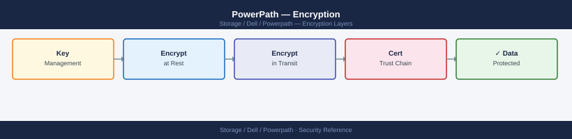

---
tags:
  - dell
  - security
description: "Encryption reference covering Overview, Encryption Responsibility Matrix."
---
# PowerPath — Encryption

Encryption reference covering Overview, Encryption Responsibility Matrix.

*Applies to: PowerPath*

## Before you begin

- **Access:** Storage admin credentials (cluster admin or equivalent)
- **Change management:** security changes require CAB approval in most environments
- **Rollback plan:** document current state before any security control change
- **Testing:** validate in a non-production environment first where possible

---

## Overview

PowerPath operates at the block I/O layer and does not encrypt data in transit between the host and array. Encryption at this layer is handled by:

- **Array-side encryption**: PowerMax, Unity, and PowerStore provide AES-256 encryption at rest on the array; PowerPath is transparent to this
- **Host-side encryption**: Use OS-level encryption (dm-crypt/LUKS on Linux, BitLocker on Windows) on top of the PowerPath pseudo device if host-side encryption is required
- **FC fabric encryption**: Some FC switch vendors (Brocade, Cisco MDS) offer in-flight FC frame encryption; PowerPath is transparent to this

## Encryption Responsibility Matrix

| Encryption Scope | Technology | PowerPath Role |
|---|---|---|
| Data at rest on array | AES-256 (PowerMax/Unity/PowerStore) | Transparent — PowerPath passes I/O through |
| Data in transit (FC fabric) | FC frame encryption (Brocade/Cisco MDS) | Transparent — PowerPath operates above this layer |
| Host-side data at rest | dm-crypt/LUKS (Linux), BitLocker (Windows) | Applied on top of PowerPath pseudo device |
| Management plane | Host OS authentication (SSH, RDP) | Out of scope for PowerPath |

---

## See also

- [Powerpath — Hardening](../hardening/)
- [Powerpath — Authentication](../authentication/)
- [Powerpath — Access Control](../access-control/)
