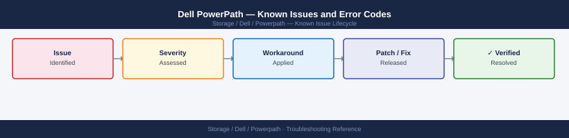

---
tags:
  - troubleshooting
  - powerpath
  - dell
  - known-issues
---
# Dell PowerPath — Known Issues and Error Codes

<div class="kb-summary">
Catalog of known PowerPath bugs, error codes, and workarounds covering path management, installation, and PPMA.

*Applies to: PowerPath/VE, PowerPath for Linux/Windows 6.x*
</div>



```d2
direction: down

symptom: Identify Symptom {shape: diamond}
path_management: "Path Management" {shape: rectangle}
installation_and_licensing: "Installation and Licensing" {shape: rectangle}
ppma_powerpath_management_appliance: "PPMA (PowerPath Management Appliance)" {shape: rectangle}
resolution: Resolve or Escalate {shape: oval}

symptom -> path_management: investigate
symptom -> installation_and_licensing: investigate
symptom -> ppma_powerpath_management_appliance: investigate
path_management -> resolution
installation_and_licensing -> resolution
ppma_powerpath_management_appliance -> resolution
```

## Before you begin

- PowerPath is a kernel-level multipath driver — issues often appear as host I/O errors, not PowerPath messages.
- Linux: `powermt display dev=all` shows path state; `powermt check_registration` verifies license.
- Windows: `powermt display dev=all` from PowerPath Management Console or CLI.

## Path Management

| Error / Symptom | Affected Versions | Cause | Workaround / Fix | Fixed In |
|---|---|---|---|---|
| Device shows `dead` path(s) | PowerPath 6.x | FC port or iSCSI session failure | Check HBA/NIC connectivity; rescan: `powermt restore` | N/A |
| All paths `dead` — device inaccessible | PowerPath 6.x | SAN fabric or storage array issue; or PowerPath license expired | Verify SAN health; check license: `powermt check_registration` | N/A |
| PowerPath not claiming new LUN | PowerPath 6.x | PowerPath auto-claim disabled or device blocked | Run `powermt config` to claim new devices | N/A |

## Installation and Licensing

| Error / Symptom | Affected Versions | Cause | Workaround / Fix | Fixed In |
|---|---|---|---|---|
| `powermt: command not found` after install | Linux | PATH not updated for PowerPath binaries | Add `/sbin` or `/usr/sbin` to PATH; or run `powermt` with full path | N/A |
| `License expired` — paths still active | PowerPath 6.x | Evaluation/trial license expired; permanent license not applied | Apply permanent license: `powermt check_registration -f <license-file>` | N/A |
| PowerPath upgrade fails with `driver conflict` | Linux | Old PowerPath kernel module not removed | Run `powermt uninstall`; reboot; reinstall new version | N/A |

## PPMA (PowerPath Management Appliance)

| Error / Symptom | Affected Versions | Cause | Workaround / Fix | Fixed In |
|---|---|---|---|---|
| PPMA not discovering hosts | PPMA | Agents on hosts not pointing to PPMA IP | Update PowerPath agent config on hosts to point to new PPMA IP | N/A |

## See also

- [Dell PowerPath — Common Issues](../common-issues/)
- [Dell PowerStore — Known Issues](../../powerstore/troubleshooting/known-issues.md)
- [Dell PowerMax — Known Issues](../../powermax/troubleshooting/known-issues.md)
