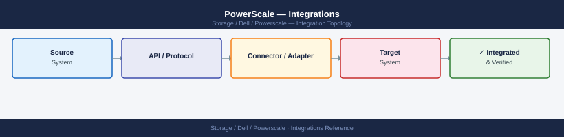

---
tags:
  - architecture
  - dell
description: "Integrations reference covering VMware Integration, Backup Integration, CloudIQ Monitoring, Active Directory / LDAP, REST API."
---
# PowerScale — Integrations

<div class="kb-summary">
Integrations reference covering VMware Integration, Backup Integration, CloudIQ Monitoring, Active Directory / LDAP, REST API.

*Applies to: PowerScale (Isilon) 9.x*
</div>


## VMware Integration

PowerScale integrates with VMware vSphere in several ways:

- **NFS Datastores**: PowerScale NFS exports are used as NFS datastores for vSphere. Mount via the SmartConnect DNS name (not a node IP) to ensure path failover transparency.
- **VAAI-NAS**: PowerScale supports the VMware VAAI-NAS extension via the Dell VAAI NAS plug-in, enabling hardware-accelerated full-copy and fast-file-clone operations for VM cloning and snapshot workflows.
- **VMDK storage for VMs with large unstructured data**: PowerScale `/ifs` is used as NFS-backed storage for VMs handling large file I/O (media transcoding, genomics analysis).
- **vCenter integration**: CloudIQ can surface PowerScale capacity and performance metrics alongside vSphere metrics for holistic capacity management.

NFS datastore tuning for VMware:
- Set NFS export options: `rw,no_root_squash` for vSphere hosts.
- Use NFSv3 for VAAI-NAS compatibility (NFSv4 does not support VAAI-NAS).
- Assign each ESXi cluster its own SmartConnect IP pool to isolate traffic and simplify ACL management.

## Backup Integration

**Veeam Backup & Replication**:
- Use PowerScale NFS or SMB shares as Veeam backup repositories (hardened or standard).
- Veeam SmartCopy for NAS (Veeam v12+) can use PowerScale SnapshotIQ to create application-consistent NAS backup points.
- Configure the backup repository to connect via SmartConnect DNS name.

**NetBackup / Veritas**:
- PowerScale supports NDMP (Network Data Management Protocol) for backup acceleration. Configure the NDMP service: `isi ndmp settings global modify --enabled true`.
- NDMP three-way backup: backup server connects to DD or tape library; PowerScale streams data directly without traversing the backup server.

**CommVault**:
- CommVault File System Agent on an NFS-mounted client, or IntelliSnap with SnapshotIQ for array-level NAS snapshots.

**Dell Data Domain (DDBoost)**:
- SyncIQ can replicate PowerScale data to another PowerScale cluster used as a long-term retention target; from there, Data Domain replication handles offsite DR.

## CloudIQ Monitoring

- **Setup**: Enable telemetry forwarding in OneFS: `isi cloud accounts create` (for CloudPools) and SupportAssist for CloudIQ health monitoring.
- **Capabilities**: Node health scoring, capacity forecasting, throughput anomaly detection, SyncIQ policy health, and quota headroom trending.
- **Alerts**: CloudIQ sends email and push notifications for node failures, capacity threshold crossings, and protection violations.

## Active Directory / LDAP

PowerScale access zones each have their own authentication providers:

```bash
# Join an Active Directory domain for an access zone
isi auth ads create --name EXAMPLE.COM --user Administrator --password <pw> --zone <zone-name>

# Verify AD join status
isi auth ads list --zone <zone-name>

# Add an LDAP provider for a zone
isi auth ldap create --name ldap-prod --server ldap://ldap.example.com \
  --base-dn "dc=example,dc=com" --zone <zone-name>

# List all auth providers for a zone
isi auth providers list --zone <zone-name>
```


```text title="Expected output"
Creating Active Directory domain EXAMPLE.COM for zone System...
Successfully joined domain EXAMPLE.COM
ID                  Name            Status      Domain Controller
--                  ----            ------      -----------------
1                   EXAMPLE.COM     online      dc01.example.com (192.168.1.50)

Name            Type    Server                          Status
----            ----    ------                          ------
EXAMPLE.COM     ads     dc01.example.com                online
ldap-prod       ldap    ldap.example.com                online

ID    Name            Type      Server                    Zone
--    ----            ----      ------                    ----
1     EXAMPLE.COM     ads       dc01.example.com          System
2     ldap-prod       ldap      ldap.example.com          System
```

!!! warning "Common errors"
    **`Error: Failed to join domain EXAMPLE.COM: Authentication failed`** — Verify the Administrator credentials are correct and the account has sufficient permissions to join computers to the domain.
    **`Error: LDAP server ldap://ldap.example.com is unreachable`** — Confirm network connectivity to the LDAP server and that the URI scheme and port are correct (typically ldap:// on port 389 or ldaps:// on port 636).
- Use a dedicated service account for AD join; avoid domain admin credentials.
- For multi-protocol (NFS + SMB) environments, configure both AD (for Windows SIDs) and LDAP/NIS (for Unix UIDs/GIDs) on the same zone, and enable identity mapping.

## REST API

PowerScale OneFS exposes a REST API (PAPI):

```bash
# Base URL
https://<cluster-node>:8080/platform/<version>/

# List cluster nodes
curl -k -u admin:password \
  https://<cluster-node>:8080/platform/1/cluster/nodes

# Get quota information for a path
curl -k -u admin:password \
  "https://<cluster-node>:8080/platform/1/quota/quotas?path=/ifs/data/project"

# Create an NFS export
curl -k -u admin:password -X POST \
  -H "Content-Type: application/json" \
  -d '{"paths":["/ifs/data/newproject"],"clients":["10.0.0.0/24"],"map_root":{"user":"nobody"}}' \
  https://<cluster-node>:8080/platform/2/protocols/nfs/exports

# List SyncIQ policies
curl -k -u admin:password \
  https://<cluster-node>:8080/platform/3/sync/policies
```


```text title="Expected output"
{
  "nodes": [
    {
      "id": 1,
      "hostname": "isilon-node-01.corp.local",
      "ip_address": "192.168.1.10",
      "status": "online",
      "lnn": 1
    },
    {
      "id": 2,
      "hostname": "isilon-node-02.corp.local",
      "ip_address": "192.168.1.11",
      "status": "online",
      "lnn": 2
    },
    {
      "id": 3,
      "hostname": "isilon-node-03.corp.local",
      "ip_address": "192.168.1.12",
      "status": "online",
      "lnn": 3
    }
  ]
}
{
  "quotas": [
    {
      "id": "quota-12345abc",
      "path": "/ifs/data/project",
      "hard_threshold": 1099511627776,
      "soft_threshold": 966367641600,
      "usage": 549755813888,
      "container": true
    }
  ]
}
{
  "id": "export-98765def",
  "paths": ["/ifs/data/newproject"],
  "clients": ["10.0.0.0/24"],
  "map_root": {"user": "nobody"},
  "protocol": "nfs",
  "security_flavors": ["sys"]
}
{
  "policies": [
    {
      "id": "SyncIQ-policy-001",
      "name": "daily-backup-to-dr",
      "source_cluster": "prod-cluster-01",
      "target_cluster": "dr-cluster-02",
      "schedule": "0 2 * * *",
      "enabled": true,
      "last_job_status": "succeeded"
    },
    {
      "id": "SyncIQ-policy-002",
      "name": "hourly-sync-remote",
      "enabled": true,
      "last_job_status": "running"
    }
  ]
}
```

!!! warning "Common errors"
    **`curl: (60) SSL certificate problem: self signed certificate`** — Add the `-k` flag to skip SSL verification, or import the cluster's CA certificate into your system trust store.
    **`curl: (7) Failed to connect to <cluster-node>:8080: Connection refused`** — Verify the cluster node hostname/IP is correct, the management interface is listening on port 8080, and network connectivity exists from your client.
    **`{"errors":[{"code":"EACCES","message":"Access denied"}]}`** — Ensure the admin credentials are correct and the user has sufficient role-based permissions for the requested API endpoint.
Use the `isilon_sdk` Python package for scripted automation: `pip install isilon-sdk`.
API documentation is available at `https://<cluster-node>:8080/platform/latest/`.

---

## See also

- [Powerscale — How It Works](../how-it-works/)
- [Powerscale — Design Standards](../design-standards/)
