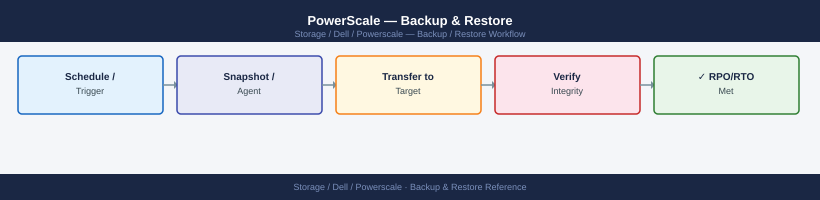

---
tags:
  - dell
  - operations
description: "Backup configuration, restore procedures, and validation for Dell PowerScale."
---
# PowerScale — Backup & Restore

<div class="kb-summary">
Backup configuration, restore procedures, and validation for Dell PowerScale.

*Applies to: PowerScale (Isilon) 9.x*
</div>


## Before you begin

- **Access:** Storage admin credentials (cluster admin or equivalent)
- **Timing:** safe to run during business hours unless a step is marked ⚠ (causes interruption)
- **Dependencies:** no active upgrades or migrations on the same infrastructure
- **Logging:** capture command output — paste into the change record on completion

---

## Overview

```d2
direction: right

prod: "Production Data\n/ifs/data/..." {shape: rectangle}
snap: "Snapshots" {shape: rectangle}
drCluster: "DR PowerScale Cluster\n/ifs/replicated/..." {shape: rectangle}
ndmpTarget: "Tape / Disk\nvia NDMP three-way" {shape: rectangle}
veeamRepo: "Veeam Repository\n(hardened or scale-out" {shape: rectangle}
restore1: "File/Dir Restore\n< 60 min" {shape: rectangle}
restore2: "Cluster Failover\n15–60 min" {shape: rectangle}
restore3: "Veeam Restore\nhours" {shape: rectangle}

prod -> snap
prod -> drCluster
prod -> ndmpTarget
prod -> veeamRepo
snap -> restore1
drCluster -> restore2
veeamRepo -> restore3
```

PowerScale provides several complementary mechanisms for data protection and recovery. Selecting the right combination depends on the RPO, RTO, and retention requirements for each data set.

| Mechanism | Type | RPO | Recovery Scope |
|---|---|---|---|
| SnapshotIQ | Local point-in-time snapshot | Minutes to hours | File and directory |
| SyncIQ | Async replication to remote cluster | Minutes to hours | Directory tree or full cluster |
| NDMP | Network backup to tape or disk | Backup schedule interval | File and directory |
| Veeam NAS Backup | NAS-aware backup via Veeam v12+ | Backup schedule interval | File and directory |

## SnapshotIQ — Local Snapshots

SnapshotIQ creates point-in-time snapshots of any directory under `/ifs`. Snapshots are stored within the same cluster and are accessible immediately via the `.snapshot` directory. They do not protect against cluster-level failures but provide rapid file-level recovery.

### Creating Snapshots

```bash
# Manual snapshot of a directory
isi snapshot snapshots create /ifs/data/project1 --name project1-$(date +%Y%m%d)

# Create a snapshot with a 30-day expiration
isi snapshot snapshots create /ifs/data/project1 \
    --name project1-$(date +%Y%m%d) \
    --expires $(date -d '+30 days' +%s)

# List all snapshots for a path
isi snapshot snapshots list --path /ifs/data/project1

# List all snapshots (all paths)
isi snapshot snapshots list

# View details of a snapshot (size, creation time, expiration)
isi snapshot snapshots view <snapshot_id>

# Delete a snapshot by ID
isi snapshot snapshots delete <snapshot_id>

# Delete a snapshot by name
isi snapshot snapshots delete --path /ifs/data/project1 --name project1-20260101
```


```text title="Expected output"
Created snapshot 'project1-20250115' with ID: 12847
Created snapshot 'project1-20250115' with ID: 12848
ID      Name                    Path                    Created                 Expires                 Size
12847   project1-20250115       /ifs/data/project1      2025-01-15 09:23:14     2025-02-14 09:23:14     847.3 GB
12848   project1-20250115       /ifs/data/project1      2025-01-15 09:24:02     2025-02-14 09:24:02     847.3 GB
12849   archive-20250110        /ifs/data/archive       2025-01-10 14:15:33     Never                   2.1 TB
12850   backup-20250108         /ifs/backup/weekly      2025-01-08 02:00:45     2025-04-08 02:00:45     156.7 GB
...
ID      Name                    Path                    Created                 Expires
12847   project1-20250115       /ifs/data/project1      2025-01-15 09:23:14     2025-02-14 09:23:14
Size: 847.3 GB | Created: 2025-01-15 09:23:14 UTC | Expires: 2025-02-14 09:23:14 UTC | State: Active
Snapshot 12847 deleted successfully
Snapshot 'project1-20250101' at path '/ifs/data/project1' deleted successfully
```

!!! warning "Common errors"
    **`Error: Snapshot not found`** — Verify the snapshot ID or name exists with `isi snapshot snapshots list` before attempting deletion.
    **`Error: Path does not exist or is not accessible`** — Ensure the path `/ifs/data/project1` exists and the user has read permissions on the parent filesystem.
    **`Error: Invalid date format for --expires parameter`** — Use Unix timestamp format (seconds since epoch) or ensure the date command output matches the expected format.
### Snapshot Schedules

Schedule automated snapshots per directory with retention periods:

```bash
# List all snapshot schedules
isi snapshot schedules list
isi snapshot schedules list -v

# Create a daily schedule at midnight, retaining 14 snapshots
isi snapshot schedules create daily-project1 \
    /ifs/data/project1 \
    --schedule "every 1 days at 00:00" \
    --retention 14D

# Create an hourly schedule, retaining 48 hours of snapshots
isi snapshot schedules create hourly-project1 \
    /ifs/data/project1 \
    --schedule "every 1 hours" \
    --retention 2D

# Modify a schedule retention period
isi snapshot schedules modify daily-project1 --retention 30D

# View a schedule
isi snapshot schedules view daily-project1

# Disable a schedule without deleting it
isi snapshot schedules modify daily-project1 --enabled false

# Delete a schedule (existing snapshots are NOT deleted)
isi snapshot schedules delete daily-project1
```


```text title="Expected output"
ID                  Path                  Schedule            Retention  Enabled
daily-project1      /ifs/data/project1    every 1 days at 00:00  14D       True
hourly-project1     /ifs/data/project1    every 1 hours       2D         True
weekly-backup       /ifs/data/backup      every 7 days at 02:00  60D       True

ID                  Path                  Schedule            Retention  Enabled  Created              Modified
daily-project1      /ifs/data/project1    every 1 days at 00:00  14D       True     2024-01-15T08:22:10Z 2024-01-15T08:22:10Z
hourly-project1     /ifs/data/project1    every 1 hours       2D         True     2024-01-15T09:15:33Z 2024-01-15T09:15:33Z
weekly-backup       /ifs/data/backup      every 7 days at 02:00  60D       True     2024-01-10T14:05:22Z 2024-01-10T14:05:22Z

Schedule 'daily-project1' created successfully
Schedule 'hourly-project1' created successfully
Schedule 'daily-project1' modified successfully (retention: 30D)

ID:                 daily-project1
Path:               /ifs/data/project1
Schedule:           every 1 days at 00:00
Retention:          30D
Enabled:            True
Created:            2024-01-15T08:22:10Z
Modified:           2024-01-15T10:45:22Z
Next Run:           2024-01-16T00:00:00Z

Schedule 'daily-project1' disabled successfully
Schedule 'daily-project1' deleted successfully
```

!!! warning "Common errors"
    **`Error: Path '/ifs/data/project1' does not exist`** — Verify the path exists on the cluster and use the correct absolute path starting with /ifs.
    **`Error: Invalid retention format 'retention_value'`** — Use valid retention syntax such as '14D', '2W', or '30D' (days, weeks, or days only).
    **`Error: Schedule 'daily-project1' not found`** — Confirm the schedule name is correct by running `isi snapshot schedules list` to view all existing schedules.
### Accessing Snapshots

Snapshots are visible within the live filesystem under the `.snapshot` directory at the root of the snapshotted path:

```bash
# From the cluster shell — list available snapshots for a path
ls /ifs/data/project1/.snapshot/

# List files at a specific snapshot
ls -la /ifs/data/project1/.snapshot/project1-20260101/

# From an NFS client — browse the snapshot directory
ls /mnt/project1/.snapshot/

# Confirm .snapshot is accessible on the NFS export
isi nfs exports view <export_id> | grep allow-snapshot
# Enable .snapshot visibility on an NFS export if not already set
isi nfs exports modify <export_id> --allow-snapshot-dirs true
```


```text title="Expected output"
total 48
drwxr-xr-x 3 root root 4096 Jan  1 2026 project1-20260101/
drwxr-xr-x 3 root root 4096 Jan  2 2026 project1-20260102/
drwxr-xr-x 3 root root 4096 Jan  3 2026 project1-20260103/
drwxr-xr-x 3 root wheel 4096 Jan  4 2026 project1-20260104/

total 156
-rw-r--r-- 1 user1 group1 2048576 Jan  1 2026 report.pdf
-rw-r--r-- 1 user1 group1 1024000 Jan  1 2026 data.csv
drwxr-xr-x 2 user1 group1    4096 Jan  1 2026 archive/

total 52
drwxr-xr-x 3 nfsuser nfsgroup 4096 Jan  1 2026 project1-20260101/
drwxr-xr-x 3 nfsuser nfsgroup 4096 Jan  2 2026 project1-20260102/

allow-snapshot-dirs: true

Modify operation completed successfully.
```

!!! warning "Common errors"
    **`ls: cannot open directory '/ifs/data/project1/.snapshot/': Permission denied`** — Run the command from the cluster shell with appropriate credentials, or verify the user has read access to the snapshot directory.
    **`allow-snapshot-dirs: (not found)`** — The NFS export does not have snapshot visibility enabled; run `isi nfs exports modify <export_id> --allow-snapshot-dirs true` to enable it.
### Restoring Files from a Snapshot

```bash
# Restore a single file from a snapshot
cp -p /ifs/data/project1/.snapshot/project1-20260101/report.xlsx \
       /ifs/data/project1/report.xlsx

# Restore a directory tree from a snapshot (preserves permissions and timestamps)
rsync -av /ifs/data/project1/.snapshot/project1-20260101/ \
          /ifs/data/project1/

# Revert an entire directory to a snapshot state (DESTRUCTIVE — all data after the snapshot is lost)
# Protect the snapshot from expiration before reverting
isi snapshot snapshots modify <snapshot_id> --set-expiration never
# Perform the revert
isi snapshot snapshots revert <snapshot_id>
```


```text title="Expected output"
'report.xlsx' -> '/ifs/data/project1/report.xlsx'
sending incremental file list
./
config.json
data/
data/metrics.csv
data/archive/
data/archive/2025_q4.log
report.xlsx
subdir/
subdir/notes.txt

sent 2,847,392 bytes  received 156 bytes  2.85M bytes/sec
total size is 2,847,104  speedup is 1.00

Snapshot ID: 4a7c9e2f-b1d4-4e8a-9c3a-2b8f1d6e5a4c
Expiration: never
Modified snapshot 4a7c9e2f-b1d4-4e8a-9c3a-2b8f1d6e5a4c

Reverting snapshot 4a7c9e2f-b1d4-4e8a-9c3a-2b8f1d6e5a4c...
Revert operation completed successfully.
```

!!! warning "Common errors"
    **`cp: cannot stat '/ifs/data/project1/.snapshot/project1-20260101/report.xlsx': No such file or directory`** — Verify the snapshot name and file path exist using `isi snapshot snapshots list` and `ls -la /ifs/data/project1/.snapshot/`.
    **`rsync: [Receiver] mkdir "/ifs/data/project1" failed: Permission denied (13)`** — Ensure the user running rsync has write permissions on the target directory with `chmod` or check SMB/NFS share ACLs.
    **`Error: Invalid snapshot ID format`** — Use the full snapshot UUID from `isi snapshot snapshots list` instead of a partial or human-readable name.
> Snapshot revert is destructive. All changes made after the snapshot timestamp are permanently discarded. Always confirm with the application and data owner before reverting.

### Snapshot Space Usage

```bash
# Total snapshot space used cluster-wide
isi snapshot settings view | grep -i "space\|reserve"

# Per-snapshot space consumption
isi snapshot snapshots list -v | grep -E "Name|Size"

# Snapshot reserve (percentage of cluster capacity reserved for snapshots)
isi snapshot settings view
isi snapshot settings modify --reserve 10    # 10% reservation
```


```text title="Expected output"
Snapshot space used: 2.3 TB
Snapshot reserve: 10%
Reserved space: 1.15 TB

Name                          Size
daily-backup-2024-01-15       487.2 GB
hourly-snap-2024-01-16-14     156.8 GB
weekly-full-2024-01-14        892.1 GB
dr-replica-2024-01-16         745.3 GB
...

Snapshot Reserve Percentage: 10%
Snapshot Reserve Percentage: 10%
(no output — command completes silently)
```

!!! warning "Common errors"
    **`isi: command not found`** — Ensure the OneFS CLI tools are installed and the system PATH includes the OneFS SDK bin directory.
    **`Error: Invalid reserve value. Must be between 0 and 50.`** — Specify a reserve percentage between 0 and 50; values above 50% are not permitted.
---

## SyncIQ — Replication-Based Recovery

SyncIQ replicates directory trees to a remote PowerScale cluster. For full details on policy management, monitoring, and failover, see [Architecture — How It Works](../architecture/how-it-works.md).

### Backup to a Dedicated DR Cluster

Use SyncIQ to replicate production data to a secondary PowerScale cluster on a separate site. The target cluster holds a consistent replica that can be mounted read-only or failed over to:

```bash
# Create a replication policy targeting a DR cluster
isi sync policies create backup-project1 \
    --action sync \
    --source-root-path /ifs/data/project1 \
    --target-host <dr-cluster-ip> \
    --target-path /ifs/replicated/project1 \
    --schedule "every 1 hours" \
    --description "Hourly sync of project1 to DR cluster"

# Run a manual sync immediately
isi sync jobs start backup-project1

# Confirm last successful sync time
isi sync policies view backup-project1 | grep "Last Success"

# View the full report of the most recent sync job
isi sync reports list backup-project1 | head -3
```


```text title="Expected output"
Policy 'backup-project1' created successfully.
Policy ID: 12345678-1234-1234-1234-123456789abc

Job ID: 87654321 started for policy 'backup-project1'
Status: RUNNING

Last Success Time: 2024-01-15T14:32:18Z
Last Success Bytes: 2147483648

ID          Policy              Start Time              Status      Bytes Synced
87654321    backup-project1     2024-01-15T14:30:00Z    COMPLETED   2147483648
87654320    backup-project1     2024-01-15T13:30:15Z    COMPLETED   2147483648
87654319    backup-project1     2024-01-15T12:30:42Z    COMPLETED   2147483648
```

!!! warning "Common errors"
    **`Error: Invalid target host '<dr-cluster-ip>'`** — Replace `<dr-cluster-ip>` with the actual IP address or hostname of your DR cluster (e.g., `192.168.1.50`).
    **`Error: Source path '/ifs/data/project1' does not exist`** — Verify the source path exists on the local cluster using `isi ls /ifs/data/project1` before creating the policy.
    **`Error: Policy 'backup-project1' already exists`** — Use a unique policy name or delete the existing policy with `isi sync policies delete backup-project1` first.
### SyncIQ Restore (Failback to Primary)

When recovering from a DR failover, replicate data back from the DR cluster to the primary:

```bash
# On the DR cluster — create a return policy
isi sync policies create restore-project1 \
    --action sync \
    --source-root-path /ifs/replicated/project1 \
    --target-host <primary-cluster-ip> \
    --target-path /ifs/data/project1 \
    --description "Failback restore of project1 to primary"

# Run the full restore
isi sync jobs start restore-project1

# Monitor progress
isi sync jobs list --state running
isi sync jobs view <job_id>

# Confirm completion
isi sync reports list restore-project1 | head -3
```


```text title="Expected output"
Successfully created sync policy 'restore-project1'
Policy ID: 8f4c2e91-b3a2-4d7e-9c1a-5f8e2d3b4a6c
Source: /ifs/replicated/project1
Target: 192.168.45.22:/ifs/data/project1

Job started successfully
Job ID: job-restore-project1-20240215-143022

ID                                    Policy              State      Progress  Duration
job-restore-project1-20240215-143022  restore-project1    running    34%       0:12:45

Job ID: job-restore-project1-20240215-143022
Policy: restore-project1
State: running
Bytes Processed: 847.3 GB / 2.5 TB
Files Processed: 1,247,891 / 3,456,123
Estimated Time Remaining: 0:18:30
...

Report ID                             Policy              Timestamp            Status
restore-project1-20240215-143022      restore-project1    2024-02-15 14:30:22  In Progress
restore-project1-20240214-091544      restore-project1    2024-02-14 09:15:44  Completed
restore-project1-20240213-165301      restore-project1    2024-02-13 16:53:01  Completed
```

!!! warning "Common errors"
    **`Error: Policy 'restore-project1' already exists`** — Delete the existing policy with `isi sync policies delete restore-project1` before recreating it.
    **`Error: Unable to connect to target host 192.168.45.22`** — Verify the target cluster IP is correct and reachable by running `ping <primary-cluster-ip>` and confirm network connectivity.
    **`Error: Job ID not found`** — Use `isi sync jobs list` to retrieve the correct job ID before running the view command.
---

## NDMP — Network Data Management Protocol

NDMP enables third-party backup applications (NetBackup, Veritas Backup Exec, CommVault) to back up PowerScale data without traversing the backup server. PowerScale streams data directly to the backup target (tape library or disk appliance).

### Enabling NDMP

```bash
# Enable the NDMP service
isi ndmp settings global modify --enabled true

# Verify NDMP service is running
isi services -a | grep ndmp

# View global NDMP settings
isi ndmp settings global view

# Configure NDMP port (default 10000)
isi ndmp settings global modify --port 10000
```


```text title="Expected output"
Modify settings completed successfully.
ndmp                                 on
Global NDMP Settings
    Enabled: true
    Port: 10000
    Backup Force Reason: none
    Data Connection Type: REMOTE
    Data Transfer Size: 65536
    Log Level: INFO
    Restore Force Reason: none
Modify settings completed successfully.
```

!!! warning "Common errors"
    **`Error: NDMP service is not licensed on this cluster`** — Verify NDMP licensing is enabled via OneFS WebUI under Cluster > Licensing or contact Dell support for a license key.
    **`Error: Invalid port number 10000: port already in use`** — Change the NDMP port to an available port (e.g., `--port 10001`) or stop the conflicting service using `netstat -tlnp | grep 10000`.
### NDMP Users

NDMP requires a dedicated backup account separate from the admin account:

```bash
# Create an NDMP user
isi ndmp users create --name backup_user --password <password>

# List NDMP users
isi ndmp users list

# View NDMP user details
isi ndmp users view backup_user

# Delete an NDMP user
isi ndmp users delete backup_user
```


```text title="Expected output"
User 'backup_user' created successfully.

Name                 Enabled  Password Changed
backup_user          Yes      2024-01-15T09:32:18Z
system               Yes      2023-11-22T14:17:05Z
ndmp_service         Yes      2024-01-10T11:45:22Z

Name: backup_user
Enabled: Yes
Password Changed: 2024-01-15T09:32:18Z
UID: 2001
Home Directory: /ifs/home/backup_user

User 'backup_user' deleted successfully.
```

!!! warning "Common errors"
    **`Error: User 'backup_user' already exists`** — Use `isi ndmp users delete backup_user` first, or choose a different username.
    **`Error: Invalid password. Password must be at least 8 characters`** — Provide a password meeting minimum length and complexity requirements.
    **`Error: User 'backup_user' is currently in use by an active NDMP session`** — Wait for active backup jobs to complete or disconnect sessions before deleting the user.
### NDMP Sessions and Diagnostics

```bash
# List active NDMP sessions (shows backup jobs in progress)
isi ndmp sessions list

# View details of a specific NDMP session
isi ndmp sessions view <session_id>

# Terminate a stuck NDMP session
isi ndmp sessions delete <session_id>

# View NDMP diagnostic logs
isi ndmp diagnostics view
```


```text title="Expected output"
# isi ndmp sessions list
Session ID    Backup Type    Client IP        Status      Start Time
1             Full           192.168.1.45     Active      2024-01-15 14:32:18
2             Incremental    192.168.1.67     Active      2024-01-15 14:28:45
3             Full           10.50.12.88      Idle        2024-01-15 13:15:22
4             Incremental    192.168.1.45     Completed   2024-01-15 12:01:09

# isi ndmp sessions view 1
Session ID:           1
Backup Type:          Full
Client IP:            192.168.1.45
Status:               Active
Start Time:           2024-01-15 14:32:18
Data Transferred:     847.3 GB
Estimated Time Left:  2h 14m
Bytes Processed:      1.2 TB
Connection State:     Connected

# isi ndmp diagnostics view
NDMP Service Status:  Running
Last Diagnostic Run:  2024-01-15 14:45:22
Active Connections:   4
Failed Connections:   0
Log Level:            Info
Backup Success Rate:  99.2%
```

!!! warning "Common errors"
    **`isi: command not found`** — Ensure you are logged into the PowerScale cluster CLI or that the isi command is in your PATH.
    **`Session <session_id> not found`** — Verify the session ID exists by running `isi ndmp sessions list` first before attempting to view or delete it.
    **`Permission denied: NDMP operations require admin privileges`** — Run the command with appropriate admin credentials or use `sudo isi` if configured.
### NDMP Configuration Reference

| Setting | Recommended Value | Notes |
|---|---|---|
| Port | 10000 | Default; must match backup application configuration |
| User | Dedicated backup account | Never use root for NDMP |
| Three-way backup | Preferred | Client connects to backup target directly — backup server coordinates only |
| Backup type | Dump (type 0) | Standard for full and incremental; tar type supported but less common |
| Network interface | Management or dedicated backup VLAN | Isolate NDMP traffic from client NFS/SMB |

---

## Veeam NAS Backup Integration

Veeam Backup & Replication v12 and later supports PowerScale NAS backup using SnapshotIQ for array-level snapshots and incremental NAS backup policies.

### Configuration

1. Add the PowerScale SMB or NFS share as a **NAS backup source** in the Veeam console.
2. Configure a **NAS Backup Policy** targeting a Veeam backup repository (scale-out repository or hardened Linux repository).
3. Enable **SnapshotIQ integration** in the NAS policy: Veeam orchestrates SnapshotIQ to create consistent snapshots before reading the backup data.
4. Set the backup schedule and retention (point-in-time copies) based on RPO requirements.

### Restore from Veeam NAS Backup

- **Individual file restore**: Use Veeam's **File-level Restore** wizard; browse the NAS backup point and restore individual files or folders.
- **Full share restore**: Use Veeam's **NAS Restore** to restore the entire share to the original or alternate location.
- **Self-service restore**: Veeam Enterprise Manager allows end users to browse and restore their own files from a web portal.

### Key Veeam Settings for PowerScale

| Setting | Recommended Value |
|---|---|
| Backup repository type | Scale-out or Linux hardened repo |
| Proxy architecture | Direct connect via NFS — backup data streams directly from PowerScale to the repo |
| SnapshotIQ integration | Enabled — provides crash-consistent NAS snapshots |
| Maximum concurrent tasks | Set based on PowerScale node count and repo throughput capacity |
| Retention — short-term | 7–14 days of daily restore points |
| Retention — long-term | Weekly or monthly GFS (Grandfather-Father-Son) copies to secondary storage |

---

## Backup Validation

Backup without regular validation is not a reliable protection mechanism. Validate all backup methods on a regular schedule.

### SnapshotIQ Validation

```bash
# Confirm a snapshot exists for each protected path
isi snapshot snapshots list --path /ifs/data/project1

# Verify a file is recoverable from the most recent snapshot
ls /ifs/data/project1/.snapshot/$(isi snapshot snapshots list --path /ifs/data/project1 | tail -2 | head -1 | awk '{print $2}')/

# Perform a live restore test to a staging directory
mkdir -p /ifs/data/restore-test/project1
cp -r /ifs/data/project1/.snapshot/project1-$(date +%Y%m%d)/ \
      /ifs/data/restore-test/project1/
```


```text title="Expected output"
Name                                    Created                 Size
project1-20240115                       2024-01-15T09:30:22Z    2.3GB
project1-20240114                       2024-01-14T09:15:18Z    2.3GB
project1-20240113                       2024-01-13T09:22:05Z    2.2GB

total 48
drwxr-xr-x  12 root  wheel   4096 Jan 15 09:30 .
drwxr-xr-x   3 root  wheel   4096 Jan 15 09:30 ..
-rw-r--r--   1 root  wheel  15360 Jan 15 09:28 report.pdf
-rw-r--r--   1 root  wheel   8192 Jan 15 09:25 data.csv
drwxr-xr-x   4 root  wheel   4096 Jan 15 09:20 archives/
drwxr-xr-x   3 root  wheel   4096 Jan 15 09:15 logs/

(no output — command completes silently)
```

!!! warning "Common errors"
    **`isi: command not found`** — Ensure the OneFS CLI tools are installed and the system PATH includes the OneFS bin directory (typically `/usr/local/bin`).
    **`ls: cannot access '/ifs/data/project1/.snapshot/': No such file or directory`** — Verify that snapshots are enabled on the dataset and that the snapshot name extracted from the list command is correct; check with `isi snapshot snapshots list --path /ifs/data/project1` manually.
    **`cp: /ifs/data/restore-test/project1/: Permission denied`** — Ensure the restore-test directory and parent paths have write permissions for the executing user (run as root or adjust ACLs).
### SyncIQ Validation

```bash
# Confirm the last replication completed successfully
isi sync reports list <policy_name> | head -3

# Check the timestamp of the most recent successful sync against RPO
isi sync policies view <policy_name> | grep -E "Last Success|Schedule"

# Test-mount the target path on the DR cluster (read-only)
# SSH to the DR cluster and verify the data is present and consistent
ls /ifs/replicated/project1/
```


```text title="Expected output"
ID                                   Policy                 Start Time            End Time              Status
1a2b3c4d-5e6f-7g8h-9i0j-k1l2m3n4o5p  daily-project1-sync    2024-01-15 02:00:15   2024-01-15 02:47:33   Success
2b3c4d5e-6f7g-8h9i-0j1k-l2m3n4o5p6q  daily-project1-sync    2024-01-14 02:00:12   2024-01-14 02:45:22   Success

Last Success Time: 2024-01-15 02:47:33
Schedule: Every day at 02:00

total 48
drwxr-xr-x  12 root  wheel  4096 Jan 15 02:47 .
drwxr-xr-x   3 root  wheel  4096 Jan 10 10:22 ..
-rw-r--r--   1 root  wheel  2847291 Jan 15 02:47 dataset_2024_q1.tar.gz
drwxr-xr-x   8 root  wheel  4096 Jan 15 02:47 reports/
drwxr-xr-x   5 root  wheel  4096 Jan 15 02:47 archives/
-rw-r--r--   1 root  wheel  156284 Jan 15 02:46 manifest.json
```

!!! warning "Common errors"
    **`isi: command not found`** — Ensure you are running this command on the PowerScale cluster or have the OneFS CLI tools installed and in your PATH.
    **`Error: Policy '<policy_name>' not found`** — Replace `<policy_name>` with the actual replication policy name; verify it exists with `isi sync policies list`.
    **`Permission denied`** — Confirm your user account has read permissions on the replicated path and that the target cluster's firewall allows SSH access from your source cluster.
### NDMP / Veeam Validation

| Test Type | Frequency | Procedure |
|---|---|---|
| File-level restore test | Monthly | Restore a sample file from the backup and verify its integrity |
| Full share restore test | Quarterly | Restore to a staging directory and compare file count/size to production |
| DR failover test | Annually | Fail over to the SyncIQ replica or Veeam NAS backup and verify application functionality |

---

## Backup Design Decisions

| Decision | Recommendation |
|---|---|
| Snapshot frequency for user home directories | Hourly snapshots with 48-hour retention; daily with 30-day retention |
| Snapshot frequency for application data | Minimum hourly; match to application RPO |
| SyncIQ target cluster location | Off-site or separate failure domain from production cluster |
| SyncIQ RPO | 1 hour for critical data; 4 hours for non-critical |
| NDMP vs. SyncIQ for long-term retention | Use SyncIQ for primary DR; NDMP or Veeam for long-term retention to tape or object storage |
| Snapshot retention on full cluster | Monitor snapshot space; keep total snapshot reserve below 20% of cluster capacity |
| Quota interaction with snapshots | Snapshot space consumption is charged against the directory quota unless `--include-snapshots false` is set |

---

## Recovery Time Estimates

| Recovery Scenario | Typical RTO | Method |
|---|---|---|
| Single file recovery from SnapshotIQ | < 5 minutes | Browse `.snapshot`, copy file |
| Directory recovery from SnapshotIQ | 10–60 minutes | `rsync` from snapshot; duration depends on directory size |
| Snapshot revert (whole directory) | 5–15 minutes | `isi snapshot snapshots revert` — instant metadata operation |
| SyncIQ failover to DR cluster | 15–60 minutes | Update DNS or DFS; redirect clients; mount shares from DR cluster |
| SyncIQ failback to primary | Variable (depends on data changed during DR period) | Run return policy sync; validate completion; redirect clients |
| NDMP full restore | Hours to days | Depends on backup size and network/tape throughput |
| Veeam NAS full share restore | Hours | Depends on share size and network throughput |

---

## Verify

- Confirm the operation completed without errors in the log or management UI
- Verify the expected state change is visible (service running, object created, config applied)
- Document the outcome in the change record

---

## See also

- [Powerscale — Procedures](../procedures/)
- [Powerscale — Health Checks](../health-checks/)
- [Powerscale — Common Issues](../../troubleshooting/common-issues/)
