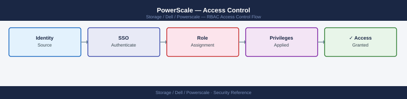

---
tags:
  - dell
  - security
---
# PowerScale — Access Control

<div class="kb-summary">
Roles, permissions, and least privilege access for Dell PowerScale.

*Applies to: PowerScale (Isilon) 9.x*
</div>


## Before you begin

- **Access:** Storage admin credentials (cluster admin or equivalent)
- **Change management:** security changes require CAB approval in most environments
- **Rollback plan:** document current state before any security control change
- **Testing:** validate in a non-production environment first where possible

---

## RBAC

PowerScale uses role-based administration for cluster management:

| Role | Permissions |
|---|---|
| `SystemAdmin` | Full cluster administration including security, users, and hardware |
| `AuditAdmin` | Read access to all audit logs and events; cannot change configuration |
| `BackupAdmin` | Permission to read all files for backup purposes (NDMP/snapshot) regardless of file ACLs |
| `VMwareAdmin` | Access to VMware-related cluster functions (vVols, VAAI) |
| `SecurityAdmin` | Manage authentication providers, zones, and user role assignments |
| `ISI_PRIV_AUTH` | Privilege to manage authentication configuration (AD, LDAP, NIS) |
| `ISI_PRIV_SNAPSHOT` | Privilege to create and manage SnapshotIQ policies |
| `ISI_PRIV_SYNCIQ` | Privilege to manage SyncIQ replication policies |

Create custom roles and assign specific privileges:
```bash
isi auth roles create --name ReadOnlyMonitor --description "Read-only cluster monitoring"
isi auth roles modify ReadOnlyMonitor --add-priv ISI_PRIV_LOGIN_CONSOLE
isi auth roles modify ReadOnlyMonitor --add-priv ISI_PRIV_STATISTICS
isi auth roles modify ReadOnlyMonitor --add-user <username>
```


```text title="Expected output"
Created role 'ReadOnlyMonitor'
Modified role 'ReadOnlyMonitor'
Modified role 'ReadOnlyMonitor'
Modified role 'ReadOnlyMonitor'
```

!!! warning "Common errors"
    **`Error: Role 'ReadOnlyMonitor' already exists`** — Delete the existing role with `isi auth roles delete ReadOnlyMonitor` before recreating it, or use `isi auth roles modify` for all operations.
    **`Error: Invalid privilege 'ISI_PRIV_STATISTICS'`** — Verify the correct privilege name with `isi auth privileges list` and use the exact case-sensitive name.
    **`Error: User '<username>' does not exist`** — Create the user first with `isi auth users create --name <username>` or use an existing username from `isi auth users list`.
## Access Zones

Access zones partition the cluster into separate namespaces — each with its own NFS exports, SMB shares, and authentication providers:

```bash
# List zones
isi zone zones list
isi zone zones view <zone_name>

# Create a zone
isi zone zones create <zone_name> --path /ifs/<path>

# Assign auth providers to a zone
isi zone zones modify <zone_name> --add-auth-providers <provider>
```


```text title="Expected output"
# List zones
Name                    Path                    Auth Providers
default                 /ifs                    local
secure-data             /ifs/secure             local,ldap-corp
archive-zone            /ifs/archive            local,ad-prod
backup-tier             /ifs/backup             local

# View zone details
Zone: secure-data
Path: /ifs/secure
Auth Providers: local, ldap-corp
Groupnet: groupnet0
Access Zone ID: 2

# Create a zone
Created access zone 'prod-zone' with path '/ifs/prod-zone'

# Assign auth providers
Modified access zone 'prod-zone'
Added auth providers: ad-prod
```

!!! warning "Common errors"
    **`Error: Access zone '<zone_name>' does not exist`** — Verify the zone name with `isi zone zones list` and ensure it is spelled correctly.
    **`Error: Path '/ifs/<path>' already exists and is in use by another zone`** — Choose a unique path that is not already assigned to another access zone.
    **`Error: Auth provider '<provider>' is not configured`** — Configure the auth provider first using `isi auth providers` commands before assigning it to a zone.
## Audit Logging

```bash
# Enable protocol audit logging (NFS, SMB events)
isi audit settings global modify --auditing-enabled true

# View audit configuration
isi audit settings global view

# Set syslog forwarding for audit events
isi audit settings global modify \
  --cee-server-uri http://siem.example.com:12228/cee

# View recent audit log entries (protocol access events)
isi audit log view
```


```text title="Expected output"
Auditing is now enabled.
Auditing is now enabled.

Auditing is now enabled.

Audit Log Entries:
ID          Timestamp                Protocol  User        Action      Resource            Status
1847392     2024-01-15T14:32:18Z    NFS       root        READ        /ifs/data/file.txt  Success
1847393     2024-01-15T14:32:22Z    SMB       domain\jsmith WRITE      \\share\docs\report.docx Success
1847394     2024-01-15T14:32:45Z    NFS       nfsuser     MKDIR       /ifs/archive/2024   Success
1847395     2024-01-15T14:33:01Z    SMB       domain\admin DELETE      \\share\temp\old.zip Success
1847396     2024-01-15T14:33:18Z    NFS       root        SETATTR     /ifs/data           Success
```

!!! warning "Common errors"
    **`Error: Invalid URI format for cee-server-uri`** — Verify the SIEM server URI is reachable and uses the correct format (http/https with valid hostname and port).
    **`Error: Auditing cannot be enabled: insufficient cluster quorum`** — Ensure all nodes in the cluster are online and healthy before enabling audit logging.
- Audit events cover: file open, read, write, delete, rename, permission change, and authentication events.
- Forward to a syslog receiver or a Dell Common Event Enabler (CEE) API endpoint for SIEM integration.
- Retain audit logs for a minimum of 12 months; 24 months for regulated environments.

## Compliance Notes

| Framework | Relevant Control | PowerScale Capability |
|---|---|---|
| PCI-DSS | Requirement 3 (data at rest encryption) | SED-based AES-256 encryption |
| PCI-DSS | Requirement 10 (audit logging) | Protocol and admin audit logging via CEE |
| HIPAA | §164.312 (access control) | Access zones, RBAC, and per-share ACLs |
| GDPR | Article 32 (security of processing) | Encryption in transit (SMB3, SyncIQ TLS) and at rest (SED) |
| ISO 27001 | A.9 (access control) | RBAC roles, AD/LDAP integration, root squash on NFS |

---

## See also

- [Powerscale — Authentication](../authentication/)
- [Powerscale — Hardening](../hardening/)
- [Powerscale — Encryption](../encryption/)
