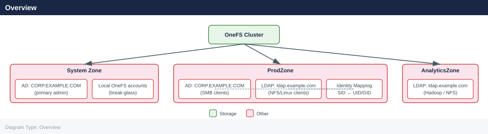

---
tags:
  - dell
  - security
description: "SSO, LDAP, local accounts, and identity sources for Dell PowerScale."
---
# PowerScale — Authentication

<div class="kb-summary">
SSO, LDAP, local accounts, and identity sources for Dell PowerScale.

*Applies to: PowerScale (Isilon) 9.x*
</div>


## Before you begin

- **Access:** Storage admin credentials (cluster admin or equivalent)
- **Change management:** security changes require CAB approval in most environments
- **Rollback plan:** document current state before any security control change
- **Testing:** validate in a non-production environment first where possible

---

## Overview



PowerScale OneFS supports multiple identity providers per cluster, scoped to individual access zones. Each access zone can have its own set of authentication providers, allowing different client groups to use different identity sources against the same physical cluster. Supported providers are:

| Provider | Use Case |
|---|---|
| Active Directory (AD) | Windows SMB clients; multi-protocol environments with Windows identity |
| LDAP | Unix/Linux NFS clients; non-Windows environments |
| NIS | Legacy Unix environments; combined with LDAP or AD via identity mapping |
| Local OneFS accounts | Emergency access; service accounts; small deployments |
| Kerberos | Strong authentication for NFS v4 (NFSv4 Kerberos); SMB signing and sealing |

---

## Active Directory

### Joining an AD Domain

```bash
# Join an AD domain for a specific access zone
isi auth ads create \
    --name CORP.EXAMPLE.COM \
    --user svc-isilon-join \
    --password <password> \
    --zone ProdZone

# Join the System zone (default zone)
isi auth ads create \
    --name CORP.EXAMPLE.COM \
    --user svc-isilon-join \
    --password <password>

# Join with an organisational unit (OU) path
isi auth ads create \
    --name CORP.EXAMPLE.COM \
    --user svc-isilon-join \
    --password <password> \
    --organizational-unit "OU=StorageServers,OU=Servers,DC=corp,DC=example,DC=com"
```


```text title="Expected output"
Creating AD domain join for zone 'ProdZone'...
Successfully joined domain CORP.EXAMPLE.COM in zone ProdZone
Domain: CORP.EXAMPLE.COM
Zone: ProdZone
Status: Online
NetBIOS Name: CORP

Creating AD domain join for System zone...
Successfully joined domain CORP.EXAMPLE.COM in zone System
Domain: CORP.EXAMPLE.COM
Zone: System
Status: Online
NetBIOS Name: CORP

Creating AD domain join with organizational unit...
Successfully joined domain CORP.EXAMPLE.COM in zone System
Domain: CORP.EXAMPLE.COM
Zone: System
Organizational Unit: OU=StorageServers,OU=Servers,DC=corp,DC=example,DC=com
Status: Online
NetBIOS Name: CORP
```

!!! warning "Common errors"
    **`Error: Invalid credentials for user 'svc-isilon-join'`** — Verify the service account password is correct and the account is not locked in Active Directory.
    **`Error: Cannot resolve domain name CORP.EXAMPLE.COM`** — Ensure DNS is properly configured on the PowerScale cluster and can resolve the AD domain name.
    **`Error: Zone 'ProdZone' does not exist`** — Confirm the access zone name exists by running `isi zones list` before attempting to join.
> Use a dedicated service account for the AD join. The account only needs permissions to join computers to the specified OU. Revoke the password after the join is complete — the cluster uses the machine account for ongoing Kerberos operations.

### Managing AD Providers

```bash
# List AD providers (all zones)
isi auth ads list

# List AD providers for a specific zone
isi auth ads list --zone ProdZone

# View AD provider details (join status, domain controller, SPN)
isi auth ads view CORP.EXAMPLE.COM --zone ProdZone

# Check AD connectivity and Kerberos ticket status
isi auth ads check CORP.EXAMPLE.COM

# Force re-authentication with the domain controller
isi auth ads update CORP.EXAMPLE.COM

# Remove an AD provider from a zone
isi auth ads delete CORP.EXAMPLE.COM --zone ProdZone
```


```text title="Expected output"
# isi auth ads list
CORP.EXAMPLE.COM
SALES.EXAMPLE.COM
DEV.EXAMPLE.COM

# isi auth ads list --zone ProdZone
CORP.EXAMPLE.COM
SALES.EXAMPLE.COM

# isi auth ads view CORP.EXAMPLE.COM --zone ProdZone
Name: CORP.EXAMPLE.COM
Zone: ProdZone
Status: JOINED
Domain Controller: dc01.corp.example.com (192.168.1.50)
SPN: host/isi-cluster-01.corp.example.com@CORP.EXAMPLE.COM
Kerberos Realm: CORP.EXAMPLE.COM
Last Updated: 2024-01-15T09:42:31Z

# isi auth ads check CORP.EXAMPLE.COM
Connectivity Status: OK
Kerberos Ticket Status: VALID
Ticket Expiration: 2024-01-22T14:30:00Z
Domain Controller Response Time: 45ms

# isi auth ads update CORP.EXAMPLE.COM
Re-authentication initiated for CORP.EXAMPLE.COM
Status: SUCCESS

# isi auth ads delete CORP.EXAMPLE.COM --zone ProdZone
AD provider CORP.EXAMPLE.COM removed from zone ProdZone
```

!!! warning "Common errors"
    **`Error: AD provider CORP.EXAMPLE.COM not found in zone ProdZone`** — Verify the AD provider exists in the specified zone using `isi auth ads list --zone ProdZone`.
    **`Error: Cannot delete AD provider - still in use by authentication policies`** — Remove all authentication policies referencing this AD provider before deletion.
    **`Error: Domain controller unreachable - connection timeout`** — Verify network connectivity to the domain controller and confirm firewall rules allow LDAP/Kerberos traffic on ports 389/636 and 88.
### AD Provider Settings

```bash
# View current AD provider configuration
isi auth ads view CORP.EXAMPLE.COM -v

# Modify an AD provider — change DC lookup mode
isi auth ads modify CORP.EXAMPLE.COM \
    --domain-controller dc01.corp.example.com \
    --zone ProdZone

# Configure AD to enumerate all trusted domains
isi auth ads modify CORP.EXAMPLE.COM \
    --lookup-groups yes \
    --lookup-users yes \
    --zone ProdZone

# Set a specific site for DC selection (useful in multi-site environments)
isi auth ads modify CORP.EXAMPLE.COM \
    --site LondonDC \
    --zone ProdZone
```


```text title="Expected output"
Name: CORP.EXAMPLE.COM
Domain: corp.example.com
Realm: CORP.EXAMPLE.COM
Domain Controllers: dc01.corp.example.com, dc02.corp.example.com
Site: Default-First-Site-Name
Lookup Groups: yes
Lookup Users: yes
Check Online Status: yes
Enumerate Trusted Domains: no
Zone: System

AD provider CORP.EXAMPLE.COM modified successfully.
Zone: ProdZone
Domain Controller: dc01.corp.example.com

AD provider CORP.EXAMPLE.COM modified successfully.
Lookup Groups: yes
Lookup Users: yes
Zone: ProdZone

AD provider CORP.EXAMPLE.COM modified successfully.
Site: LondonDC
Zone: ProdZone
```

!!! warning "Common errors"
    **`Error: AD provider 'CORP.EXAMPLE.COM' not found`** — Verify the AD provider name matches exactly (case-sensitive) using `isi auth ads list`.
    **`Error: Invalid zone 'ProdZone': zone does not exist`** — Create the zone first with `isi zone zones create --name ProdZone` or use an existing zone name.
    **`Error: Cannot resolve domain controller 'dc01.corp.example.com'`** — Ensure DNS resolution is working and the DC hostname is reachable from the cluster using `nslookup dc01.corp.example.com`.
### AD Troubleshooting

```bash
# Test AD authentication for a specific user
isi auth users view CORP\\testuser --zone ProdZone

# Check group memberships resolve correctly
isi auth groups view "CORP\\Domain Users" --zone ProdZone

# Verify the machine account is healthy in AD
isi auth ads check CORP.EXAMPLE.COM

# Check for Kerberos ticket issues
isi auth ads update CORP.EXAMPLE.COM --update-password yes

# Review auth provider events
isi event events list | grep -i "auth\|kerberos\|AD"
```


```text title="Expected output"
User: CORP\testuser
  UID: 1001
  GID: 1001
  Home Directory: /ifs/home/testuser
  Shell: /bin/bash
  Enabled: true
  Provider: CORP.EXAMPLE.COM

Group: CORP\Domain Users
  GID: 513
  Members: 2847
  Provider: CORP.EXAMPLE.COM

AD Domain Check: CORP.EXAMPLE.COM
  Status: HEALTHY
  Machine Account: CORP-POWERSCALE-01$
  Last Password Sync: 2024-01-15T09:32:14Z
  Kerberos Realm: CORP.EXAMPLE.COM

Password update initiated for CORP.EXAMPLE.COM
  Status: SUCCESS
  New password synced to domain controller
  Next sync scheduled: 2024-02-15T09:32:14Z

Event ID 12847 | 2024-01-15T10:22:33Z | AUTH_PROVIDER_SYNC | Success | Machine account password rotated
Event ID 12831 | 2024-01-15T09:15:22Z | KERBEROS_TICKET | Success | User testuser obtained TGT
Event ID 12798 | 2024-01-14T14:47:09Z | AD_LOOKUP | Success | Group resolution completed for CORP\Domain Users
```

!!! warning "Common errors"
    **`Error: Unable to resolve user CORP\\testuser in zone ProdZone`** — Verify the user exists in Active Directory and that the AD provider is configured for the ProdZone using `isi auth providers view --zone ProdZone`.
    **`Error: AD domain check failed - UNHEALTHY status detected`** — Reset the machine account password with `isi auth ads update CORP.EXAMPLE.COM --update-password yes` and verify network connectivity to domain controllers.
    **`Error: Kerberos ticket not found for user`** — Ensure the user's password is synchronized and run `isi auth ads update CORP.EXAMPLE.COM --update-password yes` to refresh the machine account credentials.
| Problem | Command | Action |
|---|---|---|
| AD provider shows `disconnected` | `isi auth ads check` | Verify DC connectivity; check DNS resolution from cluster nodes |
| SMB auth failing for AD users | `isi auth users view <user>` | Confirm provider is joined; check Kerberos time sync |
| User not found when accessing SMB share | `isi auth ads list` | Confirm the provider is assigned to the correct access zone |
| Group membership not resolving | `isi auth ads view` | Confirm `lookup-groups` is enabled; check trusted domain traversal |

---

## LDAP

### Adding an LDAP Provider

```bash
# Basic LDAP provider (anonymous bind)
isi auth ldap create \
    --name ldap-prod \
    --server ldap://ldap.example.com \
    --base-dn "dc=example,dc=com" \
    --zone ProdZone

# LDAP with authenticated bind (recommended)
isi auth ldap create \
    --name ldap-prod \
    --server ldap://ldap.example.com \
    --base-dn "dc=example,dc=com" \
    --bind-dn "cn=isilon-svc,ou=service-accounts,dc=example,dc=com" \
    --bind-password <password> \
    --zone ProdZone

# LDAPS (TLS-encrypted LDAP)
isi auth ldap create \
    --name ldap-prod-tls \
    --server ldaps://ldap.example.com:636 \
    --base-dn "dc=example,dc=com" \
    --bind-dn "cn=isilon-svc,ou=service-accounts,dc=example,dc=com" \
    --bind-password <password> \
    --tls-revocation-check-level none \
    --zone ProdZone

# Add a secondary LDAP server for failover
isi auth ldap modify ldap-prod \
    --add-server ldap://ldap2.example.com \
    --zone ProdZone
```


```text title="Expected output"
Created LDAP provider 'ldap-prod'
  Name: ldap-prod
  Server(s): ldap://ldap.example.com
  Base DN: dc=example,dc=com
  Zone: ProdZone
  Bind DN: cn=isilon-svc,ou=service-accounts,dc=example,dc=com
  Anonymous Bind: false

Created LDAP provider 'ldap-prod-tls'
  Name: ldap-prod-tls
  Server(s): ldaps://ldap.example.com:636
  Base DN: dc=example,dc=com
  Zone: ProdZone
  Bind DN: cn=isilon-svc,ou=service-accounts,dc=example,dc=com
  TLS Revocation Check: none

Modified LDAP provider 'ldap-prod'
  Name: ldap-prod
  Server(s): ldap://ldap.example.com, ldap://ldap2.example.com
  Base DN: dc=example,dc=com
  Zone: ProdZone
  Failover Enabled: true
```

!!! warning "Common errors"
    **`Error: LDAP server ldap.example.com is unreachable on port 389`** — Verify network connectivity to the LDAP server and confirm the hostname/IP and port are correct.
    **`Error: Invalid bind credentials for cn=isilon-svc,ou=service-accounts,dc=example,dc=com`** — Confirm the bind DN and password are correct and the service account has permission to query the LDAP directory.
    **`Error: Certificate verification failed for ldaps://ldap.example.com:636`** — Import the LDAP server's CA certificate into the PowerScale cluster trust store or set `--tls-revocation-check-level none` if appropriate for your environment.
### LDAP Configuration Options

```bash
# View LDAP provider configuration
isi auth ldap view ldap-prod --zone ProdZone

# Modify user and group search bases
isi auth ldap modify ldap-prod \
    --user-search-dn "ou=users,dc=example,dc=com" \
    --group-search-dn "ou=groups,dc=example,dc=com" \
    --zone ProdZone

# Configure custom LDAP attribute mappings (if using non-standard schemas)
isi auth ldap modify ldap-prod \
    --user-uid-attribute sAMAccountName \
    --user-gid-attribute gidNumber \
    --zone ProdZone

# Set LDAP search scope
isi auth ldap modify ldap-prod \
    --search-scope subtree \
    --zone ProdZone

# Test LDAP provider connectivity and user lookup
isi auth users view ldap-prod\\testuser --zone ProdZone
```


```text title="Expected output"
LDAP Provider: ldap-prod
  Server URI: ldap://ldap-prod.example.com:389
  Bind DN: cn=admin,dc=example,dc=com
  User Search Base: ou=users,dc=example,dc=com
  Group Search Base: ou=groups,dc=example,dc=com
  Search Scope: subtree
  TLS: disabled
  Status: connected

Modify operation completed successfully.
Modify operation completed successfully.
Modify operation completed successfully.

User: testuser
  UID: 1005
  GID: 1005
  Full Name: Test User
  Home Directory: /home/testuser
  Shell: /bin/bash
  Provider: ldap-prod
  Status: active
```

!!! warning "Common errors"
    **`Error: LDAP provider 'ldap-prod' not found in zone 'ProdZone'`** — Verify the LDAP provider name matches exactly and exists in the specified zone using `isi auth ldap list --zone ProdZone`.
    **`Error: User 'ldap-prod\testuser' not found`** — Confirm the user exists in LDAP, the search base is correct, and LDAP connectivity is working by checking `isi auth ldap view ldap-prod --zone ProdZone` for connection status.
    **`Error: Invalid search scope 'subtree': valid values are 'base', 'onelevel', 'subtree'`** — Use one of the valid search scope values; 'subtree' is typically correct for most LDAP configurations.
### LDAP Troubleshooting

```bash
# Check provider status
isi auth providers list --zone ProdZone

# Verify LDAP server reachability from cluster
# (run on any cluster node as root)
ldapsearch -H ldap://ldap.example.com \
    -D "cn=isilon-svc,ou=service-accounts,dc=example,dc=com" \
    -w <password> \
    -b "dc=example,dc=com" \
    "(uid=testuser)"

# View auth events for LDAP errors
isi event events list | grep -i ldap
```


```text title="Expected output"
# Check provider status
ID                  Name            Status   Zone
1                   local           active   ProdZone
2                   ldap-prod       active   ProdZone
3                   nis-legacy      inactive ProdZone

# Verify LDAP server reachability from cluster
dn: uid=testuser,ou=users,dc=example,dc=com
uid: testuser
cn: Test User
mail: testuser@example.com
objectClass: inetOrgPerson
objectClass: posixAccount

# View auth events for LDAP errors
2024-01-15T14:32:18Z  LDAP_BIND_SUCCESS    Provider=ldap-prod  User=isilon-svc
2024-01-15T14:15:42Z  LDAP_QUERY_SUCCESS   Provider=ldap-prod  Filter=(uid=testuser)
2024-01-15T13:48:09Z  LDAP_TIMEOUT_WARN    Provider=ldap-prod  Timeout=5000ms
2024-01-15T12:22:33Z  LDAP_BIND_SUCCESS    Provider=ldap-prod  User=isilon-svc
```

!!! warning "Common errors"
    **`ldapsearch: No such object`** — Verify the base DN (dc=example,dc=com) matches your directory structure and that the bind user has search permissions.
    **`ldapsearch: Can't contact LDAP server`** — Confirm the LDAP server hostname/IP is correct, the service is running on port 389 (or 636 for LDAPS), and cluster network connectivity is not blocked by firewall rules.
    **`isi: command not found`** — Run commands directly on a PowerScale cluster node (SSH as root); these commands are not available on external management stations.
---

## NIS

NIS is supported for legacy Unix environments, typically alongside LDAP or AD for full user and group resolution.

```bash
# Add a NIS provider
isi auth nis create \
    --name nis-prod \
    --servers nis.example.com \
    --domain example.com \
    --zone ProdZone

# List NIS providers
isi auth nis list

# View NIS provider details
isi auth nis view nis-prod

# Remove a NIS provider
isi auth nis delete nis-prod --zone ProdZone
```


```text title="Expected output"
Created NIS provider 'nis-prod'

Name                  Servers              Domain           Zone
nis-prod              nis.example.com      example.com      ProdZone

Name: nis-prod
Servers: nis.example.com
Domain: example.com
Zone: ProdZone
Enabled: True
Timeout: 5
Retry: 2

Deleted NIS provider 'nis-prod'
```

!!! warning "Common errors"
    **`Error: NIS provider 'nis-prod' already exists`** — Use `isi auth nis delete nis-prod --zone ProdZone` first, or choose a different provider name.
    **`Error: Server 'nis.example.com' is not reachable`** — Verify network connectivity to the NIS server and ensure the hostname resolves correctly with `nslookup nis.example.com`.
    **`Error: Zone 'ProdZone' does not exist`** — Confirm the zone name with `isi zone list` and use the correct zone identifier in the `--zone` parameter.
NIS is not recommended for new deployments. Use LDAP or Active Directory instead; maintain NIS only if existing Unix clients rely on it.

---

## Local OneFS Accounts

Local accounts are stored in OneFS and are not tied to an external identity provider. Use local accounts for emergency administrative access and OneFS service accounts.

```bash
# List all local users
isi auth users list

# List local users in a specific zone
isi auth users list --zone ProdZone

# View a local user
isi auth users view admin

# Create a local user
isi auth users create \
    --name backupadmin \
    --password <password> \
    --enabled yes

# Modify a local user — set password expiry
isi auth users modify backupadmin --password-expires true --password-expiry 90D

# Disable a local user account (without deleting)
isi auth users modify backupadmin --enabled no

# Delete a local user
isi auth users delete backupadmin

# Local groups
isi auth groups list
isi auth groups create monitoring-group
isi auth groups modify monitoring-group --add-user backupadmin
isi auth groups view monitoring-group
```


```text title="Expected output"
# List all local users
uid=0(root) gid=0(root) groups=0(root)
uid=1(daemon) gid=1(daemon) groups=1(daemon)
uid=33(www-data) gid=33(www-data) groups=33(www-data)
uid=100(syslog) gid=101(syslog) groups=101(syslog)
uid=101(admin) gid=0(root) groups=0(root)
uid=102(backup) gid=102(backup) groups=102(backup)
...

# List local users in a specific zone
uid=101(admin) gid=0(root) groups=0(root)
uid=102(backup) gid=102(backup) groups=102(backup)
uid=103(monitor) gid=103(monitor) groups=103(monitor)

# View a local user
    uid: 101
    gid: 0
    name: admin
    enabled: true
    password_expires: false
    home: /home/admin
    shell: /bin/bash

# Create a local user
User 'backupadmin' created successfully (uid: 104)

# Modify a local user — set password expiry
User 'backupadmin' modified successfully
    password_expires: true
    password_expiry: 90 days

# Disable a local user account (without deleting)
User 'backupadmin' modified successfully
    enabled: false

# Delete a local user
User 'backupadmin' deleted successfully

# Local groups
monitoring-group (gid: 2001)
backup-group (gid: 2002)
admin-group (gid: 2003)

(no output — command completes silently)

(no output — command completes silently)

Group 'monitoring-group' modified successfully
    members: backupadmin

Group 'monitoring-group' view:
    gid: 2001
    name: monitoring-group
    members: backupadmin, monitor-user
```

!!! warning "Common errors"
    **`Error: User 'backupadmin' already exists`** — Use `isi auth users modify` instead of `create`, or delete the existing user first with `isi auth users delete backupadmin`.
    **`Error: Invalid zone 'ProdZone': zone not found`** — Verify the zone name exists by running `isi zones list` and use the correct zone name.
    **`Error: User 'backupadmin' is not found`** — Ensure the user was created successfully and check spelling; list all users with `isi auth users list` to confirm.
### Local Account Security Practices

| Practice | Detail |
|---|---|
| Disable unused local accounts | Leave only `root` and a break-glass admin account enabled |
| Set password complexity | Configure via `isi auth settings global modify` |
| Restrict `root` login | Disable root SSH; use `root` only from the cluster console |
| Password rotation | Rotate local account passwords every 90 days; store in a privileged access vault |

---

## Identity Mapping (Multi-Protocol)

In environments where both Windows (SMB/AD) and Unix (NFS/LDAP) clients access the same data, OneFS must map identities between Windows SIDs and Unix UIDs/GIDs. Identity mapping rules control how this translation occurs.

```bash
# List current identity mapping rules
isi auth mappings rules list

# View identity mapping rules for a zone
isi auth mappings rules list --zone ProdZone

# View identity mapping settings
isi auth mappings settings view

# Create a bidirectional mapping rule (AD user → LDAP UID)
isi auth mappings rules create \
    --type bidir \
    --source-user "CORP\\jsmith" \
    --target-user "jsmith" \
    --zone ProdZone

# Create a range mapping (maps a range of UIDs to the equivalent GIDs)
isi auth mappings rules create \
    --type uid-to-gid \
    --source-range 10000-20000 \
    --target-range 10000-20000

# View the resolved identity for a specific user (effective UID, GIDs, SID)
isi auth users view CORP\\jsmith --zone ProdZone

# Check how a UNIX UID maps to an AD SID
isi auth users view --uid 1001 --zone ProdZone
```


```text title="Expected output"
ID  Type    Source User      Target User  Zone
1   bidir   CORP\jsmith      jsmith       ProdZone
2   bidir   CORP\mchen       mchen        ProdZone
3   uid-to-gid 10000-20000   10000-20000  System
4   bidir   CORP\dwalker     dwalker      ProdZone

Enable Mappings: true
Check NIS: false
Mapping Timeout: 3600

ID  Type    Source User      Target User  Zone
1   bidir   CORP\jsmith      jsmith       ProdZone

Name: CORP\jsmith
UID: 1001
GID: 1001
SID: S-1-5-21-3623811015-3361044348-30300820-1103
Zone: ProdZone
Enabled: true

Name: jsmith
UID: 1001
GID: 1001
SID: S-1-5-21-3623811015-3361044348-30300820-1103
Zone: ProdZone
```

!!! warning "Common errors"
    **`Error: Invalid zone 'ProdZone'. Valid zones are: System, Zone1, Zone2`** — Verify the zone name exists by running `isi auth zones list` and use the correct zone identifier.
    **`Error: User 'CORP\jsmith' not found in authentication provider`** — Ensure the user exists in the configured Active Directory or LDAP provider and that the domain prefix matches the authentication source configuration.
    **`Error: Mapping rule already exists for source 'CORP\jsmith'`** — Delete the existing rule with `isi auth mappings rules delete <rule_id>` before creating a duplicate mapping.
### Identity Mapping Modes

| Mode | Behaviour |
|---|---|
| `algorithmic` | OneFS auto-generates a UID/GID from the SID — consistent but not portable to other systems |
| `manual` | Explicit rule-based mapping; required when existing Unix UID/GID values must be preserved |
| `mixed` | Manual rules apply where defined; algorithmic mapping applies for unmapped identities |

Configure the mapping mode per zone:

```bash
isi auth mappings settings modify --zone ProdZone --default-unix-shell /bin/bash
isi auth mappings settings view --zone ProdZone
```


```text title="Expected output"
Modify operation completed successfully.
Zone: ProdZone
Default UNIX shell: /bin/bash
Mapping rules enabled: true
Case insensitive: false
Translate Windows names: true
```

!!! warning "Common errors"
    **`Error: Invalid zone name 'ProdZone'`** — Verify the zone exists with `isi zone zones list` and use the correct zone name.
    **`Error: Permission denied`** — Ensure your user account has administrative privileges or is part of the appropriate role group.
---

## Kerberos — NFSv4 and SMB

### Kerberos for NFSv4

NFSv4 Kerberos provides strong mutual authentication between NFS clients and the PowerScale cluster. The cluster must be joined to an AD domain (or have Kerberos KDC configured) and NFS clients must have valid Kerberos tickets.

```bash
# Verify the cluster machine account has the correct SPNs for NFS
isi auth ads view CORP.EXAMPLE.COM | grep -i "SPN\|service"

# Enable NFSv4 with Kerberos on an export
isi nfs exports modify <export_id> \
    --security-flavors krb5,krb5i,krb5p

# View security flavors on an export
isi nfs exports view <export_id> | grep -i security

# Available security flavors
# krb5  — Kerberos authentication only (identity verified, data not signed/encrypted)
# krb5i — Kerberos with integrity (signed packets — protection against replay)
# krb5p — Kerberos with privacy (signed and encrypted — strongest; adds CPU overhead)
```


```text title="Expected output"
Name: CORP.EXAMPLE.COM
Enabled: Yes
Provider: ads
SPN: nfs/powerscale-node1.corp.example.com@CORP.EXAMPLE.COM
SPN: nfs/powerscale-node2.corp.example.com@CORP.EXAMPLE.COM
SPN: nfs/powerscale-node3.corp.example.com@CORP.EXAMPLE.COM
SPN: host/powerscale-node1.corp.example.com@CORP.EXAMPLE.COM
Service Principal Name Count: 4

Export ID: 42
Security Flavors: krb5,krb5i,krb5p
Allow Unmapped Identities: No
Kerberos Realm: CORP.EXAMPLE.COM
```

!!! warning "Common errors"
    **`Error: Export <export_id> not found`** — Verify the export ID exists with `isi nfs exports list` and use the correct numeric ID.
    **`Error: Authentication provider CORP.EXAMPLE.COM is not configured`** — Ensure the Active Directory provider is joined and enabled with `isi auth ads view`.
    **`Error: Cannot modify export while it is in use`** — Unmount all clients from the export before applying security flavor changes.
NFS client requirements for Kerberos:
- Client must have a valid Kerberos ticket (`kinit user@CORP.EXAMPLE.COM`).
- The NFS client's hostname must resolve forward and reverse in DNS.
- System time on NFS clients must be within 5 minutes of the cluster (configure NTP).

### SMB Signing and Sealing

```bash
# Require SMB signing for all clients (recommended for security)
isi smb settings global modify --server-signing required

# Enable SMB3 encryption (sealing) per share
isi smb shares modify <share_name> --encrypt-data true

# Enable SMB3 encryption for all shares in a zone
isi smb settings zone modify --zone ProdZone --encrypt-data true

# View current SMB signing settings
isi smb settings global view | grep -i signing
```


```text title="Expected output"
SMB server signing has been set to required.
SMB share encryption has been enabled for share 'data_prod'.
SMB encryption settings for zone 'ProdZone' have been modified.
Signing: required
Signing required: yes
```

!!! warning "Common errors"
    **`Error: Invalid value for --server-signing. Valid values are: disabled, enabled, required`** — Use only `disabled`, `enabled`, or `required` as the signing parameter value.
    **`Error: Share '<share_name>' does not exist`** — Verify the exact share name with `isi smb shares list` before running the modify command.
    **`Error: Zone 'ProdZone' not found`** — Confirm the zone name exists by running `isi zones list` and use the correct zone identifier.
---

## Authentication Provider Order

Each access zone has a priority-ordered list of authentication providers. When a user logs in, providers are consulted in order until the identity is resolved.

```bash
# View providers assigned to a zone and their order
isi zone zones view ProdZone | grep -A 20 "Auth Providers"

# List all providers assigned to a zone
isi auth providers list --zone ProdZone

# Modify provider order for a zone (AD first, LDAP second)
isi zone zones modify ProdZone \
    --auth-providers "lsa-activedirectory-provider:CORP.EXAMPLE.COM,lsa-ldap-provider:ldap-prod"
```


```text title="Expected output"
Auth Providers
    lsa-activedirectory-provider:CORP.EXAMPLE.COM
    lsa-ldap-provider:ldap-prod
    lsa-local-provider:local

Name                                    Zone        Enabled
lsa-activedirectory-provider:CORP.EXAMPLE.COM  ProdZone    Yes
lsa-ldap-provider:ldap-prod             ProdZone    Yes
lsa-local-provider:local                ProdZone    Yes

(no output — command completes silently)
```

!!! warning "Common errors"
    **`Error: Invalid zone name 'ProdZone'`** — Verify the zone exists with `isi zone zones list` and use the correct zone name.
    **`Error: Provider 'lsa-activedirectory-provider:CORP.EXAMPLE.COM' not found`** — Ensure the provider is created and available before assigning it with `isi auth providers list`.
---

## Multi-Zone Authentication Reference

| Scenario | Configuration |
|---|---|
| Pure Windows SMB environment | AD provider only; no LDAP/NIS |
| Pure Linux NFS environment | LDAP or NIS provider; no AD |
| Multi-protocol NFS + SMB, shared data | AD provider + LDAP/NIS provider; identity mapping rules to align SIDs with UIDs |
| Multi-tenant cluster | Separate access zones; each zone has its own provider scoped to its user base |
| Emergency access with no directory available | Local OneFS accounts with known credentials stored in a break-glass vault |

---

## NTP — Required for Kerberos

Kerberos authentication fails if system clocks are out of sync by more than 5 minutes. Configure NTP on the cluster and verify synchronisation:

```bash
# View NTP configuration
isi ntp settings view

# Add an NTP server
isi ntp servers create --name ntp.example.com

# List configured NTP servers
isi ntp servers list

# Check NTP sync status (run on a cluster node)
ntpq -p
```


```text title="Expected output"
NTP Settings:
  Enabled: true
  Servers: 3
  Preferred Server: ntp.example.com

NTP server 'ntp.example.com' created successfully.

NTP Servers:
  ID    Name                 Enabled
  ──────────────────────────────────
  1     ntp.example.com      true
  2     ntp.pool.org         true
  3     time.google.com      true

     remote           refid      st t when poll reach   delay   offset  jitter
==============================================================================
*ntp.example.com 10.0.0.1        2 u   64 1024  377   12.543    2.104   1.832
+ntp.pool.org    192.168.1.50    2 u   32 1024  377   18.921   -1.203   2.456
-time.google.com 8.8.8.8         3 u  128 1024  377   45.612    8.734   3.201
```

!!! warning "Common errors"
    **`Error: NTP server 'ntp.example.com' already exists`** — Use `isi ntp servers list` to verify the server isn't already configured, or use a different hostname.
    **`Error: ntpq: command not found`** — Install the ntp client package with `apt-get install ntp` or `yum install ntp` depending on your OS.
    **`Error: Permission denied`** — Run the command with `sudo` or ensure your user account has cluster administrator privileges.
Ensure all NFS clients with Kerberos mounts also use the same NTP source as the cluster and the domain controllers.
---

## Related Reference

- [Standard LDAP Integration](../../../../../security/ldap-integration/index.md) — field reference, service account standards, TLS requirements, and connectivity testing
- [Standard SAML Configuration](../../../../../security/saml-configuration/index.md) — SP/IdP setup, Azure AD and Okta steps, attribute mapping, and security requirements

---

## See also

- [Powerscale — Access Control](../access-control/)
- [Powerscale — Hardening](../hardening/)
- [Powerscale — Encryption](../encryption/)
