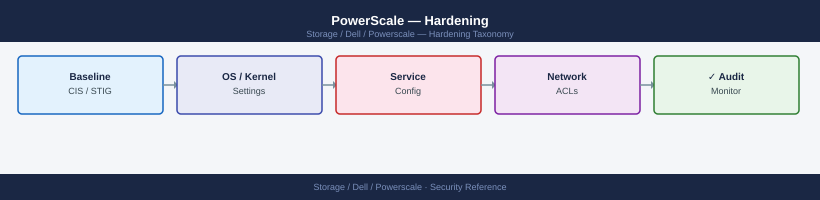
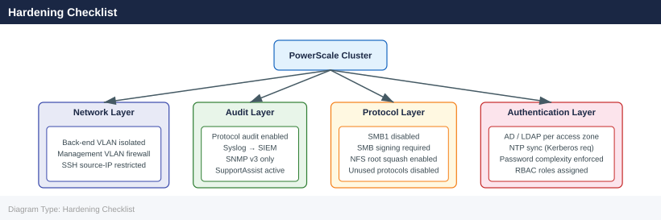

---
tags:
  - dell
  - security
description: "Security baselines and compliance configuration for Dell PowerScale."
---
# PowerScale — Hardening

<div class="kb-summary">
Security baselines and compliance configuration for Dell PowerScale.

*Applies to: PowerScale (Isilon) 9.x*
</div>


## Before you begin

- **Access:** Storage admin credentials (cluster admin or equivalent)
- **Change management:** security changes require CAB approval in most environments
- **Rollback plan:** document current state before any security control change
- **Testing:** validate in a non-production environment first where possible

---

## Hardening Checklist



Apply all items before placing a cluster into production. Re-verify after each major upgrade.

### Initial Setup

- [ ] Change the default `root` and `admin` passwords immediately after cluster initialisation; store in a privileged access vault
- [ ] Rename or disable the `admin` account if a named service account is being used for administration
- [ ] Configure the cluster name to match the naming standard (`<site>-ps-<number>`) before exposing the cluster to clients
- [ ] Register the cluster in the CMDB with owner, site, support contract, and serial number

### Network Hardening

- [ ] Isolate the back-end cluster network (InfiniBand or 10/25 GbE) on a dedicated VLAN — client traffic must not reach the back-end network
- [ ] Restrict management interface access to management VLAN source IPs using firewall rules or OneFS IP access rules
- [ ] Enable HTTPS-only access to the OneFS management GUI; disable HTTP access
- [ ] Restrict SSH to management VLAN source IPs — block SSH from client VLANs
- [ ] Apply SmartConnect IP pool source filters to ensure each access zone only accepts client connections from authorised subnets

### Protocol Hardening

- [ ] Enable SMB signing: `isi smb settings global modify --server-signing required`
- [ ] Disable SMB1 globally: `isi smb settings global modify --support-smb1 false`
- [ ] Enable NFS root squash on all exports unless there is a documented technical exception
- [ ] Disable unused protocols per access zone (FTP, HDFS, S3 if not required)
- [ ] Set NFS export client lists explicitly — do not use wildcards (`*`) on production exports
- [ ] Enable NFSv4 and disable NFSv3 where all clients support v4; NFSv4 supports stronger security flavors

### Authentication Hardening

- [ ] Join each access zone to the appropriate identity provider (AD, LDAP) — do not use local accounts for regular client access
- [ ] Disable or restrict the `root` local account from SSH login; use named accounts with sudo-equivalent roles
- [ ] Configure NTP with at least two NTP servers — required for Kerberos authentication
- [ ] Configure password complexity and expiration for all local OneFS accounts: `isi auth settings global modify`
- [ ] Review and remove any stale or unused NDMP user accounts

### Audit and Monitoring

- [ ] Enable protocol audit logging for NFS, SMB access events: `isi audit settings global modify --auditing-enabled true`
- [ ] Configure audit log forwarding to the centralised SIEM via syslog or CEE: `isi audit settings global modify --cee-server-uri http://siem.example.com:12228/cee`
- [ ] Configure SNMP v3 (not v2c) for monitoring integration: `isi snmp settings modify --snmp-v3-access-enable yes`
- [ ] Enable email or SIEM alerting for CRITICAL cluster events via alert channels
- [ ] Configure SupportAssist (PhoneHome) for automatic case creation on hardware faults

### Quota and Data Protection

- [ ] Apply SmartQuota hard limits to all user-accessible directories before production data lands
- [ ] Set advisory and soft thresholds below the hard limit to provide advance warning before write failures
- [ ] Set minimum protection level to N+2 on all production node pools

---

## Commands

### Disable HTTP, Enforce HTTPS

```bash
# Enforce HTTPS-only for the management API and web UI
# (Block HTTP at the firewall level; OneFS redirects HTTP to HTTPS by default)

# View current HTTPS/TLS settings
isi https settings view

# Set minimum TLS version to 1.2
isi https settings modify --tls-min-version 1.2

# Configure session timeout for the web UI (15 minutes recommended)
isi web settings modify --session-timeout 900
```


```text title="Expected output"
HTTPS Settings
  Enable HTTPS: Yes
  Port: 8080
  Redirect HTTP to HTTPS: Yes
  TLS Min Version: 1.1
  TLS Max Version: 1.3
  Ciphers: DEFAULT
  Certificate: /etc/isi_cert.pem

Modify HTTPS settings completed successfully.

Modify web settings completed successfully.
```

!!! warning "Common errors"
    **`Error: Invalid TLS version '1.2'. Supported versions: 1.0, 1.1, 1.3`** — Verify the OneFS version supports TLS 1.2 (requires OneFS 8.0+) and use a supported version string.
    **`Error: session-timeout must be between 60 and 86400 seconds`** — Adjust the timeout value; 900 seconds (15 minutes) is valid, so check for typos or ensure the parameter name is exactly `--session-timeout`.
### Disable SMB1 and Enforce SMB Signing

```bash
# Disable SMBv1 (legacy; insecure — affected by WannaCry and EternalBlue)
isi smb settings global modify --support-smb1 false

# Require SMB packet signing on all connections
isi smb settings global modify --server-signing required

# Verify settings
isi smb settings global view | grep -E "smb1|signing"
```


```text title="Expected output"
SMB settings modified successfully.
SMB settings modified successfully.
support_smb1: false
server_signing: required
```

!!! warning "Common errors"
    **`Error: Invalid value 'false' for parameter support-smb1`** — Use `--support-smb1=false` with an equals sign, or check your OneFS version supports this parameter name.
    **`Error: Connection refused to 192.168.1.10:8080`** — Ensure you are connected to the PowerScale cluster management IP and have network access to port 8080.
### NFS Root Squash

Root squash maps NFS client UID 0 (root) to the anonymous user (typically `nobody`). This prevents an NFS client root user from having unrestricted access to cluster data.

```bash
# View current root squash settings on an export
isi nfs exports view <export_id> | grep -E "root|squash|map"

# Enable root squash on all clients (map root to nobody)
isi nfs exports modify <export_id> \
    --map-root user:nobody

# For an export that requires root access (e.g., backup host), add only that IP to root-clients
isi nfs exports modify <export_id> \
    --add-root-clients 10.0.1.5 \
    --map-root user:nobody

# Global NFS settings — default squash behaviour
isi nfs settings export view | grep -i "map\|root"
isi nfs settings export modify --map-root user:nobody
```


```text title="Expected output"
root_mapping: user:nobody
squash_uid: 65534
squash_gid: 65534
map_failure: deny
root_clients: 10.0.1.5, 10.0.2.10

Name                          Value
map_root                       user:nobody
map_failure                    deny
map_non_root                   user:nobody
ignore_unregistered_clients    False

(no output — command completes silently)

Name                          Value
map_root                       user:nobody
map_non_root                   user:nobody
map_failure                    deny
```

!!! warning "Common errors"
    **`Error: Export <export_id> not found`** — Verify the export ID exists with `isi nfs exports list` and use the correct identifier.
    **`Error: Invalid user 'nobody' — user does not exist on this cluster`** — Create the nobody user or use an existing local user with `isi auth users list`.
### Disable Unused Protocols Per Access Zone

```bash
# View current protocol status for a zone
isi zone zones view <zone_name> | grep -i protocol

# Disable FTP for a zone (if not in use)
isi ftp settings global modify --enabled false

# Disable HDFS for a zone
isi hdfs settings global modify --enabled false

# Disable S3 in an access zone
isi s3 settings zone modify --zone <zone_name> --service false

# Verify which services are running
isi services -a | grep running
```


```text title="Expected output"
Protocol: nfs
Protocol: smb
Protocol: ftp
Protocol: hdfs
(no output — command completes silently)
(no output — command completes silently)
(no output — command completes silently)
Service: nfs                    Status: running
Service: smb                    Status: running
Service: ftp                    Status: running
Service: hdfs                   Status: running
Service: s3                     Status: running
Service: http                   Status: running
Service: syslog                 Status: running
Service: ntp                    Status: running
...
```

!!! warning "Common errors"
    **`isi: command not found`** — Ensure you are logged into the PowerScale cluster CLI or have the OneFS SDK installed on your local system.
    **`Error: Invalid zone name '<zone_name>'`** — Replace `<zone_name>` with an actual access zone name; verify it exists with `isi zone zones list`.
    **`Error: Service cannot be disabled in this zone`** — Confirm the service is not actively in use by clients before attempting to disable it, or check cluster-wide dependencies with `isi services -a`.
### Restrict SSH Access

```bash
# View SSH configuration
isi ssh settings view

# Restrict SSH to specific source IPs (management VLAN only)
# Done via firewall rules at the network level — not natively enforced in OneFS
# Alternatively, configure /etc/hosts.allow on each node (TCP wrappers)
# Best practice: use a jump host / bastion in the management VLAN

# Disable root SSH login (use named accounts with role-based access)
# Edit /etc/ssh/sshd_config on each node: PermitRootLogin no
# Or use the OneFS security policy if available in your version
isi ssh settings modify --allow-root-login no 2>/dev/null || \
    echo "Restrict root SSH login via /etc/ssh/sshd_config on each node"
```


```text title="Expected output"
SSH Settings
  Allow Root Login: true
  Allow Password Authentication: true
  Allow Public Key Authentication: true
  Port: 22
  Max Auth Tries: 6
  Client Alive Interval: 300

Restrict root SSH login via /etc/ssh/sshd_config on each node
```

!!! warning "Common errors"
    **`isi: command not found`** — Ensure you are running this command on a PowerScale cluster node with OneFS installed, not a remote management workstation.
    **`Error: Permission denied`** — Run the command with appropriate administrative privileges (sudo or as root account with SSH key authentication).
### SNMP v3 Configuration

```bash
# Disable SNMP v1 and v2c (insecure community strings)
isi snmp settings modify \
    --snmp-v1-v2c-access-enable no \
    --snmp-v3-access-enable yes

# Configure SNMP v3 with authentication and privacy
isi snmp settings modify \
    --snmp-v3-access-enable yes \
    --system-contact "infra-team@corp.example.com" \
    --system-location "DC1-Row3-Rack5-Node1"

# View SNMP settings
isi snmp settings view

# Create an SNMP v3 user with auth + privacy
isi snmp v3users create \
    --name monitoring-user \
    --auth-password <auth_password> \
    --priv-password <priv_password> \
    --auth-type SHA \
    --priv-type AES
```


```text title="Expected output"
SNMP v1/v2c access:                                    disabled
SNMP v3 access:                                        enabled
System contact:                                        infra-team@corp.example.com
System location:                                       DC1-Row3-Rack5-Node1
Engine ID:                                             80:00:1f:88:03:00:08:a2:c0:a8:01:42
Read community:                                        (not set)
Write community:                                       (not set)
SNMP v3 users:
  Name                 Auth Type    Priv Type    Status
  monitoring-user      SHA          AES          active
```

!!! warning "Common errors"
    **`Error: SNMP v1/v2c access cannot be disabled while SNMP v3 access is disabled`** — Enable SNMP v3 access before disabling v1/v2c, or combine both modifications in a single command.
    **`Error: User 'monitoring-user' already exists`** — Delete the existing user with `isi snmp v3users delete --name monitoring-user` before recreating it.
    **`Error: Authentication password must be at least 8 characters`** — Ensure both `<auth_password>` and `<priv_password>` meet minimum length requirements (typically 8+ characters).
### Audit Logging

```bash
# Enable protocol audit logging (NFS and SMB access events)
isi audit settings global modify --auditing-enabled true

# Set the syslog audit target
isi audit settings global modify \
    --syslog-forwarding-enabled true \
    --syslog-server siem.example.com \
    --syslog-facility local6

# Configure CEE (Common Event Enabler) forwarding for SIEM integration
isi audit settings global modify \
    --cee-server-uri "http://siem.example.com:12228/cee"

# Enable configuration change audit (admin actions)
isi audit settings global modify --config-auditing-enabled true

# View current audit configuration
isi audit settings global view

# View audit topics (what events are captured)
isi audit topics list
isi audit topics view protocol
```


```text title="Expected output"
Auditing enabled successfully.
Syslog forwarding enabled successfully.
CEE forwarding configured successfully.
Configuration auditing enabled successfully.

Audit Settings
  Auditing Enabled: true
  Config Auditing Enabled: true
  Syslog Forwarding Enabled: true
  Syslog Server: siem.example.com
  Syslog Facility: local6
  CEE Server URI: http://siem.example.com:12228/cee
  Audit Log Path: /ifs/audit

Topics
  protocol
  auth
  config
  data_movement
  antivirus

Protocol Topic Details
  Topic Name: protocol
  Description: NFS and SMB protocol access events
  Enabled: true
  Audit Events: nfs_read, nfs_write, smb_open, smb_close, smb_delete
  Retention Days: 90
```

!!! warning "Common errors"
    **`Error: Invalid syslog server address 'siem.example.com'`** — Verify DNS resolution with `nslookup siem.example.com` or use the IP address directly.
    **`Error: CEE server URI is unreachable at 'http://siem.example.com:12228/cee'`** — Confirm the SIEM server is running and accessible on port 12228 from the PowerScale cluster.
    **`Error: Insufficient privileges to modify audit settings`** — Run the command as root or a user with cluster administration role using `isi auth login`.
### Restrict IP Pool Access by Subnet

Limit which source IPs can connect to each access zone's IP pool:

```bash
# View IP pool configuration
isi network pools view <pool_name>

# Set source IP restrictions on a pool (only allow connections from authorised subnets)
isi network pools modify <pool_name> \
    --sc-subnet <allowed_subnet>

# Alternatively, enforce access zone path restrictions via NFS export client lists
# and SMB share permissions — restrict client lists to known IP ranges
```


```text title="Expected output"
Name: pool-prod-01
Description: Production client access pool
Subnet: 192.168.10.0/24
Gateway: 192.168.10.1
Aggregation Address: 192.168.10.50
Ranges:
  - Start: 192.168.10.100
    End: 192.168.10.200
Access Zone: System
SC Subnets: 10.0.0.0/8
Rebalance Policy: auto
```

!!! warning "Common errors"
    **`Error: pool <pool_name> does not exist`** — Verify the pool name with `isi network pools list` and use the correct name from the output.
    **`Error: invalid subnet format '<allowed_subnet>'`** — Ensure the subnet is in CIDR notation (e.g., `10.0.0.0/8`) and is a valid IP range.
---

## Role-Based Administration

Apply the principle of least privilege for cluster administrators:

```bash
# List all available privileges
isi auth privileges list

# Create a read-only monitoring role (no configuration changes)
isi auth roles create \
    --name ReadOnlyMonitor \
    --description "Read-only cluster monitoring — no configuration access"
isi auth roles modify ReadOnlyMonitor --add-priv ISI_PRIV_LOGIN_CONSOLE
isi auth roles modify ReadOnlyMonitor --add-priv ISI_PRIV_STATISTICS
isi auth roles modify ReadOnlyMonitor --add-priv ISI_PRIV_EVENT_READ

# Create a backup operator role
isi auth roles create \
    --name BackupOperator \
    --description "NDMP backup operations only"
isi auth roles modify BackupOperator --add-priv ISI_PRIV_LOGIN_CONSOLE
isi auth roles modify BackupOperator --add-priv ISI_PRIV_BACKUP

# Assign a role to a user
isi auth roles modify ReadOnlyMonitor --add-user <username>
isi auth roles modify ReadOnlyMonitor --add-group "CORP\\StorageMonitoring"

# View roles assigned to a user
isi auth users view <username> | grep -i role

# List all roles and their members
isi auth roles list
isi auth roles view ReadOnlyMonitor
```


```text title="Expected output"
ISI_PRIV_LOGIN_CONSOLE
ISI_PRIV_STATISTICS
ISI_PRIV_EVENT_READ
ISI_PRIV_BACKUP
ISI_PRIV_QUOTA_READ
ISI_PRIV_NDMP_ADMIN
ISI_PRIV_CLUSTER_READ
...

Role ReadOnlyMonitor created successfully.
(no output — command completes silently)
(no output — command completes silently)
(no output — command completes silently)

Role BackupOperator created successfully.
(no output — command completes silently)
(no output — command completes silently)

(no output — command completes silently)
(no output — command completes silently)

Roles: ReadOnlyMonitor, BackupOperator

Name: ReadOnlyMonitor
Description: Read-only cluster monitoring — no configuration access
Members: jsmith, CORP\StorageMonitoring
Privileges: ISI_PRIV_LOGIN_CONSOLE, ISI_PRIV_STATISTICS, ISI_PRIV_EVENT_READ

Name: BackupOperator
Description: NDMP backup operations only
Members: (none)
Privileges: ISI_PRIV_LOGIN_CONSOLE, ISI_PRIV_BACKUP
```

!!! warning "Common errors"
    **`Error: Role 'ReadOnlyMonitor' already exists`** — Use `isi auth roles modify` instead of `create`, or delete the existing role first with `isi auth roles delete ReadOnlyMonitor`.
    **`Error: User '<username>' not found in authentication provider`** — Verify the username exists in the configured directory service (Active Directory/LDAP) using `isi auth users list`.
    **`Error: Invalid privilege 'ISI_PRIV_BACKUP' for this role type`** — Confirm the privilege name is correct by running `isi auth privileges list` and checking exact spelling.
### Recommended Role Structure

| Role | Members | Privileges |
|---|---|---|
| `StorageAdmin` | Named storage administrators | Full cluster administration |
| `ReadOnlyMonitor` | Monitoring and NOC team | Statistics, events, status — read only |
| `BackupOperator` | Backup service account | NDMP access; snapshot management |
| `SyncIQOperator` | Replication team | SyncIQ policy management |
| `SecurityAuditor` | Security team | Audit log access; no configuration |

---

## Security Baseline Validation

Run these checks to confirm the hardening baseline is in place:

```bash
# Confirm SMB1 is disabled
isi smb settings global view | grep -i smb1
# Expected: support_smb1: No

# Confirm SMB signing is required
isi smb settings global view | grep -i signing
# Expected: server_signing: Required

# Confirm audit logging is enabled
isi audit settings global view | grep -i auditing
# Expected: auditing_enabled: Yes

# Confirm SNMP v3 is enabled and v1/v2c disabled
isi snmp settings view | grep -E "v1_v2c|v3"
# Expected: snmp_v1_v2c_access_enable: No, snmp_v3_access_enable: Yes

# Confirm HTTPS min TLS version
isi https settings view | grep -i tls
# Expected: tls_min_version: 1.2

# Confirm NFS exports do not use wildcards
isi nfs exports list -v | grep -E "Clients:|Root Clients:|Read Write Clients:"
# Review for any entry with * — replace with specific CIDRs

# Confirm SyncIQ policies require encryption
isi sync policies list -v | grep -E "Name|Encryption"
# Expected: encryption_required: Yes for all policies carrying sensitive data

# Confirm no unused local user accounts are enabled
isi auth users list | grep -v "Enabled: No"
```


```text title="Expected output"
support_smb1: No
server_signing: Required
auditing_enabled: Yes
snmp_v1_v2c_access_enable: No
snmp_v3_access_enable: Yes
tls_min_version: 1.2
Clients: 192.168.1.0/24
Root Clients: 192.168.10.5
Read Write Clients: 10.0.0.0/16
Name: prod-daily-sync
Encryption: Yes
Name: archive-weekly-sync
Encryption: Yes
root                                 Enabled: Yes
admin_backup                         Enabled: Yes
nfs_service                          Enabled: No
legacy_monitor                       Enabled: No
```

!!! warning "Common errors"
    **`isi: command not found`** — Ensure you are running commands on the PowerScale cluster or via SSH session to the cluster management IP, not your local workstation.
    **`Permission denied`** — Verify your user account has cluster admin privileges by running `isi auth whoami` to confirm role assignment.
---

## Hardening Standards Reference

| Standard | Relevant Sections | Key Controls |
|---|---|---|
| CIS Benchmark (Dell Isilon) | All | SMB1 disabled; SSH restricted; audit logging; SNMP v3 |
| PCI-DSS 4.0 | Req 2 (secure defaults), Req 7 (access control), Req 10 (logging) | RBAC; audit to SIEM; encryption; NFS root squash |
| HIPAA §164.312 | Access control; audit controls | Named accounts; RBAC; audit logging forwarded to SIEM |
| NIST SP 800-53 | AC, AU, IA, SC controls | Least privilege; audit; identity management; encryption |
| ISO 27001 | A.9 (access control), A.12 (operations security) | RBAC; change management; logging |

---

## See also

- [Powerscale — Authentication](../authentication/)
- [Powerscale — Access Control](../access-control/)
- [Powerscale — Encryption](../encryption/)
