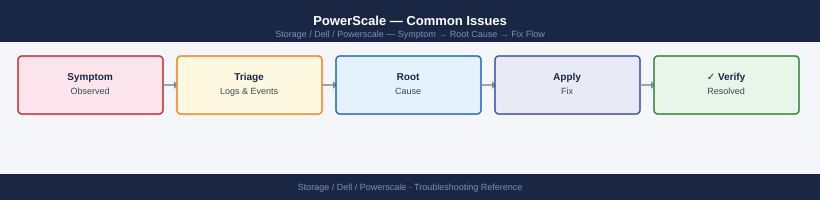

---
tags:
  - dell
  - troubleshooting
search:
  boost: 1.5
---
# PowerScale — Common Issues

<div class="kb-summary">
Common Issues reference covering Quick Reference, Incident Triage.

*Applies to: PowerScale (Isilon) 9.x*
</div>


```d2
direction: down

symptom: Identify Symptom {shape: diamond}
diagnostic_flow: "Diagnostic Flow" {shape: rectangle}
quick_reference: "Quick Reference" {shape: rectangle}
incident_triage: "Incident Triage" {shape: rectangle}
verify_resolution: "Verify resolution" {shape: rectangle}
resolution: Resolve or Escalate {shape: oval}

symptom -> diagnostic_flow: investigate
symptom -> quick_reference: investigate
symptom -> incident_triage: investigate
symptom -> verify_resolution: investigate
diagnostic_flow -> resolution
quick_reference -> resolution
incident_triage -> resolution
verify_resolution -> resolution
```

## Diagnostic Flow

```d2
direction: right

D1: "D1" {shape: rectangle}
R1: "See Incident Triage —\nSMARTFAIL: do not remove manually" {shape: rectangle}
R2: "See Quick Reference —\nHigh per-node CPU or latency spike" {shape: rectangle}
D2: "D2" {shape: rectangle}
R3: "See Quick Reference —\nSMB access denied despite correct perms" {shape: rectangle}
R4: "See Quick Reference —\nSMB access denied: time skew issue" {shape: rectangle}
D3: "D3" {shape: rectangle}
R5: "See Quick Reference —\nNFS stale file handle or permission denied" {shape: rectangle}
R6: "See Incident Triage —\nCheck isi auth and share ACL" {shape: rectangle}
D4: "D4" {shape: rectangle}
R7: "See Quick Reference —\nWrite failure on quota directory" {shape: rectangle}
R8: "See Quick Reference —\nCluster capacity unexpectedly full" {shape: rectangle}
D5: "D5" {shape: rectangle}
R9: "See Quick Reference —\nSyncIQ policy stuck in running or failed" {shape: rectangle}
R10: "See Incident Triage —\nCheck target cluster quota and capacity" {shape: rectangle}
S: "What is the symptom?" {shape: rectangle}
B1: "B1" {shape: rectangle}
B2: "B2" {shape: rectangle}
B3: "B3" {shape: rectangle}
B4: "B4" {shape: rectangle}
B5: "B5" {shape: rectangle}

D1 -> R1
D1 -> R2
D2 -> R3
D2 -> R4
D3 -> R5
D3 -> R6
D4 -> R7
D4 -> R8
D5 -> R9
D5 -> R10
```

---

## Before you begin

- **Access:** Storage admin credentials (cluster admin or equivalent)
- **Gather first:** recent error message text, event timestamps, and affected object names
- **Scope:** confirm whether the issue affects a single object, host, cluster, or site
- **Escalation:** open a vendor support ticket before running any destructive step
- **Logging:** document each command and output — required if escalation is needed

---

## Quick Reference

| Symptom | Likely Cause | Action |
|---|---|---|
| SyncIQ policy stuck in `running` or `failed` | Network interruption, snapshot conflict on source, or target cluster quota/capacity reached | `isi sync reports list --policy-name <name>`; check network to target; resolve snapshot or quota issue; restart with `isi sync policies run <name>` |
| Node in SMARTFAIL state | Drive failures or hardware fault triggered automatic node removal | Do NOT intervene manually; monitor `isi job list` for Restripe job progress; replace failed hardware; open Dell Support case |
| Write failure on a quota directory | Hard quota threshold exceeded | `isi quota list --path /ifs/<path>`; raise or remove hard limit, or delete data to free space; notify directory owner |
| SmartConnect DNS name not resolving | Missing NS delegation in parent DNS zone, or IP pool has no healthy nodes | Verify NS record delegates zone to cluster node IPs; check pool health with `isi network pools list`; test with `nslookup <sc-zone>` |
| NFS stale file handle | Node rebooted or network partition caused NFS client to lose session | Remount on client; ensure NFS client uses SmartConnect DNS name, not a node IP directly |
| SMB access denied despite correct share permissions | SID mapping issue between Windows identity and OneFS local user; ACL misconfiguration | Check `isi auth users view --name <user> --zone <zone>`; verify AD provider is joined; review share ACL and directory ACL |
| Cluster capacity unexpectedly full | Snapshot accumulation, CloudPools recall, or runaway data ingest | `isi snapshot list`; delete expired snapshots; check `isi quota list` for violations; identify largest directories with `isi statistics query` |
| High per-node CPU or latency spike | Imbalanced SmartConnect; hot directory; too many concurrent jobs | `isi statistics query current --keys CPU --nodes all`; check `isi job list` for competing cluster jobs; pause non-critical jobs |

## Incident Triage

```d2
direction: right

A: "Client reports NFS/SMB error\nor node unreachable" {shape: rectangle}
B: "isi status\nisi event list --limit 20" {shape: rectangle}
C: "SMARTFAIL\nor DOWN node?" {shape: rectangle}
D: "Monitor Restripe\nDo NOT manually remove\nOpen Dell support case" {shape: rectangle}
E: "Write failure\non quota directory?" {shape: rectangle}
F: "isi quota quotas list\nRaise hard limit or free space" {shape: rectangle}
G: "SmartConnect DNS\nnot resolving?" {shape: rectangle}
H: "Verify NS delegation\nisi network pools list\nnslookup SmartConnect zone" {shape: rectangle}
I: "NFS stale file\nhandle?" {shape: rectangle}
J: "Remount from client\nUse SmartConnect DNS name\nnot a node IP" {shape: rectangle}
K: "SMB access denied\ndespite correct perms?" {shape: rectangle}
L: "isi auth users view\nCheck AD provider join\nReview share + dir ACL" {shape: rectangle}
M: "isi statistics query current\nisi job list\nCapacity or performance path" {shape: rectangle}
Z: "Escalate if unresolved" {shape: rectangle}

A -> B
B -> C
C -> D
C -> E
E -> F
E -> G
G -> H
G -> I
I -> J
I -> K
K -> L
K -> M
D -> F
F -> H
H -> J
J -> L
L -> M
M -> Z
```

When clients report NFS/SMB errors, SyncIQ failures, or a node is unreachable, work through this sequence first.

- [ ] Run `isi status` immediately — confirm which nodes and drives are in a fault state; note SMARTFAIL nodes, DOWN nodes, and drive error counts
- [ ] Run `isi event list --limit 20` — find CRITICAL or ERROR events timestamped near the start of the incident; note the event code and description
- [ ] Check SyncIQ if the report involves replication failures: `isi sync policies list` and `isi sync reports list --limit 5` — identify the failing policy and the error message in the report
- [ ] Check quota violations if clients report write failures: `isi quota quotas list` — identify directories at or above hard threshold
- [ ] Verify network connectivity for client-facing interfaces: `isi network subnets list` — confirm all SmartConnect zones and IP pools are intact
- [ ] Check cluster job status: `isi job list` — a long-running Restripe after a node SMARTFAIL can cause elevated latency across the cluster
- [ ] Review per-node statistics for the affected time window: `isi statistics query current --keys CPU` and `isi statistics query current --keys DISK`
- [ ] If a node is DOWN, do not manually remove it — open a Dell support case and monitor `isi job list` for Restripe progress

| Question | Answer |
|---|---|
| Which nodes are SMARTFAIL or DOWN in isi status? | |
| What CRITICAL events appear in isi event list? | |
| Which SyncIQ policies are failing and what is the error? | |
| Are any quota directories at or above hard threshold? | |
| Is a Restripe job running and what is its progress? | |

---

## Verify resolution

- Confirm the original symptom no longer occurs
- Check logs for any residual errors related to the issue
- Monitor for 10–15 minutes to confirm the fix is stable

---

## See also

- [Powerscale — Diagnostics](../diagnostics/)
- [Powerscale — Escalation](../escalation/)
- [Powerscale — Health Checks](../../operations/health-checks/)
