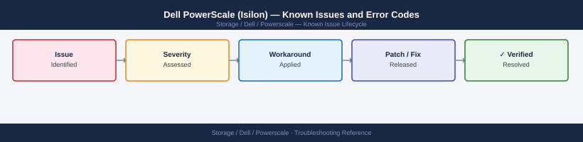

---
tags:
  - troubleshooting
  - powerscale
  - dell
  - known-issues
description: "Catalog of known PowerScale / OneFS bugs, error codes, and workarounds covering NFS, SMB, SyncIQ, and cluster health."
---
# Dell PowerScale (Isilon) — Known Issues and Error Codes

<div class="kb-summary">
Catalog of known PowerScale / OneFS bugs, error codes, and workarounds covering NFS, SMB, SyncIQ, and cluster health.

*Applies to: OneFS 9.x*
</div>



```d2
direction: down

symptom: Identify Symptom {shape: diamond}
nfs: "NFS" {shape: rectangle}
smb: "SMB" {shape: rectangle}
synciq: "SyncIQ" {shape: rectangle}
resolution: Resolve or Escalate {shape: oval}

symptom -> nfs: investigate
symptom -> smb: investigate
symptom -> synciq: investigate
nfs -> resolution
smb -> resolution
synciq -> resolution
```

## Before you begin

- Run `isi status` from any node for overall cluster health.
- ECS (Error, Condition, Status) codes appear in `isi events list` — filter with `--severity critical`.
- SRS/ESRS phone-home should be active for proactive alerting.

## NFS

| Error / Symptom | Affected Versions | Cause | Workaround / Fix | Fixed In |
|---|---|---|---|---|
| NFS mount shows `Permission denied` on valid path | OneFS 9.x | Export zone or client mapping not configured for client IP | Verify export zone in `isi nfs exports view`; add client IP to export access list | N/A |
| `Stale file handle` after cluster node removal | OneFS 9.x | SmartConnect DNS TTL cached old node IP | Flush DNS cache on client; set SmartConnect TTL to ≤10 seconds | N/A |
| NFSv4 ACL writes not preserved across NFS remount | OneFS 9.x | NFSv4 ACL support not enabled on export | Enable `security_flavors = krb5` on export and configure Kerberos, or use NFSv3 | N/A |

## SMB

| Error / Symptom | Affected Versions | Cause | Workaround / Fix | Fixed In |
|---|---|---|---|---|
| `The network path was not found` for SMB share | OneFS 9.x | SmartConnect zone not resolving to correct SIP | Verify SmartConnect zone DNS delegation; test with `nslookup <smartconnect-zone>` | N/A |
| Slow SMB enumeration for large directories | OneFS 9.x | Directory enumeration cache disabled | Enable `isi smb settings global modify --directory-cache-size=524288` | N/A |

## SyncIQ

| Error / Symptom | Affected Versions | Cause | Workaround / Fix | Fixed In |
|---|---|---|---|---|
| SyncIQ job fails: `Target directory access denied` | OneFS 9.x | Source cluster SSH key not trusted by target | Re-add source SSH key to target: `isi sync target policies allow-write <job-name>` | N/A |
| SyncIQ lag growing after network change | OneFS 9.x | TCP 11111 or 7722 blocked between sites | Verify ports 11111/7722 open between SmartConnect management IPs | N/A |

## See also

- [Dell PowerScale — Common Issues](../common-issues/)
- [Superna Eyeglass — Known Issues](../../../netapp/superna-eyeglass/troubleshooting/known-issues.md)
