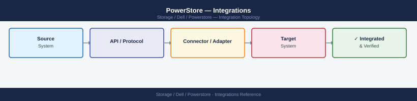

---
tags:
  - architecture
  - dell
---
# PowerStore — Integrations

<div class="kb-summary">
Integrations reference covering VMware vSphere, Dell Backup and Recovery (Data Domain / PowerProtect), CloudIQ, SupportAssist (ESRS), SNMP Monitoring and 4 more sections.

*Applies to: PowerStore 3.x*
</div>


## VMware vSphere

PowerStore is deeply integrated with VMware vSphere and is qualified as a VMware-certified storage solution.

### VMFS Datastores (iSCSI / FC)

Standard block storage datastores — volumes presented to ESXi hosts via Fibre Channel or iSCSI, then formatted as VMFS6. This is the most common VMware integration path and works with all PowerStore models.

```bash
# Create a volume via REST API for VMware use
curl -k -X POST "https://<mgmt-ip>/api/rest/volume" \
  -H "DELL-EMC-TOKEN: <token>" \
  -H "Content-Type: application/json" \
  -d '{
    "name": "vmfs-prod-01",
    "size": 10995116277760,
    "description": "VMFS datastore for production VMs",
    "volume_group_id": "<vg-id>"
  }'

# Map the volume to the ESXi host group
curl -k -X POST "https://<mgmt-ip>/api/rest/host_volume_mapping" \
  -H "DELL-EMC-TOKEN: <token>" \
  -H "Content-Type: application/json" \
  -d '{
    "volume_id": "<volume-id>",
    "host_group_id": "<esxi-cluster-host-group-id>",
    "logical_unit_number": 0
  }'
```


```text title="Expected output"
{
  "id": "vol-0a1b2c3d4e5f6g7h",
  "name": "vmfs-prod-01",
  "size": 10995116277760,
  "state": "Ready",
  "description": "VMFS datastore for production VMs",
  "volume_group_id": "vg-8f9e7d6c5b4a3210",
  "creation_timestamp": "2024-01-15T14:32:18Z",
  "logical_unit_number": null
}
{
  "id": "mapping-9x8y7z6w5v4u3t2s",
  "volume_id": "vol-0a1b2c3d4e5f6g7h",
  "host_group_id": "hg-prod-esxi-cluster-01",
  "logical_unit_number": 0,
  "state": "Mapped",
  "creation_timestamp": "2024-01-15T14:32:45Z"
}
```

!!! warning "Common errors"
    **`curl: (60) SSL certificate problem: self signed certificate`** — Add `-k` flag to curl command to skip SSL verification (already present in example, but ensure it's included if removed).
    **`{"error_code": 401, "message": "Invalid or expired token"}`** — Regenerate the DELL-EMC-TOKEN via the PowerStore management UI or API authentication endpoint and update the header.
    **`{"error_code": 400, "message": "Invalid volume_group_id"}`** — Verify the volume group exists and the UUID is correct by listing volume groups with `curl -k -H "DELL-EMC-TOKEN: <token>" https://<mgmt-ip>/api/rest/volume_groups`.
After mapping, rescan storage in vSphere and present the volume as a new VMFS datastore via **vCenter → Storage → New Datastore**.

### NFS Datastores

PowerStore NAS servers serve NFS exports to ESXi hosts. NFS datastores avoid the need for LUN management and provide flexibility for large VM environments.

Configuration steps:

1. Create a NAS server on PowerStore with an NFS protocol enabled interface
2. Create a file system and enable NFS export with appropriate permissions
3. In vSphere, mount the NFS export as a new datastore

```bash
# Create NAS server
curl -k -X POST "https://<mgmt-ip>/api/rest/nas_server" \
  -H "DELL-EMC-TOKEN: <token>" \
  -H "Content-Type: application/json" \
  -d '{
    "name": "nas-vmware-prod",
    "preferred_node": "node-a",
    "current_unix_directory_service": "NIS",
    "description": "NAS server for VMware NFS datastores"
  }'

# NFS export settings recommended for ESXi
# root_squash: no_root_squash (ESXi requires root access)
# Access: read-write, allow all ESXi host IPs in the cluster
# NFS version: NFS v3 (widely supported) or NFS v4.1 (stateful, session trunking)
```


```text title="Expected output"
{
  "id": "6581c3f7-a2e4-42f1-9c8d-5f8b2a1d4e9c",
  "name": "nas-vmware-prod",
  "preferred_node": "node-a",
  "current_unix_directory_service": "NIS",
  "description": "NAS server for VMware NFS datastores",
  "current_node": "node-a",
  "is_replication_destination": false,
  "is_replication_source": false,
  "operational_status": "Started",
  "creation_timestamp": "2024-01-15T14:32:18.000Z",
  "last_modified_timestamp": "2024-01-15T14:32:18.000Z"
}
```

!!! warning "Common errors"
    **`{"error_code":"INVALID_FIELD","message":"preferred_node 'node-a' does not exist"}`** — Verify the correct node name using `curl -k -H "DELL-EMC-TOKEN: <token>" https://<mgmt-ip>/api/rest/node` and update the preferred_node value.
    **`{"error_code":"UNAUTHORIZED","message":"Invalid or expired token"}`** — Regenerate the authentication token and ensure it is passed correctly in the DELL-EMC-TOKEN header.
    **`curl: (60) SSL certificate problem: self signed certificate`** — Add the `-k` flag to skip SSL verification (already present) or import the management IP's certificate into your CA bundle.
### Virtual Volumes (vVols)

vVols are the recommended storage model for VMware environments requiring per-VM storage policy management. Each virtual disk becomes an individual object on PowerStore rather than a file in a shared VMFS.

| Component | Function |
|---|---|
| VASA Provider | Built into PowerStoreOS; no separate VM required |
| Protocol Endpoint (PE) | A logical I/O access point on PowerStore; created automatically |
| Storage Container | A PowerStore volume group designated as a vVols datastore |
| VM Storage Policy | vSphere policy mapped to a PowerStore capability profile |

```bash
# Verify VASA Provider registration status
curl -k -X GET "https://<mgmt-ip>/api/rest/storage_provider" \
  -H "DELL-EMC-TOKEN: <token>"

# List storage containers (vVols datastores)
curl -k -X GET "https://<mgmt-ip>/api/rest/storage_container" \
  -H "DELL-EMC-TOKEN: <token>"
```


```text title="Expected output"
{
  "id": "provider-001",
  "name": "PowerStore-VASA-Provider",
  "version": "3.1.0.1",
  "status": "registered",
  "vasa_version": "3.0",
  "certificate_expiry": "2025-12-15T23:59:59Z",
  "last_heartbeat": "2024-01-18T14:32:10Z"
}

{
  "entries": [
    {
      "id": "sc-prod-001",
      "name": "prod-vvol-datastore-01",
      "size": 5368709120000,
      "used": 2684354560000,
      "available": 2684354560000,
      "storage_protocol": "iSCSI",
      "replication_policy": "synchronous"
    },
    {
      "id": "sc-prod-002",
      "name": "prod-vvol-datastore-02",
      "size": 10737418240000,
      "used": 5368709120000,
      "available": 5368709120000,
      "storage_protocol": "FC",
      "replication_policy": "asynchronous"
    },
    {
      "id": "sc-dev-001",
      "name": "dev-vvol-datastore-01",
      "size": 2199023255552,
      "used": 549755813888,
      "available": 1649267441664,
      "storage_protocol": "iSCSI",
      "replication_policy": "none"
    }
  ],
  "page": 1,
  "per_page": 100,
  "total": 3
}
```

!!! warning "Common errors"
    **`curl: (60) SSL certificate problem: self signed certificate`** — Add `-k` flag to bypass certificate verification (already present in the example, but ensure it's included if removed).
    **`{"error_code": 401, "message": "Invalid or expired token"}`** — Regenerate the DELL-EMC-TOKEN via the PowerStore management API authentication endpoint and verify it hasn't exceeded its TTL.
    **`curl: (7) Failed to connect to <mgmt-ip> port 443: Connection refused`** — Verify the management IP is correct, the PowerStore array is online, and port 443 is accessible from your client network.
### VMware Site Recovery Manager (SRM)

PowerStore integrates with VMware SRM via the **Storage Replication Adapter (SRA)**. The SRA is a plugin installed on the SRM server that allows SRM to orchestrate PowerStore async replication failover.

| Component | Location |
|---|---|
| Dell PowerStore SRA | Installed on the vCenter SRM server (Windows or Linux) |
| PowerStore async replication | Configured between primary and recovery PowerStore arrays |
| SRM Array Manager | Configured in SRM with the PowerStore management IP and credentials |

Integration workflow:

1. Configure async replication session between primary and recovery PowerStore
2. Install the PowerStore SRA on both SRM servers (protected and recovery sites)
3. Add both PowerStore arrays to SRM under **Array Manager** using the management IP and a dedicated SRM service account
4. Create Protection Groups in SRM that include the replicated volumes/datastores
5. Create Recovery Plans that orchestrate VM shutdown, replication sync, and VM power-on at the recovery site

### VMware HCI (vSAN)

PowerStore X-series running AppsOn can coexist with vSAN, but PowerStore is not itself a vSAN-based solution. When deploying PowerStore alongside a vSAN cluster:

- PowerStore block volumes can serve as supplemental external storage for vSAN-managed clusters (iSCSI or FC datastores)
- PowerStore NAS can provide file storage to VMs running in a vSAN cluster

## Dell Backup and Recovery (Data Domain / PowerProtect)

### PowerProtect Data Manager (PPDM)

PowerProtect Data Manager integrates with PowerStore for application-consistent VM backups using vSphere APIs.

| Integration Method | Description |
|---|---|
| vSphere VADP | PPDM uses VMware VADP (vStorage APIs for Data Protection) to quiesce and snapshot VMs stored on PowerStore |
| Crash-consistent snapshot | PowerStore-native snapshot taken before VADP backup for rollback capability |
| Storage direct backup | PPDM can use PowerStore snapshots as a backup source (snapshot offload), reducing load on production hosts |

### Veeam Backup & Replication

Veeam integrates with PowerStore via:

- **vSphere VADP**: standard VM backup via vCenter — no PowerStore-specific plugin needed
- **Veeam Storage Integration Plugin for PowerStore**: enables Veeam to leverage PowerStore snapshots directly as restore points, offloading backup I/O from production hosts

```bash
# PowerStore REST API credentials for Veeam integration
# Create a dedicated service account in PowerStore Manager for Veeam
# Recommended role: StorageOperator (can create/delete snapshots, read volumes)
# Settings → Security → Users → Add User → Role: StorageOperator
```

### Commvault

Commvault MediaAgent integrates with PowerStore for IntelliSnap snapshot management:

- Commvault creates application-consistent snapshots on PowerStore
- Snapshots are catalogued in Commvault and can be used as instant restore points
- Commvault Snap Engine for Dell PowerStore uses the REST API to manage snapshots

## CloudIQ

All PowerStore systems are supported by Dell CloudIQ for predictive analytics, health scoring, and capacity forecasting. CloudIQ integration is automatic once a Secure Connect Gateway (SCG) is deployed and the PowerStore system is registered.

Data sent to CloudIQ:

| Data Type | Purpose |
|---|---|
| Hardware health | Drive, node, PSU, fan health scores |
| Capacity metrics | Used, free, DRR, and forecast models |
| Performance metrics | IOPS, throughput, latency per volume |
| Configuration metadata | Software version, model, serial number |

No user data, file contents, or application data is transmitted to CloudIQ.

## SupportAssist (ESRS)

SupportAssist is Dell's call-home mechanism. When enabled, PowerStore automatically:

- Sends health telemetry to Dell's SRS (Secure Remote Services) platform
- Creates automated service requests for qualifying hardware faults (e.g., drive failure)
- Enables Dell Support engineers to initiate remote support sessions

```text
PowerStore → SupportAssist → ESRS/SRS Cloud → Dell Support
```

Configure SupportAssist in PowerStore Manager under **Settings → Support → SupportAssist**. Requires outbound HTTPS to `esrs3.emc.com` (port 443). Route through a proxy if direct internet access is not permitted.

## SNMP Monitoring

PowerStore supports SNMP v2c and v3 for integration with enterprise monitoring systems (Nagios, Zabbix, SolarWinds, etc.).

| Setting | Recommended Value |
|---|---|
| Protocol | SNMP v3 (preferred); v2c if v3 is not supported by the NMS |
| Auth protocol (v3) | SHA |
| Privacy protocol (v3) | AES-128 or AES-256 |
| Community string (v2c) | Change from default; restrict by source IP |
| Trap destination | NMS collector IP |
| Trap types | Hardware faults, capacity thresholds, replication failures |

Configure under PowerStore Manager → **Settings → Monitoring → SNMP**.

## Syslog / SIEM Integration

PowerStore can forward event logs to a syslog server for SIEM ingestion (Splunk, Microsoft Sentinel, QRadar, etc.):

- Syslog forwarding is configured in PowerStore Manager → **Settings → Monitoring → Syslog**
- Supported protocols: UDP (port 514), TCP (port 514 or 601), TLS (port 6514)
- Log level: INFO (operational events) and CRITICAL (faults and alerts) at minimum
- CEF (Common Event Format) output is not natively supported; raw syslog messages require parsing in the SIEM

```bash
# Verify syslog forwarding via REST API
curl -k -X GET "https://<mgmt-ip>/api/rest/remote_syslog" \
  -H "DELL-EMC-TOKEN: <token>"

# Add a syslog server
curl -k -X POST "https://<mgmt-ip>/api/rest/remote_syslog" \
  -H "DELL-EMC-TOKEN: <token>" \
  -H "Content-Type: application/json" \
  -d '{
    "address": "192.168.10.200",
    "port": 514,
    "transport": "UDP",
    "enabled": true
  }'
```


```text title="Expected output"
{
  "id": "remote_syslog_1",
  "address": "192.168.10.200",
  "port": 514,
  "transport": "UDP",
  "enabled": true,
  "created_at": "2024-01-15T09:23:47Z",
  "updated_at": "2024-01-15T09:23:47Z"
}
```

!!! warning "Common errors"
    **`curl: (60) SSL certificate problem: self signed certificate`** — Add the `-k` flag to skip SSL verification, or import the PowerStore certificate into your CA bundle.
    **`{"error": "Unauthorized", "code": 401}`** — Verify the DELL-EMC-TOKEN is valid and not expired by re-authenticating via the login endpoint.
    **`curl: (7) Failed to connect to <mgmt-ip> port 443: Connection refused`** — Confirm the management IP is correct and the PowerStore REST API service is running with `systemctl status dell-rest-service`.
## Active Directory / LDAP

PowerStore integrates with Active Directory for:

- **User authentication**: Unisphere/PowerStore Manager logins via AD credentials
- **NAS access control**: file-level permissions on SMB shares and NFS exports using AD users and groups

```bash
# Configure AD for management authentication via REST API
curl -k -X POST "https://<mgmt-ip>/api/rest/ldap" \
  -H "DELL-EMC-TOKEN: <token>" \
  -H "Content-Type: application/json" \
  -d '{
    "domain_name": "corp.example.com",
    "server_address": ["192.168.1.10", "192.168.1.11"],
    "protocol": "LDAP",
    "bind_user": "CN=svc-powerstore,OU=Service Accounts,DC=corp,DC=example,DC=com",
    "bind_password": "<password>",
    "user_search_path": "OU=Users,DC=corp,DC=example,DC=com",
    "group_search_path": "OU=Groups,DC=corp,DC=example,DC=com"
  }'
```


```text title="Expected output"
{
  "id": "ldap-config-001",
  "domain_name": "corp.example.com",
  "server_address": [
    "192.168.1.10",
    "192.168.1.11"
  ],
  "protocol": "LDAP",
  "bind_user": "CN=svc-powerstore,OU=Service Accounts,DC=corp,DC=example,DC=com",
  "user_search_path": "OU=Users,DC=corp,DC=example,DC=com",
  "group_search_path": "OU=Groups,DC=corp,DC=example,DC=com",
  "status": "configured",
  "created_at": "2024-01-15T09:42:33Z",
  "updated_at": "2024-01-15T09:42:33Z"
}
```

!!! warning "Common errors"
    **`curl: (60) SSL certificate problem: self signed certificate`** — Add `-k` flag to the curl command to skip SSL verification (already present in the example, but ensure it's not removed in production without proper CA certificate configuration).
    **`{"error": "Invalid token", "error_code": 401}`** — Regenerate the DELL-EMC-TOKEN by authenticating to the management API first using valid credentials.
    **`{"error": "LDAP server unreachable", "error_code": 400}`** — Verify network connectivity to the LDAP servers (192.168.1.10 and 192.168.1.11) and confirm firewall rules allow port 389 from the PowerStore management network.
## Ansible

The Dell PowerStore Ansible collection (`dellemc.powerstore`) is available on Ansible Galaxy and provides modules for all major provisioning and management operations.

```bash
# Install the Dell PowerStore Ansible collection
ansible-galaxy collection install dellemc.powerstore

# Example: create a volume
- name: Create a PowerStore volume
  dellemc.powerstore.volume:
    array_ip: "192.168.10.50"
    user: "admin"
    password: "{{ powerstore_password }}"
    validate_certs: false
    vol_name: "app-db-prod-01"
    size: 500
    cap_unit: "GB"
    state: present
    volume_group_name: "app-db-vg"
```


```text title="Expected output"
Starting galaxy collection install process
Process install dependency map
Starting collection download of 'dellemc.powerstore:1.6.0' from https://galaxy.ansible.com
Downloading collection from url https://galaxy.ansible.com/download/dellemc-powerstore-1.6.0.tar.gz
Installing 'dellemc.powerstore:1.6.0' to '/home/ansible/.ansible/collections/plugins/modules/dellemc/powerstore'
dellemc.powerstore (1.6.0) was installed successfully

TASK [Create a PowerStore volume] *******************************************
changed: [localhost] => {
    "changed": true,
    "volume_details": {
        "id": "0c4b8f2a-1c9e-4d7f-9e2b-5a3c8d1f6e9a",
        "name": "app-db-prod-01",
        "size": 536870912000,
        "state": "Normal",
        "volume_group_id": "vg-12345"
    }
}
```

!!! warning "Common errors"
    **`ERROR! the role 'dellemc.powerstore' was not found`** — Run `ansible-galaxy collection install dellemc.powerstore` before executing the playbook.
    **`fatal: [localhost]: FAILED! => {"msg": "Unsupported parameters for module: dellemc.powerstore.volume: 'cap_unit'"}`** — Replace `cap_unit: "GB"` with `size_unit: "GB"` to match the correct parameter name for this module version.
    **`fatal: [localhost]: FAILED! => {"msg": "authentication failed"}`** — Verify the array IP address is reachable and the admin credentials are correct; check `validate_certs: false` is set if using self-signed certificates.
## Terraform

The Dell PowerStore Terraform provider (`registry.terraform.io/dell/powerstore`) supports infrastructure-as-code for PowerStore resources:

```hcl
terraform {
  required_providers {
    powerstore = {
      source  = "dell/powerstore"
      version = ">= 1.0.0"
    }
  }
}

provider "powerstore" {
  username = var.powerstore_user
  password = var.powerstore_password
  endpoint = "https://192.168.10.50/api/rest"
  insecure = false
}

resource "powerstore_volume" "db_lun" {
  name              = "ora-prod-01"
  size              = 2199023255552   # 2 TiB in bytes
  description       = "Oracle production data LUN"
  volume_group_name = "oracle-vg"
}
```

---

## See also

- [Powerstore — How It Works](../how-it-works/)
- [Powerstore — Design Standards](../design-standards/)
