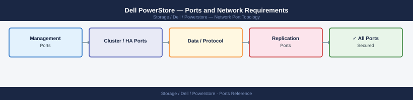

---
tags:
  - powerstore
  - dell
  - networking
  - firewall
  - ports
  - storage
---
# Dell PowerStore — Ports and Network Requirements

<div class="kb-summary">
Firewall port reference for Dell PowerStore. Covers management API and UI, data protocols (NFS, SMB, iSCSI, NVMe-oF/TCP), synchronous/asynchronous replication, and AD integration.

*Applies to: PowerStore 3.x / 4.x (PowerStore OS)*
</div>


## Before you begin

- PowerStore has two network roles: management (mgmt IP) and data (per-protocol IPs on data interfaces)
- Apply firewall rules to the specific IP for each role — data IPs are separate from the management IP
- Replication (Metro Volume / async) uses HTTPS between the management IPs of both systems
- FC (Fibre Channel) ports are not IP-based — no firewall rules needed

---

## Inbound — Management Traffic

| Port | Protocol | Source | Purpose |
|---|---|---|---|
| 443 | TCP | Admin workstations, vSphere plugin, automation | PowerStore Manager UI and REST API |
| 22 | TCP | Jump hosts | SSH — CLI (service user) |
| 80 | TCP | Clients | HTTP — redirects to 443 |
| 161 | UDP | Monitoring systems | SNMP polling |

---

## Outbound — Array to External

| Port | Protocol | Destination | Purpose |
|---|---|---|---|
| 162 | UDP | SNMP trap receiver | SNMP hardware and event traps |
| 514 | UDP/TCP | Syslog server | Syslog event forwarding |
| 123 | UDP | NTP server | Time synchronisation |
| 25 | TCP | SMTP relay | Alert email delivery |
| 443 | TCP | *.dell.com | CloudIQ telemetry, support upload, license check |

---

## Data Protocols — NFS

| Port | Protocol | Source | Purpose |
|---|---|---|---|
| 2049 | TCP/UDP | NFS client hosts | NFS v3 / v4.1 data access |
| 111 | TCP/UDP | NFS client hosts | rpcbind (portmapper — NFSv3) |

---

## Data Protocols — SMB

| Port | Protocol | Source | Purpose |
|---|---|---|---|
| 445 | TCP | Windows clients | SMB direct TCP |
| 139 | TCP | Legacy clients | NetBIOS over TCP (legacy) |

---

## Data Protocols — iSCSI

| Port | Protocol | Source | Purpose |
|---|---|---|---|
| 3260 | TCP | iSCSI initiator hosts | iSCSI block storage |

---

## Data Protocols — NVMe-oF/TCP (PowerStore 3.6+)

| Port | Protocol | Source | Purpose |
|---|---|---|---|
| 4420 | TCP | NVMe/TCP hosts | NVMe over Fabrics / TCP |
| 8009 | TCP | NVMe/TCP hosts | NVMe-oF discovery |

---

## Replication — Metro Volume and Asynchronous Replication

| Port | Protocol | Between | Purpose |
|---|---|---|---|
| 443 | TCP | PowerStore A mgmt IP ↔ PowerStore B mgmt IP | Metro Volume sync and async replication control |

---

## CloudIQ / Dell Support Integration

| Port | Protocol | Destination | Purpose |
|---|---|---|---|
| 443 | TCP | cloudiq.dell.com | Telemetry for CloudIQ analytics |
| 443 | TCP | esrs.emc.com, esrs.dell.com | ConnectEMC/ESRS — Dell phone-home support |

---

## Active Directory Integration (NAS)

| Port | Protocol | Destination | Purpose |
|---|---|---|---|
| 389 | TCP | Active Directory DCs | LDAP — NAS domain join and share authentication |
| 636 | TCP | Active Directory DCs | LDAPS (recommended) |
| 88 | TCP/UDP | Active Directory DCs | Kerberos |
| 445 | TCP | Active Directory DCs | SMB (domain join) |

---

## VMware Integration

| Port | Protocol | Source | Purpose |
|---|---|---|---|
| 443 | TCP | vCenter Server (inbound to PowerStore) | VASA provider registration, VAAI offload |

---

## Firewall Zone Summary

| From | To | Ports | Notes |
|---|---|---|---|
| Admin clients | PowerStore mgmt IP | 443, 22 | REST API, Manager UI, SSH |
| Monitoring | PowerStore mgmt IP | 161 UDP | SNMP polling |
| NFS clients | PowerStore NFS data IPs | 2049, 111 | Per NFS VLAN |
| SMB clients | PowerStore SMB data IPs | 445 | Per SMB VLAN |
| iSCSI hosts | PowerStore iSCSI data IPs | 3260 | Per iSCSI VLAN |
| NVMe/TCP hosts | PowerStore NVMe data IPs | 4420, 8009 | NVMe-oF/TCP |
| PowerStore A mgmt | PowerStore B mgmt | 443 | Replication |
| PowerStore | *.dell.com | 443 | CloudIQ, ESRS (outbound) |

---

## Verify

```bash
# From admin workstation — test REST API
curl -sk -o /dev/null -w "%{http_code}" https://<powerstore-mgmt-ip>/api/rest/cluster

# From iSCSI host — discover targets
iscsiadm -m discovery -t sendtargets -p <powerstore-iscsi-ip>:3260

# From NFS client — test NFS export list
showmount -e <powerstore-nfs-ip>

# From NVMe host — discover controllers
nvme discover -t tcp -a <powerstore-nvme-ip> -s 4420

# From PowerStore CLI — check replication links
# Accessible via SSH to mgmt IP as service user
```


```text title="Expected output"
200

10.45.120.50:3260,1 iqn.2021-05.com.dell:powerstore.fcnvme01.target1
10.45.120.51:3260,2 iqn.2021-05.com.dell:powerstore.fcnvme01.target1

Export list for 10.45.120.60:
/nfs/vol_prod_01	10.0.0.0/8
/nfs/vol_prod_02	10.0.0.0/8
/nfs/vol_backup	192.168.1.0/24

Discovery Log Number of Records: 2, Generation counter: 5
=====Discovery Log Entry 0======
trtype:  tcp
adrfam:  ipv4
subtype: nvme subsystem
treq:    not specified
portid:  0
trsvcid: 4420
subnqn:  nqn.2014-08.org.nvmexpress.discovery
traddr:  10.45.120.70

=====Discovery Log Entry 1======
trtype:  tcp
adrfam:  ipv4
subtype: nvme subsystem
treq:    not specified
portid:  1
trsvcid: 4420
subnqn:  nqn.2021-05.com.dell:powerstore.nvme01
traddr:  10.45.120.71
```

!!! warning "Common errors"
    **`curl: (60) SSL certificate problem: self-signed certificate`** — Add `-k` flag to curl command to skip certificate verification, or import the PowerStore CA certificate into your system trust store.
    **`iscsiadm: No records found!`** — Verify the iSCSI portal IP is correct and reachable; check that iSCSI service is running on PowerStore with `systemctl status iscsid` on the initiator.
    **`showmount: clnt_create: RPC: Program not registered`** — Confirm NFS service is enabled on PowerStore and the NFS IP is accessible; test connectivity with `ping <powerstore-nfs-ip>` first.
---

## See also

- [Dell PowerStore — Architecture](../how-it-works/)
- [Dell PowerStore — Deploy](../../deploy/)
- [Dell PowerStore — Operations](../../operations/)
