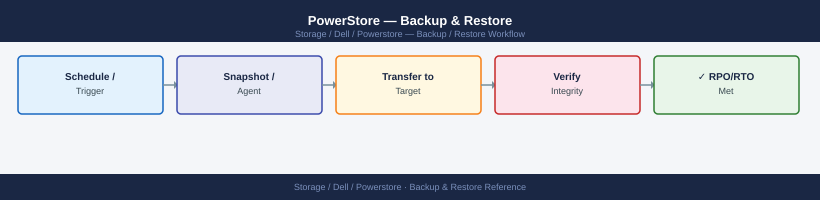
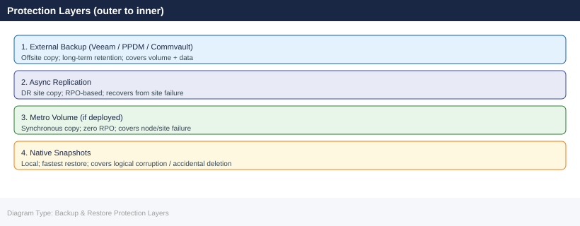

---
tags:
  - dell
  - operations
description: "Backup & Restore reference covering Protection Architecture Overview, Native Snapshots, Backup Integration, Backup Restore Procedures, Recovery Objectives."
---
# PowerStore — Backup & Restore

<div class="kb-summary">
Backup & Restore reference covering Protection Architecture Overview, Native Snapshots, Backup Integration, Backup Restore Procedures, Recovery Objectives.

*Applies to: PowerStore 3.x*
</div>


## Before you begin

- **Access:** Storage admin credentials (cluster admin or equivalent)
- **Timing:** safe to run during business hours unless a step is marked ⚠ (causes interruption)
- **Dependencies:** no active upgrades or migrations on the same infrastructure
- **Logging:** capture command output — paste into the change record on completion

---

## Protection Architecture Overview

PowerStore data protection is layered: native snapshots and replication provide first-line protection; external backup tools provide secondary copies. Use both — snapshots enable fast local restores; backup copies provide offsite protection and long-term retention.



## Native Snapshots

### Snapshot Policies

PowerStore schedules snapshots via Protection Policies, which combine:

- **Snapshot Rules**: define frequency and retention
- **Replication Rules**: define RPO interval and target
- **Protection Policy**: bundles one or more rules; assigned to a volume group

```bash
# Create a snapshot rule (hourly, keep 7 days)
curl -k -X POST "https://<mgmt-ip>/api/rest/snapshot_rule" \
  -H "DELL-EMC-TOKEN: <token>" \
  -H "Content-Type: application/json" \
  -d '{
    "name": "hourly-7d",
    "interval": "One_Hour",
    "desired_retention": 168,
    "access_type": "Creation"
  }'

# Create a snapshot rule (daily at 21:00, keep 30 days)
curl -k -X POST "https://<mgmt-ip>/api/rest/snapshot_rule" \
  -H "DELL-EMC-TOKEN: <token>" \
  -H "Content-Type: application/json" \
  -d '{
    "name": "daily-21h-30d",
    "time_of_day": "21:00",
    "days_of_week": ["Sunday","Monday","Tuesday","Wednesday","Thursday","Friday","Saturday"],
    "desired_retention": 720,
    "access_type": "Creation"
  }'

# Create a protection policy combining hourly + daily snapshot rules
curl -k -X POST "https://<mgmt-ip>/api/rest/policy" \
  -H "DELL-EMC-TOKEN: <token>" \
  -H "Content-Type: application/json" \
  -d '{
    "name": "tier2-1h",
    "description": "Hourly snapshots 7d + daily 30d",
    "snapshot_rules": ["<hourly-rule-id>", "<daily-rule-id>"]
  }'

# Assign the policy to a volume group
curl -k -X PATCH "https://<mgmt-ip>/api/rest/volume_group/<vg-id>" \
  -H "DELL-EMC-TOKEN: <token>" \
  -H "Content-Type: application/json" \
  -d '{"policy_id": "<policy-id>"}'
```


```text title="Expected output"
{
  "id": "snapshot_rule_1a2b3c4d-5e6f-7g8h-9i0j-1k2l3m4n5o6p",
  "name": "hourly-7d",
  "interval": "One_Hour",
  "desired_retention": 168,
  "access_type": "Creation",
  "created_at": "2024-01-15T09:32:18Z"
}
{
  "id": "snapshot_rule_9x8y7w6v-5u4t-3s2r-1q0p-9o8n7m6l5k4j",
  "name": "daily-21h-30d",
  "time_of_day": "21:00",
  "days_of_week": ["Sunday","Monday","Tuesday","Wednesday","Thursday","Friday","Saturday"],
  "desired_retention": 720,
  "access_type": "Creation",
  "created_at": "2024-01-15T09:32:45Z"
}
{
  "id": "policy_2f4e6d8c-0a1b-2c3d-4e5f-6g7h8i9j0k1l",
  "name": "tier2-1h",
  "description": "Hourly snapshots 7d + daily 30d",
  "snapshot_rules": ["snapshot_rule_1a2b3c4d-5e6f-7g8h-9i0j-1k2l3m4n5o6p", "snapshot_rule_9x8y7w6v-5u4t-3s2r-1q0p-9o8n7m6l5k4j"],
  "created_at": "2024-01-15T09:33:12Z"
}
{
  "id": "vg_prod-tier2-001",
  "name": "prod-tier2-001",
  "policy_id": "policy_2f4e6d8c-0a1b-2c3d-4e5f-6g7h8i9j0k1l",
  "policy_applied_at": "2024-01-15T09:33:58Z"
}
```

!!! warning "Common errors"
    | Error | Fix |
    |---|---|
    | `{"error": "Unauthorized", "code": 401, "message": "Invalid or expired DELL-EMC-TOKEN"}` | Regenerate the authentication token via the PowerStore management console or API login endpoint. |
    | `{"error": "Bad Request", "code": 400, "message": "Invalid snapshot_rule ID in policy snapshot_rules array"}` | Verify the hourly and daily rule IDs match exactly the IDs returned from the first two curl commands. |
    | `{"error": "Not Found", "code": 404, "message": "Volume group <vg-id> does not exist"}` | Confirm the volume group ID exists by running `curl -k -H "DELL-EMC-TOKEN: <token>" "https://<mgmt-ip>/api/rest/volume_group"` to list all groups. |
### Recommended Snapshot Retention by Tier

| Tier | Workload Type | Snapshot Frequency | Local Retention |
|---|---|---|---|
| Tier 1 | Databases, critical apps | 15-minute or hourly | 7 days |
| Tier 2 | Application servers, ERP | Hourly | 14 days |
| Tier 3 | File servers, home directories | Every 4 hours + daily | 30 days |
| Archive | Backup targets, NAS archives | Daily | 90 days |

### Restoring a Volume from Snapshot

Snapshots can be restored in place (replacing the current volume) or cloned to a new volume for validation before committing to production.

```bash
# Option A: Clone the snapshot to a new volume (safe — production is untouched)
curl -k -X POST "https://<mgmt-ip>/api/rest/volume_snapshot/<snap-id>/clone" \
  -H "DELL-EMC-TOKEN: <token>" \
  -H "Content-Type: application/json" \
  -d '{
    "name": "oradb-prod-data-001-snap-restore-validation",
    "description": "Clone for restore validation"
  }'
# Map the clone to a test host; verify data integrity; then either:
#   a) Promote the clone to production (rename) if it's correct
#   b) Delete the clone if the data was the wrong recovery point

# Option B: Restore in place (destructive — replaces current volume content)
# Ensure the volume is unmounted on all hosts before proceeding
curl -k -X POST "https://<mgmt-ip>/api/rest/volume_snapshot/<snap-id>/restore" \
  -H "DELL-EMC-TOKEN: <token>" \
  -H "Content-Type: application/json" \
  -d '{"backup_snap_name": "before-restore-20260507"}'
# PowerStore creates a backup snapshot of the current state before restoring
```


```text title="Expected output"
{
  "id": "clone_5f8c9e2a-7d41-4c2e-b8f3-1a2b3c4d5e6f",
  "name": "oradb-prod-data-001-snap-restore-validation",
  "description": "Clone for restore validation",
  "size": 1099511627776,
  "state": "Ready",
  "creation_timestamp": "2026-05-07T14:32:18Z",
  "source_snapshot_id": "snap_8f7e6d5c-4b3a-2f1e-0d9c-8b7a6f5e4d3c",
  "protection_policy": null,
  "is_replication_destination": false
}

{
  "id": "restore_job_a1b2c3d4-e5f6-47g8-h9i0-j1k2l3m4n5o6",
  "state": "Completed",
  "start_time": "2026-05-07T14:35:22Z",
  "end_time": "2026-05-07T14:47:51Z",
  "backup_snapshot_id": "snap_pre_restore_20260507_143522",
  "backup_snapshot_name": "before-restore-20260507",
  "restored_snapshot_id": "snap_8f7e6d5c-4b3a-2f1e-0d9c-8b7a6f5e4d3c",
  "volume_id": "vol_prod_oradb_001",
  "percent_complete": 100
}
```

!!! warning "Common errors"
    | Error | Fix |
    |---|---|
    | `curl: (60) SSL certificate problem: self signed certificate` | Add `-k` flag to the curl command to skip certificate verification (already present in the example, but ensure it is not removed). |
    | `{"error": "Invalid or expired token", "error_code": "UNAUTHENTICATED"}` | Regenerate the DELL-EMC-TOKEN via the PowerStore management API authentication endpoint and verify it has not expired. |
    | `{"error": "Volume is mounted on 1 host(s)", "error_code": "VOLUME_IN_USE"}` | Unmount the volume on all connected hosts before executing the restore operation. |
### File System Snapshot Restore (NFS/SMB)

```bash
# List snapshots for a file system
curl -k -X GET "https://<mgmt-ip>/api/rest/filesystem_snapshot?filesystem_id=<fs-id>" \
  -H "DELL-EMC-TOKEN: <token>"

# Restore the file system from a snapshot (in-place)
curl -k -X POST "https://<mgmt-ip>/api/rest/filesystem_snapshot/<snap-id>/restore" \
  -H "DELL-EMC-TOKEN: <token>" \
  -H "Content-Type: application/json" \
  -d '{"backup_snap_name": "pre-restore-fs-20260507"}'
```


```text title="Expected output"
{
  "entries": [
    {
      "id": "snapshot_123abc456def",
      "name": "daily-backup-20260506",
      "filesystem_id": "fs_789xyz012",
      "creation_timestamp": "2026-05-06T02:15:00Z",
      "size": 1099511627776,
      "state": "Ready"
    },
    {
      "id": "snapshot_456def789ghi",
      "name": "weekly-backup-20260501",
      "filesystem_id": "fs_789xyz012",
      "creation_timestamp": "2026-05-01T01:00:00Z",
      "size": 1099511627776,
      "state": "Ready"
    }
  ]
}
{
  "id": "restore_job_987uvw654",
  "state": "Initializing",
  "estimated_completion_time": "2026-05-07T03:45:00Z",
  "backup_snap_name": "pre-restore-fs-20260507",
  "progress_percentage": 0
}
```

!!! warning "Common errors"
    | Error | Fix |
    |---|---|
    | `curl: (60) SSL certificate problem: self signed certificate` | Add `-k` flag to skip certificate verification (already present in the example, but ensure it's included if removed). |
    | `{"error_code": 401, "message": "Invalid or expired token"}` | Regenerate the authentication token via the management console and update the DELL-EMC-TOKEN header value. |
    | `{"error_code": 404, "message": "Snapshot not found"}` | Verify the snapshot ID exists by listing snapshots first and confirm the filesystem_id matches the target filesystem. |
**SMB Previous Versions (Shadow Copies):** PowerStore NAS supports Windows Shadow Copies via the NAS server. When snapshots are scheduled, Windows clients can access previous versions of files directly from the share via right-click → Properties → Previous Versions. Enable this in PowerStore Manager → NAS server → SMB configuration → Enable Shadow Access Copies.

## Backup Integration

### Veeam Backup & Replication

Veeam integrates with PowerStore in two modes:

**Mode 1: vSphere VADP (standard VMware backup)**

- Veeam connects to vCenter and uses vStorage APIs to quiesce and snapshot VMs
- PowerStore is transparent — Veeam reads data from the VMFS/NFS datastore via the ESXi host
- No PowerStore-specific configuration required
- Works with all PowerStore models and protocols

**Mode 2: Veeam Storage Integration Plugin for PowerStore**

- Veeam uses PowerStore snapshots as backup proxy — offloads backup I/O from production hosts
- Requires the Veeam Storage Integration Plugin installed on the Veeam backup server
- Veeam creates a PowerStore snapshot, mounts it to a proxy host, and reads data from the snapshot
- PowerStore REST API credentials required in Veeam configuration

```bash
# Veeam PowerStore plugin configuration:
# Veeam Backup Console → Storage Infrastructure → Add Storage → Dell PowerStore
# Enter:
#   Management IP: <powerstore-mgmt-ip>
#   Protocol: HTTPS
#   Username: veeam-svc (dedicated account with StorageOperator role)
#   Password: <password>
```

Recommended service account for Veeam:

| Setting | Value |
|---|---|
| Username | `veeam-svc` |
| PowerStore role | StorageOperator |
| Permissions | Read volumes, create/delete snapshots, read NAS |
| Location | PowerStore Manager → Settings → Security → Users |

### Dell PowerProtect Data Manager (PPDM)

PPDM provides application-aware protection for VMs and databases on PowerStore:

```text
PPDM Workflow:
1. PPDM discovers VMs via vCenter API
2. PPDM coordinates application quiesce (VMware Tools or pre/post scripts)
3. PPDM triggers a PowerStore snapshot via REST API (crash-consistent or app-consistent)
4. PPDM reads the snapshot and writes to the Data Domain (PowerProtect DD) backup target
5. Snapshot is released after backup completes
```

PPDM configuration for PowerStore:

- PPDM → Infrastructure → Storage Systems → Add → Dell PowerStore
- Enter the PowerStore management IP and a service account with StorageOperator role
- PPDM will discover all volumes and associate them with protected VMs

### Commvault (IntelliSnap)

Commvault IntelliSnap uses the PowerStore REST API to create application-consistent snapshots via snap engines:

```text
Commvault Snap Engine for Dell PowerStore:
1. CommServe coordinates application quiesce (SQL Agent, Oracle Agent, etc.)
2. Snap Engine calls PowerStore REST API to create a volume snapshot
3. Commvault catalogues the snapshot as an IntelliSnap restore point
4. Optional: Commvault mounts the snapshot to an access node for secondary copy to tape/object
```

## Backup Restore Procedures

### VM Restore from Veeam

```text
Veeam Restore Options (in order of speed):
1. Instant VM Recovery — starts VM directly from Veeam repository; fastest
2. Restore to Original Location — overwrites current VM; data consistency depends on backup type
3. Restore to New Location — creates a new VM from backup; safest validation option
4. File-Level Restore — extracts individual files from a VM backup without full VM restore
5. Application Item Recovery — Exchange, SQL, SharePoint, Oracle item-level restore
```

### Database Restore from Snapshot

Example: Oracle database restore from a PowerStore volume snapshot.

```bash
# Step 1: Identify the target snapshot (from the snapshot schedule)
curl -k -X GET "https://<mgmt-ip>/api/rest/volume_snapshot?volume_id=<ora-data-vol-id>" \
  -H "DELL-EMC-TOKEN: <token>" | python3 -m json.tool

# Step 2: Clone the snapshot to a test volume for validation
curl -k -X POST "https://<mgmt-ip>/api/rest/volume_snapshot/<snap-id>/clone" \
  -H "DELL-EMC-TOKEN: <token>" \
  -H "Content-Type: application/json" \
  -d '{"name": "ora-restore-validation-20260507"}'

# Step 3: Map the clone to a test/restore host
curl -k -X POST "https://<mgmt-ip>/api/rest/host_volume_mapping" \
  -H "DELL-EMC-TOKEN: <token>" \
  -H "Content-Type: application/json" \
  -d '{
    "volume_id": "<clone-id>",
    "host_id": "<restore-host-id>",
    "logical_unit_number": 10
  }'

# Step 4: On the restore host — mount the LUN and start Oracle in read-only mode to validate
# oracle$ sqlplus / as sysdba
# SQL> startup mount;
# SQL> alter database open resetlogs;   (if recovering from an older snapshot)
# Validate data; confirm correct restore point

# Step 5: If validated — detach from restore host; attach to production host
# Or restore in place on production host (schedule downtime)
```


```text title="Expected output"
{
  "entries": [
    {
      "id": "snap-0a1f4c8e-92d3-11ee-b9d1-005056b3d4a2",
      "name": "ora-data-vol_snap_20260505_0200",
      "volume_id": "vol-7c2a9f1b-44e6-11ee-a1c2-005056b3d4a2",
      "creation_timestamp": "2026-05-05T02:00:15Z",
      "size": 536870912000
    },
    {
      "id": "snap-1b2g5d9f-93e4-11ee-c0d2-005056b3d4a3",
      "name": "ora-data-vol_snap_20260504_0200",
      "volume_id": "vol-7c2a9f1b-44e6-11ee-a1c2-005056b3d4a2",
      "creation_timestamp": "2026-05-04T02:00:22Z",
      "size": 536870912000
    }
  ]
}
{
  "id": "vol-e8f3a2c7-55g7-11ee-d3e4-005056b3d4a4",
  "name": "ora-restore-validation-20260507",
  "size": 536870912000,
  "state": "Ready",
  "source_snapshot_id": "snap-0a1f4c8e-92d3-11ee-b9d1-005056b3d4a2"
}
{
  "id": "mapping-9h4i6j1k-77h8-11ee-e5f6-005056b3d4a5",
  "volume_id": "vol-e8f3a2c7-55g7-11ee-d3e4-005056b3d4a4",
  "host_id": "host-restore-prod-01",
  "logical_unit_number": 10,
  "state": "Mapped"
}
```

!!! warning "Common errors"
    | Error | Fix |
    |---|---|
    | `curl: (60) SSL certificate problem: self signed certificate` | Add `-k` flag to curl command to skip SSL verification, or import the PowerStore management certificate into your system trust store. |
    | `{"error": "Invalid or expired token"}` | Regenerate the DELL-EMC-TOKEN by re-authenticating to the PowerStore API and ensure the token has not exceeded its TTL. |
    | `{"error": "Host not found or not registered"}` | Verify the restore-host-id exists in PowerStore inventory by running `curl -k -X GET "https://<mgmt-ip>/api/rest/host" -H "DELL-EMC-TOKEN: <token>"` and confirm the host is properly registered. |
## Recovery Objectives

| Recovery Scenario | Method | Typical RTO | RPO |
|---|---|---|---|
| Single file/object deleted | NAS snapshot (Previous Versions / NFS snapshot) | < 5 minutes | Last snapshot (hourly) |
| VM corrupted (logical) | Veeam Instant Recovery or snapshot clone | < 15 minutes | Last backup or snapshot |
| Volume corrupted (logical) | PowerStore snapshot restore or clone | 10–30 minutes | Last snapshot (hourly) |
| Drive failure | Automatic (RAID reconstruct); no downtime | 0 minutes (transparent) | 0 |
| Node failure | Automatic peer node takeover | < 60 seconds | 0 |
| Site failure (async replication) | Replication failover; bring up at DR | 1–4 hours | Last RPO cycle (e.g., 1 hour) |
| Site failure (Metro Volume) | Automatic promotion via mediator | < 5 minutes | 0 (synchronous) |
| Full array loss | Restore from Veeam / PPDM backup to new array | 4–24 hours | Last backup |

---

## Verify

- Confirm the operation completed without errors in the log or management UI
- Verify the expected state change is visible (service running, object created, config applied)
- Document the outcome in the change record

---

## See also

- [Powerstore — Procedures](../procedures/)
- [Powerstore — Health Checks](../health-checks/)
- [Powerstore — Common Issues](../../troubleshooting/common-issues/)
