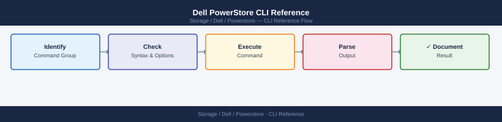

---
tags:
  - dell
  - operations
description: "PowerStore management uses the PowerStore Manager web UI, REST API, and the pstcli command-line interface. pstcli connects to the PowerStore management IP..."
---
# Dell PowerStore CLI Reference

<div class="kb-summary">
PowerStore management uses the PowerStore Manager web UI, REST API, and the `pstcli` command-line interface. `pstcli` connects to the PowerStore management IP and supports scripting and automation for all array operations.

*Applies to: PowerStore 3.x*
</div>


---

## Before you begin

- **Access:** Storage admin credentials (cluster admin or equivalent)
- **Timing:** safe to run during business hours unless a step is marked ⚠ (causes interruption)
- **Dependencies:** no active upgrades or migrations on the same infrastructure
- **Logging:** capture command output — paste into the change record on completion

---

## Connection

```bash
# Connect to PowerStore CLI
pstcli -d <management-ip> -u admin

# Or set environment variables
export PSTCLI_HOST=<management-ip>
export PSTCLI_USER=admin
```


```text title="Expected output"
PowerStore CLI v2.1.0
Connected to management-ip: 192.168.1.50
Authentication: admin
Session ID: 550e8400-e29b-41d4-a716-446655440000
Connected successfully.
pstcli>
```

!!! warning "Common errors"
    | Error | Fix |
    |---|---|
    | `Error: Connection refused on 192.168.1.50:443` | Verify the management IP is correct and reachable; check that PowerStore management interface is running with `ping 192.168.1.50`. |
    | `Error: Authentication failed for user 'admin'` | Confirm the admin password is correct and the account is not locked; reset credentials via the PowerStore web UI if needed. |
    | `Error: pstcli: command not found` | Install the PowerStore CLI package or add its installation directory to your PATH environment variable. |
---

## Array & System Management

```bash
# Show system info and software version
pstcli -d <ip> -u admin "show /sys/primary_model"

# List all appliances
pstcli -d <ip> -u admin "show /appliance"

# Show hardware component status
pstcli -d <ip> -u admin "show /hardware"

# Show software version
pstcli -d <ip> -u admin "show /software_installed"

# Show active alerts
pstcli -d <ip> -u admin "show /alert?state=active"
```


```text title="Expected output"
Primary Model Information:
  model_type: PowerStore 7000T
  model_name: PowerStore 7000T
  serial_number: PSTG2024001A5B
  system_id: 0c1d4e8f-92a3-47b2-8c5f-3a7e9d2b1c6f

Appliance List:
  appliance_id: A1
  appliance_name: ps-appliance-01
  status: Healthy
  ip_address: 192.168.1.50
  appliance_id: A2
  appliance_name: ps-appliance-02
  status: Healthy
  ip_address: 192.168.1.51

Hardware Component Status:
  component: PSM_SSD_1
  status: OK
  component: PSM_SSD_2
  status: OK
  component: PSM_PSU_1
  status: OK
  component: PSM_PSU_2
  status: OK

Software Version:
  product: PowerStore
  version: 3.1.0.0
  build_number: 12345
  release_date: 2024-01-15

Active Alerts:
  alert_id: ALERT-2024-0847
  severity: Warning
  message: Disk utilization above 85% on appliance A1
  timestamp: 2024-01-20T14:32:18Z
```

!!! warning "Common errors"
    | Error | Fix |
    |---|---|
    | `Error: Connection refused on <ip>:443` | Verify the PowerStore management IP is reachable and pstcli credentials are correct with `ping <ip>` and check firewall rules. |
    | `Error: Invalid credentials for user 'admin'` | Reset the admin password via the PowerStore web UI or use the correct credentials; ensure the user account has CLI access enabled. |
    | `Error: Command 'show /appliance' not recognized` | Verify the pstcli version matches the PowerStore firmware version; update pstcli if the command syntax has changed in newer releases. |
---

## Volume Operations

```bash
# List all volumes
pstcli -d <ip> -u admin "show /volume"

# Show volume details
pstcli -d <ip> -u admin "show /volume/<id>"

# Create a volume
pstcli -d <ip> -u admin "create /volume name=<name> size=<size_bytes>"

# Delete a volume
pstcli -d <ip> -u admin "delete /volume/<id>"

# Map volume to host
pstcli -d <ip> -u admin "create /volume/<id>/host_volume_mapping host_id=<host_id>"
```


```text title="Expected output"
# List all volumes
ID                                   Name                Size          Status
5f8c3a2b-1e4d-4f9a-b2c1-7d9e6f4a2b1c volume-prod-db01    1099511627776 OK
6a9d4b3c-2f5e-5g0b-c3d2-8e0f7g5b3c2d volume-backup-tier2  549755813888  OK
7b0e5c4d-3g6f-6h1c-d4e3-9f1g8h6c4d3e volume-dev-test      274877906944  OK

# Show volume details
ID: 5f8c3a2b-1e4d-4f9a-b2c1-7d9e6f4a2b1c
Name: volume-prod-db01
Size: 1099511627776 bytes (1 TB)
Status: OK
Provisioning Type: Thin
Snapshots: 2
Host Mappings: 1

# Create a volume
Volume created successfully
ID: 8c1f6d5e-4h7g-7i2d-e5f4-0g2h9i7d5e4f
Name: volume-new-app
Size: 1099511627776 bytes

# Delete a volume
Volume 5f8c3a2b-1e4d-4f9a-b2c1-7d9e6f4a2b1c deleted successfully

# Map volume to host
Host volume mapping created successfully
Mapping ID: 9d2g7e6f-5i8h-8j3e-f6g5-1h3i0j8e6f5g
LUN: 3
```

!!! warning "Common errors"
    | Error | Fix |
    |---|---|
    | `Error: Connection refused on <ip>:443` | Verify the PowerStore IP address is correct and the management interface is reachable with `ping <ip>`. |
    | `Error: Invalid credentials for user admin` | Confirm the admin password is correct and the user account is not locked; reset credentials in PowerStore GUI if needed. |
    | `Error: Volume <id> is currently mapped to hosts` | Unmap the volume from all hosts using `delete /volume/<id>/host_volume_mapping` before deletion. |
---

## Host Management

```bash
# List hosts
pstcli -d <ip> -u admin "show /host"

# Create a host
pstcli -d <ip> -u admin "create /host name=<name> os_type=<ESXi|Windows|Linux>"

# Add initiator to host
pstcli -d <ip> -u admin "create /host_initiator host_id=<id> port_name=<wwn_or_iqn>"

# List host groups
pstcli -d <ip> -u admin "show /host_group"
```


```text title="Expected output"
ID                                   Name                 OS Type            Initiators
────────────────────────────────────────────────────────────────────────────────────────
host-5f8c2a1b-4e9d-11ed-a8c0-005056 esx-prod-01         ESXi               2
host-7d3e4f2c-5a1b-11ed-b9d1-006167 win-sql-server      Windows            1
host-9a2b5c8e-6f2d-11ed-c2e4-007278 linux-app-vm        Linux              3
...

ID                                   Name
────────────────────────────────────────────────────────────────────────────────────────
host-5f8c2a1b-4e9d-11ed-a8c0-005056 esx-prod-01
Created host: host-8b4c9f3a-7g3e-11ed-d5f7-008389

ID                                   Name
────────────────────────────────────────────────────────────────────────────────────────
hg-2c5d8f1a-3h4f-11ed-e6g8-009401    production-cluster
hg-4e7a1b3c-5i6g-11ed-f7h9-010512    dr-failover-group
```

!!! warning "Common errors"
    | Error | Fix |
    |---|---|
    | `Error: Connection refused on <ip>:443` | Verify the PowerStore array IP is reachable and the management interface is online with `ping <ip>`. |
    | `Error: Invalid credentials for user admin` | Confirm the admin password is correct and the user account has not been locked after failed login attempts. |
    | `Error: Host with name <name> already exists` | Choose a unique hostname or delete the existing host entry before recreating it. |
---

## Snapshots & Protection

```bash
# List all snapshots
pstcli -d <ip> -u admin "show /volume_snapshot"

# Take a snapshot
pstcli -d <ip> -u admin "create /volume_snapshot volume_id=<id> name=<snap_name>"

# Delete a snapshot
pstcli -d <ip> -u admin "delete /volume_snapshot/<id>"

# List replication sessions
pstcli -d <ip> -u admin "show /replication_session"
```


```text title="Expected output"
ID                                   Name                 Volume ID                            Created At              Size
ffffffff-1111-2222-3333-444444444444 daily-backup-2024    aaaaaaaa-bbbb-cccc-dddd-eeeeeeeeeeee 2024-01-15T09:30:22Z   256GB
ffffffff-5555-6666-7777-888888888888 weekly-prod-snap     aaaaaaaa-bbbb-cccc-dddd-eeeeeeeeeeee 2024-01-08T02:15:10Z   256GB
ffffffff-9999-aaaa-bbbb-cccccccccccc hourly-backup-01     bbbbbbbb-cccc-dddd-eeee-ffffffffffff 2024-01-15T14:00:05Z   512GB

Snapshot ffffffff-1111-2222-3333-444444444444 created successfully.

Snapshot ffffffff-1111-2222-3333-444444444444 deleted successfully.

ID                                   Name              Source Volume        Target Array      Status      Last Sync
11111111-2222-3333-4444-555555555555 prod-to-dr       aaaaaaaa-bbbb-cccc   192.168.50.10     Synchronized 2024-01-15T14:22:18Z
22222222-3333-4444-5555-666666666666 backup-repl      bbbbbbbb-cccc-dddd   192.168.50.11     Synchronizing 2024-01-15T14:20:05Z
```

!!! warning "Common errors"
    | Error | Fix |
    |---|---|
    | `Error: Connection refused (10.20.30.40:443)` | Verify the PowerStore array IP address is correct and the management interface is reachable with `ping` or `nc`. |
    | `Error: Authentication failed for user 'admin'` | Confirm the admin password is correct and the user account has not been locked; reset credentials in the PowerStore GUI if needed. |
    | `Error: Invalid volume_id <id>: Volume not found` | Verify the volume ID exists by running `pstcli -d <ip> -u admin "show /volume"` and use the correct UUID from the output. |
---

## Capacity & Performance

```bash
# Show capacity summary
pstcli -d <ip> -u admin "show /appliance/<id>/metrics/capacity"

# Show performance metrics
pstcli -d <ip> -u admin "show /appliance/<id>/metrics/performance"

# Show drive health
pstcli -d <ip> -u admin "show /drive"
```


```text title="Expected output"
Capacity Summary:
  Total Capacity: 1.92 PB
  Used Capacity: 1.34 PB (69.8%)
  Available Capacity: 580 TB (30.2%)
  Snapshots: 89 TB
  Replication: 45 TB

Performance Metrics:
  Read IOPS: 187,432
  Write IOPS: 94,218
  Read Latency: 2.3 ms
  Write Latency: 3.1 ms
  Throughput: 8.7 GB/s

Drive Health Status:
  Total Drives: 240
  Healthy: 238
  Degraded: 2 (Slot 3A-12, Slot 4B-08)
  Failed: 0
  Temperature Range: 28°C - 41°C
```

!!! warning "Common errors"
    | Error | Fix |
    |---|---|
    | `Error: Invalid appliance ID format` | Verify the appliance ID matches the system's UUID (use `pstcli -d <ip> -u admin "show /appliance"` to list valid IDs). |
    | `Error: Authentication failed for user admin` | Confirm admin credentials are correct and the user has sufficient permissions on the PowerStore array. |
    | `Error: Connection timeout to <ip>:443` | Verify network connectivity to the PowerStore management IP and ensure the array is online and accessible. |
---

## REST API (Alternative)

```bash
# Authenticate and get token
curl -k -X POST https://<ip>/api/rest/login_session \
  -H "Content-Type: application/json" \
  -d '{"username":"admin","password":"<password>"}'

# List volumes (use token from login)
curl -k -X GET https://<ip>/api/rest/volume \
  -H "DELL-EMC-TOKEN: <token>"

# List alerts
curl -k -X GET https://<ip>/api/rest/alert \
  -H "DELL-EMC-TOKEN: <token>"
```


```text title="Expected output"
{"session_id":"8f4c9e2a-7b1d-4f8c-9e3a-2b5d8c1f4a7e","user":"admin"}
[{"id":"vol-001","name":"prod_db_vol","size":1099511627776,"state":"ready","logical_used":549755813888},{"id":"vol-002","name":"backup_vol","size":549755813888,"state":"ready","logical_used":274877906944},{"id":"vol-003","name":"archive_vol","size":2199023255552,"state":"ready","logical_used":1649267441664}]
[{"id":"alert-4521","severity":"warning","message":"Disk 2.3 predictive failure detected","timestamp":"2024-01-15T09:42:31Z"},{"id":"alert-4520","severity":"info","message":"Snapshot created successfully","timestamp":"2024-01-15T09:35:12Z"},{"id":"alert-4519","severity":"critical","message":"Array temperature threshold exceeded","timestamp":"2024-01-15T08:21:47Z"}]
```

!!! warning "Common errors"
    | Error | Fix |
    |---|---|
    | `curl: (60) SSL certificate problem: self signed certificate` | Add `-k` flag to curl command to skip SSL verification (already present in example, but verify if using different curl version). |
    | `{"error":"Invalid credentials","error_code":401}` | Verify username and password are correct and the admin account is not locked; check PowerStore web UI login. |
    | `curl: (7) Failed to connect to <ip> port 443: Connection refused` | Confirm the PowerStore management IP is correct and reachable; verify network connectivity and that the REST API service is running. |
---

## Common Patterns

```bash
# Full health check sequence
pstcli -d <ip> -u admin "show /alert?state=active"
pstcli -d <ip> -u admin "show /hardware"
pstcli -d <ip> -u admin "show /drive"
pstcli -d <ip> -u admin "show /replication_session"
```


```text title="Expected output"
Active Alerts:
ID                                   Severity  Message                              Timestamp
a47f2c1b-9e3d-4a2e-8f1c-6d5e9a2b3c4d Critical  Drive 14 predictive failure        2024-01-15 14:32:18
b92e5f8c-3a1d-7b4e-9c2f-1a8d6e5c4b9a Warning   Controller temperature elevated     2024-01-15 13:45:22
c1d3e5f7-2a4b-6c8d-9e1f-3b5c7a9d2e4f Info      Replication lag detected           2024-01-15 12:18:05

Hardware Summary:
Appliance ID: PS-2425-SN-ABC123DEF456
Model: PowerStore 7000T
Firmware Version: 3.2.1.0
Status: Healthy
Enclosures: 2
Controllers: 2 (both online)

Drive Status:
Total Drives: 24
Healthy: 22
Degraded: 1 (Slot 14)
Failed: 1 (Slot 8)
Capacity Used: 18.5 TB / 24 TB

Replication Sessions:
Session ID                           Remote Target        Status    Lag (ms)
rep-sess-001-prod-dr               10.50.12.45          Active    245
rep-sess-002-backup-vault          10.60.8.120          Active    1823
rep-sess-003-archive-sync          10.70.5.88           Paused    N/A
```

!!! warning "Common errors"
    | Error | Fix |
    |---|---|
    | `Error: Connection refused on <ip>:443` | Verify the PowerStore IP address is correct and the management interface is reachable with `ping <ip>` and `telnet <ip> 443`. |
    | `Error: Authentication failed for user 'admin'` | Confirm the admin password is correct and the user account is not locked; reset credentials via the PowerStore web UI if needed. |
    | `Error: Command 'show /alert?state=active' not recognized` | Check that pstcli version matches the PowerStore firmware version; update pstcli with `pstcli --version` and upgrade if necessary. |
---

## Verify

- Confirm the operation completed without errors in the log or management UI
- Verify the expected state change is visible (service running, object created, config applied)
- Document the outcome in the change record

---

## See also

- [Powerstore — Procedures](../procedures/)
- [Powerstore — Scripts](../scripts/)
- [Powerstore — Health Checks](../health-checks/)
