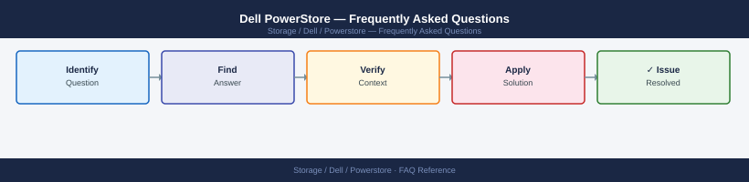

---
tags:
  - dell-powerstore
  - faq
  - operations
---
# Dell PowerStore — Frequently Asked Questions

*Applies to: Dell PowerStore 3.x*

Common questions about Dell PowerStore operations, configuration, and troubleshooting. For step-by-step procedures, see the <a href="index.md">Operations</a> section.

## General

**Q: What PowerStore OS version is recommended?**
A: PowerStore OS 3.5.x is the current recommendation. Check in PowerStore Manager: Settings → Software → Installed Software Version.

**Q: How do I check the current Dell PowerStore version?**
A: `PowerStore Manager → Settings → Software → Installed Version`

## Configuration

**Q: What is the default storage policy and when should it change?**
A: PowerStore uses a flat storage pool — no tiering policy to set. Inline deduplication and compression are enabled by default. Disable only for workloads with already-compressed data (e.g., encrypted backups, video).

**Q: How do I enable PowerStore Metro Volume for zero-RPO synchronous replication?**
A: Configure Metro Volume via PowerStore Manager: Protection → Replication → Add Metro Rule. Assign to volumes. Requires two PowerStore arrays at <5ms RTT. Requires Metro licence on both arrays.

## Operations

**Q: How do I upgrade PowerStore OS without downtime?**
A: Upgrades are non-disruptive on PowerStore appliances. Initiate via PowerStore Manager → Settings → Software → Upgrade. The upgrade is applied node-by-node with automatic I/O failover. Schedule during low-activity period.

**Q: What is the correct procedure to provision a new volume on PowerStore?**
A: PowerStore Manager → Storage → Volumes → Create. Set name, size, host mapping, and performance policy. For VMware, use the vSphere plugin for automated VMFS datastore creation.

## Troubleshooting

**Q: PowerStore shows 'Appliance node is in service mode'. What does it mean?**
A: One node of the PowerStore appliance has failed over. I/O continues on the surviving node. Contact Dell Support immediately — this is a degraded state. Do not reboot the appliance without Dell guidance.

**Q: PowerStore latency spiked — where do I start?**
A: Check PowerStore Manager → Performance for per-volume and per-appliance metrics. Review front-end port utilisation. Check dedup/compression saving ratio — low ratios may indicate working set exceeds NVMe capacity.

## Backup and Recovery

**Q: How often should I back up PowerStore configuration?**
A: Weekly via PowerStore Manager → Settings → System → Export Configuration. Include in off-site backup. Also configure Protection Policies with snapshots for data recovery.

**Q: Can I recover a deleted volume's snapshot on PowerStore?**
A: Yes — snapshots persist independently of volume deletion if the snapshot is not manually deleted. In PowerStore Manager → Storage → Snapshots, locate the snapshot and restore or create a new volume from it.

## See Also

- [Dell PowerStore Operations](index.md)
- [Dell PowerStore Troubleshooting](../../../../troubleshooting/index.md)
