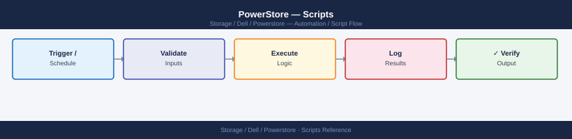

---
tags:
  - dell
  - operations
description: "Scripts reference covering Authentication Helper, Daily Health Check Script, Volume Inventory Report, Replication Status Reporter, Snapshot Cleanup Script..."
---
# PowerStore — Scripts

<div class="kb-summary">
Scripts reference covering Authentication Helper, Daily Health Check Script, Volume Inventory Report, Replication Status Reporter, Snapshot Cleanup Script and 2 more sections.

*Applies to: PowerStore 3.x*
</div>


## Before you begin

- **Access:** Storage admin credentials (cluster admin or equivalent)
- **Timing:** safe to run during business hours unless a step is marked ⚠ (causes interruption)
- **Dependencies:** no active upgrades or migrations on the same infrastructure
- **Logging:** capture command output — paste into the change record on completion

---

## Authentication Helper

All scripts in this section use the REST API token-based authentication. Source this helper before running any other script.

```bash
#!/bin/bash
# powerstore_auth.sh — Obtain a DELL-EMC-TOKEN for PowerStore REST API
# Usage: source powerstore_auth.sh
# Requires: curl, jq, environment variables PSTORE_HOST / PSTORE_USER / PSTORE_PASS

PSTORE_HOST="${PSTORE_HOST:-192.168.10.50}"
PSTORE_USER="${PSTORE_USER:-admin}"
PSTORE_PASS="${PSTORE_PASS:-}"

if [[ -z "$PSTORE_PASS" ]]; then
  echo "ERROR: PSTORE_PASS must be set" >&2
  return 1
fi

PSTORE_TOKEN=$(curl -ks -X POST \
  "https://${PSTORE_HOST}/api/rest/login_session" \
  -H "Content-Type: application/json" \
  -d "{\"username\":\"${PSTORE_USER}\",\"password\":\"${PSTORE_PASS}\"}" \
  -c /tmp/pstore_cookies.txt \
  | jq -r '.token // empty')

if [[ -z "$PSTORE_TOKEN" ]]; then
  echo "ERROR: Authentication failed — check PSTORE_HOST, PSTORE_USER, PSTORE_PASS" >&2
  return 1
fi

export PSTORE_TOKEN
export PSTORE_BASE="https://${PSTORE_HOST}/api/rest"
echo "Authenticated to ${PSTORE_HOST} as ${PSTORE_USER}"
```


```text title="Expected output"
Authenticated to 192.168.10.50 as admin
```

!!! warning "Common errors"
    **`ERROR: PSTORE_PASS must be set`** — Set the PSTORE_PASS environment variable before sourcing the script: `export PSTORE_PASS="your_password"`.
    **`ERROR: Authentication failed — check PSTORE_HOST, PSTORE_USER, PSTORE_PASS`** — Verify credentials are correct and the PowerStore array is reachable at the PSTORE_HOST IP address with `ping` or `curl -k https://${PSTORE_HOST}`.
---

## Daily Health Check Script

Runs the standard daily checks: active alerts, hardware health, drive state, replication sessions, and capacity. Exits non-zero on CRITICAL conditions.

```bash
#!/bin/bash
# powerstore_health.sh — Daily health check for Dell PowerStore
# Usage: PSTORE_HOST=<ip> PSTORE_USER=admin PSTORE_PASS=<pass> ./powerstore_health.sh
# Exit codes: 0=OK  1=WARNING  2=CRITICAL

set -uo pipefail

PSTORE_HOST="${PSTORE_HOST:-}"
PSTORE_USER="${PSTORE_USER:-admin}"
PSTORE_PASS="${PSTORE_PASS:-}"
BASE="https://${PSTORE_HOST}/api/rest"

[[ -z "$PSTORE_HOST" || -z "$PSTORE_PASS" ]] && \
  echo "ERROR: PSTORE_HOST and PSTORE_PASS required" >&2 && exit 2

STATE=0

flag() {
  local level="$1"; shift
  echo "  [${level}] $*"
  case "$level" in
    CRIT) [[ "$STATE" -lt 2 ]] && STATE=2 ;;
    WARN) [[ "$STATE" -lt 1 ]] && STATE=1 ;;
  esac
}

ok() { echo "  [OK]   $*"; }
info() { echo "  [INFO] $*"; }

# Authenticate
TOKEN=$(curl -ks -X POST "${BASE}/login_session" \
  -H "Content-Type: application/json" \
  -d "{\"username\":\"${PSTORE_USER}\",\"password\":\"${PSTORE_PASS}\"}" \
  -c /tmp/pstore_hc_cookies.txt \
  | jq -r '.token // empty')

[[ -z "$TOKEN" ]] && echo "CRIT: Authentication failed" && exit 2

AUTH=(-H "DELL-EMC-TOKEN: ${TOKEN}" -H "Accept: application/json")

echo "===================================================="
echo "  PowerStore Health Check: ${PSTORE_HOST}"
echo "  $(date '+%Y-%m-%d %H:%M:%S')"
echo "===================================================="

# 1. Active alerts
ALERTS=$(curl -ks -X GET "${BASE}/alert?state=active" "${AUTH[@]}")
CRIT_COUNT=$(echo "$ALERTS" | jq '[.[] | select(.severity == "Critical")] | length')
WARN_COUNT=$(echo "$ALERTS" | jq '[.[] | select(.severity == "Warning")] | length')
info "Active alerts — CRITICAL:${CRIT_COUNT}  WARNING:${WARN_COUNT}"

if [[ "$CRIT_COUNT" -gt 0 ]]; then
  flag CRIT "${CRIT_COUNT} CRITICAL alert(s)"
  echo "$ALERTS" | jq -r '.[] | select(.severity == "Critical") | "     " + .description_l10n' 2>/dev/null
else
  ok "No CRITICAL alerts"
fi

[[ "$WARN_COUNT" -gt 0 ]] && flag WARN "${WARN_COUNT} WARNING alert(s)" || ok "No WARNING alerts"

# 2. Drive health
DRIVES=$(curl -ks -X GET "${BASE}/drive?select=name,health.state,life_remaining" "${AUTH[@]}")
FAILED_DRIVES=$(echo "$DRIVES" | jq '[.[] | select(.health.state != "ok")] | length')
info "Drives with non-OK state: ${FAILED_DRIVES}"
[[ "$FAILED_DRIVES" -gt 0 ]] && flag CRIT "${FAILED_DRIVES} drive(s) in fault state" || ok "All drives healthy"

# 3. Node health
NODES=$(curl -ks -X GET "${BASE}/node?select=name,health.state" "${AUTH[@]}")
BAD_NODES=$(echo "$NODES" | jq '[.[] | select(.health.state != "ok")] | length')
info "Nodes with non-OK state: ${BAD_NODES}"
[[ "$BAD_NODES" -gt 0 ]] && flag CRIT "${BAD_NODES} node(s) in fault state" || ok "All nodes healthy"

# 4. Replication sessions
REPLS=$(curl -ks -X GET "${BASE}/replication_session?select=name,state" "${AUTH[@]}")
FAILED_REPLS=$(echo "$REPLS" | jq '[.[] | select(.state == "Failed")] | length')
PAUSED_REPLS=$(echo "$REPLS" | jq '[.[] | select(.state == "Paused")] | length')
info "Replication sessions — FAILED:${FAILED_REPLS}  PAUSED:${PAUSED_REPLS}"
[[ "$FAILED_REPLS" -gt 0 ]] && flag CRIT "${FAILED_REPLS} replication session(s) FAILED" || ok "No failed replication sessions"
[[ "$PAUSED_REPLS" -gt 0 ]] && flag WARN "${PAUSED_REPLS} replication session(s) PAUSED"

# 5. Pool capacity
POOLS=$(curl -ks -X GET "${BASE}/pool?select=name,size_free,size_used,size_total" "${AUTH[@]}")
echo "$POOLS" | jq -c '.[]' | while IFS= read -r pool; do
  name=$(echo "$pool" | jq -r '.name')
  total=$(echo "$pool" | jq '.size_total // 1')
  used=$(echo "$pool" | jq '.size_used // 0')
  pct=$(echo "scale=1; $used * 100 / $total" | bc)
  info "Pool ${name}: ${pct}% used"
done

echo "===================================================="
LABELS=( OK WARNING CRITICAL )
echo "  OVERALL: ${LABELS[$STATE]}"
exit "$STATE"
```


```text title="Expected output"
====================================================
  PowerStore Health Check: 192.168.1.42
  2024-01-15 09:47:23
====================================================
  [INFO] Active alerts — CRITICAL:0  WARNING:2
  [OK]   No CRITICAL alerts
  [WARN] 2 WARNING alert(s)
  [INFO] Drives with non-OK state: 0
  [OK]   All drives healthy
  [INFO] Nodes with non-OK state: 0
  [OK]   All nodes healthy
  [INFO] Replication sessions — FAILED:0  PAUSED:1
  [OK]   No failed replication sessions
  [WARN] 1 replication session(s) PAUSED
  [INFO] Pool pool_01: 67.3% used
  [INFO] Pool pool_02: 45.8% used
====================================================
  OVERALL: WARNING
```

!!! warning "Common errors"
    **`CRIT: Authentication failed`** — Verify PSTORE_HOST is reachable, PSTORE_USER exists, and PSTORE_PASS is correct.
    **`jq: parse error: Invalid numeric literal at line 1 column 5`** — Ensure the PowerStore API is responding with valid JSON; check network connectivity and API endpoint availability.
    **`curl: (60) SSL certificate problem: self signed certificate`** — Add `-k` flag to curl commands (already present) or import the PowerStore's CA certificate into your system trust store.
---

## Volume Inventory Report

Lists all volumes with their size, state, data reduction ratio, and host mapping count. Useful for regular capacity audits.

```bash
#!/bin/bash
# powerstore_volume_report.sh — Volume inventory for Dell PowerStore
# Usage: PSTORE_HOST=<ip> PSTORE_USER=admin PSTORE_PASS=<pass> ./powerstore_volume_report.sh
# Output: tab-separated to stdout (redirect to file or pipe to column)

PSTORE_HOST="${PSTORE_HOST:-}"
PSTORE_USER="${PSTORE_USER:-admin}"
PSTORE_PASS="${PSTORE_PASS:-}"
BASE="https://${PSTORE_HOST}/api/rest"

[[ -z "$PSTORE_HOST" || -z "$PSTORE_PASS" ]] && \
  echo "ERROR: PSTORE_HOST and PSTORE_PASS required" >&2 && exit 1

TOKEN=$(curl -ks -X POST "${BASE}/login_session" \
  -H "Content-Type: application/json" \
  -d "{\"username\":\"${PSTORE_USER}\",\"password\":\"${PSTORE_PASS}\"}" \
  -c /tmp/pstore_vol_cookies.txt \
  | jq -r '.token // empty')

[[ -z "$TOKEN" ]] && echo "ERROR: Auth failed" >&2 && exit 2
AUTH=(-H "DELL-EMC-TOKEN: ${TOKEN}")

echo "===================================================="
echo "  PowerStore Volume Report: ${PSTORE_HOST}"
echo "  $(date '+%Y-%m-%d %H:%M:%S')"
echo "===================================================="

VOLUMES=$(curl -ks -X GET \
  "${BASE}/volume?select=name,size,health.state,data_reduction_ratio,host_virtual_volume_mappings,type,description" \
  "${AUTH[@]}")

printf "%-40s  %10s  %-10s  %6s  %s\n" "NAME" "SIZE (GiB)" "STATE" "DRR" "DESCRIPTION"
printf "%-40s  %10s  %-10s  %6s  %s\n" "$(printf '%0.s-' {1..40})" "----------" "----------" "------" "-----------"

echo "$VOLUMES" | jq -c '.[]' | while IFS= read -r vol; do
  name=$(echo "$vol" | jq -r '.name // "unknown"')
  size_bytes=$(echo "$vol" | jq '.size // 0')
  size_gib=$(echo "scale=1; $size_bytes / 1073741824" | bc)
  state=$(echo "$vol" | jq -r '.health.state // "unknown"')
  drr=$(echo "$vol" | jq -r '.data_reduction_ratio // "N/A"')
  desc=$(echo "$vol" | jq -r '.description // ""')

  printf "%-40s  %10s  %-10s  %6s  %s\n" "$name" "${size_gib}" "$state" "$drr" "$desc"
done

# Summary
TOTAL=$(echo "$VOLUMES" | jq 'length')
echo "----"
echo "Total volumes: ${TOTAL}"
```


```text title="Expected output"
====================================================
  PowerStore Volume Report: 192.168.1.42
  2024-01-15 14:32:18
====================================================
NAME                                      SIZE (GiB)     STATE      DRR  DESCRIPTION
----------------------------------------  ----------  ----------  ------  -----------
prod-db-vol-01                                 500.0     Healthy    2.15  Production PostgreSQL
prod-db-vol-02                                 750.0     Healthy    1.89  Production PostgreSQL replica
backup-archive-vol                            2000.0     Healthy    3.42  Nightly backup target
dev-test-volume                                100.0     Healthy    1.05  Development environment
vmware-datastore-01                           1500.0     Healthy    2.67  vSphere cluster storage
----
Total volumes: 5
```

!!! warning "Common errors"
    **`ERROR: Auth failed`** — Verify PSTORE_PASS is correct and the user account is not locked; check that the PowerStore API is responding with `curl -ks https://<ip>/api/rest/login_session`.
    **`curl: (60) SSL certificate problem: self signed certificate`** — Add `-k` flag to curl commands (already present) or import the PowerStore certificate into your system CA bundle with `update-ca-certificates`.
    **`jq: parse error: Invalid numeric literal at line 1 column 5`** — Ensure the API response is valid JSON by testing the token endpoint directly; the PowerStore API may be unreachable or returning an error page instead of JSON.
---

## Replication Status Reporter

Checks the state and last sync time of all replication sessions. Flags sessions that are failed or have not synced within the expected RPO window.

```python
#!/usr/bin/env python3
# powerstore_replication_check.py — Replication session health reporter
# Requirements: requests
# Usage: PSTORE_HOST=<ip> PSTORE_USER=admin PSTORE_PASS=<pass> RPO_WARN_MINUTES=70 \
#        ./powerstore_replication_check.py
# Exit codes: 0=OK  1=WARNING  2=CRITICAL

import os, sys, requests, urllib3
from datetime import datetime, timezone, timedelta

urllib3.disable_warnings()

HOST   = os.environ.get("PSTORE_HOST", "")
USER   = os.environ.get("PSTORE_USER", "admin")
PASSW  = os.environ.get("PSTORE_PASS", "")
RPO_W  = int(os.environ.get("RPO_WARN_MINUTES", "70"))

if not HOST or not PASSW:
    print("ERROR: PSTORE_HOST and PSTORE_PASS required", file=sys.stderr)
    sys.exit(1)

BASE = f"https://{HOST}/api/rest"
session = requests.Session()
session.verify = False

# Authenticate
r = session.post(f"{BASE}/login_session",
                 json={"username": USER, "password": PASSW})
r.raise_for_status()
token = r.json().get("token")
session.headers.update({"DELL-EMC-TOKEN": token})

repls = session.get(f"{BASE}/replication_session",
                    params={"select": "name,state,last_sync_time,remaining_capacity_to_sync"}).json()

print("=" * 65)
print(f"  PowerStore Replication Check: {HOST}")
print(f"  {datetime.now().strftime('%Y-%m-%d %H:%M:%S')}")
print("=" * 65)

exit_code = 0
now = datetime.now(tz=timezone.utc)

for s in repls:
    name  = s.get("name", "unknown")
    state = s.get("state", "unknown")
    last_sync = s.get("last_sync_time")
    remaining = s.get("remaining_capacity_to_sync", 0)

    status = "OK"
    if state.lower() == "failed":
        status = "CRITICAL"
        exit_code = max(exit_code, 2)
    elif state.lower() == "paused":
        status = "WARNING"
        exit_code = max(exit_code, 1)
    elif last_sync:
        try:
            # Parse ISO8601 timestamp
            ts = datetime.fromisoformat(last_sync.replace("Z", "+00:00"))
            age_min = (now - ts).total_seconds() / 60
            if age_min > RPO_W:
                status = f"WARNING (last sync {int(age_min)}m ago)"
                exit_code = max(exit_code, 1)
        except Exception:
            pass

    print(f"  {name:<35}  state={state:<15}  {status}")

print("=" * 65)
labels = {0: "OK", 1: "WARNING", 2: "CRITICAL"}
print(f"  OVERALL: {labels.get(exit_code, 'UNKNOWN')}")
sys.exit(exit_code)
```

---

## Snapshot Cleanup Script

Deletes expired manual snapshots that are older than a specified number of days and match a naming prefix. Does not touch policy-managed snapshots.

```bash
#!/bin/bash
# powerstore_snap_cleanup.sh — Delete old manual snapshots matching a prefix
# Usage: PSTORE_HOST=<ip> PSTORE_PASS=<pass> PREFIX=snap-manual OLDER_THAN_DAYS=7 \
#        ./powerstore_snap_cleanup.sh
# Dry run by default; set DRY_RUN=false to actually delete

PSTORE_HOST="${PSTORE_HOST:-}"
PSTORE_USER="${PSTORE_USER:-admin}"
PSTORE_PASS="${PSTORE_PASS:-}"
PREFIX="${PREFIX:-snap-manual}"
OLDER_THAN_DAYS="${OLDER_THAN_DAYS:-7}"
DRY_RUN="${DRY_RUN:-true}"
BASE="https://${PSTORE_HOST}/api/rest"

[[ -z "$PSTORE_HOST" || -z "$PSTORE_PASS" ]] && \
  echo "ERROR: PSTORE_HOST and PSTORE_PASS required" >&2 && exit 1

TOKEN=$(curl -ks -X POST "${BASE}/login_session" \
  -H "Content-Type: application/json" \
  -d "{\"username\":\"${PSTORE_USER}\",\"password\":\"${PSTORE_PASS}\"}" \
  -c /tmp/pstore_snap_cookies.txt \
  | jq -r '.token // empty')

[[ -z "$TOKEN" ]] && echo "ERROR: Auth failed" >&2 && exit 2
AUTH=(-H "DELL-EMC-TOKEN: ${TOKEN}" -H "Accept: application/json")

CUTOFF=$(date -u -d "${OLDER_THAN_DAYS} days ago" '+%Y-%m-%dT%H:%M:%SZ' 2>/dev/null || \
         date -u -v-"${OLDER_THAN_DAYS}"d '+%Y-%m-%dT%H:%M:%SZ')

echo "Scanning snapshots older than ${OLDER_THAN_DAYS} days with prefix '${PREFIX}'"
echo "Dry run: ${DRY_RUN}"
echo "---"

SNAPS=$(curl -ks -X GET \
  "${BASE}/volume_snapshot?select=id,name,creation_timestamp,policy_id" \
  "${AUTH[@]}")

DELETED=0
SKIPPED=0

echo "$SNAPS" | jq -c '.[]' | while IFS= read -r snap; do
  id=$(echo "$snap" | jq -r '.id')
  name=$(echo "$snap" | jq -r '.name')
  ts=$(echo "$snap" | jq -r '.creation_timestamp // ""')
  policy=$(echo "$snap" | jq -r '.policy_id // ""')

  # Skip policy-managed snapshots (policy_id is set)
  [[ -n "$policy" && "$policy" != "null" ]] && continue

  # Check name prefix
  [[ "$name" != ${PREFIX}* ]] && continue

  # Check age
  [[ -z "$ts" || "$ts" > "$CUTOFF" ]] && { SKIPPED=$((SKIPPED+1)); continue; }

  echo "  DEL: ${name} (created: ${ts})"
  if [[ "${DRY_RUN}" == "false" ]]; then
    curl -ks -X DELETE "${BASE}/volume_snapshot/${id}" "${AUTH[@]}" > /dev/null
    DELETED=$((DELETED+1))
  fi
done

echo "---"
echo "Dry run: ${DRY_RUN} | Deleted: ${DELETED}"
```


```text title="Expected output"
Scanning snapshots older than 7 days with prefix 'snap-manual'
Dry run: true
---
  DEL: snap-manual-vol-prod-20250110 (created: 2025-01-10T14:32:18Z)
  DEL: snap-manual-vol-prod-20250108 (created: 2025-01-08T09:15:47Z)
  DEL: snap-manual-vol-test-20250105 (created: 2025-01-05T22:41:03Z)
  DEL: snap-manual-vol-archive-20250103 (created: 2025-01-03T16:28:55Z)
---
Dry run: true | Deleted: 0
```

!!! warning "Common errors"
    **`ERROR: Auth failed`** — Verify PSTORE_HOST is reachable and PSTORE_PASS credentials are correct.
    **`curl: (60) SSL certificate problem: self signed certificate`** — Add `-k` flag to curl commands or import the PowerStore certificate into your system trust store.
    **`jq: parse error: Invalid numeric literal at line 1 column 5`** — Ensure the PowerStore API is responding with valid JSON; check that PSTORE_HOST points to the management IP and the API endpoint is accessible.
---

## Capacity Forecast Report

Queries pool capacity and calculates days to full based on current usage trend. Flags pools projected to fill within 30 days.

```python
#!/usr/bin/env python3
# powerstore_capacity_report.py — Capacity and days-to-full reporter
# Requirements: requests
# Usage: PSTORE_HOST=<ip> PSTORE_USER=admin PSTORE_PASS=<pass> WARN_PCT=75 \
#        ./powerstore_capacity_report.py

import os, sys, requests, urllib3

urllib3.disable_warnings()

HOST   = os.environ.get("PSTORE_HOST", "")
USER   = os.environ.get("PSTORE_USER", "admin")
PASSW  = os.environ.get("PSTORE_PASS", "")
WARN   = float(os.environ.get("WARN_PCT", "75"))

if not HOST or not PASSW:
    print("ERROR: PSTORE_HOST and PSTORE_PASS required", file=sys.stderr)
    sys.exit(1)

BASE = f"https://{HOST}/api/rest"
s = requests.Session()
s.verify = False
r = s.post(f"{BASE}/login_session", json={"username": USER, "password": PASSW})
r.raise_for_status()
s.headers.update({"DELL-EMC-TOKEN": r.json()["token"]})

pools = s.get(f"{BASE}/pool",
              params={"select": "name,size_free,size_used,size_total,data_reduction_ratio"}).json()

print("=" * 75)
print(f"  PowerStore Capacity Report: {HOST}")
print("=" * 75)
print(f"{'POOL':<30}  {'TOTAL (TiB)':>11}  {'USED (TiB)':>10}  {'FREE (TiB)':>10}  {'USED%':>6}  STATUS")
print("-" * 75)

exit_code = 0
TiB = 1099511627776

for pool in pools:
    name  = pool.get("name", "unknown")
    total = pool.get("size_total", 0)
    used  = pool.get("size_used", 0)
    free  = pool.get("size_free", 0)
    pct   = used / total * 100 if total > 0 else 0

    status = "OK"
    if pct >= 85:
        status = "CRITICAL"
        exit_code = max(exit_code, 2)
    elif pct >= WARN:
        status = "WARNING"
        exit_code = max(exit_code, 1)

    print(f"{name:<30}  {total/TiB:>11.2f}  {used/TiB:>10.2f}  {free/TiB:>10.2f}  {pct:>5.1f}%  {status}")

print("-" * 75)
labels = {0: "OK", 1: "WARNING", 2: "CRITICAL"}
print(f"\nOVERALL: {labels.get(exit_code, 'UNKNOWN')}")
sys.exit(exit_code)
```

---

## Pre-Change Checklist Script

Validates PowerStore readiness before a maintenance window. Exits 2 if any blocking condition is found.

```bash
#!/bin/bash
# powerstore_precheck.sh — Pre-change readiness check for Dell PowerStore
# Usage: PSTORE_HOST=<ip> PSTORE_PASS=<pass> ./powerstore_precheck.sh

PSTORE_HOST="${PSTORE_HOST:-}"
PSTORE_USER="${PSTORE_USER:-admin}"
PSTORE_PASS="${PSTORE_PASS:-}"
BASE="https://${PSTORE_HOST}/api/rest"

[[ -z "$PSTORE_HOST" || -z "$PSTORE_PASS" ]] && \
  echo "ERROR: PSTORE_HOST and PSTORE_PASS required" >&2 && exit 2

TOKEN=$(curl -ks -X POST "${BASE}/login_session" \
  -H "Content-Type: application/json" \
  -d "{\"username\":\"${PSTORE_USER}\",\"password\":\"${PSTORE_PASS}\"}" \
  -c /tmp/pstore_pre_cookies.txt \
  | jq -r '.token // empty')

[[ -z "$TOKEN" ]] && echo "FAIL: Authentication failed" && exit 2
AUTH=(-H "DELL-EMC-TOKEN: ${TOKEN}" -H "Accept: application/json")

ISSUES=0
pass() { printf "  PASS  %s\n" "$1"; }
fail() { printf "  FAIL  %s\n" "$1"; ISSUES=$((ISSUES+1)); }

echo "============================================"
echo "  PowerStore Pre-Change Check: ${PSTORE_HOST}"
echo "  $(date '+%Y-%m-%d %H:%M:%S')"
echo "============================================"

# CRITICAL alerts
CRIT=$(curl -ks "${BASE}/alert?state=active&severity=Critical" "${AUTH[@]}" | jq 'length')
[[ "$CRIT" -eq 0 ]] && pass "No CRITICAL alerts" || fail "${CRIT} CRITICAL alert(s) active"

# Drive health
DRIVE_FAIL=$(curl -ks "${BASE}/drive?select=health.state" "${AUTH[@]}" \
  | jq '[.[] | select(.health.state != "ok")] | length')
[[ "$DRIVE_FAIL" -eq 0 ]] && pass "All drives healthy" || fail "${DRIVE_FAIL} drive(s) not healthy"

# Replication sessions
REPL_FAIL=$(curl -ks "${BASE}/replication_session?select=state" "${AUTH[@]}" \
  | jq '[.[] | select(.state == "Failed")] | length')
[[ "$REPL_FAIL" -eq 0 ]] && pass "No failed replication sessions" || \
  fail "${REPL_FAIL} replication session(s) FAILED"

# Pool capacity below 80%
POOL_BAD=$(curl -ks "${BASE}/pool?select=name,size_used,size_total" "${AUTH[@]}" \
  | jq '[.[] | select(.size_total > 0 and (.size_used / .size_total * 100) > 80)] | length')
[[ "$POOL_BAD" -eq 0 ]] && pass "Pool utilisation below 80%" || \
  fail "${POOL_BAD} pool(s) above 80% utilisation"

echo "============================================"
if [[ "$ISSUES" -gt 0 ]]; then
  echo "  PRE-CHECK FAILED — ${ISSUES} issue(s). Resolve before proceeding."
  exit 2
fi
echo "  PRE-CHECK PASSED — Safe to proceed."
exit 0
```


```text title="Expected output"
============================================
  PowerStore Pre-Change Check: 192.168.1.42
  2024-01-15 14:32:18
============================================
  PASS  No CRITICAL alerts
  PASS  All drives healthy
  PASS  No failed replication sessions
  PASS  Pool utilisation below 80%
============================================
  PRE-CHECK PASSED — Safe to proceed.
```

!!! warning "Common errors"
    **`FAIL: Authentication failed`** — Verify PSTORE_HOST is reachable and PSTORE_PASS credentials are correct; check network connectivity with `ping ${PSTORE_HOST}`.
    **`curl: (60) SSL certificate problem: self signed certificate`** — Add `-k` flag to curl (already present) or import the PowerStore CA certificate into your system trust store.
    **`jq: parse error: Invalid numeric literal at line 1 column 5`** — Ensure the PowerStore API is responding with valid JSON; verify the API endpoint version matches your PowerStore firmware with `curl -ks https://${PSTORE_HOST}/api/rest/system`.
---

## Verify

- Confirm the operation completed without errors in the log or management UI
- Verify the expected state change is visible (service running, object created, config applied)
- Document the outcome in the change record

---

## See also

- [Powerstore — Procedures](../procedures/)
- [Powerstore — CLI Reference](../cli-reference/)
- [Powerstore — Health Checks](../health-checks/)
