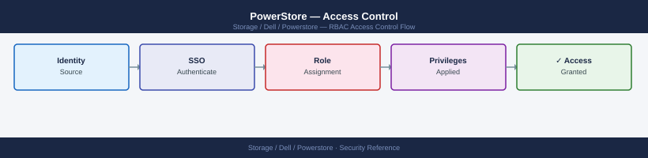

---
tags:
  - dell
  - security
description: "Access Control reference covering Role-Based Access Control, User Account Management, Host Access Control, NFS Export Access Control, SMB Share Access..."
---
# PowerStore — Access Control

<div class="kb-summary">
Access Control reference covering Role-Based Access Control, User Account Management, Host Access Control, NFS Export Access Control, SMB Share Access Control and 1 more sections.

*Applies to: PowerStore 3.x*
</div>


## Before you begin

- **Access:** Storage admin credentials (cluster admin or equivalent)
- **Change management:** security changes require CAB approval in most environments
- **Rollback plan:** document current state before any security control change
- **Testing:** validate in a non-production environment first where possible

---

## Role-Based Access Control

PowerStore uses a role-based access control model. Every user (local or LDAP-mapped) is assigned exactly one role. Roles are non-cumulative — a user has the permissions of their assigned role and nothing more.

| Role | Permissions | Intended Users |
|---|---|---|
| Administrator | Full access: create, modify, delete all resources; manage users, roles, certificates, networking; view all data | Storage lead, storage architect |
| StorageOperator | Provision and manage storage resources (volumes, hosts, NAS, snapshots, replication); cannot manage users or system security settings | Storage operations engineers |
| VMOperator | Create and manage vVols and storage containers for VMware; limited scope to VMware-related resources only | VMware administrators |
| Viewer | Read-only access to all storage resource data; cannot create, modify, or delete anything | Monitoring tools, application owners, capacity reviewers |
| SecurityAdmin | Manage certificates, LDAP configuration, audit logs, and security settings; cannot manage storage resources | Security team |

### Applying Least Privilege

Design service accounts and user accounts with the minimum role needed:

| Use Case | Role | Rationale |
|---|---|---|
| Day-to-day provisioning (storage team) | StorageOperator | Provision and manage without security or user management access |
| Read-only monitoring scripts | Viewer | No write access; cannot introduce configuration drift |
| VMware vCenter plugin (storage admin function) | Administrator | vCenter integration requires full API access |
| VMware vCenter plugin (VMware team) | VMOperator | Scoped to vVols management only |
| Veeam / backup integration | StorageOperator | Needs snapshot create/delete; no security access |
| Ansible/Terraform automation | StorageOperator or Administrator | Administrator only if you need to create LDAP config or users via IaC |
| LDAP and certificate management | SecurityAdmin | Dedicated security role; isolates from storage operations |

```bash
# Create a local user account with StorageOperator role (for a service account)
curl -k -X POST "https://<mgmt-ip>/api/rest/user/local" \
  -H "DELL-EMC-TOKEN: <token>" \
  -H "Content-Type: application/json" \
  -d '{
    "name": "svc-veeam",
    "password": "<password>",
    "role_name": "StorageOperator",
    "is_built_in": false
  }'

# Create a read-only monitoring account
curl -k -X POST "https://<mgmt-ip>/api/rest/user/local" \
  -H "DELL-EMC-TOKEN: <token>" \
  -H "Content-Type: application/json" \
  -d '{
    "name": "svc-monitoring",
    "password": "<password>",
    "role_name": "Viewer",
    "is_built_in": false
  }'
```


```text title="Expected output"
{
  "id": "user-00000001",
  "name": "svc-veeam",
  "role_name": "StorageOperator",
  "is_built_in": false,
  "created_at": "2024-01-15T09:42:18Z",
  "updated_at": "2024-01-15T09:42:18Z"
}
{
  "id": "user-00000002",
  "name": "svc-monitoring",
  "role_name": "Viewer",
  "is_built_in": false,
  "created_at": "2024-01-15T09:42:22Z",
  "updated_at": "2024-01-15T09:42:22Z"
}
```

!!! warning "Common errors"
    | Error | Fix |
    |---|---|
    | `"error_code": 400, "message": "User 'svc-veeam' already exists"` | Check if the user exists with `curl -k -H "DELL-EMC-TOKEN: <token>" "https://<mgmt-ip>/api/rest/user/local?name=svc-veeam"` and delete it first if needed. |
    | `"error_code": 401, "message": "Invalid or expired token"` | Regenerate the DELL-EMC-TOKEN by authenticating with valid admin credentials using the login endpoint. |
    | `"error_code": 422, "message": "Invalid role_name 'StorageOperator'"` | Verify the exact role name matches your PowerStore version (use `curl -k -H "DELL-EMC-TOKEN: <token>" "https://<mgmt-ip>/api/rest/role"` to list available roles). |
## User Account Management

### Audit All User Accounts

```bash
# List all local user accounts and their roles
curl -k -X GET "https://<mgmt-ip>/api/rest/user/local?select=name,role_name,is_built_in,is_default_password" \
  -H "DELL-EMC-TOKEN: <token>"

# List LDAP group-to-role mappings
curl -k -X GET "https://<mgmt-ip>/api/rest/ldap_domain_role_mapping" \
  -H "DELL-EMC-TOKEN: <token>"
```


```text title="Expected output"
{
  "entries": [
    {
      "id": "user-001",
      "name": "admin",
      "role_name": "Administrator",
      "is_built_in": true,
      "is_default_password": false
    },
    {
      "id": "user-042",
      "name": "monitor_svc",
      "role_name": "Monitor",
      "is_built_in": false,
      "is_default_password": true
    },
    {
      "id": "user-156",
      "name": "backup_operator",
      "role_name": "Operator",
      "is_built_in": false,
      "is_default_password": false
    }
  ]
}

{
  "entries": [
    {
      "id": "ldap-map-001",
      "ldap_domain_id": "ldap-001",
      "ldap_group_name": "cn=powerstore-admins,ou=groups,dc=corp,dc=local",
      "role_name": "Administrator"
    },
    {
      "id": "ldap-map-002",
      "ldap_domain_id": "ldap-001",
      "ldap_group_name": "cn=powerstore-operators,ou=groups,dc=corp,dc=local",
      "role_name": "Operator"
    }
  ]
}
```

!!! warning "Common errors"
    | Error | Fix |
    |---|---|
    | `curl: (60) SSL certificate problem: self signed certificate` | Add the `-k` flag to skip certificate verification (already present in the example, but ensure it's not removed in production scripts). |
    | `{"error": "Unauthorized"}` | Verify the DELL-EMC-TOKEN is valid and not expired by re-authenticating with the login endpoint. |
    | `curl: (7) Failed to connect to <mgmt-ip> port 443: Connection refused` | Confirm the management IP is correct and the PowerStore REST API service is running with `systemctl status dell-emc-rest-api`. |
Perform a quarterly review of all user accounts:

- [ ] No accounts using the default password (`is_default_password: true`)
- [ ] All service accounts have clearly named purposes
- [ ] No service accounts with `Administrator` role where `StorageOperator` would suffice
- [ ] All human user accounts are LDAP-mapped (not local), except the break-glass admin
- [ ] Break-glass admin password is stored in PAM vault, not known to individuals

### Remove a Stale Service Account

```bash
# List accounts to identify the stale one
curl -k -X GET "https://<mgmt-ip>/api/rest/user/local?select=id,name,role_name" \
  -H "DELL-EMC-TOKEN: <token>"

# Delete the stale account
curl -k -X DELETE "https://<mgmt-ip>/api/rest/user/local/<user-id>" \
  -H "DELL-EMC-TOKEN: <token>"
```


```text title="Expected output"
{
  "entries": [
    {
      "id": "user-001",
      "name": "admin",
      "role_name": "Administrator"
    },
    {
      "id": "user-042",
      "name": "svc_backup",
      "role_name": "Storage Administrator"
    },
    {
      "id": "user-156",
      "name": "legacy_operator",
      "role_name": "Operator"
    },
    {
      "id": "user-203",
      "name": "temp_audit",
      "role_name": "Read Only"
    }
  ]
}
(no output — command completes silently)
```

!!! warning "Common errors"
    | Error | Fix |
    |---|---|
    | `curl: (60) SSL certificate problem: self signed certificate` | Add `-k` flag to skip certificate verification (already present in the example, but ensure it's not removed). |
    | `{"error":"Unauthorized","error_code":"401"}` | Verify the DELL-EMC-TOKEN is valid and not expired by re-authenticating and obtaining a fresh token. |
    | `{"error":"User not found","error_code":"404"}` | Confirm the user-id exists in the system by running the GET query first to retrieve the correct id value. |
## Host Access Control

### Host and Host Group Isolation

PowerStore maps volumes to hosts via host objects and host groups. Access control at the storage layer depends on correct host configuration:

- **One host object per physical host**: never share a host object between unrelated servers
- **Host groups for clusters**: ESXi cluster members share a host group; all cluster members see the same volumes
- **Host group isolation by security zone**: production and dev/test host groups must never share volumes

```bash
# List all host-to-volume mappings
curl -k -X GET "https://<mgmt-ip>/api/rest/host_volume_mapping?select=host_id,volume_id,logical_unit_number" \
  -H "DELL-EMC-TOKEN: <token>"

# Audit: find any volume mapped to more than one host group
# (potential cross-zone access — should only occur for intentionally shared volumes)
curl -k -X GET "https://<mgmt-ip>/api/rest/host_volume_mapping?select=volume_id,host_id" \
  -H "DELL-EMC-TOKEN: <token>" | python3 -c "
import sys, json
from collections import defaultdict
data = json.load(sys.stdin)
vol_hosts = defaultdict(list)
for m in data:
    vol_hosts[m['volume_id']].append(m['host_id'])
for vol, hosts in vol_hosts.items():
    if len(hosts) > 1:
        print(f'Volume {vol} is mapped to {len(hosts)} hosts: {hosts}')
"
```


```text title="Expected output"
{
  "entries": [
    {
      "host_id": "host-001",
      "volume_id": "vol-7f3a9c2e",
      "logical_unit_number": 0
    },
    {
      "host_id": "host-002",
      "volume_id": "vol-8b4d1f5a",
      "logical_unit_number": 1
    },
    {
      "host_id": "host-003",
      "volume_id": "vol-9e2c6b7d",
      "logical_unit_number": 0
    },
    {
      "host_id": "host-001",
      "volume_id": "vol-c1a5e9f3",
      "logical_unit_number": 2
    }
  ],
  "meta": {
    "response_type": "collection",
    "count": 4
  }
}
Volume vol-7f3a9c2e is mapped to 2 hosts: ['host-001', 'host-004']
Volume vol-c1a5e9f3 is mapped to 3 hosts: ['host-001', 'host-002', 'host-005']
```

!!! warning "Common errors"
    | Error | Fix |
    |---|---|
    | `curl: (60) SSL certificate problem: self signed certificate` | Add `-k` flag to curl command to skip SSL verification (already present in the example, but ensure it's not removed). |
    | `error: 401 Unauthorized` | Verify the DELL-EMC-TOKEN is valid and not expired; regenerate the token from the PowerStore management console if needed. |
    | `json.decoder.JSONDecodeError: Expecting value: line 1 column 1` | Confirm the management IP is correct and the API endpoint is reachable; check network connectivity to the PowerStore array. |
### Fibre Channel Access Control

For FC-attached hosts, access control depends on correct SAN zoning in addition to PowerStore host objects. PowerStore only presents a volume to a host if both conditions are met:

1. The host's WWN is in the PowerStore host object (initiator registered)
2. The host's WWN is zoned to the PowerStore target port in the SAN fabric

Verify zoning is correct for each host:

```bash
# On Brocade FC switch — verify zone membership
# switch:admin> zoneshow "ZONE_LON01-ESX01_PSTORE01"

# On Cisco MDS FC switch
# switch# show zoneset active

# Confirm PowerStore target port WWNs
curl -k -X GET "https://<mgmt-ip>/api/rest/fc_port?select=name,wwn,current_speed,node_id" \
  -H "DELL-EMC-TOKEN: <token>"
```


```text title="Expected output"
{
  "entries": [
    {
      "id": "061d8e4a-8f2e-4e9c-b1a2-7c3d9e2f1a4b",
      "name": "FC0",
      "wwn": "50:00:14:40:5d:2e:1a:4b",
      "current_speed": 16,
      "node_id": "node-1"
    },
    {
      "id": "071d8e4a-8f2e-4e9c-b1a2-7c3d9e2f1a5c",
      "name": "FC1",
      "wwn": "50:00:14:40:5d:2e:1a:5c",
      "current_speed": 16,
      "node_id": "node-1"
    },
    {
      "id": "081d8e4a-8f2e-4e9c-b1a2-7c3d9e2f1a6d",
      "name": "FC2",
      "wwn": "50:00:14:40:5d:2e:1a:6d",
      "current_speed": 16,
      "node_id": "node-2"
    },
    {
      "id": "091d8e4a-8f2e-4e9c-b1a2-7c3d9e2f1a7e",
      "name": "FC3",
      "wwn": "50:00:14:40:5d:2e:1a:7e",
      "current_speed": 16,
      "node_id": "node-2"
    }
  ]
}
```

!!! warning "Common errors"
    | Error | Fix |
    |---|---|
    | `curl: (60) SSL certificate problem: self signed certificate` | Add the `-k` flag (already present) or import the PowerStore certificate into your CA bundle; if still failing, verify the management IP is reachable with `ping <mgmt-ip>`. |
    | `{"error": "Unauthorized"}` | Ensure the DELL-EMC-TOKEN is valid and not expired by regenerating it through the PowerStore GUI or API authentication endpoint. |
    | `curl: (7) Failed to connect to <mgmt-ip> port 443: Connection refused` | Verify the PowerStore management IP is correct and the REST API service is running with `ssh <mgmt-ip> systemctl status rest-api`. |
### iSCSI CHAP Authentication

For iSCSI-attached hosts, enforce CHAP authentication to prevent unauthorised iSCSI initiators from connecting.

```bash
# Configure mutual CHAP on an iSCSI host in PowerStore
curl -k -X PATCH "https://<mgmt-ip>/api/rest/host_initiator/<initiator-id>" \
  -H "DELL-EMC-TOKEN: <token>" \
  -H "Content-Type: application/json" \
  -d '{
    "chap_mutual_username": "host-chap-username",
    "chap_mutual_password": "<chap-password-min-12-chars>"
  }'
```


```text title="Expected output"
{
  "id": "iscsi_initiator_1a2b3c4d",
  "initiator_type": "iSCSI",
  "initiator_iqn": "iqn.1991-05.com.example:host01.storage",
  "chap_mutual_username": "host-chap-username",
  "chap_mutual_password": "***",
  "chap_single_username": "array-chap-user",
  "chap_mode": "Mutual",
  "host_id": "host_5f8e9c2a",
  "host_name": "prod-db-server-01",
  "creation_timestamp": "2024-01-15T10:23:45Z",
  "last_modified_timestamp": "2024-01-16T14:52:18Z"
}
```

!!! warning "Common errors"
    | Error | Fix |
    |---|---|
    | `"error": "Invalid token or token expired"` | Regenerate the authentication token using the PowerStore management API login endpoint. |
    | `"error": "CHAP password must be at least 12 characters"` | Increase the password length to a minimum of 12 characters and retry the PATCH request. |
    | `"error": "Initiator ID not found"` | Verify the correct initiator ID by listing all initiators with `curl -k -H "DELL-EMC-TOKEN: <token>" "https://<mgmt-ip>/api/rest/host_initiator"`. |
On the Linux iSCSI initiator:

```bash
# /etc/iscsi/iscsid.conf — enable CHAP
node.session.auth.authmethod = CHAP
node.session.auth.username = host-chap-username
node.session.auth.password = <chap-password>

# For mutual CHAP (PowerStore authenticates to the host)
node.session.auth.username_in = <target-chap-username>
node.session.auth.password_in = <target-chap-password>
```


```text title="Expected output"
(no output — command completes silently)
```

!!! warning "Common errors"
    | Error | Fix |
    |---|---|
    | `iscsid: read-only file system` | Ensure `/etc/iscsi/iscsid.conf` is writable and the filesystem is mounted read-write; check with `mount | grep /etc`. |
    | `iscsid: connection refused` | Start or restart the iSCSI daemon with `systemctl restart iscsid` after editing the configuration file. |
## NFS Export Access Control

NFS exports are controlled by host IP allow lists in the PowerStore NFS export configuration. Always specify the narrowest set of allowed hosts:

```bash
# Review NFS export access rules
curl -k -X GET "https://<mgmt-ip>/api/rest/nfs_export?select=name,rw_hosts,ro_hosts,no_access_hosts" \
  -H "DELL-EMC-TOKEN: <token>"

# Restrict an NFS export to specific subnet (update existing export)
curl -k -X PATCH "https://<mgmt-ip>/api/rest/nfs_export/<export-id>" \
  -H "DELL-EMC-TOKEN: <token>" \
  -H "Content-Type: application/json" \
  -d '{
    "rw_hosts": [{"ip": "192.168.20.0", "prefix_length": 24}],
    "ro_hosts": [],
    "no_access_hosts": [],
    "min_security": "sys"
  }'
```


```text title="Expected output"
{
  "entries": [
    {
      "id": "nfs_export_1a2b3c4d",
      "name": "prod_data_export",
      "rw_hosts": [
        {"ip": "192.168.10.0", "prefix_length": 24}
      ],
      "ro_hosts": [
        {"ip": "10.50.0.0", "prefix_length": 16}
      ],
      "no_access_hosts": []
    },
    {
      "id": "nfs_export_5e6f7g8h",
      "name": "backup_export",
      "rw_hosts": [
        {"ip": "192.168.15.5", "prefix_length": 32}
      ],
      "ro_hosts": [],
      "no_access_hosts": [
        {"ip": "172.16.0.0", "prefix_length": 12}
      ]
    }
  ]
}
{
  "id": "nfs_export_1a2b3c4d",
  "name": "prod_data_export",
  "rw_hosts": [
    {"ip": "192.168.20.0", "prefix_length": 24}
  ],
  "ro_hosts": [],
  "no_access_hosts": [],
  "min_security": "sys"
}
```

!!! warning "Common errors"
    | Error | Fix |
    |---|---|
    | `curl: (60) SSL certificate problem: self signed certificate` | Add `-k` flag to bypass certificate validation, or import the PowerStore management certificate into your system trust store. |
    | `{"error_code":"401","message":"Invalid or expired token"}` | Regenerate the DELL-EMC-TOKEN using the authentication endpoint and ensure it has not exceeded its expiration window. |
    | `{"error_code":"404","message":"Export not found"}` | Verify the export-id exists by running the GET query first and confirm the UUID matches exactly. |
NFS export security levels:

| Security Level | Description | Use |
|---|---|---|
| `sys` | Standard Unix UID/GID-based access; no encryption | Standard for trusted internal networks |
| `krb5` | Kerberos authentication; no integrity or encryption | Authenticates client identity |
| `krb5i` | Kerberos with integrity checking | Prevents packet tampering |
| `krb5p` | Kerberos with full encryption | Maximum security; impacts performance |

## SMB Share Access Control

SMB shares use Windows ACLs. Share-level permissions are configured in PowerStore; file-level ACLs are managed via standard Windows tools (Security tab, icacls, PowerShell).

```bash
# Review SMB shares
curl -k -X GET "https://<mgmt-ip>/api/rest/smb_share?select=name,path,filesystem_id,is_continuous_availability_enabled" \
  -H "DELL-EMC-TOKEN: <token>"
```


```text title="Expected output"
{
  "entries": [
    {
      "name": "data_share",
      "path": "/fs_001/shared_data",
      "filesystem_id": "filesystem_5a8c2e1f-9b3d-4e7c-a2d1-6f9e3c1b5a8d",
      "is_continuous_availability_enabled": true
    },
    {
      "name": "backup_archive",
      "path": "/fs_002/backups",
      "filesystem_id": "filesystem_7d2f1a9c-3e5b-4f8a-9c2e-1d7f3a5b8c6e",
      "is_continuous_availability_enabled": false
    },
    {
      "name": "user_profiles",
      "path": "/fs_001/profiles",
      "filesystem_id": "filesystem_5a8c2e1f-9b3d-4e7c-a2d1-6f9e3c1b5a8d",
      "is_continuous_availability_enabled": true
    }
  ]
}
```

!!! warning "Common errors"
    | Error | Fix |
    |---|---|
    | `curl: (60) SSL certificate problem: self signed certificate` | Add `-k` flag to bypass SSL verification (already present in example; if error persists, verify the management IP is correct). |
    | `{"error": "Unauthorized"}` | Verify the DELL-EMC-TOKEN is valid and not expired by re-authenticating to the API. |
Best practices:

- Grant `Full Control` share permission to the `Domain Admins` group and `Change` or `Read` to named groups — never grant `Full Control` to `Everyone`
- Use AD security groups for share access, not individual user accounts
- Enable Continuous Availability (CA) for shares hosting Hyper-V VMs or SQL Server data on SMB 3.x

## Access Review Checklist (Quarterly)

| Check | Action |
|---|---|
| All local accounts reviewed | Confirm no unused local accounts; rotate service account passwords |
| All LDAP group mappings reviewed | Confirm group-to-role mappings are current; remove stale groups |
| Service account roles reviewed | Confirm no service account has Administrator where StorageOperator suffices |
| Host objects reviewed | Confirm no host objects contain stale initiators from decommissioned servers |
| Host group memberships reviewed | Confirm production and dev/test host groups are properly separated |
| NFS export access reviewed | Confirm all exports restrict access to the intended subnets |
| SMB share permissions reviewed | Confirm no shares grant access to `Everyone` or `Authenticated Users` with write |
| Volume mappings reviewed | Confirm no cross-zone volume mappings exist between production and non-production hosts |

---

## See also

- [Powerstore — Authentication](../authentication/)
- [Powerstore — Hardening](../hardening/)
- [Powerstore — Encryption](../encryption/)
