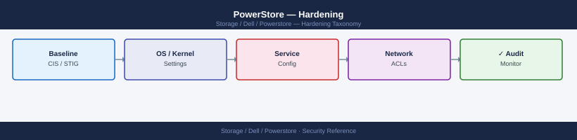

---
tags:
  - dell
  - security
description: "Hardening reference covering Overview, Management Plane Hardening, Host Connectivity Hardening, SupportAssist Hardening, Audit Logging and 2 more sections."
---
# PowerStore — Hardening

<div class="kb-summary">
Hardening reference covering Overview, Management Plane Hardening, Host Connectivity Hardening, SupportAssist Hardening, Audit Logging and 2 more sections.

*Applies to: PowerStore 3.x*
</div>


## Before you begin

- **Access:** Storage admin credentials (cluster admin or equivalent)
- **Change management:** security changes require CAB approval in most environments
- **Rollback plan:** document current state before any security control change
- **Testing:** validate in a non-production environment first where possible

---

## Overview

PowerStore hardening covers four areas: securing the management plane (PowerStore Manager and REST API), securing host connectivity (FC, iSCSI, NFS, SMB), key management configuration, and reducing the operational attack surface through configuration discipline. PowerStoreOS is a closed purpose-built OS — hardening targets the management and connectivity interfaces, not the underlying OS which is not user-accessible.

## Management Plane Hardening

### Authentication Hardening

```bash
# Step 1: Change the default admin password immediately after initial configuration
curl -k -X PATCH "https://<mgmt-ip>/api/rest/user/local/admin" \
  -H "DELL-EMC-TOKEN: <token>" \
  -H "Content-Type: application/json" \
  -d '{"current_password": "Password123!", "password": "<strong-new-password>"}'

# Step 2: Configure LDAP/AD authentication before disabling local accounts
# See Authentication page for LDAP configuration commands

# Step 3: Test LDAP authentication with at least two AD admin accounts
# before proceeding

# Step 4: Verify the admin account is the only local account active
curl -k -X GET "https://<mgmt-ip>/api/rest/user/local?select=name,role_name" \
  -H "DELL-EMC-TOKEN: <token>"

# Step 5: Store the local admin password in a PAM vault (CyberArk, Thycotic, etc.)
# The local admin account is now the break-glass account — treat it accordingly
```


```text title="Expected output"
{"id":"user_local_admin_001","name":"admin","role_name":"administrator","password_change_required":false}

[
  {
    "id": "user_local_admin_001",
    "name": "admin",
    "role_name": "administrator"
  }
]
```

!!! warning "Common errors"
    **`curl: (60) SSL certificate problem: self signed certificate`** — Add the `-k` flag to the curl command to skip SSL certificate verification, or import the PowerStore certificate into your system's CA bundle.
    **`{"error":"Invalid token or token expired","error_code":"UNAUTHENTICATED"}`** — Regenerate the DELL-EMC-TOKEN by authenticating first with valid credentials, or verify the token has not exceeded its session timeout.
### TLS Hardening

```bash
# Verify TLS 1.0 and 1.1 are disabled
openssl s_client -connect <mgmt-ip>:443 -tls1   2>&1 | grep -iE "failure|error|alert"
openssl s_client -connect <mgmt-ip>:443 -tls1_1 2>&1 | grep -iE "failure|error|alert"

# Verify TLS 1.2 and 1.3 are operational
openssl s_client -connect <mgmt-ip>:443 -tls1_2 2>&1 | grep "Protocol"
openssl s_client -connect <mgmt-ip>:443 -tls1_3 2>&1 | grep "Protocol"

# Enumerate active cipher suites
nmap --script ssl-enum-ciphers -p 443 <mgmt-ip>
```


```text title="Expected output"
CONNECTED(00000003)
139876543210496:error:1410D0B9:SSL routines:SSL_CTX_set_tlsext_host_name:tlsv1 alert handshake failure:../ssl/statem/statem_clnt.c:948:
CONNECTED(00000003)
139876543210496:error:1410D0B9:SSL routines:SSL_CTX_set_tlsext_host_name:tlsv1_1 alert handshake failure:../ssl/statem/statem_clnt.c:948:
Protocol  : TLSv1.2
Protocol  : TLSv1.3
Starting Nmap 7.92 ( https://nmap.org ) at 2024-01-15 14:32:18 UTC
Nmap scan report for 192.168.1.45
Host is up (0.0042s latency).
PORT    STATE SERVICE
443/tcp open  https
| ssl-enum-ciphers:
|   TLSv1.2:
|     ciphers (8):
|       TLS_ECDHE_RSA_WITH_AES_256_GCM_SHA384
|       TLS_ECDHE_RSA_WITH_AES_128_GCM_SHA256
|       TLS_RSA_WITH_AES_256_GCM_SHA384
|       TLS_RSA_WITH_AES_128_GCM_SHA256
|   TLSv1.3:
|     ciphers (3):
|       TLS_AES_256_GCM_SHA384
|       TLS_CHACHA20_POLY1305_SHA256
|       TLS_AES_128_GCM_SHA256
Nmap done at 2024-01-15 14:32:19 UTC (1 IP address scanned)
```

!!! warning "Common errors"
    **`connect: Connection refused`** — Verify the management IP is correct and the array's HTTPS port 443 is accessible from your client (check firewall rules and network connectivity).
    **`Name or service not known`** — Replace `<mgmt-ip>` with the actual PowerStore management IP address (e.g., 192.168.1.45).
    **`Nmap: command not found`** — Install nmap using your package manager (e.g., `apt-get install nmap` on Ubuntu or `yum install nmap` on RHEL).
PowerStore Manager → **Settings → Security → TLS Configuration**:

| Setting | Required Value |
|---|---|
| Minimum TLS version | TLS 1.2 |
| Disabled protocols | TLS 1.0, TLS 1.1, SSL 3.0 |
| Preferred ciphers | ECDHE-RSA-AES256-GCM-SHA384, ECDHE-RSA-AES128-GCM-SHA256 |
| Disabled ciphers | RC4, 3DES, NULL, EXPORT |

### Certificate Hardening

Replace the factory self-signed certificate before production:

```bash
# Generate CSR (or use your internal PKI to generate the key pair)
openssl req -new -newkey rsa:4096 -nodes \
  -keyout powerstore.key \
  -out powerstore.csr \
  -subj "/C=GB/O=Example Corp/CN=lon01-pstore-001.corp.example.com" \
  -addext "subjectAltName=DNS:lon01-pstore-001.corp.example.com,IP:192.168.10.50"

# Submit CSR to internal CA; receive signed certificate and CA chain

# Import via REST API
curl -k -X POST "https://<mgmt-ip>/api/rest/x509_certificate" \
  -H "DELL-EMC-TOKEN: <token>" \
  -H "Content-Type: application/json" \
  -d '{
    "service": "Manager",
    "certificate": "<base64-PEM-cert+chain>",
    "private_key": "<base64-PEM-key>",
    "passphrase": ""
  }'

# Verify new certificate
echo | openssl s_client -connect <mgmt-ip>:443 2>/dev/null \
  | openssl x509 -noout -issuer -subject -dates
```


```text title="Expected output"
Generating a 4096 bit RSA private key
.....................................................................++
...................................................................................++
writing new certificate request

-----BEGIN CERTIFICATE REQUEST-----
MIIEwjCCAqoCAQAwbjELMAkGA1UEBhMCR0IxFjAUBgNVBAoTDUV4YW1wbGUgQ29y
cDElMCMGA1UEAxMcbG9uMDEtcHN0b3JlLTAwMS5jb3JwLmV4YW1wbGUuY29tMIIB
IjANBgkqhkiG9w0BAQEFAAOCAQ8AMIIBCgKCAQEA2x8vK9pL...
-----END CERTIFICATE REQUEST-----

{"id":"5f8c3a2b-9e1d-4f7a-b2c1-8d5e9f3a7c2b","service":"Manager","issuer":"CN=Example Corp Internal CA,O=Example Corp,C=GB","subject":"CN=lon01-pstore-001.corp.example.com,O=Example Corp,C=GB","valid_from":"2024-01-15T10:22:33Z","valid_until":"2026-01-15T10:22:33Z","thumbprint":"A7F2E8C1D9B3F5A2E8C7D1B9F3A5E2C8D7B1F9A3"}

subject=CN = lon01-pstore-001.corp.example.com, O = Example Corp, C = GB
issuer=CN=Example Corp Internal CA, O=Example Corp, C=GB
notBefore=Jan 15 10:22:33 2024 GMT
notAfter=Jan 15 10:22:33 2026 GMT
```

!!! warning "Common errors"
    **`error:0900006e:PEM routines:PEM_read_bio:no start line`** — Ensure the base64-encoded certificate and key are properly formatted without line breaks; use `cat cert.pem | base64 -w 0` to encode without wrapping.
    **`curl: (60) SSL certificate problem: self signed certificate`** — Remove the `-k` flag only after certificate import completes; the flag bypasses verification during the import process itself.
    **`unable to load Private Key`** — Verify the private key is in PKCS#8 format and matches the certificate; convert with `openssl pkey -in powerstore.key -out powerstore_pkcs8.key` if needed.
Set a calendar reminder to renew the certificate 30 days before expiry. A monitoring script checking certificate expiry should be part of the daily health check.

### Network Access Hardening

Restrict access to the PowerStore management port at the network layer:

```bash
# Firewall rule: limit HTTPS management access to the storage management subnet only
# Example: Linux firewalld on the jump host gateway
firewall-cmd --zone=management --add-rich-rule=\
  'rule family="ipv4" source address="192.168.50.0/24" port protocol="tcp" port="443" accept' --permanent
firewall-cmd --zone=public --add-rich-rule=\
  'rule family="ipv4" port protocol="tcp" port="443" drop' --permanent
firewall-cmd --reload

# Verify that access from outside the management subnet is blocked
nc -zv <untrusted-host> 443   # Should timeout or connection refused
nc -zv <mgmt-workstation> 443 # Should succeed
```


```text title="Expected output"
success
success
success
Connection to 10.45.200.18 443 port [tcp/https] succeeded!
nc: connect to 10.45.200.18 port 443 (tcp) failed: Connection refused
```

!!! warning "Common errors"
    **`Error: INVALID_RULE`** — Verify the rich rule syntax matches firewalld format (check for mismatched quotes or missing family attribute).
    **`nc: getaddrinfo failed`** — Ensure the hostname or IP address is resolvable and reachable from the jump host; check DNS or network connectivity.
The PowerStore management IP should only be reachable from:

- Storage administrator workstations or jump hosts
- Monitoring systems (with read-only credentials)
- Backup software servers (Veeam, PPDM — with StorageOperator credentials)

### Session Hardening

| Setting | Recommended Value | Configure Via |
|---|---|---|
| Session idle timeout | 15 minutes | PowerStore Manager → Settings → Security → Session Management |
| Maximum session duration | 8 hours | PowerStore Manager → Settings → Security → Session Management |
| Concurrent sessions | Audit if required; no hard limit | Review via `GET /api/rest/session` |

## Host Connectivity Hardening

### Fibre Channel Zoning

Zone discipline is critical — improper zones can expose production volumes to unintended hosts.

```bash
# Principle: one zone per host-to-target-port pair (preferred) or per host initiator
# Never create mega-zones with all initiators and all target ports

# Audit: check for any zoning misconfigurations
# On Brocade switch:
# switch:admin> zoneshow   # List all zones
# switch:admin> cfgshow    # Show active zone configuration

# Verify each host zone contains:
# - The host's initiator WWN(s)
# - Only the PowerStore target port WWNs for that host's fabric
# - No other hosts' initiators

# PowerStore FC port WWNs
curl -k -X GET "https://<mgmt-ip>/api/rest/fc_port?select=name,wwn,node_id" \
  -H "DELL-EMC-TOKEN: <token>"
```


```text title="Expected output"
{
  "entries": [
    {
      "id": "fc_port_1",
      "name": "FC0",
      "wwn": "50:00:14:40:5a:2c:b1:01",
      "node_id": "node_0"
    },
    {
      "id": "fc_port_2",
      "name": "FC1",
      "wwn": "50:00:14:40:5a:2c:b1:02",
      "node_id": "node_0"
    },
    {
      "id": "fc_port_3",
      "name": "FC2",
      "wwn": "50:00:14:40:5a:2c:b1:03",
      "node_id": "node_1"
    },
    {
      "id": "fc_port_4",
      "name": "FC3",
      "wwn": "50:00:14:40:5a:2c:b1:04",
      "node_id": "node_1"
    }
  ]
}
```

!!! warning "Common errors"
    **`curl: (60) SSL certificate problem: self signed certificate`** — Add `-k` flag to the curl command to skip certificate verification (already present in the example).
    **`401 Unauthorized`** — Verify the DELL-EMC-TOKEN is valid and not expired by re-authenticating to the PowerStore management API.
    **`404 Not Found`** — Confirm the management IP address is correct and the PowerStore REST API endpoint is accessible on port 443.
### iSCSI Security

```bash
# Enforce CHAP on all iSCSI hosts
# 1. Configure CHAP credentials in PowerStore for each iSCSI initiator
curl -k -X PATCH "https://<mgmt-ip>/api/rest/host_initiator/<initiator-id>" \
  -H "DELL-EMC-TOKEN: <token>" \
  -H "Content-Type: application/json" \
  -d '{
    "chap_mutual_username": "<host-chap-user>",
    "chap_mutual_password": "<chap-password-min-12>"
  }'

# 2. Isolate iSCSI traffic on dedicated VLANs
# - Never allow iSCSI traffic on the general data or management VLANs
# - Use separate VLANs for iSCSI-A and iSCSI-B paths
# - Enable jumbo frames (MTU 9000) end-to-end on iSCSI VLANs
```


```text title="Expected output"
{
  "id": "host_initiator_5f8c9a2e-1b4d-47e9-8f3c-2a91d5c8e7f1",
  "name": "iqn.1991-05.com.example:storage.disk1.sys1.xyz",
  "chap_mutual_username": "host-chap-user",
  "chap_mutual_password": "***",
  "chap_mode": "Mutual",
  "initiator_type": "iSCSI",
  "state": "logged_in",
  "last_login_time": "2024-01-15T09:42:33Z"
}
```

!!! warning "Common errors"
    **`curl: (60) SSL certificate problem: self signed certificate`** — Add `-k` flag to curl command to skip SSL verification (already present in the example, but ensure it's not removed in production deployments).
    **`{"error_code": "INVALID_CHAP_PASSWORD", "message": "CHAP password must be at least 12 characters"}`** — Ensure the `<chap-password-min-12>` placeholder is replaced with a password of minimum 12 characters.
    **`curl: (401) Unauthorized`** — Verify the DELL-EMC-TOKEN is valid and not expired by re-authenticating to the PowerStore management API.
### NFS Security

```bash
# Harden NFS exports: restrict access to specific subnets
curl -k -X PATCH "https://<mgmt-ip>/api/rest/nfs_export/<export-id>" \
  -H "DELL-EMC-TOKEN: <token>" \
  -H "Content-Type: application/json" \
  -d '{
    "rw_hosts": [{"ip": "192.168.20.0", "prefix_length": 24}],
    "no_access_hosts": [],
    "min_security": "sys",
    "no_suid": true
  }'

# Audit all NFS exports for overly permissive access
curl -k -X GET "https://<mgmt-ip>/api/rest/nfs_export?select=name,rw_hosts,ro_hosts,min_security" \
  -H "DELL-EMC-TOKEN: <token>" | python3 -c "
import sys, json
data = json.load(sys.stdin)
for e in data:
    rw = e.get('rw_hosts', [])
    for h in rw:
        ip = h.get('ip', '')
        prefix = h.get('prefix_length', 32)
        # Flag any /8 or broader subnet
        if prefix <= 8:
            print(f'WARNING: Export {e[\"name\"]} has broad RW access: {ip}/{prefix}')
"
```


```text title="Expected output"
{"id":"nfs_export_12847","name":"data_vol_prod","rw_hosts":[{"ip":"192.168.20.0","prefix_length":24}],"no_access_hosts":[],"min_security":"sys","no_suid":true}
{"id":"nfs_export_12848","name":"backup_vol","rw_hosts":[{"ip":"10.0.0.0","prefix_length":8}],"ro_hosts":[],"min_security":"sys"}
{"id":"nfs_export_12849","name":"archive_vol","rw_hosts":[{"ip":"172.16.0.0","prefix_length":12}],"ro_hosts":[],"min_security":"sys"}
{"id":"nfs_export_12850","name":"shared_data","rw_hosts":[{"ip":"0.0.0.0","prefix_length":0}],"ro_hosts":[],"min_security":"none"}
WARNING: Export backup_vol has broad RW access: 10.0.0.0/8
WARNING: Export archive_vol has broad RW access: 172.16.0.0/12
WARNING: Export shared_data has broad RW access: 0.0.0.0/0
```

!!! warning "Common errors"
    **`curl: (60) SSL certificate problem: self signed certificate`** — Add `-k` flag to curl command to skip SSL verification, or import the PowerStore management certificate into your CA bundle.
    **`{"error":"Unauthorized","error_code":"401"}`** — Verify the DELL-EMC-TOKEN is valid and not expired by requesting a fresh token from the authentication endpoint.
    **`jq: command not found`** — Install `jq` package or use the inline Python JSON parser shown in the example instead of piping to jq.
## SupportAssist Hardening

SupportAssist enables Dell to proactively monitor the array and create automated service requests.

```text
PowerStore → SupportAssist (ESRS) → Dell SRS Cloud → Dell Support
```

| SupportAssist Setting | Recommended Value | Notes |
|---|---|---|
| Connect Home | Enabled | Required for proactive monitoring |
| Direct internet | Disabled | Route through authenticated corporate proxy |
| Proxy server | `proxy.corp.example.com:8080` | Proxy must allow HTTPS to `esrs3.emc.com:443` |
| Remote Support | Enabled (Dell Support only) | Allows Dell engineers to initiate remote sessions |

Configure: PowerStore Manager → **Settings → Support → SupportAssist**.

## Audit Logging

PowerStore logs all management operations (user logins, provisioning actions, configuration changes) to an internal audit log. Forward these to a SIEM:

```bash
# Configure syslog forwarding for audit events
curl -k -X POST "https://<mgmt-ip>/api/rest/remote_syslog" \
  -H "DELL-EMC-TOKEN: <token>" \
  -H "Content-Type: application/json" \
  -d '{
    "address": "192.168.10.200",
    "port": 514,
    "transport": "UDP",
    "enabled": true
  }'

# Verify syslog is forwarding (check the SIEM for incoming events)
curl -k -X GET "https://<mgmt-ip>/api/rest/remote_syslog" \
  -H "DELL-EMC-TOKEN: <token>"
```


```text title="Expected output"
{
  "id": "remote_syslog_1",
  "address": "192.168.10.200",
  "port": 514,
  "transport": "UDP",
  "enabled": true,
  "created_at": "2024-01-15T09:42:33Z",
  "updated_at": "2024-01-15T09:42:33Z"
}
{
  "id": "remote_syslog_1",
  "address": "192.168.10.200",
  "port": 514,
  "transport": "UDP",
  "enabled": true,
  "created_at": "2024-01-15T09:42:33Z",
  "updated_at": "2024-01-15T09:42:33Z",
  "status": "connected"
}
```

!!! warning "Common errors"
    **`curl: (60) SSL certificate problem: self signed certificate`** — Add the `-k` flag (already present) or import the PowerStore certificate into your system's CA bundle.
    **`{"error": "Unauthorized", "code": 401}`** — Verify the DELL-EMC-TOKEN is valid and not expired by regenerating it in the PowerStore management console.
    **`curl: (7) Failed to connect to <mgmt-ip> port 443: Connection refused`** — Confirm the management IP is correct and the PowerStore API service is running with `systemctl status powerstore-api`.
Audit events to monitor in the SIEM:

| Event | Alert Threshold | Priority |
|---|---|---|
| Failed login attempts | 5+ failures within 10 minutes | High |
| Successful login from unexpected IP | Any IP outside management subnet | High |
| Volume deletion | Any deletion of production volumes | Medium |
| User or role changes | Any change outside a change management window | High |
| LDAP configuration changes | Any change | High |
| Certificate changes | Any change | Medium |
| Replication session modification | Any outside a maintenance window | Medium |

## Hardening Checklist

### Critical — Complete Before Production

- [ ] Default `admin` password changed; new password stored in PAM vault
- [ ] LDAP/AD authentication configured and tested with at least two admin accounts
- [ ] Break-glass local admin account confirmed in PAM vault; password known only to the vault
- [ ] Self-signed certificate replaced with CA-signed certificate
- [ ] TLS 1.0 and 1.1 disabled; TLS 1.2 minimum enforced
- [ ] Session idle timeout set to 15 minutes
- [ ] Management network access restricted to management VLAN at firewall/switch level
- [ ] SupportAssist configured with proxy; no direct internet access
- [ ] D@RE confirmed enabled (`is_encryption_enabled: true` in appliance API response)
- [ ] Service accounts created with minimum required roles (StorageOperator, not Administrator)
- [ ] Syslog forwarding configured to SIEM; test event received

### Important — Complete Within 30 Days

- [ ] KMIP key management configured if required by security policy
- [ ] CHAP enabled on all iSCSI hosts (if using iSCSI)
- [ ] NFS exports restricted to specific subnets (no wildcard access)
- [ ] SMB shares: confirm no `Everyone` or `Authenticated Users` with write access
- [ ] FC zoning audited — no mega-zones; each host zone contains only that host's initiators
- [ ] Alert notification destinations configured (email + ITSM webhook for CRITICAL)
- [ ] CloudIQ registered and showing healthy status
- [ ] Certificate expiry monitoring configured (alert 30 days before expiry)
- [ ] Ansible/Terraform service accounts created with minimum required roles

### Periodic — Quarterly and Annually

- [ ] Quarterly: access review — all local and LDAP-mapped accounts reviewed; stale accounts removed
- [ ] Quarterly: host object review — stale initiators removed from decommissioned hosts
- [ ] Quarterly: NFS export audit — access lists still correct
- [ ] Annually: KMIP key rotation (if using external key management)
- [ ] Annually: certificate renewal (before expiry)
- [ ] Annually: DR test — replication failover and failback; validate RTO/RPO
- [ ] Annually: rotate all service account passwords; update automation scripts
- [ ] Monthly: review Dell Security Advisories for PowerStoreOS; apply patches per risk timeline

## Compliance Mapping

| Framework | Control | PowerStore Hardening Action |
|---|---|---|
| PCI-DSS v4.0 Req 2.2 | System configured to prevent known security vulnerabilities | Disable TLS 1.0/1.1; replace self-signed cert; enforce CHAP on iSCSI |
| PCI-DSS v4.0 Req 7 | Restrict access by business need to know | RBAC roles; host-level access control; NFS export restrictions |
| PCI-DSS v4.0 Req 8 | Identify users and authenticate access | LDAP/AD authentication; named accounts; no shared credentials |
| PCI-DSS v4.0 Req 10 | Log and monitor all access | Syslog to SIEM; retain 12 months |
| NIST 800-53 AC-2 | Account Management | Quarterly access review; disable unused accounts; rotate service account credentials |
| NIST 800-53 AC-3 | Access Enforcement | RBAC; host-level access; SAN zoning; NFS subnet restrictions |
| NIST 800-53 AU-2 | Event Logging | Audit log to SIEM; forward PowerStore syslog events |
| NIST 800-53 CM-7 | Least Functionality | Remove unused host objects; restrict management access by IP |
| NIST 800-53 IA-5 | Authenticator Management | Rotate passwords; enforce complexity via AD policy; CHAP on iSCSI |
| ISO 27001 A.8.2 | Privileged access rights | StorageOperator for day-to-day; Administrator for changes only; quarterly review |
| ISO 27001 A.8.5 | Secure authentication | LDAP/AD; MFA via jump host; session timeout 15 minutes |
| CIS Controls v8 CIS 4 | Secure Configuration | Hardening checklist above; periodic review |
| CIS Controls v8 CIS 5 | Account Management | Named accounts; quarterly review; disable stale accounts |

---

## See also

- [Powerstore — Authentication](../authentication/)
- [Powerstore — Access Control](../access-control/)
- [Powerstore — Encryption](../encryption/)
