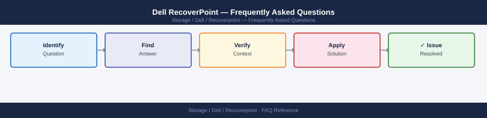

---
tags:
  - dell-recoverpoint
  - faq
  - operations
---
# Dell RecoverPoint — Frequently Asked Questions

*Applies to: Dell EMC Storage*

Common questions about Dell RecoverPoint operations, configuration, and troubleshooting. For step-by-step procedures, see the <a href="index.md">Operations</a> section.

## General

**Q: What RecoverPoint version is recommended?**
A: RecoverPoint 5.3.x is the current recommendation. Check via RecoverPoint Management Application (RPMA) → System → About.

**Q: How do I check the current Dell RecoverPoint version?**
A: `RPMA → System → About`

## Configuration

**Q: What is the default journal size and when should it change?**
A: Default journal size is 10% of protected volume size. Increase for longer RPO windows or high-change-rate workloads. Under-sized journals cause journal overflow, which forces a full sweep (similar to a full resync).

**Q: How do I enable bookmark-based recovery in RecoverPoint?**
A: Create a bookmark via RPMA: Consistency Group → Bookmarks → Add Bookmark. Bookmarks mark a specific point in time for recovery. Enable auto-bookmarks on a schedule for regular recovery points.

## Operations

**Q: How do I upgrade RecoverPoint Appliances without disrupting replication?**
A: RecoverPoint upgrades are non-disruptive for most versions. Use RPMA → System → Upgrade. Splitters continue to protect volumes during upgrade. Test failback after upgrade. Schedule during low I/O periods.

**Q: What is the correct procedure to add a new volume to an existing consistency group?**
A: In RPMA: select the Consistency Group → Volumes → Add Volume. Map source and replica volumes. RecoverPoint begins initial copy (sweep). Monitor sweep progress via RPMA → Consistency Groups → Policies.

## Troubleshooting

**Q: RecoverPoint shows 'Journal overflow'. What does it mean?**
A: The journal volume is full — incoming writes exceed journal capacity faster than they can be applied to the replica. Increase journal size, reduce protected volume write rate, or reduce RPO target. Overflow forces a full resync.

**Q: Replication lag is increasing — where do I start?**
A: Check WAN bandwidth between RPA clusters. Review journal utilisation. Check RPA CPU and memory. Reduce replication traffic with compression (enabled by default). Throttle non-critical CGs during peak hours.

## Backup and Recovery

**Q: How often should I back up RecoverPoint configuration?**
A: Weekly via RPMA → System → Export Configuration. Back up before any upgrade. Include RPA network configuration in your runbook. Configuration restore requires matching software version.

**Q: Can I perform a partial failover for a single volume in a consistency group?**
A: RecoverPoint fails over consistency groups as a unit to maintain write-order fidelity. To fail over a single volume, it must be in its own consistency group. Review CG design before incident — splitting CGs later requires a full resync.

## See Also

- [Dell RecoverPoint Operations](index.md)
- [Dell RecoverPoint Troubleshooting](../../../../troubleshooting/index.md)
